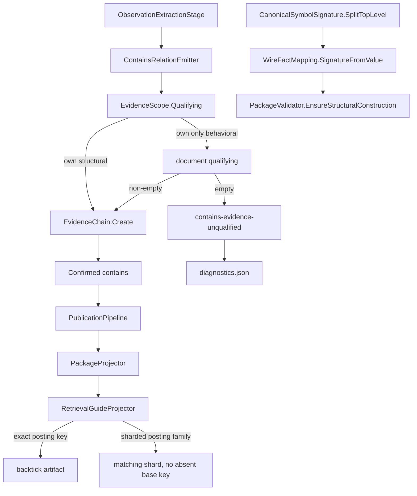

# Analysis Publication Resilience Design

**Spec**: `.specs/features/analysis-publication-resilience/spec.md`
**Status**: Approved

---

## Architecture Overview

Three surgical fixes at the defect sites, plus a sibling unlabeled fixture that proves them through the live `analyze` adapters. No new assembly, port, CLI verb, schema or taxonomy axis.

Rejected alternatives that deliver the same scope:

- Catch `EvidenceChain` throws in `ObservationExtractionStage`. That would keep constructors from aborting, and would also swallow every other empty-chain bug.
- Add a repair pipeline stage or a second signature parser in Storage. The spec forbids a third parser and the five-assembly split (AD-006) already has owners for evidence, identity and the retrieval guide.

Chosen approach: select evidence after `EvidenceScope` filtering; put delimiter-aware top-level split on `CanonicalSymbolSignature`; copy the confirmed-relation exact-vs-sharded wording onto unknown and frontier *posting* keys.



Issue 01 is a regression contract on HEAD. `PipelineFailureDetail`, `SolutionOutcome.FailingStage` / `Detail`, CLI stderr-once, and abort-preserves-package stay untouched unless a discriminating test fails.

---

## Code Reuse Analysis

### Existing Components to Leverage

| Component | Location | How to Use |
| --- | --- | --- |
| `EvidenceScope` | `src/Csharp2Md.Analysis/Classification/EvidenceScope.cs` | Extract the structural-vs-causal filter as `Qualifying`. `For` keeps calling `EvidenceChain.Create`. The emitter inspects `Qualifying` before Create |
| `EvidenceChain.Create` | `src/Csharp2Md.Domain/Proof/EvidenceChain.cs` | Unchanged non-empty invariant (APR-13). The emitter never calls it with an empty sequence |
| `ContainsRelationEmitter` | `src/Csharp2Md.Analysis/Extraction/ContainsRelationEmitter.cs` | Replace `ownObservations.Length > 0 ? own : document` with qualifying-then-fallback. Keep `DeclaredOn` primary-constructor yield |
| `DiagnosticRecord` / `SnapshotAccumulator.AddDiagnostic` | `src/Csharp2Md.Analysis/Storage/DiagnosticRecord.cs`, `Pipeline/SnapshotAccumulator.cs` | One `contains-evidence-unqualified` record; AD-017 already ships diagnostics on the snapshot |
| `CanonicalSymbolSignature.Create` | `src/Csharp2Md.Domain/Identity/CanonicalSymbolSignature.cs` | Emit path unchanged. Add `SplitTopLevel` next to it so round-trip has one owner |
| `WireFactMapping.SignatureFromValue` | `src/Csharp2Md.Storage/Mapping/WireFactMapping.cs` | Delete the private `<>`-only splitter; call Domain |
| `PackageValidator.EnsureStructuralConstruction` | `src/Csharp2Md.Storage/Validation/PackageValidator.cs:664` | Already maps `ArgumentException` from `FromDto` to `PublicationRejectedException("construction", id)`. Unbalanced signatures stay structural corruption (APR-22) |
| `RetrievalGuideProjector.AppendRelationsSection` | `src/Csharp2Md.Projection/Guides/RetrievalGuideProjector.cs:181` | The exact-key / `HasFamily` / no-backtick-on-shard pattern. `AppendDisposition` already branches; only the *lambda text* for unknowns and frontiers still backticks the posting base key |
| `HasFamily` / `ValidateNoAbsentKeys` | same file | Unchanged. APR-28 is satisfied once the lambdas stop quoting an absent posting key |
| `PostingProjector` / `ShardWriter` | `src/Csharp2Md.Projection/Postings/PostingProjector.cs`, `ShardWriter.cs` | Unchanged. Tests pass the same small ceiling to layout and projection so the posting family itself shards |
| `PublicationPipeline` / `CeilingCalculator` / `CommandFactory` | Storage + CLI | Unchanged. Default-budget `analyze` already derives the ~32 KiB ceiling and constructs `PackageProjector` with it |
| `PipelineFailureDetail`, abort-preserves-package tests | Analysis pipeline + `AbortPreservesPackageTests` | The APR-01..08 gate. No production edit |
| `SyntheticSolutionImmutabilityTests` | `tests/Csharp2Md.Analysis.Tests/Fixtures/` | Keep the committed digest. Do not touch that tree |
| `LocalCorpusAnalyzeTests` | `tests/Csharp2Md.Cli.Tests/` | Pattern for optional Pitstop: skip when the clone path is absent; no golden counts |

### Integration Points

| System | Integration Method |
| --- | --- |
| Domain identity | Public `CanonicalSymbolSignature.SplitTopLevel`. Not a registry / identity-component change; AD-013 drift gate stays byte-identical |
| Analysis write port | Unchanged. Diagnostics already travel on `FactualSnapshot` (AD-017) |
| Storage reconstruction | `WireFactMapping.FromDto` → `SignatureFromValue` → Domain `Create`. Commit and `validate` share this path (AD-016, AD-025) |
| Projection | `RetrievalGuideProjector` only. `PackageProjector` composition and ceiling plumbing stay |
| CLI | No new option. `analyze` with declared defaults against `fixtures/PublicationResilience` |
| Registry | Untouched |

---

## Components

### `EvidenceScope.Qualifying`

- **Purpose**: return the observations that may justify a given relation kind, without constructing a chain.
- **Location**: `src/Csharp2Md.Analysis/Classification/EvidenceScope.cs`
- **Interfaces**:
  - `static Observation[] Qualifying(RelationKind kind, IEnumerable<Observation> candidates)` — causal kinds keep the caller set; structural kinds drop `Invocation` and `DataAccess`
  - `static EvidenceChain For(...)` — `EvidenceChain.Create(Qualifying(...).Select(identity))`, same throw on empty as today
- **Dependencies**: existing `BehavioralNoiseForStructuralRelations` / `CausalRelationKinds` tables
- **Reuses**: the filter already inlined in `For`

### `ContainsRelationEmitter` evidence selection

- **Purpose**: emit document-to-symbol `contains` only with a non-empty structural chain.
- **Location**: `src/Csharp2Md.Analysis/Extraction/ContainsRelationEmitter.cs`
- **Interfaces**: `Emit` unchanged. Per symbol:
  1. `own = Qualifying(Contains, observations owned by the symbol)`
  2. if `own` is non-empty, that is the chain (APR-09)
  3. else `document = Qualifying(Contains, all observations in the file)`; if non-empty, that is the chain (APR-10)
  4. else record `contains-evidence-unqualified` and skip `Add` (APR-12)
- **Dependencies**: `EvidenceScope`, `DiagnosticRecord`, `EvidenceChain.Create`
- **Reuses**: project-to-document emission stays on `EvidenceScope.For`. `DeclaredOn` primary-constructor yield stays. Do not change `TopologyEmitter.BelongsToEvidence`

### `CanonicalSymbolSignature.SplitTopLevel`

- **Purpose**: split parameter and type-argument lists on commas whose delimiter depth is zero.
- **Location**: `src/Csharp2Md.Domain/Identity/CanonicalSymbolSignature.cs`
- **Interfaces**:
  - `public static ImmutableArray<string> SplitTopLevel(string text)`
  - Depth increments on `<`, `(`, `[`; decrements on `>`, `)`, `]` when depth > 0
  - Yield a slice at `,` when depth == 0
  - `IF` the final depth is not 0 `THEN` throw `ArgumentException` (unbalanced → `PublicationRejectedException("construction", ...)` via existing `TryCreate`)
- **Dependencies**: none beyond `FactIdGrammar` already used by `Create`
- **Reuses**: the scan shape of Storage's current `SplitTopLevel`, with two extra delimiter pairs. `Create` still joins with `,`; it does not parse

`WireFactMapping.SignatureFromValue` calls this for `parameters` and `type-arguments`. `ParseParameter` stays in Storage. `SignatureReader.HasSeparatorAtTopLevel` is **not** updated here: BoundaryPass comma-splitting is out of scope.

### `RetrievalGuideProjector` disposition posting lambdas

- **Purpose**: name a posting artifact in backticks only when that exact key exists in this publication.
- **Location**: `src/Csharp2Md.Projection/Guides/RetrievalGuideProjector.cs` `AppendDispositionsSection`
- **Interfaces**: `AppendDisposition` already takes exact vs sharded lambdas. Change only the unknown and frontier *posting* strings:
  - exact: keep `select its bucket in \`postings/unknowns.json\`` (and frontiers)
  - sharded: `select its bucket in the matching postings/unknowns.json shard` — family named, **no backticks** on the absent base key, same voice as `AppendRelationsSection`
- **Dependencies**: `slots`, `HasFamily`
- **Reuses**: candidate / unresolved-relation / frontier-relation lambdas stay. `ValidateNoAbsentKeys` stays strict

### `fixtures/PublicationResilience`

- **Purpose**: unlabeled C# solution that combines the three defects and is large enough that default-ceiling publication shards unknown and frontier postings.
- **Location**: `fixtures/PublicationResilience/` (AD-029)
- **Interfaces**: one `.slnx`, one (or few) class-library projects, no `labels/` tree
- **Contents**:
  - a primary-constructor / builder type whose own observations are invocations
  - members whose signatures carry named tuples, nested generics and multidimensional arrays
  - enough unproven dispositions (unresolved + open frontier) that `postings/unknowns` and `postings/frontiers` exceed the derived default ceiling (~32 KiB), not the 1 MiB `ShardWriter.DefaultCeilingBytes` placeholder
- **Dependencies**: none on labeled `CertificationCorpus`
- **Reuses**: `CertificationCorpusPaths`-style helper for the solution path; CLI invoke pattern from `AnalyzeSuccessTests` / `ValidateCommandTests`

---

## Data Models

No new wire types. Diagnostics already have `code`, `message`, `identityOrKey`.

### `contains-evidence-unqualified`

```csharp
new DiagnosticRecord(
    "contains-evidence-unqualified",
    "contains relation omitted because no qualifying structural evidence was found.",
    symbol.Reference.Id.Value);
```

**Relationships**: `IdentityOrKey` is the omitted target symbol's fact id. The relation is absent. Run-certification is not flipped by this record alone.

### Signature split

`parameters` and `type-arguments` remain comma-joined canonical text on the signature string. Only the inverse split changes. Simple and generic identities that never contained `,` inside `()`, `<>` or `[]` at depth > 0 stay byte-identical.

---

## Error Handling Strategy

| Error Scenario | Handling | User Impact |
| --- | --- | --- |
| Symbol owns only behavioral observations, document has structural ones | Document-scoped qualifying chain; `contains` published | Relation present, evidence structural |
| Neither scope has qualifying structural evidence | Skip relation; `contains-evidence-unqualified` diagnostic; commit | Package committed; diagnostic in `diagnostics.json` |
| `EvidenceChain.Create` given empty input | Still throws. Emitter never does this | Unchanged Domain invariant |
| Unbalanced / malformed wire signature | `SplitTopLevel` throws `ArgumentException`; `EnsureStructuralConstruction` raises `PublicationRejectedException("construction", id)` | Publication aborted; prior package preserved |
| `retrieval.md` backticks an absent key | `ValidateNoAbsentKeys` still throws `projection-key` | Publication aborted; this feature's job is to stop generating that key |
| Unexpected pipeline exception | Existing `PipelineFailureDetail` + unpublished + abort-preserves-package | Unchanged |
| Cancellation | Existing cancellation path | Unchanged |
| Pitstop / eShop clone missing | `LocalCorpus` skip; CI green | No false CI fail |

---

## Risks & Concerns

| Concern | Location (file:line) | Impact | Mitigation |
| --- | --- | --- | --- |
| Empty-own fallback already cites every structural observation in the file, including other symbols | `ContainsRelationEmitter.cs:63-66` | APR-10 extends that fallback to "own observations exist but none qualify". Evidence can still be broader than the target symbol | Spec accepts document-scoped qualifying structural observations as fallback. Do not invent a tighter owner filter in this workstream |
| `TopologyEmitter.BelongsToEvidence` deliberately bypasses `EvidenceScope` on fallback | `TopologyEmitter.cs:143-148` | Changing `For` to not throw, or reusing the contains fallback, would mix behavioral evidence into `belongs-to` or change a closed classifier | Do not touch `TopologyEmitter`. `Qualifying` is additive |
| `SignatureReader.HasSeparatorAtTopLevel` still only balances `<>` | `SignatureReader.cs:55-73` | BoundaryPass `Split(',')` remains wrong for `Dictionary<K,V>` (accidental-complexity item 11) | Explicitly out of scope. Domain `SplitTopLevel` is the owner item 11 can consume later |
| Default ceiling is ~32 KiB, `ShardWriter.DefaultCeilingBytes` is 1 MiB | `PublicationPipeline.cs:34-36`, `ShardWriter.cs:11` | A tiny fixture shards in unit tests with a tiny ceiling and still publishes a single `postings/unknowns.json` under real `analyze` | Size the versioned fixture so unsplit unknowns and frontiers exceed the derived default ceiling. CLI test uses no budget override |
| Fixture volume vs CI time | `fixtures/PublicationResilience` | Hundreds of small methods may be needed to pass 32 KiB | Many small methods, not one giant type body. No labels, no extra projects beyond what the three defects need |
| Existing guide test still backticks `postings/unknowns.json` while the *relation* family is sharded | `RetrievalGuideProjectorTests.cs:149-160` | That case is correct when the posting family is unsplit. A naive rewrite of both lambdas would break it | Keep exact-key posting wording. Add a test that shards the posting family itself with the same small ceiling on layout and projection |
| `SyntheticSolution` immutability digest is already non-reproducible (GCPC-117, deferred) | `SyntheticSolutionImmutabilityTests.cs:18` | This feature must not change that tree, or GCPC-117 gets worse | APR-34: do not touch `fixtures/SyntheticSolution` |
| Issue 01 sanitizer is a generated-regex partial class | `PipelineFailureDetail.cs` | Easy to "improve" while in the area | Regression only. No production edit unless a test fails |

---

## Tech Decisions (only non-obvious ones)

| Decision | Choice | Rationale |
| --- | --- | --- |
| Splitter home | Public `CanonicalSymbolSignature.SplitTopLevel` in Domain | Spec: one shared split, no third parser. Storage already reconstructs through Domain (AD-016). A Storage-private fix would leave Analysis with a second, weaker balancer |
| Empty `contains` evidence | Omit + diagnostic, never catch `ArgumentException` from `EvidenceChain` | Domain invariant stays the last gate. Catching it would hide unrelated empty chains |
| Run-certification | Unchanged by a missing `contains` | `contains` is not a coverage numerator. The diagnostic is the degraded outcome |
| Guide wording | Copy `AppendRelationsSection`'s exact vs `HasFamily` voice onto posting keys | `ValidateNoAbsentKeys` already rejects backtick-quoted missing keys; do not add a ceiling exclusion |
| Third fixture | `fixtures/PublicationResilience`, unlabeled, AD-029 | Confirmed spec default. Sibling of AD-026, not a mutation of either existing tree |
| Issue 01 | No production change | Already on HEAD; existing tests are the gate |
| Pitstop | Optional `LocalCorpus` analyze of 15 isolated projects plus the full solution when present | Issue 05. Absence does not fail CI. Counts are not golden |
| Discrimination sensor | Skip, standing project override | Same note in `tasks.md` as prior features |

**Project-level:** AD-029 records the third versioned fixture. No other active AD is superseded.
