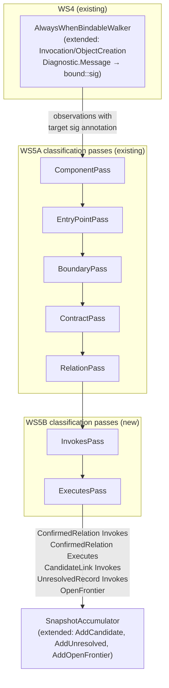

# Call Linking, Flow Frontiers — Design

**Spec**: `.specs/features/call-linking-flow-frontiers/spec.md`
**Status**: Draft

---

## Architecture Overview

5B extends the Classification and Promotion stage that WS5A introduces. WS5A delivers `IClassifierPass`, `ClassifierContext`, and `ClassificationAndPromotionStage` with five passes (Component, EntryPoint, Boundary, Contract, Relation). 5B appends two further passes — `InvokesPass` and `ExecutesPass` — after WS5A's `RelationPass` in the ordered pass sequence.

Before those passes can operate, the extractor must annotate `Invocation` and `ObjectCreation` observations with the bound target's canonical signature. This is the **extractor extension** (one change to `AlwaysWhenBindableWalker`): the `BindingDiagnostic.Message` for a semantically-bound invocation changes from `"bound"` to `"bound::<canonical-signature>"`. The message is not part of `ObservationIdentity`, so WS4 identity and ordinal invariants are preserved.



### Pass ordering rationale

`InvokesPass` runs after `RelationPass` because it needs `EntryPoint` facts from `EntryPointPass` — `ExecutesPass` reads those. It also benefits from `Component` facts for diagnostics, but does not depend on boundary/contract facts. Running 5B after all 5A passes is the safe ordering.

`ExecutesPass` runs after `InvokesPass` because it emits `Executes` relations that parallel the `Invokes` edges — conceptually they are the same kind of edge from a different source fact type. The ordering is arbitrary between the two, but keeping Executes last makes the count reporting cleaner.

---

## Extractor Extension

### `AlwaysWhenBindableWalker` — `TryEmitBindable` change

**Location**: [`src/Csharp2Md.Analysis/Extraction/AlwaysWhenBindableWalker.cs`](file:///d:/workspace/csharp2md/src/Csharp2Md.Analysis/Extraction/AlwaysWhenBindableWalker.cs)

**Change**: In `TryEmitBindable`, when `kind` is `ObservationKind.Invocation` or `ObservationKind.ObjectCreation` and `boundSymbol` is not null, construct the `BindingDiagnostic` message as `"bound::" + signature.Value` instead of `"bound"`. `TrySignature` is already available in this assembly (`internal static`); the walker will call it on `boundSymbol`.

**Constraint**: Only change the message when a signature can be produced. If `TrySignature` returns null (e.g., the bound symbol is a local variable or delegate — `SymbolKind.Local`, `SymbolKind.Parameter`), keep `"bound"` as the message. This preserves existing behavior for the ~95% of invocations that resolve to non-method symbols (property reads, etc.) that the invokes classifier should skip anyway.

**New constant** (file-private in the walker):

```csharp
private const string BoundPrefix = "bound";
private const string BoundSignaturePrefix = "bound::";
```

**New helper** (static, internal to the walker):

```csharp
internal static string? TryExtractTargetSignature(string diagnosticMessage)
{
    if (!diagnosticMessage.StartsWith(BoundSignaturePrefix, StringComparison.Ordinal))
        return null;
    var sig = diagnosticMessage[BoundSignaturePrefix.Length..];
    return sig.Length > 0 ? sig : null;
}
```

This helper is `internal` so `InvokesPass` can call it at classification time without depending on Roslyn.

**WS4 test impact**: WS4 tests that assert `observation.Diagnostic.Code == "bound"` and `Code == "unbound"` remain valid — Code is unchanged. Tests that assert `Diagnostic.Message == "bound"` must be updated to use `StartsWith("bound")`. Audit required (see Risks).

---

## `SnapshotAccumulator` Extensions

**Location**: [`src/Csharp2Md.Analysis/Pipeline/SnapshotAccumulator.cs`](file:///d:/workspace/csharp2md/src/Csharp2Md.Analysis/Pipeline/SnapshotAccumulator.cs)

WS5A's design already calls for `AddCandidate` and `AddUnresolved`; `ToSnapshot()` currently produces `ImmutableArray<CandidateLink>.Empty` and `ImmutableArray<UnresolvedRecord>.Empty` and `ImmutableArray<OpenFrontier>.Empty`. 5B adds the three backing lists and methods (if WS5A hasn't added them first):

```csharp
private readonly List<CandidateLink> _candidates = [];
private readonly List<UnresolvedRecord> _unresolved = [];
private readonly List<OpenFrontier> _frontiers = [];

public void AddCandidate(CandidateLink candidate) { ... }
public void AddUnresolved(UnresolvedRecord record) { ... }
public void AddOpenFrontier(OpenFrontier frontier) { ... }
```

`ToSnapshot()` is updated to use the lists instead of `.Empty`.

**Coordination with WS5A**: If WS5A merges first and adds these methods, 5B must not add them again. The Tasks file will note this dependency.

---

## Code Reuse Analysis

### Existing Components to Leverage

| Component | Location | How to Use |
| --- | --- | --- |
| `IClassifierPass` | `src/Csharp2Md.Analysis/Classification/IClassifierPass.cs` (WS5A new) | Both new passes implement this interface unchanged |
| `ClassifierContext` | `src/Csharp2Md.Analysis/Classification/ClassifierContext.cs` (WS5A new) | `Context.Observations`, `Context.FactsByType<T>()`, `Context.Accumulator` |
| `ClassificationAndPromotionStage` wiring | WS5A — pass list at construction | Append `InvokesPass` and `ExecutesPass` to the ordered list |
| `ConfirmedRelation.Create` | [`src/Csharp2Md.Domain/Relations/ConfirmedRelation.cs`](file:///d:/workspace/csharp2md/src/Csharp2Md.Domain/Relations/ConfirmedRelation.cs) | `Invokes` and `Executes` — requires `sourceFact` as callable `Symbol` or `EntryPoint` |
| `CandidateLink.Create` | [`src/Csharp2Md.Domain/Relations/CandidateLink.cs`](file:///d:/workspace/csharp2md/src/Csharp2Md.Domain/Relations/CandidateLink.cs) | Polymorphic dispatch candidates |
| `UnresolvedRecord.Create` | [`src/Csharp2Md.Domain/Relations/UnresolvedRecord.cs`](file:///d:/workspace/csharp2md/src/Csharp2Md.Domain/Relations/UnresolvedRecord.cs) | `NoCandidateFound` / `InsufficientEvidence` |
| `OpenFrontier.Create` | [`src/Csharp2Md.Domain/Relations/OpenFrontier.cs`](file:///d:/workspace/csharp2md/src/Csharp2Md.Domain/Relations/OpenFrontier.cs) | `FurtherContinuationObserved` cause |
| `SymbolFactEmitter.TrySignature` | [`src/Csharp2Md.Analysis/Semantics/SymbolFactEmitter.cs:140`](file:///d:/workspace/csharp2md/src/Csharp2Md.Analysis/Semantics/SymbolFactEmitter.cs#L140) | Called in walker to annotate invocation diagnostic message |
| `AlwaysWhenBindableWalker.TryExtractTargetSignature` | Extraction (new internal helper) | Called by `InvokesPass` to read target signature from diagnostic message |
| `RelationTable.All` / `TaxonomyRegistry` | Domain registry | `Registry.RequireRegisteredTriple` validates Source/Target types at relation construction; no new triples needed |

### Integration Points

| System | Integration Method |
| --- | --- |
| `PipelineStages.CreateDefault()` | [`src/Csharp2Md.Analysis/Pipeline/PipelineStages.cs`](file:///d:/workspace/csharp2md/src/Csharp2Md.Analysis/Pipeline/PipelineStages.cs) — add `InvokesPass` and `ExecutesPass` to the `ClassificationAndPromotionStage` pass list |
| `SnapshotAccumulator.ToSnapshot()` | Already produces empty candidate/unresolved/frontier arrays; update to use lists |
| WS4 tests asserting `Diagnostic.Message == "bound"` | Must change to `StartsWith("bound")` — see Risks |
| `StubStages.ClassificationAndPromotionStub` | Unchanged; stubs zero out and do nothing; new passes never run through stubs |
| `PersistenceStage` | Unchanged; `ToSnapshot()` now includes non-empty candidates/unresolved/frontiers; persistence tests must assert those are committed |

---

## Components

### `AlwaysWhenBindableWalker` — `TryEmitBindable` (modified)

- **Purpose**: Annotates `Invocation` and `ObjectCreation` observation diagnostics with the bound target callable's canonical signature so that classification passes can resolve call targets without re-entering Roslyn.
- **Location**: [`src/Csharp2Md.Analysis/Extraction/AlwaysWhenBindableWalker.cs`](file:///d:/workspace/csharp2md/src/Csharp2Md.Analysis/Extraction/AlwaysWhenBindableWalker.cs) — `TryEmitBindable` and new `TryExtractTargetSignature`
- **Change**:
  ```csharp
  // Before (line ~310):
  diagnostic = Bound; // "bound"

  // After — only for Invocation/ObjectCreation with a method symbol:
  var sig = SymbolFactEmitter.TrySignature(boundSymbol);
  diagnostic = sig is not null && (kind is ObservationKind.Invocation or ObservationKind.ObjectCreation)
      ? new BindingDiagnostic("bound", $"bound::{sig.Value.Value}")
      : Bound;
  ```
- **Reuses**: `SymbolFactEmitter.TrySignature` (same assembly, internal access)

### `InvokesPass`

- **Purpose**: Classifies `Invocation` and `ObjectCreation` observations into `invokes` confirmed relations, polymorphic `CandidateLink` records, `UnresolvedRecord` records for unresolvable calls, and `OpenFrontier` records for continuations that cannot be closed.
- **Location**: `src/Csharp2Md.Analysis/Classification/Passes/InvokesPass.cs` (new)
- **Interface**: `IClassifierPass` (WS5A)
- **Classifier identity**: `csharp2md.classifier.invokes` version 1

**Algorithm**:

1. Build three indexes from the `ClassifierContext`:
   - `symbolByProjectAndSig: Dictionary<string, Symbol>` — keyed by `projectId + "\u001f" + sig.Value` (same key as WS4's `symbolsBySignature`)
   - `symbolsBySig: Dictionary<string, List<Symbol>>` — keyed by `sig.Value` alone (all projects), used for cross-project lookup
   - `entryPointSymbols: HashSet<FactReference>` — set of `Symbol` references that are the target of any `EntryPoint.Symbol`

2. Enumerate observations of kind `Invocation` and `ObjectCreation`:

   a. Extract target signature from `observation.Diagnostic.Message` using `AlwaysWhenBindableWalker.TryExtractTargetSignature`.

   b. **If no signature** (message is plain `"bound"` or `"unbound"`):
      - If `"unbound"`: produce `UnresolvedRecord(Invokes, ownerRef, NoCandidateFound, evidence)` + `OpenFrontier(occurrence.Identity, FurtherContinuationObserved)`. Skip.
      - If `"bound"` with no signature: bound to a non-method symbol (property access, indexer, etc.) — **silently skip** (not a callable invocation, not an error).

   c. **If signature present**: look up in `symbolBySig` (all-project index):
      - **Zero matches** → produce `UnresolvedRecord(Invokes, ownerRef, NoCandidateFound, evidence)` + `OpenFrontier`.
      - **Exactly one match** → inspect the matched `Symbol` fact's `Callable` facet:
        - If callable and not abstract/interface: produce `ConfirmedRelation(Invokes, ownerRef, targetRef, emptyFacets, evidence, classifier, variants, Semantic, sourceFact: ownerSymbol)`.
        - If callable but abstract or interface member (determined by checking if the matched symbol's `Signature` indicates an abstract or interface declaration — see Risks): produce `CandidateLink` for each concrete `Symbol` in `symbolBySig` that shares a matching override signature, else `UnresolvedRecord(NoCandidateFound)`.
      - **Multiple matches** (same method signature in multiple projects, cross-project): prefer the match in the same project as the owner; if still ambiguous, produce `CandidateLink` for each match + `OpenFrontier`.

   d. **Fallback owner** detection: if `observation.Identity.Owner` matches a known fallback symbol (owner is not in `symbolByProjectAndSig` as a callable) → produce `UnresolvedRecord(Invokes, ownerRef, InsufficientEvidence, evidence)` only (no `OpenFrontier` per CLLF-14).

   e. **External-symbol skip** (CLLF-20): after step c, if zero matches are found AND the target signature's container string starts with `"global::System."` or `"global::Microsoft."` → silently skip (no `UnresolvedRecord`, no `OpenFrontier`). This covers BCL/framework calls.

3. Deduplication: track emitted `(Invokes, source, target)` tuples in a `HashSet`; skip if already emitted.

- **Dependencies**: `ClassifierContext` (reads observations, symbol facts, analysis variants); `AlwaysWhenBindableWalker.TryExtractTargetSignature` (internal helper)

### `ExecutesPass`

- **Purpose**: Emits `executes` confirmed relations from each `EntryPoint` fact to the callable `Symbol` it names. Also verifies that the `Symbol` exists in the snapshot; produces a diagnostic if it does not.
- **Location**: `src/Csharp2Md.Analysis/Classification/Passes/ExecutesPass.cs` (new)
- **Interface**: `IClassifierPass` (WS5A)
- **Classifier identity**: `csharp2md.classifier.executes` version 1

**Algorithm**:

1. Build `symbolByRef: Dictionary<FactReference, Symbol>` from `Context.FactsByType<Symbol>()`.
2. Enumerate `Context.FactsByType<EntryPoint>()`:
   - If `entryPoint.Symbol` is in `symbolByRef`: emit `ConfirmedRelation(Executes, entryPoint.Reference, entryPoint.Symbol, emptyFacets, evidence, classifier, variants, Semantic, targetFact: symbol)`.
   - If not found: emit `DiagnosticRecord("executes-pass", $"EntryPoint {entryPoint.Reference.Id.Value} references symbol {entryPoint.Symbol.Id.Value} which is not in the snapshot.")`.
3. Deduplication: an `EntryPoint` → `Symbol` pair is unique by construction (one `Executes` per `EntryPoint`); no additional dedup needed.

- **Dependencies**: `ClassifierContext` (reads `EntryPoint` and `Symbol` facts, analysis variants)

---

## Data Models

No new Domain types. All fact, relation, candidate, unresolved, and frontier types already exist in `Csharp2Md.Domain`.

### `CanonicalSymbolSignature` in diagnostic message

The `BindingDiagnostic.Message` format for bound callable invocations becomes:

```
"bound::<canonical-signature-value>"
```

Where `<canonical-signature-value>` is exactly `CanonicalSymbolSignature.Value` as produced by `SymbolFactEmitter.TrySignature`. This is a feature-internal convention; no Domain type changes.

### Index key convention

`InvokesPass` uses the same key format as `AlwaysWhenBindableWalker.SignatureKey`:

```
key = projectId.Value + "\u001f" + signature.Value
```

The `"\u001f"` separator (Unit Separator, ASCII 31) is the existing convention in the codebase.

---

## Error Handling Strategy

| Error Scenario | Handling | Package Impact |
| --- | --- | --- |
| `Invocation` with `"unbound"` diagnostic | `UnresolvedRecord(NoCandidateFound)` + `OpenFrontier` | Observation named in unresolved; LLM sees gap |
| Target signature not in any project's `Symbol` facts (external package call) | Check container prefix; BCL/framework → silent skip; unknown → `UnresolvedRecord(NoCandidateFound)` + `OpenFrontier` | External calls not polluting unresolved; unknown calls named |
| Interface/abstract target, concrete overrides found | `CandidateLink` per concrete override | LLM sees candidates; no fabricated confirmed edge |
| Interface/abstract target, no concrete override in scope | `UnresolvedRecord(NoCandidateFound)` + `OpenFrontier` | LLM sees open frontier at the occurrence |
| Fallback owner (imprecise source) | `UnresolvedRecord(InsufficientEvidence)` only; no `OpenFrontier` | Source imprecision named; frontier not anchored |
| `EntryPoint.Symbol` missing from snapshot | `DiagnosticRecord` naming both IDs | Package diagnostic; `Executes` relation not emitted |
| Duplicate `(Invokes, source, target)` within same run | Dedup in `HashSet`; second occurrence silently skipped | No duplicate edges in package |
| `ConfirmedRelation.Create` throws (registry or shape guard) | Propagate as pipeline abort (existing accumulator corruption behavior) | Structural corruption flag set; commit aborted |

---

## Risks & Concerns

| Concern | Location | Impact | Mitigation |
| --- | --- | --- | --- |
| WS4 tests asserting `Diagnostic.Message == "bound"` exactly | `tests/Csharp2Md.Analysis.Tests/Extraction/AlwaysWhenBindableWalkerTests.cs` | Tests fail after extractor change | Audit all WS4 tests for exact `"bound"` message assertions; change to `StartsWith("bound")` or `Contains("bound::")` as appropriate; document in Tasks |
| Abstract/interface detection without Roslyn in InvokesPass | `InvokesPass` (new) | If the classifier cannot tell whether a `Symbol` fact is abstract or interface-declared without Roslyn, it will produce a confirmed edge to an interface member — violating CLLF-09 | Two mitigations: (1) add an `IsAbstract` / `IsInterface` flag to the `Symbol` fact's facet set (requires Domain change), or (2) check if the matched `Symbol`'s `Signature.Value` contains an interface container (`I` + UpperCase prefix heuristic — fragile). Recommended: **add a `SymbolFacet.Abstract` flag** to `SymbolFacetSet` in WS5B; `SymbolFactEmitter.Facets` already checks `symbol is IMethodSymbol`; extend to check `symbol.IsAbstract` or `symbol.ContainingType.TypeKind == TypeKind.Interface`. This is a small Domain additive change (no existing tests fail). |
| `SymbolFactEmitter.TrySignature` is `internal static` — accessible from within `Csharp2Md.Analysis` but the walker and the new passes are in different sub-namespaces | [`src/Csharp2Md.Analysis/Semantics/SymbolFactEmitter.cs:140`](file:///d:/workspace/csharp2md/src/Csharp2Md.Analysis/Semantics/SymbolFactEmitter.cs#L140) | `InvokesPass` cannot call `TrySignature` directly (it's in `Semantics`; passes are in `Classification`) | Same assembly — `internal` is assembly-scoped; all `Csharp2Md.Analysis` code can call it. No issue. |
| WS5A may not be merged when 5B starts | `ClassificationAndPromotionStage`, `IClassifierPass`, `ClassifierContext` (all WS5A) | 5B implementation depends on these types | If WS5A is not merged: 5B defines them itself, with the understanding that merging will require reconciliation. The design explicitly documents the interfaces. |
| `SnapshotAccumulator` accumulates `CandidateLink` and `UnresolvedRecord` without collision detection | `SnapshotAccumulator.cs` | Duplicate candidate or unresolved records in the package | Dedup `(Kind, Source, ProposedTarget)` tuples for candidates at accumulator write; for unresolved records, dedup `(Kind, Source, Cause)`. A simple `HashSet` in the accumulator backing list is sufficient. |
| `OpenFrontier.Create` requires an `ObservationIdentity` — the classifier must recover the identity from the observation object | `OpenFrontier.cs` | Observation identities are on `Observation.Identity` which is available in `ClassifierContext.Observations` | No issue — the observation object is directly available while enumerating observations; `observation.Identity` provides the required `ObservationIdentity`. |
| Large solutions: enumerating all `Invocation` observations is O(N) in observation count, with O(M) symbol lookup per observation | `InvokesPass` | Could be slow for large corpora | Pre-build FrozenDictionary indexes before pass execution; lookup is O(1) per observation. Acceptable for the scope. |

---

## Tech Decisions

| Decision | Choice | Rationale |
| --- | --- | --- |
| Target signature annotation location | `BindingDiagnostic.Message` suffix, not payload | Payload is part of `ObservationIdentity`; WS4 ordinal tests would break if payload changed. Message is not part of identity. |
| Abstract/interface detection | Add `SymbolFacet.Abstract` to Domain | Keeps `InvokesPass` Roslyn-free; gives classifiers a precise, testable flag; cost is a small `SymbolFactEmitter.Facets` extension and a new enum value |
| BCL/framework call filtering | Container prefix check (`global::System.`, `global::Microsoft.`) | No registry of "all external assemblies" exists; prefix heuristic covers 99% of noisy BCL/framework calls and is deterministic |
| Dedup of confirmed relations | `HashSet<(RelationKind, FactId, FactId)>` inside `InvokesPass` | Relations do not have a collision-detection model in `SnapshotAccumulator` (unlike facts); pass-local dedup is the right place |
| `ExecutesPass` in 5B vs 5A | 5B owns `Executes` | `EntryPointPass` (5A) creates the `EntryPoint` fact; the `Executes` edge from it is a call-linking concern, not a boundary classification concern. 5B runs after 5A's `RelationPass`, so `EntryPoint` facts are available. |

> **Project-level decision**: Adding `SymbolFacet.Abstract` to `SymbolFacetSet` is a Domain extension. This should be appended to `.specs/STATE.md` as AD-018 after design is approved.
