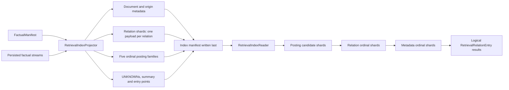

# Compact Relation Retrieval Index Design

**Spec**: `.specs/features/compact-retrieval-index/spec.md`
**Status**: Approved
**Approach confirmed**: deep streaming module with compact in-memory postings, 2026-08-23

---

## Architecture Overview

`RetrievalIndexProjector` remains the single projection interface. Its implementation stops materializing
the factual relation document and stops passing full relation payloads to five independent shard families.
It streams the one solution-level relation fragment established by AD-018, writes each normalized relation
once, and retains only document/origin metadata, ordinal postings, UNKNOWN groups and metric counters.

`RetrievalIndexReader` becomes the consumer interface. It hides hash-range lookup, shard selection, ordinal
joins and metadata reconstruction. Callers submit one of the five existing lookup families and receive the
same logical relations in relation-ordinal order without opening `raw/facts/`.



### Selected approach and alternatives

| Approach | Decision | Trade-off |
| --- | --- | --- |
| Deep streaming projector with compact in-memory postings | **Selected by the user** | Peak memory still grows with keys and ordinal memberships, but not with repeated relation payloads. It preserves a small interface and keeps change local. |
| Stream plus external sort through temporary runs | Rejected | It bounds posting memory further, but adds temporary-file cleanup, merge ordering and extra I/O before the current scale proves they are necessary. |
| Scanner, normalizer, posting builder and publisher as separate exposed interfaces | Rejected | It offers more substitution points, but makes callers and tests learn almost the whole implementation. The modules would be shallow. |

### Projection flow and invariants

1. Validate the factual manifest identity and calculate an `analysis_run_id` that includes the explicit
   `retrieval-index-schema:2` marker. All manifest collections participate in canonical ordinal order.
2. Open factual fragments through streams. Build document metadata before reading relations. A document
   fact supplies `document_id`, `project_id`, `relative_path` and `generated_origin`. An evidence-only
   document is appended deterministically on first encounter with `project_id: null`.
3. Find the one non-empty `relations` array permitted by AD-018. Reject a second non-empty relation array.
   Validate that `header.id` equals `relation_id`, relation ids are strictly increasing in ordinal order,
   and no duplicate id exists before assigning the next dense relation ordinal.
4. For each relation, normalize its document and factual-origin references. Serialize the compact relation
   record once into UTF-8 and append it to a bounded relation shard. Update five in-memory posting maps,
   UNKNOWN accumulators, entry-point state, endpoint counts and quality metrics.
5. Emit normalized metadata shards and posting-list shards in canonical order. A posting list can be split
   into consecutive physical segments when its ordinal array cannot fit one shard.
6. Write `unknowns.json`, `summary.json` and the proven-entry-point catalogue.
7. Write `raw/index/manifest.json` last. Partial derived files left by a failure are unreachable because no
   schema-2 manifest advertises them. `raw/facts/` is never written by this module.

The implementation is synchronous and ordinal. It introduces no parallel projection path.

### Output layout

```text
raw/index/
  manifest.json
  summary.json
  unknowns.json
  catalogues/
    entry-points.json
  relations/
    0000.json
    0001.json
  metadata/
    documents-0000.json
    origins-0000.json
  postings/
    project/0000.json
    source/0000.json
    target/0000.json
    kind/0000.json
    resolution/0000.json
```

Ten and ten thousand unique keys create the same directory set. File count can grow with shard bytes, but
no path segment derives from the original key.

Relation and metadata descriptors use inclusive ordinal ranges. Posting descriptors use inclusive SHA-256
ranges over the UTF-8 lookup key. Posting records retain the original key. The reader handles a theoretical
hash collision by comparing the original key and opening every descriptor whose range includes the query
hash. A hash is only a locator; it is not an identity and never names a directory.

### Selective query flow

1. `RetrievalIndexReader.Open` reads the manifest and rejects any schema other than 2.
2. `Query` hashes the lookup key and opens only posting descriptors for the requested family whose inclusive
   hash range contains that hash.
3. It validates `schema_version`, `analysis_run_id`, family, key and ordinals. It combines split posting
   segments, rejects duplicate or missing ordinals, and orders the result ordinals.
4. It groups ordinals by relation descriptor and opens only the required relation shards.
5. It gathers referenced document and origin ordinals, opens only matching metadata shards, and reconstructs
   each logical `RetrievalRelationEntry`.
6. The result is returned once per relation in ordinal order. No method on the reader accepts or discovers a
   `raw/facts/` path.

`ReadUnknownGroups` follows the same relation-resolution path for the ordinals stored in `unknowns.json`.

### Exact bounded UTF-8 writing

`BoundedUtf8ShardWriter` receives records that are already serialized once as UTF-8. It tracks:

```text
envelope_prefix_bytes
+ serialized_record_bytes
+ comma_bytes_between_records
+ envelope_suffix_bytes
+ one_final_lf_byte
```

It appends a record only when the inclusive total is at most 262144. Otherwise it flushes the current shard
and retries the unchanged record against an empty envelope. A singleton total of 262144 is accepted. A
singleton total above 262144 raises a deterministic `RetrievalIndexProjectionException` naming the record
kind, identity or key, and the 262144-byte ceiling.

Posting segmentation calculates capacity from the pre-encoded key and decimal ordinal widths before writing
the physical list. It never serializes a whole oversized list and retries smaller prefixes. Every physical
posting segment is serialized once.

The writer uses `ArrayBufferWriter<byte>`, `Utf8JsonWriter` and source-generated `JsonTypeInfo`. It does not
call a `JsonSerializer.Serialize` overload that returns `string`. A dedicated `RetrievalIndexJsonContext`
uses compact JSON; the existing indented aggregate context remains unchanged.

Instrumentation records relation record serializations, metadata record serializations, posting-list segment
serializations, posting ordinal writes and completed shard envelopes. There is no prefix-reserialization
counter because no accepted prefix enters a serializer again. Tests compare these counters for N and N+1
relations.

---

## Code Reuse Analysis

### Existing modules to leverage

| Module | Location | How it is used |
| --- | --- | --- |
| `CanonicalAggregateWriter` | `src/Csharp2Md.Core/Projection/Aggregates/CanonicalAggregateWriter.cs` | Keeps aggregate coordination and invokes the projector before publishing the factual manifest. The index manifest remains the derived commit marker. |
| `IAggregateFileWriter` and `LocalAggregateFileWriter` | `src/Csharp2Md.Core/Projection/Aggregates/CanonicalAggregateWriter.cs` | Evolve the existing local-substitutable seam to expose `OpenRead`; production uses `FileStream`, tests use `MemoryStream`. |
| `FactualManifest` / `ManifestFragment` | `src/Csharp2Md.Core/Projection/Aggregates/AggregateContracts.cs` | Supplies canonical input identity, fragment references, hashes and analysis metadata. |
| `FactualJsonSerializer` ordering | `src/Csharp2Md.Core/Facts/Serialization/FactualJsonSerializer.cs` | Its ordinal `header.id` ordering makes dense relation ordinals streamable. The projector validates rather than assumes the order. |
| `RetrievalIndexProjector` | `src/Csharp2Md.Core/Projection/Aggregates/RetrievalIndexProjector.cs` | Retains the external projection seam, run-id responsibility, UNKNOWN ordering and proven-entry-point behavior. Its materializing implementation is replaced. |
| `RetrievalIndexReader` | `src/Csharp2Md.Core/Projection/Aggregates/RetrievalIndexReader.cs` | Retains versioned document reading and becomes the deep selective-query interface. Schema-1 additive reading is intentionally removed. |
| `RetrievalRelationEntry` / `RetrievalEvidence` | `src/Csharp2Md.Core/Projection/Aggregates/RetrievalIndexContracts.cs` | Become logical reader results rather than physical records repeated in every shard. |
| SHA-256 and ordinal comparers | Existing factual identity and aggregate projection code | Preserve lowercase SHA-256 and `StringComparer.Ordinal` conventions. |

### Integration points

| System | Integration method |
| --- | --- |
| Factual persistence | Read manifest-referenced fragments only after `ValidateFragments`. Hash validation also moves to `OpenRead`, so it no longer requires `File.ReadAllBytes`. |
| Aggregate publication | `CanonicalAggregateWriter` still calls one projector and writes the factual manifest last. The projector writes the index manifest last within `raw/index/`. |
| Consumer contract | Schema 2 is intentionally incompatible. Every reader entry point validates version 2 and the shared `analysis_run_id`. |
| Package contract | The derived output break changes `<Version>` from `3.0.1` to `4.0.0`, conforming to AD-007. Branch push, PR and `v4.0.0` tag remain outside local execution without explicit approval. |
| Tests | Existing schema-1 behavior tests become reference-fixture or schema-2 outcome tests. Tests exercise projector and reader through their interfaces instead of the old shard writer's implementation details. |
| Benchmark | A tooling-only console project is added under `benchmarks/` and to `csharp2md.slnx`. It does not create a new production assembly boundary inside `Csharp2Md.Core`, so AD-013 remains intact. |

---

## Modules and Interfaces

### RetrievalIndexProjector

- **Purpose**: Own the complete schema-2 projection and publication lifecycle behind one interface.
- **Location**: `src/Csharp2Md.Core/Projection/Aggregates/RetrievalIndexProjector.cs`
- **Interface**:
  - `Project(FactualManifest manifest, IAggregateFileWriter files): RetrievalIndexProjection`
  - `ComputeAnalysisRunId(FactualManifest manifest): string`
- **Invariants**: one relation payload serialization per relation; dense ordinals follow `relation_id` ordinal
  order; manifest last; no factual writes; no concurrent ordering.
- **Dependencies**: factual scanner, metadata table, posting accumulator, bounded writer and file seam.
- **Reuses**: existing invocation point, input types, UNKNOWN priority and run-id hashing pattern.

This is the external module for projection. Its helpers are internal implementation, not caller-visible seams.

### RetrievalIndexReader

- **Purpose**: Hide every physical join required to answer a schema-2 lookup.
- **Location**: `src/Csharp2Md.Core/Projection/Aggregates/RetrievalIndexReader.cs`
- **Interface**:
  - `Open(IAggregateFileReader files, string manifestPath = "raw/index/manifest.json"): RetrievalIndexReader`
  - `Query(RetrievalLookup lookup): ImmutableArray<RetrievalRelationEntry>`
  - `ReadUnknownGroups(): ImmutableArray<RetrievalUnknownGroup>`
  - `Manifest: RetrievalIndexManifest`
- **Invariants**: schema must be 2; every opened artifact must carry the manifest run id; results are unique
  and ordinal; no factual artifact is opened.
- **Dependencies**: file reader, SHA-256, source-generated compact JSON contracts.
- **Reuses**: existing logical relation/evidence models and versioned-reader error style.

### Aggregate file seam

- **Purpose**: Support progressive reads with production and in-memory adapters.
- **Location**: `src/Csharp2Md.Core/Projection/Aggregates/CanonicalAggregateWriter.cs`
- **Interfaces**:
  - `IAggregateFileReader.Exists(string relativePath): bool`
  - `IAggregateFileReader.OpenRead(string relativePath): Stream`
  - `IAggregateFileWriter : IAggregateFileReader` keeps `CreateDirectory` and `Write`.
- **Dependencies**: local filesystem only in `LocalAggregateFileWriter`.
- **Reuses**: the existing production adapter and four recording test adapters.

`Read(string): byte[]` is removed. `LocalAggregateFileWriter.OpenRead` returns a read-only `FileStream` with
sequential-scan intent. Validation hashes the stream directly.

### FactualFragmentScanner

- **Purpose**: Read only document metadata and relation values from persisted UTF-8 streams.
- **Location**: `src/Csharp2Md.Core/Projection/Aggregates/FactualFragmentScanner.cs`
- **Interface**: internal callbacks consumed only by `RetrievalIndexProjector`; no new injected port.
- **Dependencies**: `Utf8JsonReader`, `JsonReaderState`, pooled byte buffers and per-value `JsonDocument`.
- **Reuses**: factual property names and schema-6 ordering.

The scanner stops a document fragment after the non-empty `documents` array, so it never buffers source text
from `source_sections`. For the relation fragment it preserves unconsumed bytes and grows the pooled buffer
only until one complete relation value fits. Each temporary `JsonDocument` is disposed after its compact
record is serialized.

### Compact metadata and posting accumulators

- **Purpose**: Normalize repeated metadata and retain only lookup keys plus relation ordinals.
- **Location**: `src/Csharp2Md.Core/Projection/Aggregates/CompactRetrievalIndexBuilder.cs`
- **Interface**: internal mutation methods called by the projector, followed by one immutable completion result.
- **Dependencies**: ordinal dictionaries and sorted dictionaries using `StringComparer.Ordinal`.
- **Reuses**: current project-owner rule, metric grouping and UNKNOWN ordering.

Known document metadata is assigned ordinals by `document_id`. Evidence-only documents are appended on first
encounter in canonical relation order. Conflicting path or generated-origin values for one document fail
instead of silently choosing one. Origins are keyed by `(fragment reference, SHA-256, generator version)`.

### BoundedUtf8ShardWriter

- **Purpose**: Pack already serialized records into exact-size compact shards without prefix retries.
- **Location**: `src/Csharp2Md.Core/Projection/Aggregates/BoundedUtf8ShardWriter.cs`
- **Interface**: internal relation, metadata and posting policies over one byte-counting implementation.
- **Dependencies**: `ArrayBufferWriter<byte>`, `Utf8JsonWriter`, compact JSON context and file writer.
- **Reuses**: the current 262144-byte constant and deterministic error content.

The old `BoundedShardWriter` is replaced. It is not retained as a second implementation.

### Retrieval index benchmark

- **Purpose**: Produce reproducible schema-1/schema-2 performance evidence in isolated processes.
- **Location**: `benchmarks/Csharp2Md.RetrievalIndex.Benchmarks/`
- **Interface**:
  - `compare --report <path>` generates the corpus, launches variants and writes the final report.
  - internal `run --format schema1|schema2 --output <path> --sample <path>` executes one child sample.
- **Dependencies**: `Csharp2Md.Core`, `Process`, `Stopwatch`; no benchmark package or network dependency.
- **Reuses**: factual contracts, production compact projector and a frozen schema-1 benchmark adapter.

The frozen schema-1 adapter lives only in the benchmark project. Before the production implementation is
replaced, a parity test proves that adapter emits the same files and bytes as the verified schema-1 projector
for the deterministic reference corpus. The parity fixture remains after migration to prevent baseline drift.

The fixed methodology is one warm-up and three measured samples per variant. Every sample runs in a fresh
process. The child measures only projection elapsed time. The parent records the child process peak working
set. The canonical report is `.specs/features/compact-retrieval-index/benchmark-report.json`.

---

## Data Models

All physical schema-2 contracts use snake_case, compact UTF-8 and explicit property order.

```csharp
internal sealed record RetrievalIndexManifest(
    int SchemaVersion,
    string AnalysisRunId,
    ManifestAnalysis Analysis,
    string Trust,
    bool RestorePerformed,
    ImmutableArray<RelationShardDescriptor> RelationShards,
    ImmutableArray<MetadataShardDescriptor> MetadataShards,
    ImmutableArray<PostingShardDescriptor> PostingShards,
    string SummaryPath,
    string UnknownsPath,
    string EntryPointsPath);

internal sealed record RelationShardDescriptor(
    string Path, int FirstOrdinal, int LastOrdinal, int EntryCount, int ByteLength);

internal sealed record MetadataShardDescriptor(
    string Kind, string Path, int FirstOrdinal, int LastOrdinal, int EntryCount, int ByteLength);

internal sealed record PostingShardDescriptor(
    string Family, string Path, string FirstKeyHash, string LastKeyHash,
    int EntryCount, int ByteLength);
```

Every relation and metadata shard carries schema version, run id and its first ordinal. Array position defines
the dense ordinal, so the ordinal is not repeated inside each entry.

```csharp
internal sealed record CompactRelationRecord(
    string RelationId,
    int OriginOrdinal,
    string SourceId,
    string? TargetId,
    string Partition,
    string RelationKind,
    string Resolution,
    string ResolutionMethod,
    string? UnresolvedReason,
    ImmutableArray<RelationDetailJson>? Details,
    ImmutableArray<string>? Candidates,
    ImmutableArray<CompactEvidence> Evidence,
    JsonElement? Extensions);

internal sealed record CompactEvidence(
    int DocumentOrdinal,
    int StartLine,
    int StartColumn,
    int EndLine,
    int EndColumn,
    JsonElement? Extensions);

internal sealed record DocumentMetadata(
    string DocumentId,
    string? ProjectId,
    string RelativePath,
    bool GeneratedOrigin);

internal sealed record OriginMetadata(
    string FragmentReference,
    string FragmentSha256,
    string GeneratorVersion);

internal sealed record PostingList(string Key, ImmutableArray<int> RelationOrdinals);
```

`details` and `candidates` become known physical fields. `observed_target_text` is derived from the first
`details` entry whose key is `target_text`; it is never stored a second time. Opaque relation properties stay
in relation extensions. Opaque evidence properties stay only with that evidence.

The logical reader result keeps complete consumer semantics. `RetrievalRelationEntry` retains the existing
fields and adds known `Details` and `Candidates` collections. Schema-1 reference results are canonicalized for
tests by promoting those values out of their old opaque extension object. Equivalence compares this logical
model, not physical JSON shape.

UNKNOWN groups keep cause, source, observed target, count, entry-point flag and impact, but replace
`relation_id` arrays with relation ordinals. The summary contains `schema_version`, `analysis_run_id`,
`indexed_endpoint_count`, `mapped_entry_point_count`, `unknown_group_count`, `unknowns_path`, analysis
limitations, and ordered metrics by partition and relation kind. Each metric contains `total`, all seven
`FactResolution` counts and all eight `ResolutionMethod` counts. Percentages are not serialized.

### Benchmark report

```json
{
  "schema_version": 1,
  "corpus": { "relation_count": 25000, "unique_source_count": 25000, "unique_target_count": 25000 },
  "environment": { "runtime": "...", "operating_system": "...", "architecture": "..." },
  "methodology": { "configuration": "Release", "warmups": 1, "samples": 3, "isolated_processes": true },
  "variants": [
    {
      "index_schema_version": 1,
      "total_bytes": 0,
      "file_count": 0,
      "projection_ms_samples": [],
      "peak_working_set_bytes_samples": [],
      "median_projection_ms": 0,
      "median_peak_working_set_bytes": 0
    }
  ],
  "comparison": { "bytes_reduced": true, "files_reduced": true, "time_reduced": true, "memory_reduced": true }
}
```

The command returns non-zero and names every missing, equal or regressed metric.

---

## Error Handling Strategy

| Error scenario | Handling | User impact |
| --- | --- | --- |
| Missing or hash-invalid factual fragment | Existing factual validation fails through streamed hashing before projection. | No schema-2 manifest is published. |
| Malformed factual JSON or missing required property | Throw `RetrievalIndexProjectionException` with fragment reference and property context. | Run fails without modifying factual bytes. |
| More than one non-empty relation fragment | Fail and cite AD-018's one-fragment invariant. | Prevents order-dependent ordinals. |
| Duplicate, decreasing or header-mismatched relation id | Fail before assigning the ambiguous ordinal. | Prevents corrupted postings and unstable output. |
| Conflicting metadata for one document | Fail with document id and conflicting field. | No path or generated-origin value is silently fabricated. |
| Singleton relation, metadata or posting segment exceeds 262144 bytes | Fail with record kind, identity/key and ceiling. | No oversized or truncated shard is published. |
| Reader receives schema other than 2 | Throw `JsonException` naming received and expected versions. | Schema 1 cannot be confused with schema 2. |
| Artifact run id differs from manifest | Reject before returning any result. | Mixed-run output cannot be composed. |
| Posting references a missing or duplicate relation ordinal | Reject with family, key and ordinal. | Corruption is visible; results are not silently deduplicated. |
| Relation references missing document or origin ordinal | Reject with relation shard, metadata kind and ordinal. | Incomplete logical payload is never returned. |
| Empty relation run | Write valid manifest, summary, empty entry points and UNKNOWNs; no relation or posting shards. | Consumer receives an explicit zero state. |
| Benchmark metric missing, equal or worse | Report all failing metric names and exit non-zero. | The feature cannot claim the scale objective without evidence. |

---

## Risks & Concerns

| Concern | Location (file:line) | Impact | Mitigation |
| --- | --- | --- | --- |
| The file seam exposes only whole-byte reads. | `src/Csharp2Md.Core/Projection/Aggregates/CanonicalAggregateWriter.cs:16`, `:196` | `File.ReadAllBytes` defeats CRI-14 on the large relation fragment. | Replace `Read` with `OpenRead`; update factual hash validation and every in-memory adapter. |
| The projector materializes every fragment DOM and every logical relation. | `src/Csharp2Md.Core/Projection/Aggregates/RetrievalIndexProjector.cs:19`, `:85`, `:113` | Peak memory includes the factual document plus all relation entries. | Scan streams incrementally, stop document fragments before source text, and dispose each relation value after serialization. |
| The schema-1 shard writer is quadratic within large groups. | `src/Csharp2Md.Core/Projection/Aggregates/BoundedShardWriter.cs:31-57` | Every candidate retries the already accepted prefix. | Replace it with exact byte accounting over once-serialized records. |
| Schema-1 serialization creates an indented UTF-16 string before UTF-8 bytes. | `src/Csharp2Md.Core/Projection/Aggregates/BoundedShardWriter.cs:66`, `AggregateJsonContext.cs:19` | Extra bytes and transient allocation distort all four benchmark metrics. | Use a dedicated compact context and `Utf8JsonWriter` over byte buffers. |
| The current reader only deserializes supplied documents. | `src/Csharp2Md.Core/Projection/Aggregates/RetrievalIndexReader.cs:7` | There is no interface-level proof that postings, relation shards and metadata reconstruct a query. | Make query and UNKNOWN resolution the reader's primary test surface. |
| `Utf8JsonReader` needs a buffer large enough for the largest token. | Factual source-section strings can be large. | A naive scan of every top-level array can still retain a large source token. | Stop document fragments after `documents`; grow pooled input only for one relation value, whose compact output is independently bounded. |
| Posting memory remains proportional to key text and ordinal memberships. | New compact builder. | A future corpus can outgrow memory even though relation payload duplication is gone. | Benchmark the required corpus now. Keep external sort as the next step only if measured memory fails. |
| Physical equivalence with schema 1 is impossible because details become known fields. | Current schema-1 `RetrievalIndexProjector.ReadRelation`. | A byte/shape comparison would falsely report a compatibility failure. | Compare canonical logical results after promoting known schema-1 extension fields. |
| A copied benchmark baseline can drift from the verified schema-1 implementation. | New benchmark project. | Performance claims could compare against a weaker fake. | Land and test byte-for-byte parity before replacing production schema 1; retain the parity fixture hashes. |
| Strict wall-time and working-set inequalities are sensitive to host noise. | Benchmark report. | A valid structural improvement can still fail one sample set. | Use fresh processes, one warm-up, three raw samples, medians and recorded environment. Keep it outside permanent CI without weakening the checks. |
| Old schema-1 files must not survive a new run. | `OutputWriter.PrepareRun` and `raw/index/catalogues/`. | Removed catalogues could appear to remain supported. | Start an end-to-end test from pre-populated schema-1 output and assert the removed files and key directories are absent. |

---

## Requirement Alignment

| Requirements | Design coverage |
| --- | --- |
| CRI-01..CRI-06 | One relation stream, five ordinal posting maps, selective reader joins and missing-target posting rule. |
| CRI-07..CRI-14 | Exact bounded byte writer, once-only serialization counters, flat layout, direct UTF-8 and streamed factual reads. |
| CRI-15..CRI-19 | Schema-2 contracts, strict version checks, schema-bound run id, canonical ordering and explicit empty output. |
| CRI-20..CRI-23 | One UNKNOWN artifact, preserved priority, summary reference only and reader reconstruction. |
| CRI-24..CRI-31 | Document/origin normalization, known details, manifest-owned analysis data, corrected metrics and removed catalogues. |
| CRI-32..CRI-35 | Frozen schema-1 adapter, isolated child processes, versioned raw-sample report and strict comparison exit code. |

---

## Tech Decisions

| Decision | Choice | Rationale |
| --- | --- | --- |
| External projection interface | Keep one `Project` operation. | Preserves depth and isolates the physical migration from `CanonicalAggregateWriter`. |
| Reader interface | Open once, query by family/key, resolve UNKNOWN groups. | Callers do not learn descriptor, shard or join mechanics. |
| Relation memory | Stream relation payloads; retain only postings and summaries. | Conforms to AD-008 while avoiding premature external-sort complexity. |
| Relation order | Trust only after validating schema-6 canonical order and AD-018's single-fragment invariant. | Dense ordinals stay deterministic without an in-memory relation sort. |
| Posting locator | Flat sequential files with inclusive SHA-256 key ranges and original-key comparison. | Candidate selection remains bounded without key-derived directories or manifest-sized raw keys. |
| Metadata locator | Dense ordinal ranges for documents and factual origins. | Evidence joins stay compact and selective. |
| JSON implementation | Dedicated non-indented source-generated context plus byte writers. | Avoids UTF-16 and leaves existing aggregate formatting unchanged. |
| Logical compatibility | Compare reconstructed semantic models, promoting schema-1 known values out of opaque extensions. | Preserves data while allowing the physical schema to become normalized. |
| Performance baseline | Frozen schema-1 adapter with pre-migration byte parity. | Makes the before/after report reproducible after production migrates. |
| Package compatibility | Version 4.0.0 and schema-2-only reader. | The output is intentionally breaking and AD-007 requires semver disclosure. |

The normalized schema-2 output is a project-level decision and is recorded as AD-023. No active factual
decision is superseded: AD-008, AD-010, AD-014, AD-018, AD-019 and AD-022 remain unchanged.
