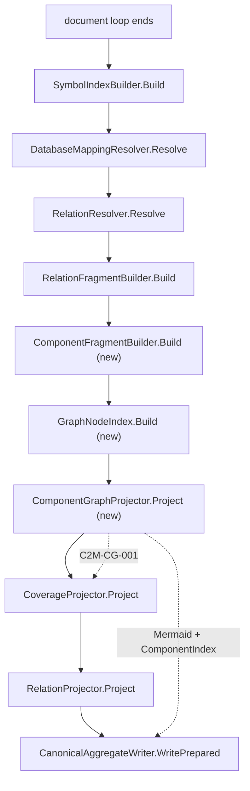

# Component Graph Design

**Spec**: `.specs/features/component-graph/spec.md`
**Status**: Approved

---

## Architecture Overview

Two gaps close in one pass. A new pass-two builder mints one `ComponentFact` per `ProjectFact` and persists
it like any other fragment. A new pure `GraphNodeIndex` answers the question `RelationProjector` never could
— *which node does this relation endpoint belong to?* — by walking facts the pipeline already holds, never
by parsing a `FactId` string. A new `ComponentGraphProjector` consumes both and owns `raw/dependencies.mmd`
and `raw/codebase/components.md`. `RelationProjector` loses its component and Mermaid responsibilities and
keeps only its partition job.



The dotted edge from `ComponentGraphProjector` into `CoverageProjector` is the ordering that matters: the
graph must be projected **before** `CoverageProjector.Project` so its omission diagnostic reaches
`raw/facts/diagnostics.json`. `RelationProjector.Project` runs today at
[AnalysisEngine.cs:269](src/Csharp2Md.Core/Analysis/AnalysisEngine.cs#L269), *after* coverage is computed at
line 263, which is precisely why a projector-produced diagnostic would be silently dropped (see Risks).

---

## Code Reuse Analysis

### Existing Components to Leverage

| Component | Location | How to Use |
| --- | --- | --- |
| `RelationFragmentBuilder` | [RelationFragmentBuilder.cs:29](src/Csharp2Md.Core/Analysis/Relations/RelationFragmentBuilder.cs#L29) | Copy its exact shape for `ComponentFragmentBuilder`: empty-input short circuit, `validate(FactValidationInput.Create(...))`, a `…FragmentResult(Fragment, Diagnostics)` record with a static `Empty`. |
| `DatabaseFragmentBuilder` / `DatabaseAggregateProjector` | `src/Csharp2Md.Core/Projection/Aggregates/DatabaseAggregateProjector.cs` | The precedent for a pass-two aggregate whose diagnostics are added to `analysisDiagnostics` *before* coverage ([AnalysisEngine.cs:212-213](src/Csharp2Md.Core/Analysis/AnalysisEngine.cs#L212)). Also the precedent for anchoring a projector diagnostic on a representative fact's `Header.Id`. |
| `ComponentFact` / `ComponentFactId` | [Facts.cs:85](src/Csharp2Md.Core/Facts/Model/Facts.cs#L85), [FactIds.cs:94](src/Csharp2Md.Core/Facts/Identity/FactIds.cs#L94) | Already modelled, already validated (`FactValidator.GetReferences` line 82), already serialized, already in `schemas/facts.schema.json`. Construct, do not extend. |
| `RelationProjector.Escape` | [RelationProjector.cs:178](src/Csharp2Md.Core/Projection/Aggregates/RelationProjector.cs#L178) | Move into `ComponentGraphProjector` and extend with `\|` → `#124;` per COMP-18. |
| `FactValidator` `knownFactIds` channel | [FactValidator.cs:19-22](src/Csharp2Md.Core/Facts/Validation/FactValidator.cs#L19) | The component fragment references project ids that live in *other* fragments; `knownFactIds` is the existing escape hatch relations already use for exactly this. |
| `SymbolIndexBuilder` inputs | [AnalysisEngine.cs:183-187](src/Csharp2Md.Core/Analysis/AnalysisEngine.cs#L183) | `accumulated.OfType<ProjectFact>()` / `OfType<DocumentFact>()` and the `symbolFacts` builder are already materialized at the call site — the node index needs no new collection pass. |
| `DiagnosticStage.Projection` | [AnalysisDiagnostic.cs:18](src/Csharp2Md.Core/Facts/Metadata/AnalysisDiagnostic.cs#L18) | The correct stage for `C2M-CG-001`. |

### Integration Points

| System | Integration Method |
| --- | --- |
| `AggregateOutputSnapshot` | Gains `ComponentGraphProjection? Graph = null` as a trailing optional parameter, mirroring `Relations` and `Database`. |
| `CanonicalAggregateWriter` | Lines 85-86 read `snapshot.Graph?.Mermaid` / `snapshot.Graph?.ComponentIndex` instead of `relationProjection?.…`. The `?? "flowchart LR\n"` / `?? "# Components\n"` fallbacks stay and satisfy COMP-06. |
| `raw/facts/manifest.json` | The component fragment is added to `storedFragments` via `store.Persist`, so it appears in the manifest with no writer change (COMP-02). |
| `knownFactIds` | Extended with every `ProjectFactId` so `C2M-FV-002` accepts the component fragment's references. |

---

## Components

### `ComponentFragmentBuilder`

- **Purpose**: Mint one `ComponentFact` per `ProjectFact` and validate them into the run's single
  solution-level component fragment.
- **Location**: `src/Csharp2Md.Core/Analysis/Components/ComponentFragmentBuilder.cs`
- **Interfaces**:
  - `static ComponentFragmentResult Build(IEnumerable<ProjectFact> projects, IReadOnlySet<FactId> knownFactIds, FragmentValidationFunc validate)` — returns `ComponentFragmentResult.Empty` when there are no projects (COMP-06).
- **Dependencies**: `ProjectFact`, `FactValidator` via the injected `validate` delegate.
- **Reuses**: `RelationFragmentBuilder`'s structure verbatim.
- **Rules**:
  - `ComponentKind` is the constant `"project"`; `ProjectIds` is `[project.ProjectId]` (COMP-01).
  - `ComponentFactId.Create("project", [project.ProjectId.ToFactId()])`.
  - Header resolution is `project.Header.Resolution` — mirrored, not hardcoded (COMP-04). A live run
    reports every project as `syntactic` in the default mode, so a hardcoded `Exact` would overclaim.
  - Provenance `new FactProvenance("csharp2md.components", "1")`, matching the
    `csharp2md.relations` / `csharp2md.syntax` naming already in use.
  - `Evidence` is empty (COMP-04).
  - Deduplication is inherited, not re-implemented: `AnalysisEngine.analysedProjects`
    ([line 149](src/Csharp2Md.Core/Analysis/AnalysisEngine.cs#L149)) already guarantees one `ProjectFact`
    per project regardless of how many solutions reach it (COMP-03). A defensive duplicate check still
    throws so COMP-08 is structural rather than incidental.

### `GraphNodeIndex`

- **Purpose**: Answer "which graph node owns this `FactId`?" in O(1) without interpreting id text.
- **Location**: `src/Csharp2Md.Core/Projection/Aggregates/GraphNodeIndex.cs`
- **Interfaces**:
  - `static GraphNodeIndex Build(IEnumerable<ComponentFact> components, IEnumerable<ProjectFact> projects, IEnumerable<DocumentFact> documents, IEnumerable<SymbolFact> symbols, IEnumerable<DatabaseObjectFact> objects, IEnumerable<DatabaseColumnFact> columns)`
  - `bool TryResolve(FactId endpoint, [NotNullWhen(true)] out GraphNode? node)`
- **Dependencies**: none beyond the fact model — pure and independently testable.
- **Reuses**: the `FrozenDictionary` + ordinal-comparer discipline `SymbolIndex` established.
- **Resolution rules** (one flat `FrozenDictionary<FactId, GraphNode>`, pre-expanded at build time):

  | Endpoint id shape | Resolves to |
  | --- | --- |
  | `ProjectFactId` | that project's component node |
  | `DocumentFactId` | `DocumentFact.ProjectId`'s component node |
  | `SymbolFactId` | `SymbolFact.DocumentId` → `DocumentFact.ProjectId`'s component node |
  | `DatabaseObjectFactId` | that object's database node |
  | `DatabaseColumnFactId` | `DatabaseColumnFact.ObjectId`'s database node (COMP-21) |
  | anything else | no node — caller omits the relation and counts it (COMP-14, COMP-25) |

  This is why the design refuses approach 3: a semantic `id1:symbol;target=…` buries its project two
  percent-encoding levels deep inside `target=` while a `syntactic-symbol` id keeps it one level deep, and
  AD-014 defines ids as opaque references navigated through the manifest.

### `ComponentGraphProjector`

- **Purpose**: Render the deduped component graph and the component index from validated facts.
- **Location**: `src/Csharp2Md.Core/Projection/Aggregates/ComponentGraphProjector.cs`
- **Interfaces**:
  - `static ComponentGraphProjection Project(IEnumerable<ValidatedFactFragment> fragments, GraphNodeIndex nodes)`
- **Dependencies**: `GraphNodeIndex`, `RelationFact`, `ComponentFact`.
- **Reuses**: `RelationProjector`'s fragment-walking loop and `Escape`; `FactualJsonMapper.WireRelationPartition` for the partition name in an edge label.
- **Pipeline**:
  1. Walk fragments; collect `RelationFact`s and `ComponentFact`s. Reading only validated fragments means
     an unvalidated relation can never reach the diagram.
  2. Drop every relation with a null `TargetId` (COMP-13), no diagnostic (COMP-26).
  3. Resolve both endpoints through `GraphNodeIndex`. An endpoint that resolves to nothing drops the
     relation and increments the omission counter (COMP-14).
  4. Drop relations whose endpoints resolve to the same node (COMP-12), no diagnostic (COMP-26).
  5. Group the survivors by `(SourceNode, TargetNode, Partition, RelationKind)`; each group is one edge
     with `Count = group size` (COMP-11, COMP-19).
  6. Emit node lines for the nodes the surviving edges touch, and nothing else (COMP-15).
  7. Emit the omission diagnostic if and only if the counter is non-zero (COMP-25).
- **Ordering** (COMP-16): nodes by `(Label, NodeId)` ordinal — `Label` alone is not a total order because
  two database objects on different connections may share a `Name` (COMP-30); edges by
  `(SourceLabel, SourceNodeId, TargetLabel, TargetNodeId, PartitionWireName, RelationKind)` ordinal.
- **Rendering**:
  - Node alias is positional: `node0`, `node1`, … assigned after ordering, so the file is deterministic.
  - Project node: `    node0["Acme.Orders"]` (COMP-17).
  - Database node: `    node1[("order_headers")]` — Mermaid's cylinder (COMP-23).
  - Edge: `    node0 -->|structural:calls ×5| node1` (COMP-11).
  - `Escape` maps `#`→`#35;`, `"`→`#quot;`, `|`→`#124;`, `\r`→``, `\n`→` ` (COMP-18). The `|` case is new
    and matters because the edge label sits between pipes.
- **Component index** (COMP-05, COMP-24): `# Components`, then every `ComponentFact` ordered by component
  id with its kind and project ids. Database objects are absent by construction — they are not
  `ComponentFact`s.

### `RelationProjector` (modified)

- **Change**: delete the `ComponentFact` case, the `Components` field, `Mermaid`, `ComponentIndex` and
  `Escape`. `RelationProjectionResult` narrows to `(ImmutableArray<RelationPartitionProjection> Partitions)`.
- **Why**: it currently does four unrelated jobs; `ResolutionMetricsProjector` and
  `CanonicalAggregateWriter`'s partition loop only ever touch `Partitions`.
- **Kept**: the duplicate-relation-identity throw and the `Enum.GetValues<RelationPartition>()` projection.
- **Test impact**: 3 of the 13 tests in `RelationProjectorTests.cs` cover Mermaid/component behaviour and
  move to `ComponentGraphProjectorTests.cs` rewritten against the new rules; the other 10 stay.

### `AnalysisEngine` (modified)

Inserted between the relation fragment (line 252-260) and `CoverageProjector.Project` (line 263):

```csharp
var projects = accumulated.OfType<ProjectFact>().ToImmutableArray();
var componentKnownIds = knownFactIds
    .Concat(projects.Select(static project => project.ProjectId.ToFactId()))
    .ToHashSet();
var componentResult = ComponentFragmentBuilder.Build(projects, componentKnownIds, _validate);
analysisDiagnostics.AddRange(componentResult.Diagnostics);
if (componentResult.Fragment is { } componentFragment)
{
    storedFragments.Add(store.Persist(componentFragment));
    aggregateFragments.Add(componentFragment);
}
else if (!componentResult.Diagnostics.IsEmpty)
{
    structuralFailure = true;
}

var nodeIndex = GraphNodeIndex.Build(
    componentResult.Components, projects, accumulated.OfType<DocumentFact>(),
    symbolFacts, databaseResolution.Objects, databaseResolution.Columns);
var graph = ComponentGraphProjector.Project(aggregateFragments, nodeIndex);
analysisDiagnostics.AddRange(graph.Diagnostics);   // must precede CoverageProjector.Project
```

`snapshot` then gains `graph` as its trailing argument.

---

## Data Models

### `GraphNode`

```csharp
internal sealed record GraphNode(string NodeId, string Label, GraphNodeShape Shape);

internal enum GraphNodeShape { Component, DatabaseObject }
```

`NodeId` is the underlying identity (`ComponentFactId.Value` or `DatabaseObjectFactId.Value`) and is what
dedupe and tie-breaking use. `Label` is the display string (`ProjectFact.Name` or
`DatabaseObjectFact.Name`) and is what ordering primarily uses. `Shape` selects the Mermaid bracket form.

### `ComponentFragmentResult`

```csharp
internal sealed record ComponentFragmentResult(
    ValidatedFactFragment? Fragment,
    ImmutableArray<ComponentFact> Components,
    ImmutableArray<AnalysisDiagnostic> Diagnostics)
{
    public static ComponentFragmentResult Empty { get; } = new(null, [], []);
}
```

`Components` is carried separately from `Fragment` so `GraphNodeIndex.Build` does not have to re-filter the
fragment's `IFact` array by type.

### `ComponentGraphProjection`

```csharp
internal sealed record ComponentGraphEdge(
    GraphNode Source,
    GraphNode Target,
    RelationPartition Partition,
    string RelationKind,
    int Count);

internal sealed record ComponentGraphProjection(
    ImmutableArray<ComponentGraphEdge> Edges,
    string Mermaid,
    string ComponentIndex,
    ImmutableArray<AnalysisDiagnostic> Diagnostics)
{
    public static ComponentGraphProjection Empty { get; } = new([], "flowchart LR\n", "# Components\n", []);
}
```

`Edges` is the deduped edge set the Mermaid is rendered *from*, added during task breakdown so edge
selection is verifiable without the renderer. It is a real product rather than a test-only hook — a future
JSON graph or per-component page consumes the same list instead of re-deriving it from the diagram text.

---

## Error Handling Strategy

| Error Scenario | Handling | User Impact |
| --- | --- | --- |
| Two `ComponentFact`s share one identity (COMP-08) | `ComponentFragmentBuilder` throws `InvalidOperationException`; `FactValidator`'s `C2M-FV-001` is the second line of defence | Run fails loudly rather than dropping a component |
| One project id maps to two components (COMP-09) | `GraphNodeIndex.Build` throws `InvalidOperationException`, preserving the invariant `RelationProjector.Mermaid` holds today | Run fails; guards the deferred P2 service rollup |
| A component references an unknown project id (COMP-31) | `C2M-FV-002` from the existing validator; empty fragment plus `structuralFailure = true` | Non-zero exit, diagnostic in `diagnostics.json` |
| Relation endpoint resolves to no node (COMP-14) | Relation omitted; omission counter incremented | One `C2M-CG-001` summary diagnostic per run, never one per relation |
| Relation is a self-edge or has a null target | Omitted silently (COMP-26) | Nothing — this is specified behaviour, not a gap |
| Run analysed zero projects (COMP-06) | `ComponentFragmentBuilder` returns `Empty`; the writer's existing `??` fallbacks apply | `flowchart LR` and `# Components` still written |

`C2M-CG-001` is `DiagnosticSeverity.Information`, `DiagnosticStage.Projection`, anchored on the
ordinal-first omitted relation's `Header.Id`, carrying `DiagnosticData("omitted_relation_count", n)` —
the same anchoring pattern `DatabaseAggregateProjector` uses at line 100.

---

## Risks & Concerns

| Concern | Location (file:line) | Impact | Mitigation |
| --- | --- | --- | --- |
| **Diagnostic-ordering trap.** `RelationProjector.Project` is invoked inside the `snapshot` constructor at line 269, *after* `CoverageProjector.Project` at line 263. Any diagnostic a projector produces there is invisible in `diagnostics.json`. This is the same defect the relation-resolver session found in `RelationFragmentBuilder` (STATE.md, T23). | [AnalysisEngine.cs:263-270](src/Csharp2Md.Core/Analysis/AnalysisEngine.cs#L263) | COMP-27 would silently fail while appearing to pass | `ComponentGraphProjector.Project` is called on its own line before `CoverageProjector.Project`, not inline in the snapshot. A dedicated task asserts `C2M-CG-001` is present in `raw/facts/diagnostics.json` from a real run, not in a unit test of the projector. |
| **Flat node map size.** `GraphNodeIndex` holds one dictionary entry per symbol. A large solution has 10⁵+ symbols. | new file | Memory growth proportional to symbol count | Same order as `SymbolIndex`, which the run already retains to completion, and the values are shared `GraphNode` references so only the entry costs. Accepted; noted rather than optimized. |
| **`RelationProjectorTests` covers behaviour that is moving.** 13 tests, 3 of them on Mermaid/components. | [RelationProjectorTests.cs:224](tests/Csharp2Md.Core.Tests/Projection/Aggregates/RelationProjectorTests.cs#L224) — the repository's only `new ComponentFact(` | Deleting them would lose coverage silently | The 3 are rewritten into `ComponentGraphProjectorTests.cs` against the new rules and must be *stricter* (they currently assert an empty diagram). Deletion without replacement is prohibited. |
| **`Acme.DoesNotExist` gets a `ProjectFact`.** Inventory produces a project fact for a `.slnx` entry whose file is missing, with 0 documents and no linked diagnostic. | `fixtures/SyntheticSolution/Acme.Orders/Acme.Orders.slnx` | A component for a project that does not exist on disk | Specified deliberately (COMP-29): the component mirrors the project fact one-for-one, appears in `components.md`, and never reaches the diagram because no edge touches it. |
| **Test gap: nothing asserts `dependencies.mmd` content today.** The file has been `"flowchart LR\n"` across four features and no test noticed. | [CanonicalAggregateWriter.cs:85](src/Csharp2Md.Core/Projection/Aggregates/CanonicalAggregateWriter.cs#L85) | The exact failure mode AD-020 documented | The P1 Independent Tests run the real CLI over `fixtures/SyntheticSolution` and assert named edges, not just non-emptiness. `V3DeterminismTests` gains the byte-identical `.mmd` assertion for COMP-16. |
| **Escape has no `\|` rule.** Latent, not currently triggered — relation kinds come from a fixed vocabulary and project names come from paths. | [RelationProjector.cs:178-182](src/Csharp2Md.Core/Projection/Aggregates/RelationProjector.cs#L178) | A `\|` in any label would break the Mermaid edge syntax | COMP-18 adds `\|` → `#124;` to the moved `Escape`, with a unit test that does not depend on a fixture producing one. |

---

## Tech Decisions (only non-obvious ones)

| Decision | Choice | Rationale |
| --- | --- | --- |
| Endpoint→node mapping | A pre-expanded flat `FrozenDictionary<FactId, GraphNode>` built from facts | O(1), no id-text parsing, conforms to AD-014's opaque-id rule. User chose this over parsing ids and over threading a `NodeIndex` into `RelationProjector`. |
| Graph reads validated fragments, not `RelationResolution` | `Project(IEnumerable<ValidatedFactFragment>, GraphNodeIndex)` | Mirrors `RelationProjector` exactly and makes it structurally impossible for an unvalidated relation to reach the diagram. |
| Component resolution mirrors the project's | `component.Header.Resolution = project.Header.Resolution` | A live run reports every project as `syntactic` in the default syntax-only mode; a hardcoded `Exact` would claim proof the project fact itself does not. |
| Database objects are nodes but not `ComponentFact`s | Projected straight from `DatabaseObjectFact` | `ComponentFactId.Create` throws on an empty owner set and `ProjectIds` is typed `ImmutableArray<ProjectFactId>`, so a non-project owner is inexpressible without the schema bump the spec puts out of scope. |
| Node ordering key | `(Label, NodeId)`, not `Label` | Two database objects on different connections may share a `Name` (COMP-30); label alone is not a total order and would make output order input-order-dependent. |
| No schema version bump | `SchemaVersion` stays 5 | `schemas/facts.schema.json` already lists `components` in `required` and `"component"` in `fact_kind`. Verified by reading the schema, not assumed. |

> **Project-level decision to record at Execute:** a new `AD-021` supersedes `AD-020`, stating that
> `raw/dependencies.mmd` carries real component edges, that a component is one-per-project, and that
> database objects are graph nodes without being `ComponentFact`s. `AD-020`'s status becomes
> `superseded by AD-021`. `AD-015`'s open question about the orphaned `Detection/` tree is **not** resolved
> here — this feature produces components from inventory, not from detectors.
