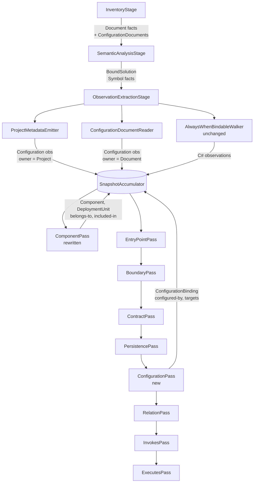

# Components, Deployments and Configuration Design

**Spec**: `.specs/features/components-deployments-configuration/spec.md`
**Status**: Approved

---

## Architecture Overview

Two evidence sources feed two classifier passes. Neither pass touches Roslyn or the filesystem: everything they read is already in the immutable ledger, which is what AD-004 requires and what `EvidenceChain.Create` makes unavoidable — a confirmed relation has no legal way to exist without observations behind it.

The extraction layer grows two emitters. `ProjectMetadataEmitter` reads `OutputKind` and `ProjectReferences` off the Roslyn projects the semantic stage already holds and writes them as `Configuration` observations owned by `Project` facts, located in the `.csproj`. `ConfigurationDocumentReader` reads each inventoried `appsettings*.json` and writes one `Configuration` observation per leaf key, owned by the `Document` fact, carrying the key path and never the value.

The classification layer grows one rewritten pass and one new pass, each following 5C's model → builder → emitter split so the correlation rules stay unit-testable against a hand-built ledger.



`ComponentPass` must stay first because `EntryPointPass`, `BoundaryPass` and `PersistencePass` all resolve a symbol's owning component. `ConfigurationPass` must run after `PersistencePass` because `configured-by` on a `DataStore` needs 5C's output, and its `targets` promotion needs 5A's candidates.

### Approach exploration — pass decomposition

The one genuinely open structural choice is how many passes carry the new work.

| Approach | Shape | Trade-off |
| --- | --- | --- |
| **A — two passes (recommended)** | `ComponentPass` emits components, deployment units, `belongs-to` and `included-in`; `ConfigurationPass` emits bindings, `configured-by` and the `targets` promotion | All four outputs of `ComponentPass` fall out of one transitive-reachability computation over the same topology graph. Splitting them would mean either computing the graph twice or passing it between passes, which the `IClassifierPass` contract has no slot for |
| B — three passes | `ComponentPass`, a separate `DeploymentPass`, then `ConfigurationPass` | One concern per pass reads tidier, but `DeploymentPass` would have to re-derive reachability from the emitted `Component` facts, which no longer carry the project graph. Re-derivation from facts is exactly the "classifier invents evidence" shape AD-004 forbids |
| C — one pass | Everything in a single topology pass | Infeasible. Components must exist before `EntryPointPass`; `configured-by` on a `DataStore` needs `PersistencePass` output. One pass cannot occupy both positions |

**Recommendation: A.** The topology graph is computed once in `TopologyModelBuilder` and consumed once by `TopologyEmitter`, mirroring `PersistenceModelBuilder` / `PersistenceEmitter`.

---

## Code Reuse Analysis

### Existing Components to Leverage

| Component | Location | How to Use |
| --- | --- | --- |
| `PersistenceModel` / `Builder` / `Emitter` triad | `src/Csharp2Md.Analysis/Classification/Persistence/` | Apply the same pattern for `Topology` and `Configuration`: a Roslyn-free record model, a builder that correlates the ledger, an emitter that constructs Domain facts in one ordered walk |
| `SecretRedactor` | `src/Csharp2Md.Analysis/Extraction/SecretRedactor.cs:11` | `TryRedact` already recognizes `Password=`, `Pwd=`, `Data Source=`, `token=`, bearer tokens and PEM bodies — exactly the fixture's connection string. Reuse unchanged for CDC-28 |
| `ObservationMaterializer.Redact` | `src/Csharp2Md.Analysis/Extraction/ObservationMaterializer.cs:41` | Drops secret-bearing payload entries and records `SuspectedSecretEvidence`. Both new emitters route drafts through it |
| `ObservationMaterializer.HashFileBytes` | `.../ObservationMaterializer.cs:33` | Supplies the `DocumentHash` CDC-32 requires for configuration documents |
| `ObservationDraft` | `src/Csharp2Md.Analysis/Extraction/ObservationDraft.cs` | Both new emitters produce drafts, so redaction and ordinal assignment stay shared |
| `PayloadReader` | `src/Csharp2Md.Analysis/Classification/PayloadReader.cs` | Reads a payload entry by key from an observation; both new builders use it instead of re-implementing payload access |
| `SnapshotAccumulator` | `src/Csharp2Md.Analysis/Pipeline/SnapshotAccumulator.cs` | `AddFact`, `AddRelation`, `AddCandidate`, `AddUnresolved`, `AddOpenFrontier`, `AddDiagnostic`, `AddSuspectedSecret` all exist. Only `RemoveCandidate` is new |
| `ClassifierContext` | `src/Csharp2Md.Analysis/Classification/ClassifierContext.cs` | `ObservationsByKind`, `ObservationsByOwner`, `FactsByType<T>` and the `Refresh` cycle carry both new passes. One new lookup is added |
| `AuthorizedRoot` / `PathGuard` | `src/Csharp2Md.Analysis/Inventory/` | The configuration reader resolves absolute paths through the same guard, satisfying CDC-34 without new path logic |
| `BoundSolution.Leases` | `src/Csharp2Md.Analysis/Semantics/BoundSolution.cs:18` | Each lease exposes `Solution.Projects`, which carry `CompilationOptions.OutputKind`, `ProjectReferences` and `FilePath` — the entire topology input |
| `ClassifierIdentity.Create` | `src/Csharp2Md.Domain/Proof/ClassifierIdentity.cs:17` | Same `csharp2md.classifier.{area}` convention 5A and 5C use |

### Integration Points

| System | Integration Method |
| --- | --- |
| Wire and storage layer | None needed. `WireFactMapping.ToDto(DeploymentUnit)` (`WireFactMapping.cs:107`) and `ToDto(ConfigurationBinding)` (`:189`) already exist, `WireDocument` already carries both arrays, and `PackagePublisher` already writes the `ConfigurationFactsShard` when it is non-empty. This workstream is the first to make it non-empty |
| `PackageValidator` | Validates registered fact types and observation kinds only — no owner-type constraint — so `Project`- and `Document`-owned observations pass unchanged |
| Taxonomy registry | Untouched. Every fact type, relation triple, observation kind and literal role this workstream needs is already declared (`RelationDescriptor.cs:55,60,116`), so `contracts/taxonomy-registry.json` stays byte-identical |

---

## Components

### `ProjectMetadataEmitter`

- **Purpose**: Write each compiled project's output kind and in-solution references into the ledger as `Configuration` observations.
- **Location**: `src/Csharp2Md.Analysis/Extraction/ProjectMetadataEmitter.cs`
- **Interfaces**:
  - `static int Emit(PipelineContext context, CancellationToken cancellationToken)` — returns the observation count
- **Behaviour**: For each lease's `Solution.Projects` with `Language == CSharp` and a non-null `FilePath`, map the file path to the Domain `ProjectId` logical path through the authorized root; skip a project that produced no compilation (CDC-05). Emit one `output-kind` draft valued `application` when `CompilationOptions.OutputKind` is `ConsoleApplication` or `WindowsApplication`, `library` otherwise (CDC-01). For each `ProjectReference`, resolve the referenced Roslyn project's `FilePath`; when it maps to an analyzed project emit a `project-reference` draft holding the referenced logical path (CDC-02), otherwise record an `unanalyzed-project-reference` diagnostic (CDC-07). Locator is the project's own `.csproj` `Document` with a whole-document span, because the value is MSBuild-evaluated rather than textual. Ordinals are assigned within the project's own metadata set, ordered by payload key then value: `output-kind` takes 1 and references take 2..N (CDC-06). Deduplication across target frameworks is by observation identity, which `SnapshotAccumulator.AddObservation` already provides (CDC-04).
- **Dependencies**: `BoundSolution`, `PipelineContext.AuthorizedRoot`, the `Project` and `Document` facts already in the accumulator.
- **Reuses**: `ObservationDraft`, `ObservationMaterializer.HashFileBytes`, `SnapshotAccumulator`.

### `ConfigurationDocumentReader`

- **Purpose**: Turn each inventoried `appsettings*.json` into key-path observations without carrying any value.
- **Location**: `src/Csharp2Md.Analysis/Extraction/ConfigurationDocumentReader.cs`
- **Interfaces**:
  - `static int Emit(PipelineContext context, CancellationToken cancellationToken)`
- **Behaviour**: For each `PipelineContext.ConfigurationDocuments` entry, resolve its absolute path under the authorized root through `PathGuard.RejectEscapes` (CDC-34) and parse with `System.Text.Json`. Walk objects and arrays to every leaf, building the colon-joined key path (array elements use their index, matching .NET's own convention). For each leaf emit a draft carrying `key`, a `resolution` entry of `literal` / `dynamic` / `unknown` (CDC-29), and an `address` entry only when the value parses as an absolute URI and is not a suspected secret (CDC-30). Every draft passes through `ObservationMaterializer.Redact`, so a secret-bearing value produces `SuspectedSecretEvidence` and never reaches a payload (CDC-28). Ordinals are 1..N over the ordinal-sorted key paths (CDC-33). A `JsonException` yields a `malformed-configuration-document` diagnostic and no observations (CDC-31).
- **Dependencies**: `PipelineContext.ConfigurationDocuments`, `PipelineContext.AuthorizedRoot`.
- **Reuses**: `ObservationDraft`, `ObservationMaterializer.Redact` / `HashFileBytes`, `SecretRedactor`, `PathGuard`.

### `DocumentInventory` (extended)

- **Purpose**: Stop writing off `appsettings*.json` as unsupported and surface it as a configuration document.
- **Location**: `src/Csharp2Md.Analysis/Inventory/DocumentInventory.cs`
- **Change**: `InventoriedDocuments` gains a `ConfigurationDocuments` array. A document whose file name matches `appsettings*.json` (ordinal-ignore-case) is added there instead of producing an `unsupported-document` diagnostic (CDC-25). Every other non-C# document keeps today's behaviour, including the `.csproj`, which is still not textually extracted.
- **Reuses**: the existing enumeration, exclusion and relative-path logic unchanged.

### `PipelineContext` (extended)

- **Location**: `src/Csharp2Md.Analysis/Pipeline/PipelineContext.cs`
- **Change**: two new settable slots alongside `CSharpDocuments`, filled by `InventoryStage`:
  - `string AuthorizedRoot` — today `SymbolFactEmitter` recomputes it from the solution path (`SymbolFactEmitter.cs:29`); both new emitters need it, so it is computed once and shared.
  - `ImmutableArray<Document> ConfigurationDocuments`.

### `Classification/Topology/TopologyModel`

- **Purpose**: The resolved grouping picture, built from the ledger alone, holding no Roslyn type and constructing no Domain fact.
- **Location**: `src/Csharp2Md.Analysis/Classification/Topology/TopologyModel.cs`
- **Reuses**: the `PersistenceModel` record-model pattern.

### `TopologyModelBuilder`

- **Purpose**: Apply the evidence-based grouping rule.
- **Location**: `src/Csharp2Md.Analysis/Classification/Topology/TopologyModelBuilder.cs`
- **Interfaces**:
  - `static TopologyModel Build(ClassifierContext context)`
- **Algorithm**: Read every `Configuration` observation owned by a `Project` fact. Partition projects into applications and libraries by `output-kind` (CDC-01, CDC-09). Build the directed reference graph from `project-reference` payloads and compute, for each library, the set of applications that reach it transitively (CDC-13) by a depth-first walk from each application. Then assign each project a grouping: an application groups into its own component; a library reached by exactly one application groups into that application's component (CDC-10); a library reached by two or more, or by none, groups into its own component (CDC-11, CDC-12). Component name is always the grouping project's logical path. Deployment units come from applications only (CDC-19, CDC-24), and inclusion edges from the reaching-set (CDC-20, CDC-21), with an unresolved node for every component no application reaches (CDC-22, CDC-23). An empty project-metadata set yields an empty model (CDC-18).
- **Dependencies**: `ClassifierContext` only.
- **Reuses**: `PayloadReader`.

### `TopologyEmitter`

- **Purpose**: Construct and add the Domain facts and relations in one ordered walk.
- **Location**: `src/Csharp2Md.Analysis/Classification/Topology/TopologyEmitter.cs`
- **Interfaces**:
  - `static ClassifierPassResult Emit(ClassifierContext context, TopologyModel model)`
- **Behaviour**: For each grouping, collect the `Symbol` facts in its projects that own at least one observation, ordered by fact id (CDC-14), and construct the `Component` with them as owners. Emit one `belongs-to` per owner with `EvidenceMethod.Semantic`, derived from that symbol's own observations (CDC-15, CDC-16, CDC-17). Construct one `DeploymentUnit` per application and emit `included-in` with `EvidenceMethod.Configured`, derived from the `output-kind` and `project-reference` observations that prove the reach (CDC-20). Emit `UnresolvedRecord`s for unreached components (CDC-22) and the component-coverage diagnostic (CDC-56).
- **Reuses**: `ConfirmedRelation.Create` with `sourceFact` / `targetFact` per AD-015, `EvidenceChain.Create`, `UnresolvedRecord.Create`.

### `ComponentPass` (rewritten)

- **Purpose**: Run the topology builder and emitter. Keeps its name, its `"Components"` label and its first position, so the pass list stays stable for every later pass.
- **Location**: `src/Csharp2Md.Analysis/Classification/Passes/ComponentPass.cs`
- **Interfaces**: unchanged `IClassifierPass`.
- **Classifier identity**: `csharp2md.classifier.component-topology` version 1.

### `Classification/Configuration/ConfigurationModel` and `ConfigurationModelBuilder`

- **Purpose**: Correlate declared configuration keys with the facts that consume them.
- **Location**: `src/Csharp2Md.Analysis/Classification/Configuration/`
- **Algorithm**: Read every `Configuration` observation owned by a `Document` fact into a key table, each entry holding the key path, its `resolution`, its optional `address`, the declaring document and the observation identity. Resolve each declaring document to the component grouping its project (CDC-35). Then match, all by exact ordinal comparison (CDC-41, CDC-48):
  - every `Configuration` observation owned by a `Symbol` against the key table, producing a `configured-by` edge or an unresolved node (CDC-37, CDC-42);
  - every `DataStore` name against the last segment of `ConnectionStrings:*` keys (CDC-38);
  - every outbound `BoundaryOperation` client name against the last segment of `Services:*` keys (CDC-39);
  - every candidate `targets` link whose `ExternalSystem` name matches a `Services:*` key, classified as promote / frontier / leave by that key's `resolution` (CDC-43, CDC-44, CDC-45).

### `ConfigurationEmitter` and `ConfigurationPass`

- **Purpose**: Construct the bindings, relations, frontier and coverage records; remove promoted candidates.
- **Location**: `src/Csharp2Md.Analysis/Classification/Configuration/ConfigurationEmitter.cs`, `.../Passes/ConfigurationPass.cs`
- **Pass name**: `"Configuration"`, registered after `PersistencePass` and before `RelationPass` (CDC-55).
- **Classifier identity**: `csharp2md.classifier.configuration` version 1.
- **Reuses**: `ConfirmedRelation.Create`, `OpenFrontier.Create`, `SnapshotAccumulator.RemoveCandidate`.

### `SnapshotAccumulator.RemoveCandidate` (new)

- **Location**: `src/Csharp2Md.Analysis/Pipeline/SnapshotAccumulator.cs`
- **Interface**: `bool RemoveCandidate(CandidateLink candidate)`
- **Rationale**: A promoted candidate must leave the package, or it would publish a candidate and a confirmed edge for the same link. Used only inside the promotion path.

### `ClassifierContext.ComponentForSymbol` (new) and its four callers

- **Location**: `src/Csharp2Md.Analysis/Classification/ClassifierContext.cs`
- **Interface**: `Component? ComponentForSymbol(FactReference symbol)`, built during `Refresh` from `Component.Owners`.
- **Callers to migrate**: `BoundaryPass.cs:127`, `BoundaryPass.cs:242`, `EntryPointPass.cs:61` currently resolve `symbol → project → logical path → componentsByPath`. Under the new rule a privately-used library's symbols live in a component whose name is *not* that library's path, so a path lookup silently drops them. `Component.Owners` is already the authoritative membership record, so this replaces a derived lookup with the direct one. `BoundaryPass.cs:63` and `:300` look up by component id and are unchanged.

### Fixture changes

| File | Change |
| --- | --- |
| `Acme.Orders/Acme.Orders.csproj` | `<OutputType>Exe</OutputType>` |
| `Acme.Orders/Program.cs` | `public static void Main(string[] args)` delegating to the existing `ConfigureHost`, which `OutputType=Exe` requires to compile |
| `Acme.Payments/Acme.Payments.csproj` | `<OutputType>Exe</OutputType>` |
| `Acme.Payments/PaymentsService.cs` (or a sibling) | a `Main` entry point, same reason |
| `Acme.Orders.Worker/` (new) | `Acme.Orders.Worker.csproj` (`Exe`, references `Acme.Shared.Contracts` only) plus a worker type consuming `IEventBus` so its symbols carry observations |
| `Acme.Orders/Acme.Orders.slnx` | add `../Acme.Orders.Worker/Acme.Orders.Worker.csproj` |
| `Acme.Orders/appsettings.Development.json` (new) | one key already in `appsettings.json` plus one new key, covering the glob and the no-merge rule |

Resulting grouping, which is the feature's own ground truth:

| Solution | Applications | Components | Deployment units |
| --- | --- | --- | --- |
| `Acme.Orders.slnx` | `Acme.Orders`, `Acme.Orders.Worker` | those two, plus `Acme.Shared.Contracts` as **shared** | two |
| `Acme.Payments.slnx` | `Acme.Payments` | one — `Acme.Shared.Contracts` is **private-use** and groups into it | one |

---

## Data Models

### `TopologyModel`

```csharp
internal sealed record TopologyModel(
    ImmutableArray<ComponentGroup> Groups,
    ImmutableArray<DeploymentNode> Deployments,
    ImmutableArray<InclusionEdge> Inclusions,
    ImmutableArray<UnreachedComponent> Unreached,
    TopologyCoverage Coverage);

/// <summary>One component and every project whose code it groups.</summary>
internal sealed record ComponentGroup(
    string ComponentName,
    GroupingEvidence Evidence,
    ImmutableArray<ProjectId> Projects);

/// <summary>Why these projects group together. Recorded for diagnostics, not published as a facet.</summary>
internal enum GroupingEvidence { Deployable, PrivateUse, Shared, Unreached }

internal sealed record DeploymentNode(string Name, ProjectId Application);

/// <summary>One component shipping inside one deployment unit, with the observations that prove it.</summary>
internal sealed record InclusionEdge(
    string ComponentName,
    string DeploymentName,
    EvidenceChain Evidence);

internal sealed record UnreachedComponent(string ComponentName, EvidenceChain Evidence);

internal sealed record TopologyCoverage(
    int ProjectsGrouped,
    int ApplicationsFound,
    int ComponentsWithoutDeployment);
```

`GroupingEvidence` stays internal because lifetime-style facets are not declared in the registry and workstream 1 is closed. It reaches the package only through the coverage diagnostic.

### `ConfigurationModel`

```csharp
internal sealed record ConfigurationModel(
    ImmutableArray<DeclaredKey> Keys,
    ImmutableArray<ConfiguredEdge> Edges,
    ImmutableArray<TargetDecision> Targets,
    ImmutableArray<UnboundKeyRead> UnboundReads,
    ConfigurationCoverage Coverage);

/// <summary>One key path declared by one configuration document, owned by one component.</summary>
internal sealed record DeclaredKey(
    string KeyPath,
    KeyResolution Resolution,
    string? Address,
    FactReference OwningComponent,
    ObservationIdentity Evidence);

internal enum KeyResolution { Literal, Dynamic, Unknown }

/// <summary>A fact proven to be supported by a declared key.</summary>
internal sealed record ConfiguredEdge(
    FactReference Source,
    string KeyPath,
    EvidenceChain Evidence);

/// <summary>What to do with one 5A candidate targets link.</summary>
internal sealed record TargetDecision(
    CandidateLink Candidate,
    TargetOutcome Outcome,
    EvidenceChain Evidence);

internal enum TargetOutcome { Promote, Frontier, Leave }

internal sealed record UnboundKeyRead(FactReference Symbol, ObservationIdentity Evidence);

internal sealed record ConfigurationCoverage(
    int KeysDeclared,
    int KeysBound,
    int KeysReadButNotDeclared);
```

---

## Error Handling Strategy

| Error Scenario | Handling | Package impact |
| --- | --- | --- |
| Project listed but never compiled (`Acme.Broken`, `Acme.DoesNotExist`) | No project-metadata observation; existing `compilation-error` / `missing-project` diagnostics unchanged | The project has no component and no deployment unit; structural facts still publish |
| Project references a project outside the solution | `unanalyzed-project-reference` diagnostic; no `project-reference` observation | Reachability is computed over analyzed projects only |
| Component reached by no application | `UnresolvedRecord` for `included-in`, cause `insufficient evidence` | Component publishes; inclusion is honestly absent |
| Solution with no application at all | No deployment unit; every component unresolved | Valid degraded run, not a failure |
| Malformed `appsettings*.json` | `malformed-configuration-document` diagnostic, no observation, run continues | Other documents still contribute |
| Configuration value is a suspected secret | `SuspectedSecretEvidence` with redacted excerpt; payload entry dropped | Key publishes, value never does |
| Key read in C# but declared nowhere | `UnresolvedRecord` for `configured-by` | No invented binding |
| Client name matches no `Services` key | Candidate left untouched, no frontier | 5A's honest candidate survives |
| Client address is an env-var indirection | Candidate kept plus `OpenFrontier` | Dynamic continuation published as a frontier, per the taxonomy's evidence-dimension rule |
| Path escaping the authorized root | `PathGuard.RejectEscapes` throws, stage aborts publication | Existing abort behaviour, unchanged |

---

## Risks & Concerns

| Concern | Location (file:line) | Impact | Mitigation |
| --- | --- | --- | --- |
| Observation ordering key is `owner:kind:ordinal`, which does not include the payload, so two same-owner same-kind observations with different payloads share an ordering key and fall back to `OrderBy`'s stable order — i.e. accumulator insertion order | `src/Csharp2Md.Storage/Mapping/DomainMapper.cs:102` | Latent nondeterminism in canonical bytes. Pre-existing (it already applies to two `Invocation` payloads on one callable), but this workstream would add several colliding observations per project | Assign project-metadata ordinals across the whole per-project set — `output-kind` takes 1, references take 2..N over ordinal-sorted paths — and configuration-document ordinals 1..N over ordinal-sorted key paths, so every new observation has a distinct ordering key. Add an explicit determinism test. The pre-existing C# case stays out of scope |
| `OutputType=Exe` requires an entry point, so `Acme.Orders` and `Acme.Payments` each gain a `Main`, adding `Symbol` facts and `invokes` relations | `fixtures/SyntheticSolution/Acme.Orders/Program.cs` | Fixture-driven count assertions across 5A/5B/5C tests shift | Verified that `EntryPointPass` classifies only controller and handler shapes (`EntryPointPass.cs:37-58`), so no new `EntryPoint` fact appears. Symbol and `invokes` counts do move; the tasks include a dedicated reconciliation phase over the fixture-driven suites |
| Component grouping change silently drops boundary operations for privately-used libraries | `BoundaryPass.cs:127`, `BoundaryPass.cs:242`, `EntryPointPass.cs:61` | An operation declared in a private library would find no component by path and be skipped without a diagnostic | Replace the path lookup with `ClassifierContext.ComponentForSymbol`, which reads `Component.Owners` directly. Add a test asserting a boundary operation declared in a privately-used library still resolves its component |
| `ComponentPass` currently derives the component name by string-slicing `;path=` out of the project id, duplicated in three files | `ComponentPass.cs:71`, `BoundaryPass.cs:481`, `EntryPointPass.cs:166` | Three copies of an id-parsing rule that must agree | Move the helper to one internal shared location as part of the rewrite; the duplicate copies in `BoundaryPass` and `EntryPointPass` disappear with their path lookups |
| 67 test files load the fixture solutions | `tests/` | The fixture extension has wide blast radius | The fixture change lands in its own early phase so every later phase runs against the final fixture, and the reconciliation phase runs the full suite before the feature closes |
| `BoundaryIntegrationTests` asserts exactly three `targets` candidates | `tests/Csharp2Md.Analysis.Tests/Classification/BoundaryIntegrationTests.cs:96` | `PaymentService` is promoted, so the count becomes two | Expected and specified (CDC-43). The assertion is updated to two candidates plus one confirmed relation, which is a stronger check than the current one |
| No test currently exercises AD-008 per-solution isolation of component grouping | `tests/` | A regression that leaked cross-solution grouping would go unnoticed | The `Acme.Shared.Contracts` shared-vs-private split across the two fixture solutions is itself the test, asserted in the component phase |

---

## Tech Decisions

| Decision | Choice | Rationale |
| --- | --- | --- |
| Where MSBuild metadata enters | `Configuration` observations in the ledger, not a `PipelineContext` property | `EvidenceChain.Create` throws on an empty chain (`EvidenceChain.cs:22`), so `included-in` cannot be confirmed unless its evidence is an observation. A context property could not supply one |
| Project-metadata locator | The `.csproj` document with a whole-document span | The value is MSBuild-evaluated, so there is often no `<OutputType>` element to point at. Pointing at a line that may not exist would be worse evidence than pointing at the file |
| `.csproj` stays an unsupported document | Unchanged `unsupported-document` diagnostic | It is still not textually extracted; only `appsettings*.json` becomes a supported source (CDC-25). Changing it would alter inventory behaviour this spec does not cover |
| Where the emitters run | `ObservationExtractionStage`, reading `context.BoundSolution` | Observations belong to the extraction layer. The stage already owns `BoundSolution` and disposes it in its `finally` |
| Array elements in configuration | Indexed as key path segments, matching .NET's own configuration convention | An operator reading `Services:0:Url` sees the same key `IConfiguration` would produce |
| Grouping evidence in the package | Internal only, surfaced through the coverage diagnostic | No facet axis for it is declared, and workstream 1 is closed |
| `AuthorizedRoot` on `PipelineContext` | Computed once in `InventoryStage`, shared | `SymbolFactEmitter` currently recomputes it; two more consumers would make three copies of one derivation |

> No new `AD-NNN` entry is proposed. Every choice above conforms to AD-004, AD-006, AD-008, AD-013, AD-014, AD-015 and AD-017 without superseding any of them.

---

## Test Strategy

| Layer | Coverage |
| --- | --- |
| Extraction unit | `ProjectMetadataEmitter` and `ConfigurationDocumentReader` against hand-built contexts: output-kind mapping, unanalyzed references, malformed JSON, secret redaction, env-var indirection, absolute-URI detection, ordinal determinism |
| Topology unit | `TopologyModelBuilder` against a hand-built ledger: deployable, private-use, shared, unreached, transitive reach, empty ledger |
| Configuration unit | `ConfigurationModelBuilder` against a hand-built ledger: all four `configured-by` triples, exact-match refusal of prefix/case variants, the three `targets` outcomes |
| Pass unit | `ComponentPass` and `ConfigurationPass` emit the right facts, relations, unresolved records and counts |
| Fixture integration | Both solutions analyzed end to end, asserting the grouping table above, the four `configured-by` triples, and the three client outcomes |
| Isolation | No `Microsoft.CodeAnalysis` reference from `Classification` (CDC-08); assembly reference rules (CDC-54) |
| Determinism and security | Two clone paths byte-identical (CDC-49); no absolute path (CDC-50); classifier idempotence (CDC-51); password absent from every artifact (CDC-52); registry drift gate (CDC-53) |
| Reconciliation | Full suite green after the fixture change, with every shifted count assertion updated to the new ground truth rather than loosened |
