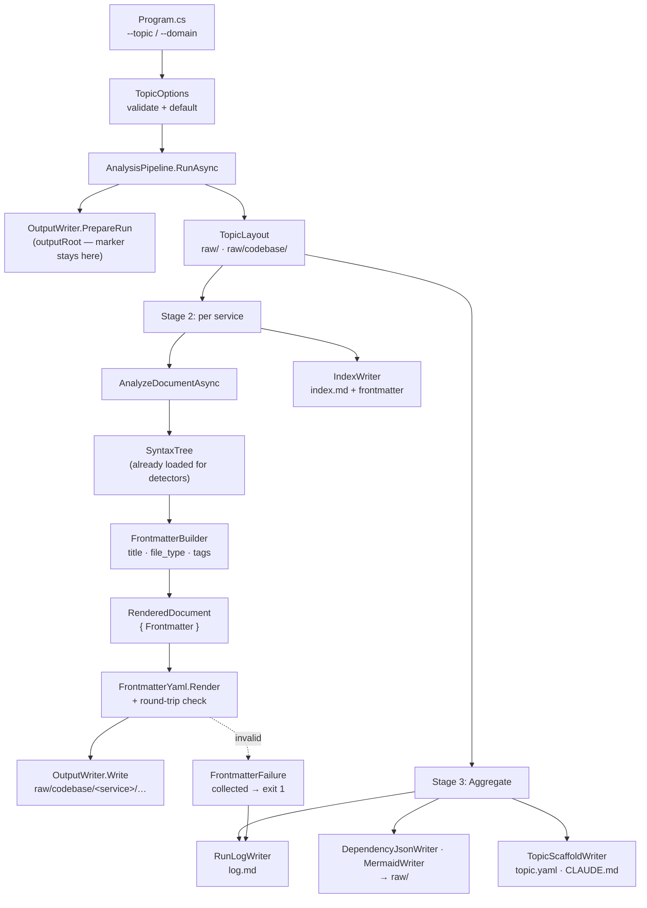

# csharp2md + LLMWiki Phase 1 Design

**Spec**: `.specs/features/csharp2md-llmwiki-phase1/spec.md`
**Status**: Approved (user, 2026-08-15)

---

## Architecture Overview

Frontmatter is a decorator applied where the syntax tree is already in hand, and the `raw/` layout is a path change at the two places output roots are computed. Nothing re-reads a written file, and no stage is added to the pipeline.

Three seams carry the whole feature:

1. **Derivation** — `FrontmatterBuilder` turns a syntax tree plus `TopicOptions` into a `Frontmatter` record, in `AnalyzeDocumentAsync`, next to the detectors that already consume that tree.
2. **Emission** — `RenderedDocument` gains a `Frontmatter?` init property that `ToMarkdown()` prepends, mirroring how `DependencySection` is already attached without touching `Sections`.
3. **Layout** — `TopicLayout` resolves `raw/` and `raw/codebase/`; `AnalysisPipeline` passes those roots to the existing `OutputWriter` and `IndexWriter` instead of `outputRoot`. `PrepareRun` keeps operating on `outputRoot` so the ownership marker stays where the `--force` contract expects it.



---

## Code Reuse Analysis

### Existing Components to Leverage

| Component | Location | How to Use |
| --- | --- | --- |
| `RenderedDocument.DependencySection` | `src/Csharp2Md.Core/Rendering/RenderedDocument.cs:34` | Copy the pattern exactly: an init-only property outside `Sections`, prepended by `ToMarkdown()`. It exists precisely because a zero-span entry in `Sections` would break the span-coverage invariant — frontmatter has the same problem. |
| `OutputWriter` | `src/Csharp2Md.Core/Output/OutputWriter.cs` | Unchanged except that it is constructed with a `raw/codebase/<service>` root. `PrepareRun`, `IsExcluded`, and `OutputPath` need no edit. |
| `OutputWriter.PrepareRun` | `OutputWriter.cs:25` | Keeps receiving `outputRoot`, so the marker, the `--force` gate, and the root/input safety checks shipped in `cli-directory-input` survive untouched. |
| `IndexWriter` | `src/Csharp2Md.Core/Output/IndexWriter.cs` | Gains a frontmatter parameter on both write methods; the relative-link logic is reused as-is, and remains correct because the whole tree moves as a unit. |
| `YamlDotNet` | already referenced, `Csharp2Md.Core.csproj:12` | `SerializerBuilder` for emission, `IDeserializer` for the round-trip check. No new package. `ConfigIndexer.cs` is the precedent for how this project consumes it. |
| `ManifestError` / `PipelineRunResult` | `src/Csharp2Md.Core/Pipeline/AnalysisPipeline.cs:22` | Extend `PipelineRunResult` with frontmatter failures rather than inventing a parallel error channel. |
| `RunReporter.Summarize` | `src/Csharp2Md.Core/Output/` (called at `Program.cs:106`) | Extend for WIKI-17's counts instead of adding a second reporting path. |
| `SyntheticFixtureRun` | `tests/…/Pipeline/SyntheticFixtureRun.cs` | The one full-pipeline run every artifact assertion shares; frontmatter assertions attach to it rather than opening new workspaces. |

### Integration Points

| System | Integration Method |
| --- | --- |
| `System.CommandLine` 2.0.11 | Two `Option<string?>` instances registered on `rootCommand`, read with `parseResult.GetValue`, matching the existing `--manifest`/`--output`/`--force` shape at `Program.cs:16-33`. |
| `AnalysisPipeline.RunAsync` (both overloads) | Gains a `TopicOptions` parameter. The manifest overload forwards it to the manifest+roots overload, as it already forwards `forceOutput`. |
| Exit-code contract | Frontmatter failures return `1` through the existing `return 1` path at `Program.cs:95-99`; load degradation keeps returning `0` with warnings. |

---

## Components

### `TopicOptions`

- **Purpose**: The validated `topic` and `domain` values every frontmatter block and `topic.yaml` carries.
- **Location**: `src/Csharp2Md.Core/Topic/TopicOptions.cs`
- **Interfaces**:
  - `static TopicOptions Default(string inputRoot)` — slug of the input directory name, `domain: system-design` (WIKI-15, WIKI-16)
  - `static Result<TopicOptions> Create(string? topic, string? domain, string inputRoot)` — applies defaults, validates the slug pattern (WIKI-14)
  - `static string Slugify(string name)` — lowercase, non-alphanumeric runs to `-`, trim `-`
- **Dependencies**: none
- **Reuses**: the `ManifestError`-style "expected error, not exception" convention from `ManifestLoader`

> Written as an explicit-property type, not a validating primary constructor — the `csharp-coding-standards` value-object snippet's validated `readonly record struct` form does not compile (CS0111), per `[[dotnet-skills-value-object-snippet-broken]]`.

### `TopicLayout`

- **Purpose**: Single source of truth for where anything lives under the output root.
- **Location**: `src/Csharp2Md.Core/Topic/TopicLayout.cs`
- **Interfaces**:
  - `static string RawRoot(string outputRoot)` — `<outputRoot>/raw`
  - `static string CodebaseRoot(string outputRoot)` — `<outputRoot>/raw/codebase`
  - `static string ServiceRoot(string outputRoot, ServiceName service)`
- **Dependencies**: `ServiceName`
- **Reuses**: nothing; deliberately a pure path calculator so the layout can be asserted without running a pipeline

### `Frontmatter` / `FileType`

- **Purpose**: The closed, strongly-typed form of the block. A record with an enum makes most invalid states unrepresentable before any validator runs.
- **Location**: `src/Csharp2Md.Core/Topic/Frontmatter.cs`
- **Dependencies**: `TopicOptions`
- **Reuses**: the sealed-record style used throughout `Rendering` and `Graph`

### `FrontmatterBuilder`

- **Purpose**: Derive `title`, `file_type`, and `tags` from a syntax tree — **syntax only**, no semantic model (WIKI-13).
- **Location**: `src/Csharp2Md.Core/Topic/FrontmatterBuilder.cs`
- **Interfaces**:
  - `static Frontmatter Build(SyntaxTree tree, string sourcePath, string rootNamespace, TopicOptions options, out IReadOnlyList<string> warnings)`
- **Internal parts** (separate `internal static` classes, each independently testable):
  - `TitleResolver` — the four tiers in order; tier 2 compares a declaration's containing namespace against the project's root namespace
  - `FileTypeClassifier` — the rule table, first match wins, warning on multi-match
  - `TagDeriver` — additive pattern matching, emitting a sorted, de-duplicated list
- **Dependencies**: `Microsoft.CodeAnalysis.CSharp.Syntax`
- **Reuses**: the detector convention of walking `tree.GetRoot().DescendantNodes()` — the same traversal shape as `MessagingDetector.cs:29`
- **Precondition (why syntax-only is total, not best-effort)**: a syntax tree is guaranteed wherever this runs, because the pipeline drops any document that lacks one before rendering — `!document.SupportsSyntaxTree` at `AnalysisPipeline.cs:233` and a null `GetSyntaxTreeAsync` at `AnalysisPipeline.cs:244` both `return` early. No tree means no document, which means no frontmatter to derive. The semantic model on the very next line (`AnalysisPipeline.cs:249-250`) is explicitly conditional and may be null. That asymmetry — tree enforced by guard, semantics optional by construction — is the whole reason this component never consults the semantic model. Roslyn's parser is additionally error-tolerant, so a file that fails to compile still yields a tree with error nodes; `Acme.Payments` proves it in the fixture.

### `FrontmatterYaml`

- **Purpose**: Render the block and prove it parses back.
- **Location**: `src/Csharp2Md.Core/Topic/FrontmatterYaml.cs`
- **Interfaces**:
  - `static string Render(Frontmatter frontmatter)` — `---`-delimited, keys in schema order
  - `static FrontmatterFailure? Validate(string yaml, string sourcePath)` — round-trips through `IDeserializer` and checks required fields are non-empty (WIKI-07, WIKI-12)
- **Dependencies**: YamlDotNet
- **Reuses**: `ConfigIndexer`'s YamlDotNet usage as the precedent

### `TopicScaffoldWriter`

- **Purpose**: Write `raw/topic.yaml` (WIKI-10) and `raw/CLAUDE.md` (WIKI-11).
- **Location**: `src/Csharp2Md.Core/Topic/TopicScaffoldWriter.cs`
- **Interfaces**: `static void Write(string outputRoot, TopicOptions options, string toolVersion)`
- **Reuses**: `IndexWriter.WriteFile`'s shape — create directory, write text, return path

### `RunLogWriter`

- **Purpose**: Write `raw/log.md` (WIKI-18 … WIKI-22).
- **Location**: `src/Csharp2Md.Core/Topic/RunLogWriter.cs`
- **Interfaces**: `static void Write(string outputRoot, RunLogData data)`
- **Dependencies**: `TimeProvider` injected for the timestamp, so the two-run determinism criterion is testable without wall-clock flake
- **Reuses**: `DependencyJsonWriter`'s "write one aggregate artifact in Stage 3" placement

---

## Data Models

```csharp
public enum FileType
{
    Configuration, Controller, Handler, Service, DataAccess,
    Enum, Interface, Filter, Extension, Class, Index,
}

public sealed record Frontmatter(
    string Title,
    SourceKind SourceKind,          // CodebaseFile | CodebaseIndex
    string SourcePath,              // <service>/<service-relative path>, forward slashes
    string Domain,
    string Topic,
    FileType FileType,
    IReadOnlyList<string> Tags)     // sorted, may be empty
{
    public string Language => "csharp";
    public string CreatedBy => "csharp2md";
    public string? SourceService => null;              // Phase 2 stub
    public string AnalysisStatus => "pending";         // Phase 2 stub
}

public sealed record FrontmatterFailure(string SourcePath, string Error);

public sealed record RunLogData(
    DateTimeOffset TimestampUtc,
    string Invocation,
    int DocumentCount,
    int EdgeCount,
    int ServiceCount,
    IReadOnlyList<FrontmatterFailure> Failures,
    string OutputTopicPath);
```

`Language`, `CreatedBy`, `SourceService`, and `AnalysisStatus` are computed rather than constructor parameters: the spec pins all four to constants in Phase 1, and a settable field would invite a caller to violate that silently. Phase 2 converts `SourceService`/`AnalysisStatus` to real parameters — a change the compiler will point at every construction site.

---

## Error Handling Strategy

| Error Scenario | Handling | User Impact |
| --- | --- | --- |
| Frontmatter fails round-trip or has an empty required field (WIKI-12) | Collect a `FrontmatterFailure`, keep writing remaining documents, return them on `PipelineRunResult`; CLI prints each to stderr and exits `1` | Every failing file named with its error; the rest of the topic is still generated and `log.md` still written |
| `--topic` fails the slug pattern (WIKI-14) | Rejected in `TopicOptions.Create` before `PrepareRun` runs | Message on stderr, exit `1`, output directory untouched |
| Project loads degraded, no semantic model (WIKI-13) | Nothing special — derivation never consulted the semantic model | Identical frontmatter to a healthy run; exit stays `0` with the existing warnings |
| Project cannot compile at all | Existing behavior at `AnalysisPipeline.cs:207`: documents dropped | No frontmatter because no document; already-reported load warning |
| Two `file_type` rules match | First in table order wins, warning names the file and both rules | Warning on stderr, deterministic classification |
| No top-level type (title tier 4) | Falls back to the file name, warning emitted | Warning on stderr, valid frontmatter |

---

## Risks & Concerns

| Concern | Location (file:line) | Impact | Mitigation |
| --- | --- | --- | --- |
| **Unhandled `NullReferenceException` on a valid-JSON manifest with a missing or null `services`** — the null-guard intends to return `ZeroEntries` but dereferences first | `src/Csharp2Md.Core/Manifests/ManifestLoader.cs:28` | A user-supplied manifest crashes with a stack trace instead of the designed error; defeats P1-16's "expected error, never an exception" contract. Reproduced this session with a PascalCase manifest. | Pre-existing, outside this feature's ACs. Confirmed as **T1 of `tasks.md`** (user decision, 2026-08-15), with its own regression test and atomic commit, before any layout or frontmatter task builds on that path. Fix is `manifest?.Services is not { Count: > 0 }`. |
| **`ToMarkdown()` acquires a second vocabulary** — it currently assembles only source-derived content | `src/Csharp2Md.Core/Rendering/RenderedDocument.cs:36` | Risk of frontmatter leaking into span-coverage reasoning, the invariant AD-002 rests on | The three `SpanCoverageTests` assert over `Sections` and use `Contains` for the Markdown check, so prepending cannot break them — verified by reading `SpanCoverageTests.cs:23-60`. Add one test asserting the body below the block is byte-identical to the un-decorated render (WIKI-08). |
| **Breaking layout change with no compatibility mode** (AD-006) | `tests/…/Pipeline/AnalysisPipelineTests.cs`, `Cli/EndToEndTests.cs` | Every test asserting a root-level output path fails at once, obscuring real regressions | Update path assertions in a single dedicated task before any frontmatter task lands, so one commit isolates the layout move from behavior changes |
| **No JSON Schema validator in the dependency set** | `Directory.Packages.props` | WIKI-12 names `schemas/frontmatter.schema.json` as the validation target, but nothing can execute it | Validate structurally instead (round-trip + required-field check over a closed record) and keep the schema file as a published contract, with a test asserting it stays in sync with `Frontmatter`. Proposed spec refinement, listed below. |
| **A syntax tree that exists is not necessarily a complete one** — a syntax error in a type header can cost the parser the base list while still producing a tree | `src/Csharp2Md.Core/Topic/FrontmatterBuilder.cs` (new) | `file_type` silently falls back to `class` for a file whose real classification was recoverable. Wrong metadata, no error, no crash — the worst failure shape because nothing signals it. | Distinct from the inheritance-depth limit in Tech Decisions and easy to confuse with it. Mitigate by emitting the tier-4 / no-rule-matched warning that WIKI-13's warnings already require, so a suspiciously large `class` count is visible on stderr rather than silent. Add a `FrontmatterBuilder` unit test over a deliberately malformed type header asserting `class` plus a warning, so the degradation is pinned as intended behavior rather than discovered later. |
| **`log.md` timestamp is the only nondeterministic output** | new `RunLogWriter` | A wall-clock call inside the writer makes the two-run determinism criterion untestable | Inject `TimeProvider`; tests pass a fixed instance. `TimeProvider` is in-box on `net10.0`, no package needed. |
| **`Acme.Payments` frontmatter depends on its degraded state staying degraded** | `fixtures/SyntheticSolution/Acme.Payments/` | If someone restores the fixture, the WIKI-13 evidence silently stops proving anything | `AnalysisPipelineTests.RunAsync_UnrestoredProject_IsReportedAsPossibleMissingRestore` already pins the degraded state; the frontmatter test asserts against that same run |

---

## Tech Decisions

| Decision | Choice | Rationale |
| --- | --- | --- |
| Derivation input | Syntax tree only, never the semantic model | Classification then cannot vary with restore state, which is what makes WIKI-13 hold and the two-run determinism criterion true across environments. Every rule in the spec's table is expressible from the base list, the declared name, the declaration kind, and modifiers. Cost: an inheritance chain deeper than one level (a custom base that itself inherits `DbContext`) is not followed — accepted, and recorded here so it is a known limit rather than a bug report. |
| Where derivation runs | Inside `AnalyzeDocumentAsync` | The syntax tree is already materialized there for the detectors and discarded immediately after (AD-001). Any other location re-parses. |
| Frontmatter validation | Round-trip through YamlDotNet plus required-field checks over a closed record | No JSON Schema package exists in the dependency set, and a round-trip catches the escaping failures WIKI-07 actually cares about — which a schema check would not. Adding a schema-validation dependency for a shape already enforced by the type system is not worth the supply-chain surface. |
| YAML emission | `SerializerBuilder().WithQuotingNecessaryStrings().WithNewLine("\n").Build()` | Both methods verified present in YamlDotNet 18.1.0's shipped XML docs, not assumed. `WithNewLine("\n")` matters on Windows: CRLF would make output non-byte-identical across platforms. |
| `index.md` frontmatter | Emitted with `source_kind: codebase-index`, `file_type: index` | A `.md` without frontmatter inside an ingested topic is what `kb lint` flags. One block shape means one validator and one round-trip path. |
| Ownership marker location | Stays at `outputRoot`, outside `raw/` | `PrepareRun` reads it at the output root before deleting anything (`OutputWriter.cs:34-49`). Moving it inside `raw/` would silently break the `--force` gate. |
| `TimeProvider` for the log timestamp | Injected, not `DateTimeOffset.UtcNow` | The only nondeterminism in the output; injecting it is what makes the determinism criterion assertable. |

> **Project-level decisions**: AD-006 already records the layout replacement, inline injection, and CLI-surface growth. The syntax-only derivation rule is feature-local and stays in this table — it constrains this feature's heuristics, not future features.

---

## Spec Refinements This Design Proposes

Three, all already applied to `spec.md` except the last, which needs a decision:

1. **WIKI-02 / `source_path`** — corrected from input-root-relative to `<service-name>/<service-relative-path>`, matching what the v1 writer already mirrors. Applied.
2. **WIKI-13** — rewritten from "degraded → `file_type: class`" to "derivation is syntax-only, so degraded derives what healthy derives". Strictly better output; the old rule discarded classification the syntax tree still had. Applied.
3. **WIKI-12** — rewritten from "fails validation against `schemas/frontmatter.schema.json`" to a YAML round-trip plus required-field check. The schema file stays published as the external contract, kept in sync by a test, but is never executed at runtime. Applied (user decision, 2026-08-15).
