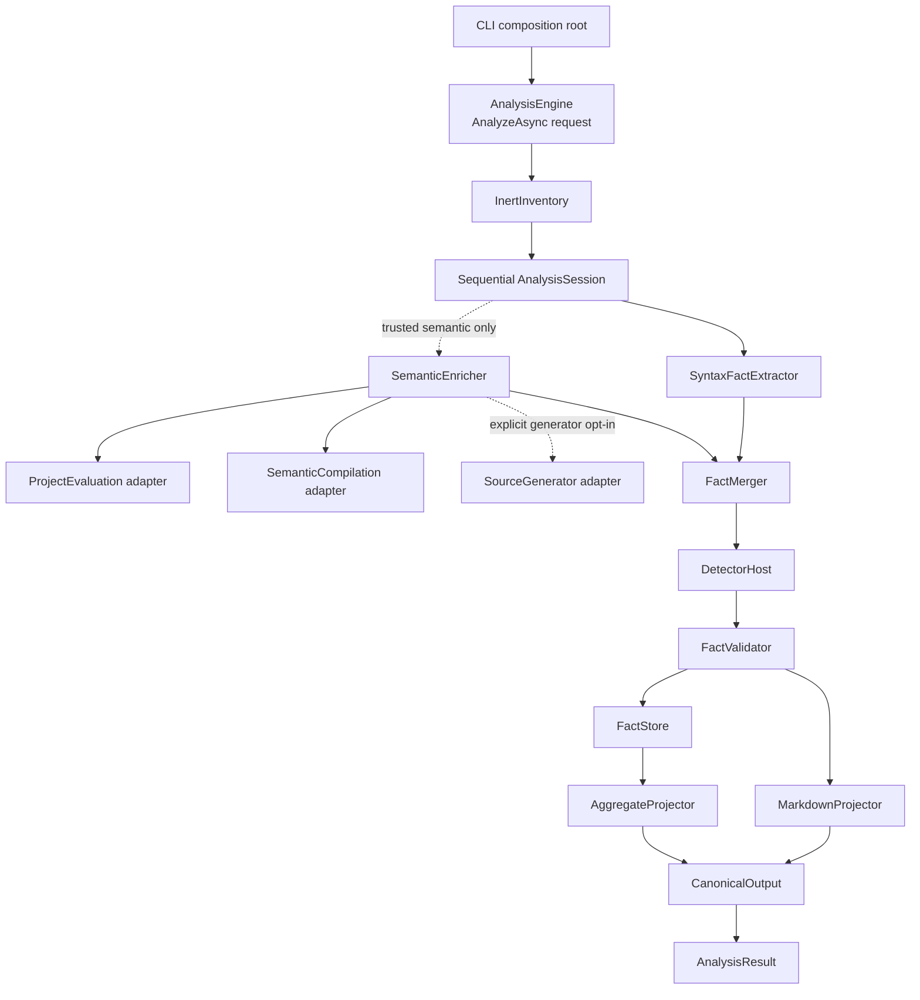
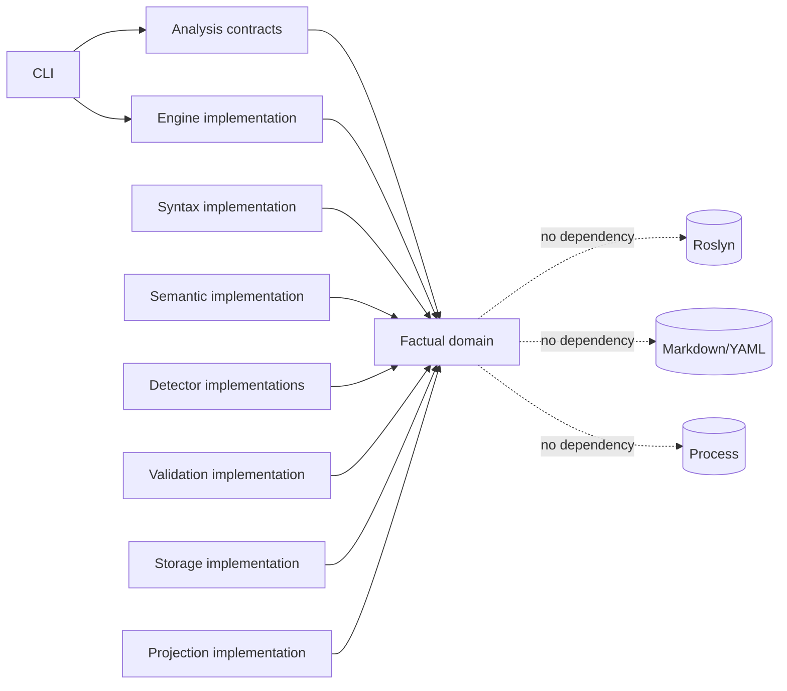
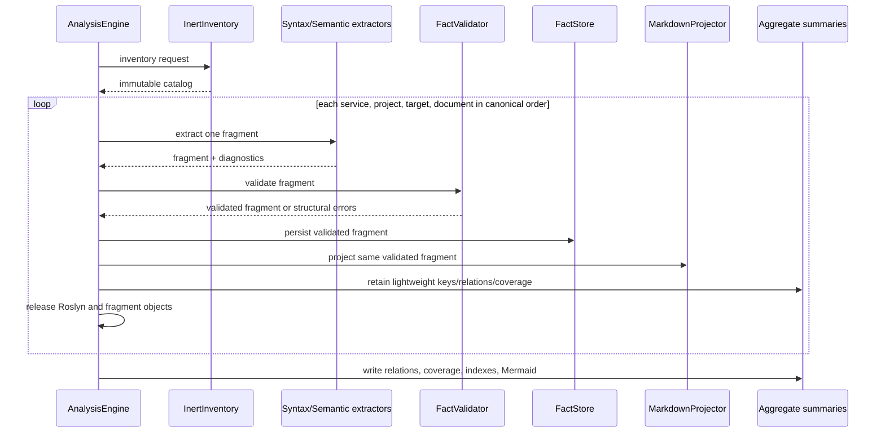

# csharp2md v3: Factual Model and Semantic Analysis Design

**Spec**: `.specs/features/csharp2md-v3/spec.md`
**Context**: `.specs/features/csharp2md-v3/context.md`
**Status**: Approved (user, 2026-08-17)

---

## Verdict

Build v3 as a modular replacement inside `Csharp2Md.Core`. `AnalysisEngine.AnalyzeAsync(AnalysisRequest, CancellationToken)` is the module's only external interface. Its implementation owns inventory, extraction, semantic enrichment, validation, persistence, projection, and aggregation behind internal seams.

The migration proceeds by cuts, not by permanent layering. Each cut routes an observable behavior through the factual module and removes the superseded path. The v2 pipeline is gone as soon as the syntax-only vertical path covers the CLI, facts, Markdown, and aggregates.

The semantic backend remains behind an internal adapter until Increment 0 proves how Roslyn 5.6 behaves. `MSBuildWorkspace` is not assumed to satisfy the no-target or no-generator contract merely because it runs through an out-of-process BuildHost.

---

## Research Findings

| Finding | Evidence | Design consequence |
| --- | --- | --- |
| `-getProperty` and `-getItem` return evaluated values without building targets when no target option is supplied. | [Microsoft Learn: Evaluate MSBuild items and properties](https://learn.microsoft.com/en-us/visualstudio/msbuild/evaluate-items-and-properties?view=visualstudio) | `DotnetMsBuildEvaluator` never passes `-target`, `-getTargetResult`, build, restore, or publish arguments. |
| MSBuild evaluation still evaluates imports, conditions, and property functions before target execution. | [Microsoft Learn: MSBuild evaluation order](https://learn.microsoft.com/en-us/visualstudio/msbuild/comparing-properties-and-items?view=visualstudio) | Evaluation is trusted-semantic behavior, not syntax-only behavior. The trust gate precedes process creation and output preparation. |
| Roslyn 5.6 exposes `Project.WithAnalyzerReferences(...)`; the installed package documentation confirms that it replaces all analyzer references. | Installed `Microsoft.CodeAnalysis.Workspaces.xml`; [Microsoft Learn API](https://learn.microsoft.com/en-us/dotnet/api/microsoft.codeanalysis.project.withanalyzerreferences?view=roslyn-dotnet-5.0.0) | The semantic backend sanitizes the project before requesting a compilation. No current `SolutionLoader.ClassifyAsync` code is reused because it requests a compilation first. |
| Roslyn analyzer references can contain analyzers and generators; generator discovery loads generator implementations. | Installed `Microsoft.CodeAnalysis.xml`; [Roslyn source-generator design](https://github.com/dotnet/roslyn/blob/main/docs/features/source-generators.md) | Inert inventory records evaluated analyzer paths without loading assemblies. Generator loading occurs only inside the explicitly enabled generator adapter. Diagnostic analyzers never run. |
| Roslyn 5.6 exposes generated documents and generator-driver APIs, but the exact workspace/driver interaction must be proven for this package version. | Installed `Microsoft.CodeAnalysis.Workspaces.xml`, `Microsoft.CodeAnalysis.xml`, and `Microsoft.CodeAnalysis.CSharp.xml` | Increment 0 selects and records the supported generator strategy before production code depends on a concrete Roslyn call sequence. |
| `Process.Kill(true)` terminates a process and its descendants. | [Microsoft Learn: Process.Kill](https://learn.microsoft.com/en-us/dotnet/api/system.diagnostics.process.kill) | The evaluator adapter owns timeout/cancellation and process-tree cleanup. Tests use a child-spawning fixture. |
| `GetDocumentationCommentId()` is the supported Roslyn textual symbol identity when available. | [Microsoft Learn: ISymbol.GetDocumentationCommentId](https://learn.microsoft.com/en-us/dotnet/api/microsoft.codeanalysis.isymbol.getdocumentationcommentid) | Resolved symbol IDs prefer documentation-comment IDs and fall back to a tested canonical signature. |

### Increment 0 decision gate

Increment 0 runs isolated probes before the semantic implementation is selected:

1. Query a healthy single-target and multi-target project through `dotnet msbuild` with property/item switches only. Capture stdout JSON and prove no custom target marker is written.
2. Repeat with missing SDK/workload, incomplete restore, invalid project reference, and imported props/targets.
3. Open a marker fixture with `MSBuildWorkspace`, without requesting a compilation, and observe custom targets, analyzer constructors, and generator output.
4. Replace analyzer references before the first compilation request and prove the marker analyzer and generator do not execute.
5. Enable the generator adapter and prove only generators execute; diagnostic analyzers remain absent.
6. Verify multi-target compilations retain separate target identities.
7. Measure elapsed time, peak working set, process count, and output volume for the repository and synthetic fixture. No numerical SLA is introduced.

The gate chooses one semantic compilation adapter:

- **Workspace adapter**: accepted only if the probes prove it does not execute forbidden targets or extensions before sanitation.
- **Evaluated compilation adapter**: constructs Roslyn projects/compilations from inert evaluation results when the workspace adapter cannot meet the contract.
- **Stop and revise**: if neither adapter can provide useful semantic facts without violating the approved contract, execution stops after Increment 0 and presents the evidence. The design does not silently weaken the security requirement.

### Increment 0 result (2026-08-17)

**Selected backend: evaluated compilation adapter.** The workspace adapter is rejected. `MSBuildWorkspace.OpenProjectAsync` executed a controlled `BeforeTargets="Compile"` marker before the caller could replace analyzer references. Marker analyzer and generator assemblies did remain unloaded, and `Project.WithAnalyzerReferences([])` prevented their later execution before `GetCompilationAsync`, but target execution alone violates FACT-26 and AD-012. Evidence: `RoslynSanitationProbeTests.WorkspaceOpening_ExecutesCustomTargetButDoesNotLoadExtensions`.

The evaluated adapter remains viable. Target-free `dotnet msbuild -getProperty/-getItem` probes returned healthy, per-TFM, imported, incomplete-restore, invalid-reference, missing-SDK, and inert extension inventory outcomes without a target marker. Direct `CSharpCompilation` construction from those inert results bound source without loading either extension. Explicit trusted generator opt-in loaded only the inventoried generator into a collectible context, produced `Generated.g.cs`, and recorded diagnostic `GEN001`; the diagnostic analyzer was neither loaded nor executed. Disabled and untrusted-opt-in paths loaded neither assembly. Evidence: `MsBuildEvaluationProbeTests`, `ProcessTreeProbeTests`, and `GeneratorIsolationProbeTests`.

Observed probe measurements are evidence, not SLAs. Peak working set is the cumulative test-host process peak, and process counts include unrelated host processes, so these values establish instrumentation only.

| Fixture / mode | Elapsed | Peak working set | Process count before/after | Output volume |
| --- | ---: | ---: | ---: | ---: |
| Synthetic, generators disabled | 34.510 ms | 803,467,264 bytes | 398 / 396 | 26 bytes |
| Synthetic, trusted generator enabled | 170.176 ms | 455,786,496 bytes | 396 / 396 | 32 generated bytes |
| Repository source set, generators disabled | 149.236 ms | 559,288,320 bytes | 396 / 396 | 161,633 source bytes |

Production semantic work in T22-T29 will therefore parse target-free evaluator results into distinct per-TFM `CSharpCompilation` instances. It will not create an `MSBuildWorkspace`. Generator execution remains a second adapter invoked only after trusted-solution and generator consent validation; diagnostic analyzers never enter that driver.

---

## Architecture Overview



### Dependency direction



The factual domain has no Roslyn, CLI, filesystem, YAML, or Markdown types. Roslyn syntax and semantic objects are consumed inside extractor implementations and converted into factual values before crossing into validation or projection.

### Sequential lifecycle



No whole-solution factual object survives the loop. A semantic workspace or compilation is scoped to the smallest backend unit proven viable by Increment 0 and is disposed before the next service.

---

## Migration Cuts

| Cut | New path | Superseded path removed in the same cut |
| --- | --- | --- |
| 0. Viability | Probe adapters and record evidence; no production routing | Temporary spike code is discarded or retained only as executable tests. |
| 1. Factual kernel | Contracts, IDs, resolution, evidence, provenance, diagnostics, schemas, validation, canonical serialization | No old code removed yet; this cut has no CLI route. |
| 2. Syntax-only vertical path | Inert inventory → syntax facts → validation/store → Markdown/frontmatter → aggregates → CLI | Default `SolutionLoader` call, direct `SemanticEnricher`, direct dependency section enrichment, and v2 dependency writer are removed from the production path. |
| 3. Trusted semantics | Evaluation and compilation adapters, scoped fallback, coverage, generator opt-in | Remaining direct `MSBuildWorkspace` construction and `Project`/`Document` orchestration outside the semantic implementation are removed. |
| 4. Priority detectors | Versioned factual detector contracts and ASP.NET Core, DI, HTTP, gRPC, events, direct-reference implementations | `DependencySignal`, old detector interfaces, `GraphBuilder`, and name-promoted runtime targets are removed once their behavioral coverage is mapped. |
| 5. Release closure | Full fixture matrix, deterministic snapshots, package/schema bump, docs | Transitional adapters and migration-only tests are removed; no v2 output switch remains. |

Each cut must leave the branch buildable and its mapped tests green. There is never a user-visible v2/v3 mode.

---

## Code Reuse Analysis

### Existing modules to retain or reshape

| Existing module | Location | Use in v3 |
| --- | --- | --- |
| Manifest loading and service discovery | `Manifests/`, `Discovery/` | Retain input semantics. Adapt results into inert inventory facts and stable project IDs. |
| Configuration indexing | `Configuration/` | Retain inert parsing concepts. Rename `ResolutionKind` to `ConfigurationResolution` and emit configuration evidence rather than semantic quality. |
| Source partition algorithm | `Rendering/MarkdownRenderer.cs` | Extract its contiguous `FullSpan` partition logic into syntax section facts. Markdown projection renders those facts; it no longer walks Roslyn nodes. |
| XML documentation prose | `Rendering/XmlDocProse.cs` | Reuse inside syntax extraction to populate prose facts. Projection consumes stored prose. |
| Output safety | `Output/OutputWriter.cs` | Retain marker, ancestor/root checks, and `--force` semantics. Split preparation from canonical artifact writing. |
| Topic paths and scaffold | `Topic/TopicLayout.cs`, `TopicScaffoldWriter.cs` | Extend for `raw/facts/`; topic metadata remains aggregate output. |
| Frontmatter YAML escaping | `Topic/FrontmatterYaml.cs` | Reuse serializer conventions after replacing the model with schema v2. |
| Run log time seam | `Topic/RunLogWriter.cs` | Retain `TimeProvider`; change input to the final factual run summary. |
| Index and Mermaid rendering | `Output/IndexWriter.cs`, `MermaidWriter.cs` | Reshape as projectors over validated summaries and relation facts. |
| Detector fixture patterns | `tests/.../Detection`, `fixtures/SyntheticSolution` | Migrate behavioral outcomes to new detector-interface and engine-interface tests. Add negative/lookalike and degradation fixtures. |

### Modules to retire

| Existing module | Reason |
| --- | --- |
| `Pipeline/AnalysisPipeline.cs` | Its responsibilities move behind the deeper `AnalysisEngine` interface. It is deleted after the syntax cut. |
| `Loading/SolutionLoader.cs` public orchestration shape | It requests compilations before extension sanitation and cannot implement syntax-only. Viable internals may move behind the semantic adapter. |
| `Rendering/SemanticEnricher.cs` | Semantic facts are produced before projection, not inserted directly into Markdown. |
| `Rendering/DependencySectionRenderer.cs` | Dependency sections become projections of persisted relation references. |
| `Graph/DependencySignal.cs`, `DependencyEdge.cs`, `GraphBuilder.cs` | Partitioned relation facts replace the single graph and its fictional-target fallback. |
| `Output/DependencyJsonWriter.cs` | v2 `dependencies.json` is removed. |
| Current detector interfaces | They return unversioned signals without descriptor, diagnostics, resolution, evidence contract, or supported levels. |

### Integration points

| Caller or dependency | Integration method |
| --- | --- |
| CLI | Construct one `AnalysisRequest`; call `AnalysisEngine.AnalyzeAsync`; print `AnalysisResult.Summary`; return `AnalysisResult.ExitCode`. |
| Filesystem | Production uses direct local filesystem operations behind the implementation. Tests use real temporary directories; no public filesystem port is added. |
| External process | Internal `IProjectEvaluationAdapter` seam has production and recording/failing test adapters. |
| Roslyn compilation | Internal `ISemanticCompilationAdapter` seam has the Increment-0-selected production adapter and deterministic test adapters. |
| Source generators | Internal `ISourceGeneratorAdapter` exists because disabled and enabled behaviors are materially different and require adversarial tests. |
| Detectors | `DetectorHost` owns compiled detector implementations under AD-004; callers do not enumerate or invoke detectors. |

---

## Modules and Interfaces

### AnalysisEngine

- **Purpose**: Own the complete analysis transaction behind one deep interface.
- **Location**: `src/Csharp2Md.Core/Analysis/`
- **External interface**:

```csharp
public sealed class AnalysisEngine
{
    public Task<AnalysisResult> AnalyzeAsync(
        AnalysisRequest request,
        CancellationToken cancellationToken = default);
}
```

- **Interface contract**:
  - Validates mode/trust/options before output preparation.
  - Processes scopes sequentially in canonical order.
  - Returns expected failures and degradation as data, not exceptions.
  - Throws only for cancellation or defects outside the defined result contract.
  - Writes no output when request validation fails.
- **Internal seams**: inventory, evaluation, compilation, generator execution, detector host, factual validation/store, and projection. These remain inaccessible to CLI callers.
- **Construction**: production construction is default/internal composition. Tests use an internal constructor through the existing `InternalsVisibleTo`; adapter seams do not enlarge the public interface.

### InertInventory

- **Purpose**: Discover solutions, projects, files, declared configurations, imports visible without evaluation, and extension declarations without starting executables.
- **Location**: `Analysis/Inventory/`
- **Internal interface**: `InventoryResult Inventory(AnalysisRequest request)`.
- **Output**: immutable, canonically ordered catalog plus diagnostics.
- **Reuses**: manifest loader, service discovery, project XML parsing, configuration indexing, exclusion rules.
- **Invariant**: no dependency on `MSBuildWorkspace`, `Process`, analyzer loading, or semantic compilation.

### SyntaxFactExtractor

- **Purpose**: Parse every eligible source file and emit document, section, declaration, syntactic symbol, and syntactic relation-candidate facts.
- **Location**: `Analysis/Syntax/`
- **Internal interface**: one document input to one `DocumentFactFragment` result.
- **Reuses**: `MarkdownRenderer` partition algorithm, `XmlDocProse`, frontmatter classification rules where still applicable.
- **Invariant**: source-section spans form a contiguous partition from byte/character offset zero to source length. The fragment owns the original source text or exact section slices until persistence/projection completes.

### SemanticEnrichment

- **Purpose**: Add evaluated project/target facts, stable resolved symbols, semantic relations, and scoped diagnostics to syntax fragments.
- **Location**: `Analysis/Semantics/`
- **Internal interface**: accepts inventory facts and syntax fragments; returns immutable fact additions/updates and diagnostics.
- **Adapters**:
  - `IProjectEvaluationAdapter`
  - `ISemanticCompilationAdapter`
  - `ISourceGeneratorAdapter`
- **Invariant**: absence or failure never removes syntax facts. It can only add facts, improve resolution, or attach degradation diagnostics.
- **Security**: the module is unreachable in syntax-only mode. Generator adapter construction/loading occurs only after explicit opt-in.

### ProjectEvaluation adapter

- **Purpose**: Evaluate trusted MSBuild projects in a controlled child process.
- **Location**: `Analysis/Semantics/MSBuild/`
- **Input**: project path, target framework selection, requested property/item names, timeout.
- **Output**: raw JSON result, import paths, extension inventory, process diagnostics, elapsed/working-set observations.
- **Implementation rules**:
  - `dotnet msbuild` through `ProcessStartInfo.ArgumentList`.
  - No target, restore, build, or `-getTargetResult` arguments.
  - One outer evaluation to obtain target frameworks, followed by one evaluation per TFM.
  - `-preprocess` writes to a scoped temporary file; only import paths survive parsing; the file is deleted.
  - Timeout/cancellation kills the complete process tree.

### SemanticCompilation adapter

- **Purpose**: Produce compilations and semantic models from trusted evaluated projects without executing forbidden extensions.
- **Location**: `Analysis/Semantics/Roslyn/`
- **Concrete implementation**: evaluated compilation adapter. It constructs distinct per-TFM Roslyn compilations from inert target-free evaluator results and never creates an `MSBuildWorkspace`.
- **Invariant**: no compilation is requested until analyzer references have been removed or excluded. Each target has a distinct compilation scope and target ID.
- **Failure result**: null/unsupported compilation and model outcomes are ordinary degraded data.

### SourceGenerator adapter

- **Purpose**: Load and run only source generators after explicit consent, returning generated document facts and generator diagnostics.
- **Location**: `Analysis/Semantics/Roslyn/`
- **Invariant**: analyzer callbacks never run. Generator assemblies are never loaded for inert inventory.
- **Failure result**: generator failure produces scoped diagnostics and retains pre-generator syntax/semantic facts.

### FactMerger

- **Purpose**: Combine syntax facts, evaluated facts, semantic facts, and detector results without mutating or erasing lower-resolution evidence.
- **Location**: `Facts/Composition/`
- **Internal interface**: pure functions over immutable factual records.
- **Rules**:
  - Fact IDs select the same logical fact across enrichment stages.
  - Higher resolution replaces only claims it proves.
  - Conflicting exact claims are structural errors, not last-write-wins updates.
  - Diagnostics and evidence are deduplicated and canonically ordered.

### DetectorHost

- **Purpose**: Run versioned compiled detectors at their declared levels and isolate their failures.
- **Location**: `Detection/`
- **Internal interfaces**:

```csharp
internal interface IDocumentFactDetector
{
    DetectorDescriptor Descriptor { get; }
    DetectorResult Detect(DocumentDetectionContext context);
}

internal interface IProjectFactDetector
{
    DetectorDescriptor Descriptor { get; }
    DetectorResult Detect(ProjectDetectionContext context);
}
```

- **Rules**:
  - `DetectorResult` contains facts and diagnostics, never side effects.
  - `DetectorHost` converts thrown detector exceptions into scoped diagnostics and discards that invocation's incomplete facts.
  - Runtime relations require detector descriptor, evidence, source identity, and destination or unresolved reason.
- **Implementations**: ASP.NET Core, dependency injection, HTTP, gRPC, messaging/events, direct/project reference.

### FactValidator

- **Purpose**: Enforce structural and cross-reference invariants before persistence or projection.
- **Location**: `Facts/Validation/`
- **Internal interface**: pure fragment validation plus bounded aggregate validation.
- **Checks**:
  - ID uniqueness and referential integrity.
  - Relative, existing, in-range evidence.
  - Resolution legality, including error-symbol prohibition for exact facts.
  - Runtime provenance/evidence.
  - Compile-time-only project/package references.
  - Required unresolved reason.
  - Deterministic ordering and schema version.
- **Result**: validated fragment or structured validation diagnostics. Invalid facts are not written or projected.

### FactStore

- **Purpose**: Persist validated fragments and return stable references used by frontmatter and aggregates.
- **Location**: `Facts/Storage/`
- **Internal interface**: write-only during document processing; bounded read/index operations during aggregation.
- **Path mapping**: `FactPathMapper` converts a stable fact ID to a deterministic, path-safe artifact key. The JSON retains the readable stable ID; the manifest maps IDs to artifact paths and hashes.
- **Canonical format**: source-generated `System.Text.Json` contexts, UTF-8 without BOM, LF, explicit property order, and pre-sorted collections.
- **Atomicity**: each file is written to an output-local temporary path and atomically renamed after serialization and hash calculation.

### MarkdownProjector

- **Purpose**: Render source-faithful Markdown and schema-version-2 frontmatter from a validated `DocumentFactFragment`.
- **Location**: `Projection/Markdown/`
- **Internal interface**: pure render to text; canonical output module performs I/O.
- **Rules**:
  - Never receives a syntax tree, semantic model, compilation, or detector.
  - Reconstructing section source payloads yields the original source exactly.
  - Factual notes and relation links are outside source spans.
  - `facts_ref` is the `FactStore` reference returned for that fragment.

### AggregateProjector

- **Purpose**: Build relation partitions, component summaries, coverage, diagnostics, indexes, and Mermaid from retained summaries or persisted fact indexes.
- **Location**: `Projection/Aggregates/`
- **Memory rule**: reads one partition/summary stream at a time; it does not rehydrate a complete solution model.
- **Outputs**: manifest, solutions, project/symbol indexes, relation files, diagnostics, coverage, Markdown indexes, Mermaid, topic scaffold, and log data.

### CanonicalOutput

- **Purpose**: Own safe output preparation and deterministic file writing.
- **Location**: `Output/`
- **Reuses**: current output root validation, ownership marker, and `--force` behavior.
- **Rules**:
  - Request validation occurs before preparation.
  - The output root is prepared once.
  - Machine artifacts use canonical UTF-8/LF writes.
  - Only `log.md` receives a timestamp.
  - Structural validation failures omit invalid artifacts, preserve valid diagnostics/audit output where safe, and set exit code `1`.

---

## Data Model

The following sketches define relationships, not final C# constructor syntax. Exact record shapes follow repository C# standards during implementation.

### Analysis contracts

```text
AnalysisRequest
  Input: directory or manifest
  OutputRoot
  ForceOutput
  TopicOptions
  AnalysisOptions
    AnalysisMode: SyntaxOnly | Semantic
    TrustMode: Untrusted | TrustedSolution
    IncludeSourceGenerators: bool
    ServiceTimeout: TimeSpan

AnalysisResult
  ExitCode
  RequestedMode / EffectiveMode
  ManifestReference?
  Summary
  Diagnostics
  CoverageSummary
```

`AnalysisRequest` validates illegal state combinations at construction or at the first engine guard. Callers do not coordinate individual stages.

### Factual core

```text
FactHeader
  Id: FactId
  Kind: FactKind
  Resolution: FactResolution
  Provenance: FactProvenance[]
  Evidence: Evidence[]
  DiagnosticIds: DiagnosticId[]

FactProvenance
  EngineId
  EngineVersion
  DetectorId?
  DetectorVersion?

Evidence
  DocumentId
  RelativePath
  StartLine / StartColumn
  EndLine / EndColumn
```

Specialized facts embed or reference `FactHeader`:

- `SolutionFact`
- `ProjectFact`
- `TargetFact`
- `DocumentFact`
- `SourceSectionFact`
- `SymbolFact`
- `ComponentFact`
- `RelationFact`

Roslyn symbols and syntax nodes never appear in these records.

### Identity types

Use dedicated value types to prevent identity mixups:

- `ProjectFactId`
- `TargetFactId`
- `DocumentFactId`
- `SymbolFactId`
- `ComponentFactId`
- `RelationFactId`
- `DiagnosticId`
- `DetectorId`

Every type stores its canonical string. Construction validates normalization and relative-path constraints. A separate `ArtifactReference` identifies the persisted file; it is not a fact identity.

### Resolution and configuration

```text
FactResolution
  Exact | Partial | Syntactic | Unresolved | NotApplicable

ConfigurationResolution
  HardCoded | Dynamic | Unresolved | NotApplicable
```

`FactResolution` is computed from claims and evidence. It is never copied from configuration lookup. Document resolution uses the normative aggregation table in the specification.

### Detector contract

```text
DetectorDescriptor
  Id
  Version
  SupportedLevels
  SupportedFactKinds

DetectorResult
  Facts[]
  Diagnostics[]
```

Relation facts include source, nullable target, relation partition/kind, detector provenance, evidence, resolution, and optional unresolved reason. Project/package references cannot construct runtime relation kinds.

### Diagnostics and coverage

```text
AnalysisDiagnostic
  Id
  Code
  Severity
  Stage
  ScopeId
  Message
  Evidence[]
  ExtensionId?

CoverageEntry
  ScopeId
  FactLevel
  DetectorId?
  Applicability
  Attempted
  Resolution
  DiagnosticIds[]
```

Diagnostics contain no absolute paths or exception stack traces in machine facts. `log.md` may render sanitized operational detail; unexpected exceptions remain available to the caller without entering deterministic artifacts.

### Manifest

```text
FactManifest
  SchemaVersion = 2
  ToolVersion
  EngineVersion
  DetectorVersions[]
  RequestedMode / EffectiveMode
  TrustMode
  RestorePerformed = false
  Isolation = none
  ExtensionsInventoried[]
  ExtensionsLoaded[]
  CoverageSummary
  Fragments[]
    FactId
    ArtifactReference
    ContentHash
```

The manifest index is the navigation root. Absolute output paths and timestamps are excluded.

---

## Output Transaction and Determinism

1. Validate the request and trust combination.
2. Validate output path safety.
3. Prepare the owned output root once.
4. For each fragment: extract → merge → validate → serialize/hash/rename → project Markdown → release.
5. Retain only stable references, relation summaries, coverage, and diagnostics.
6. Canonically sort each aggregate partition and write it atomically.
7. Write the factual manifest after all referenced fragments exist.
8. Write topic metadata, conventions, and `log.md`; timestamp only the log.
9. Return exit `1` when structural validation failed, even when other valid artifacts and diagnostics were emitted.

Canonical comparison tests copy the same fixture to different absolute roots. They compare raw bytes for every file except `log.md`. Hashes are calculated over the exact bytes written.

---

## Error Handling Strategy

| Scenario | Handling | Result / user impact |
| --- | --- | --- |
| Invalid CLI mode, trust, generator flag, or timeout | Reject before output preparation | Exit `1`; existing output remains untouched. |
| Unsafe output path or unowned non-empty output | Preserve existing `OutputWriter` safety behavior | Exit `1`; no analysis starts. |
| MSBuild evaluator cannot start | Add service-scoped evaluation diagnostic; retain syntax facts | Exit `0` when fallback output validates. |
| Evaluation timeout/cancellation | Kill process tree; timeout degrades service, caller cancellation propagates | Timeout exits `0` with fallback; caller cancellation cancels the run. |
| SDK/workload/restore/reference failure | Scope diagnostics to project/target; continue syntax facts | Exit `0` with partial/syntactic coverage. |
| Workspace/compilation/model unavailable | Record exact failing scope; do not drop inventoried source | Exit `0` with syntax facts. |
| Generator failure after opt-in | Record generator and generated-scope diagnostics; retain pre-generator facts | Exit `0` unless resulting facts violate structure. |
| Detector throws | Discard only that invocation's incomplete facts; add detector diagnostic | Other detectors/scopes continue; exit `0`. |
| Duplicate ID, invalid evidence/reference/resolution/provenance/relation | Reject affected fact or fragment and record validation diagnostic | Exit `1`; invalid artifact is absent. |
| Aggregate references absent fragment | Fail aggregate validation before manifest emission | Exit `1`; diagnostics identify source and missing ID. |
| Unexpected writer failure | Stop; do not emit a manifest that claims missing artifacts | Exit `1`; ordinary I/O error is reported. |

---

## Testing Strategy

### Test surface

The main behavioral surface is `AnalysisEngine.AnalyzeAsync`. Tests invoke the same interface as the CLI and inspect `AnalysisResult` plus a temporary output tree. Internal pure modules receive focused tests only where the engine surface cannot discriminate a rule cheaply, especially identity normalization, resolution algebra, validation, and detector lookalikes.

### Adapter tests

- Recording executable adapter proves syntax-only invokes no process or semantic adapter.
- Marker MSBuild fixtures prove no target execution and process-tree termination.
- Analyzer/generator marker assemblies prove inventory, sanitation, and opt-in behavior.
- Deterministic compilation adapters inject null compilation/model and error symbols.
- Throwing detectors prove isolation and incomplete-result discard.

### Migration policy

Map every existing test to a v3 requirement before changing it:

- Preserve the asserted behavior through a v3 engine/interface test, or
- Move a still-useful pure invariant test to its new factual module, or
- Replace an obsolete v2 shape assertion with the corresponding v3 shape assertion.

A test is removed only after its behavioral outcome is covered at the new interface. Assertion strength cannot decrease to make migration pass.

### Fixture matrix

| Dimension | Required cases |
| --- | --- |
| Language shapes | overloads, generics, records, interfaces, overrides, conditional compilation, error symbols |
| Semantic degradation | missing SDK/workload, incomplete restore, invalid reference, unsupported/null compilation, null semantic model |
| Extensions | analyzer present, generator present but disabled, generator enabled, generator failure |
| Detectors | positive, negative, and lookalike per detector rule |
| Security | syntax-only zero adapter calls; semantic without trust leaves output untouched; generator disabled by default |
| Determinism | identical fixture under unrelated absolute roots; compare all bytes except log |
| Validation | every rejection rule in FACT-12 through FACT-17 plus aggregate missing-reference cases |
| Memory/ordering | one semantic scope at a time; canonical processing order; no full factual solution retained |

Snapshots cover representative project, document, symbol, relation, diagnostics, coverage, frontmatter, Markdown, and manifest artifacts. Snapshot expectations are derived from the specification, not captured blindly from implementation output.

---

## Requirement-to-Module Mapping

| Requirements | Primary module(s) |
| --- | --- |
| FACT-01..07 | CLI guard, `AnalysisEngine`, analysis options |
| FACT-08..17 | factual domain, identity types, `FactValidator`, `FactStore` |
| FACT-18..25 | `FactStore`, `MarkdownProjector`, `AggregateProjector`, `CanonicalOutput` |
| FACT-26..36, FACT-62..65 | evaluation, compilation, and generator adapters; `SemanticEnrichment` |
| FACT-37..49, FACT-66..68 | solution indexes, `DetectorHost`, component classifier, relation facts |
| FACT-50..54, FACT-69 | resolution algebra, diagnostics, coverage, aggregate projection |
| FACT-55..61, FACT-70 | migration suite, schemas, packaging, verifier |

All 70 requirements have a design owner. Task traceability will map each ID to one or more atomic tasks and tests.

---

## Risks & Concerns

| Concern | Location | Impact | Mitigation |
| --- | --- | --- | --- |
| Current pipeline mixes inventory, Roslyn loading, detection, rendering, validation, writing, and aggregation. | `src/Csharp2Md.Core/Pipeline/AnalysisPipeline.cs:65` | Adding factual behavior in place would spread conditionals and make syntax-only unprovable. | Replace it through the `AnalysisEngine` cuts; do not add v3 branches to the existing class. |
| Current default constructor always creates `SolutionLoader`. | `src/Csharp2Md.Core/Pipeline/AnalysisPipeline.cs:74` | A zero-option run necessarily reaches executable semantic infrastructure. | CLI cut routes through inert inventory; executable adapters are absent from the syntax path. |
| Projects unsupported for compilation currently lose all documents. | `src/Csharp2Md.Core/Pipeline/AnalysisPipeline.cs:237` | Violates universal syntax fallback. | Inventory files independently of workspace/project load and parse them directly. |
| Current document path requests a semantic model before detection and rendering. | `src/Csharp2Md.Core/Pipeline/AnalysisPipeline.cs:286` | Syntax-only cannot be guaranteed and semantic failure can drop behavior. | Syntax extraction completes first; semantic enrichment is optional data. |
| Current Markdown is enriched directly with semantic and dependency output. | `src/Csharp2Md.Core/Pipeline/AnalysisPipeline.cs:299` | JSON and Markdown can disagree; facts are not authoritative. | Delete direct enrichers after the syntax cut; projector accepts validated facts only. |
| `SolutionLoader.ClassifyAsync` calls `GetCompilationAsync` before any analyzer-reference sanitation. | `src/Csharp2Md.Core/Loading/SolutionLoader.cs:38` | May execute generators or load extensions before consent. | Do not reuse this call sequence. Increment 0 proves a sanitized compilation adapter. |
| MSBuildWorkspace may run design-time targets to create a workspace even though explicit evaluation uses no targets. | Semantic backend, not yet implemented | Could violate the approved no-target contract. | Treat workspace use as unproven; Increment 0 selects workspace, evaluated compilation, or stops for requirement revision. |
| Analyzer assemblies can contain both analyzers and generators. | Roslyn `AnalyzerReference` contract | Loading for inventory can execute untrusted assembly initialization; running generators could accidentally run analyzers. | Inventory paths inertly; load only under generator opt-in; use a generator-only adapter and marker fixtures. |
| Current detector interfaces expose Roslyn types and emit unversioned graph signals. | `src/Csharp2Md.Core/Detection/IDocumentDependencyDetector.cs:12` | Provenance, resolution, and validation rules cannot be enforced centrally. | Replace with factual detector results owned by `DetectorHost`; keep Roslyn contexts internal. |
| Current output writer deletes the existing owned output before analysis completes. | `src/Csharp2Md.Core/Output/OutputWriter.cs:19` | A late fatal failure leaves a partial output tree. | Keep required existing replacement semantics, use atomic artifact writes, emit manifest last, and make partial failure explicit through diagnostics/exit code. A whole-run transactional directory swap is deferred because it would change output replacement behavior and disk usage. |
| Stable IDs can exceed portable file-name/path limits. | New fact storage | Literal IDs in paths may fail on Windows or large repositories. | Separate readable `FactId` from deterministic path-safe `ArtifactReference`; manifest maps both. Test long paths and collisions. |
| Relation and coverage aggregation can recreate a whole-solution memory model. | New aggregate path | Breaks AD-008's memory bound. | Persist fragments immediately; retain compact sorted summaries and stream one relation partition at a time. Measure peak working set in Increment 0 and release tests. |
| The 428-test migration can hide weakened assertions under shape churn. | `tests/Csharp2Md.Core.Tests/` | Regressions may pass if old snapshots are simply regenerated. | Build a requirement-to-test migration ledger; use assertion-quality and test-gap gates before verification; snapshots require semantic assertions beside them. |

---

## Tech Decisions

| Decision | Choice | Rationale |
| --- | --- | --- |
| Module shape | One deep `AnalysisEngine` external interface with internal seams | Gives CLI and tests high leverage while keeping Roslyn/process/storage complexity local. |
| Migration style | Modular replacement by cuts | Prevents permanent dual architecture and removes superseded paths as behavior moves. |
| Project layout | Keep v3 modules inside `Csharp2Md.Core` | A separate assembly adds package/project ceremony before a second external caller exists. Namespace/folder dependencies are sufficient initially. |
| Factual authority | Validate/persist the fragment, then project the same validated value | Keeps JSON and Markdown consistent without rereading every fragment. |
| Storage identity | Separate human-readable fact identity from path-safe artifact reference | Preserves stable navigation while avoiding path length, separator, and collision problems. |
| Semantic backend | Evaluated compilation adapter from inert per-TFM results | Increment 0 proved that `MSBuildWorkspace.OpenProjectAsync` executes a custom compile target before sanitation. Direct compilation plus an explicit generator-only driver meets the approved no-target/no-analyzer contract. |
| Extension policy | Inert path inventory; no analyzers; generator-only explicit adapter | Assemblies can contain both extension kinds, so consent must govern loading, not only execution requests. |
| Error model | Expected degradation and structural failures are returned as data | Enables scoped fallback, deterministic diagnostics, and exact exit-code policy. |
| Serialization | Source-generated `System.Text.Json` per factual family | Meets deterministic/AOT-friendly contract without reflection-based schema drift. |
| Test seam | `AnalysisEngine` interface plus internal production/test adapters | Tests exercise caller-visible behavior; internal seams exist only where behavior genuinely varies. |

Project-level decisions are recorded as AD-008 through AD-013 in `.specs/STATE.md`. AD-003, AD-004, and AD-007 remain active.
