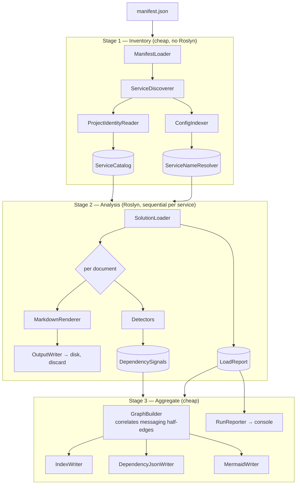

# csharp2md (v1) Design

**Spec**: `.specs/features/csharp2md/spec.md`
**Status**: Approved

---

## Architecture Overview

A three-stage streaming pipeline. Only Stage 2 is expensive; Stages 1 and 3 are cheap and hold small data. The split is not stylistic — Stage 1 is *required* to precede detection, because internal-package matching (P2-04) and logical-name resolution (P2-06) both need every service known before any detector runs.

Memory is bounded by design: rendered Markdown is written and discarded per document. Only the service catalog, the accumulated dependency signals, and index entries survive across documents.



**Sequential invariant (P1-19):** exactly one `MSBuildWorkspace` is alive at a time. Each service's workspace is disposed before the next is opened.

---

## Code Reuse Analysis

Greenfield repository — no existing code to leverage. Reuse is therefore external, and each choice below is pinned to a verified current version.

| Component | Source | How to Use |
| --- | --- | --- |
| `Microsoft.CodeAnalysis.Workspaces.MSBuild` **5.6.0** | NuGet (verified latest stable, 2026-08-14) | `MSBuildWorkspace.OpenSolutionAsync` for solution loading and semantic models |
| `Microsoft.CodeAnalysis.CSharp.Workspaces` **5.6.0** | NuGet (added T3, empirically discovered) | `Workspaces.MSBuild` alone recognizes `.csproj` files as `Language == "C#"` but registers no C# `ICompilationFactoryService` — every project's `SupportsCompilation` is `false` and `GetCompilationAsync()` returns `null` for all of them (not just genuinely unsupported ones) without this package. Confirmed empirically against the fixture before/after adding it. |
| `System.CommandLine` **2.0.11** | NuGet (verified latest stable; 3.0 is preview — avoid) | CLI parsing, `--manifest` / `--output`, usage help and exit codes |
| `System.Text.Json` | BCL | Manifest parsing, `appsettings*.json` parsing, `dependencies.json` emission |
| YAML parser (`YamlDotNet`) | NuGet | `docker-compose.yml` parsing for name resolution |
| `xunit`, `Microsoft.NET.Test.Sdk`, `coverlet.collector` | NuGet | Test projects; versions centralized in `Directory.Packages.props` |
| `Microsoft.SourceLink.GitHub` | NuGet | SourceLink for the packed tool |

### Integration Points

| System | Integration Method |
| --- | --- |
| MSBuild | **Indirect only.** Roslyn 4.9+ runs builds in an out-of-process `BuildHost`; the tool does **not** reference `Microsoft.Build.*` and does **not** call `MSBuildLocator.RegisterDefaults()`. See AD-003. |
| .NET SDK on the user's machine | The BuildHost resolves `dotnet` at runtime. Absence is a diagnosable failure, not a crash — see Risks. |
| NuGet restore | Never invoked by the tool (explicit spec out-of-scope). Missing restore is detected and reported (P1-08, P1-10). |

---

## Components

### Stage 1 — Inventory

#### ManifestLoader

- **Purpose**: Read and validate `manifest.json` into a `Manifest`, failing loudly on anything malformed.
- **Location**: `src/Csharp2Md.Core/Manifests/` — **renamed from this doc's `Manifest/` in T5.** A namespace `Csharp2Md.Core.Manifest` containing a type also named `Manifest` broke every unqualified reference to the type from sibling namespaces (`CS0118`/`CS0234` — C# resolves the identifier to the sibling namespace segment before the `using`-imported type). Confirmed by two independent compile failures (`ServiceDiscoverer.cs`, then again in its test file, which has its own colliding `Csharp2Md.Core.Tests.Manifest` namespace). Pluralizing the namespace/folder to `Manifests` while keeping the type singular (`Manifest`) — the common .NET convention — removes the collision permanently instead of qualifying every call site.
- **Interfaces**:
  - `static ManifestLoadResult Load(string path)` — **resolved in T5, deviating from this doc's `Result<Manifest, ManifestError>` sketch.** `dotnet-skills:csharp-coding-standards` explicitly rejects a generic `Result<T, TError>` in favor of a domain-specific sealed record per operation (its own `CreateOrderResult` example); per CLAUDE.md, the community pack wins on authoring style. `ManifestError` kept its `(Code, Message)` shape, but `Code` became `ManifestErrorCode` (enum) rather than `string`, matching the skill's `OrderErrorCode` pattern. Typed failure for missing file, malformed JSON, or zero entries. An invalid manifest is still an *expected* error, never an exception.
- **Covers**: P1-16
- **Dependencies**: `System.Text.Json` (source-generated context — no reflection-based serialization)

#### ServiceDiscoverer

- **Purpose**: Expand manifest globs to concrete roots and resolve each root to one service boundary.
- **Location**: `src/Csharp2Md.Core/Discovery/`
- **Interfaces**:
  - `DiscoveryResult Discover(Manifest manifest)` — yields `ServiceDescriptor`s plus warnings
- **Boundary rules**: manifest override wins (P1-04) → else exactly one `.sln` (P1-02) → else `.csproj` files in the root (P1-03). For the `Solution` boundary kind, `ServiceDescriptor.ProjectPaths` is populated too (not just `SolutionPath`) by parsing the solution file's project references — keeps `ProjectPaths` uniformly available regardless of boundary kind (added in T6/T7).
- **Covers**: P1-01, P1-02, P1-03, P1-04, P1-17 (unmatched glob → warn, continue), P1-18 (duplicate root → process once, warn)
- **Dependencies**: filesystem only

#### ProjectIdentityReader

- **Purpose**: Read each project's `PackageId` (falling back to assembly/file name per SDK default) so direct-reference detection can tell internal packages from public ones.
- **Location**: `src/Csharp2Md.Core/Discovery/`
- **Interfaces**:
  - `IReadOnlyList<PackageId> ReadPackageIds(ServiceDescriptor service)` — returns the `PackageId` value object (T7), not `string` as originally sketched here; matches `ServiceDescriptor.PackageIds`' own type below and preserves P2-04's rationale for wrapping identity types.
- **Covers**: enables P2-04, P2-05
- **Note**: plain XML read — deliberately does **not** use Roslyn or MSBuild evaluation, keeping Stage 1 cheap.

#### ConfigIndexer / ServiceNameResolver

- **Purpose**: Parse `appsettings*.json` and `docker-compose.yml` under the discovered roots, and resolve a logical service name to a concrete service plus a resolution classification.
- **Location**: `src/Csharp2Md.Core/Configuration/`
- **Interfaces**:
  - `ConfigIndexResult ConfigIndexer.Index(ServiceCatalog catalog)` (T8)
  - `NameResolution ServiceNameResolver.Resolve(string logicalName, ConfigIndex index)` (T9) — **resolved differently from this doc's `IServiceNameResolver.Build(catalog)` / `(ServiceDescriptor?, ResolutionKind)` sketch.** T9's own Done-when list requires a *static pure function*, not a built/stateful resolver, and doesn't ask for a target `ServiceDescriptor` — only classification. Matching a resolved logical name back to a specific catalog service needs an explicit mapping rule (name equality? address correlation?) that neither this doc nor spec.md defines; deferred to whichever task actually builds `DependencySignal`s (T15/T16) rather than guessed here. `NameResolution` is `(string LogicalName, ResolutionKind Kind)`.
- **Classification**: literal address → `HardCoded` (P2-07); env-var reference or registry/discovery indirection → `Dynamic` (P2-08); no match → `Unresolved`, edge still recorded (P2-09).
- **Covers**: P2-06, P2-07, P2-08, P2-09
- **`ConfigIndex` shape (T8, not specified above)**: `ConfigIndex(IReadOnlyDictionary<string,string> LogicalNames, IReadOnlySet<string> DockerComposeServiceNames)`. `appsettings*.json` uses a `"Services": { "Name": "value" }` convention (no established external standard for this — chosen to match the T2 fixture). `docker-compose.yml` contributes just the `services:` mapping's *keys* as a set (not name→value) — Docker's DNS-based service discovery makes the name itself the resolvable target, so a hit there is inherently `Dynamic` (P2-08), never `HardCoded`.

### Stage 2 — Analysis

#### SolutionLoader

- **Purpose**: Own the `MSBuildWorkspace` lifecycle for one service and classify load health.
- **Location**: `src/Csharp2Md.Core/Loading/`
- **Interfaces**:
  - `Task<LoadedService> LoadAsync(string solutionPath, CancellationToken ct)` — **signature resolved in T3, deviating from this doc's original `ServiceDescriptor`-typed sketch.** `ServiceDescriptor` is a Phase-1 (T6) type; T3 runs in Phase 0 with no forward dependency on it (tasks.md's own dependency graph forbids forward-phase edges). More importantly, P1-05 requires *every* service to load via a single `OpenSolutionAsync` call, never `OpenProjectAsync` in a loop — but P1-03's `LooseProjects` boundary kind has no `.sln` to open at all. Resolution: **every service arrives at `SolutionLoader` as a solution path.** `ServiceDiscoverer` (T6) is responsible for synthesizing a temporary `.slnx` for `LooseProjects`-boundary services, so `SolutionLoader` never needs an `OpenProjectAsync` code path and P1-05 holds uniformly. `LoadedService` wraps the resulting `Solution` plus `LoadReport`.
  - `LoadReport Report { get; }` on the returned `LoadedService`, not a separate loader-level property (see `LoadedService.cs`).
- **Behavior**:
  - `SkipUnrecognizedProjects = true` before opening (P1-06)
  - one `OpenSolutionAsync` per service, never `OpenProjectAsync` in a loop (P1-05)
  - reads the **`workspace.Diagnostics` property** after load rather than subscribing to `WorkspaceFailed` — the event is `[Obsolete]` in Roslyn 5.x, and the property accumulates the same diagnostics (AD-003)
  - `Kind == Failure` → project marked degraded, run continues (P1-07)
  - `GetCompilationAsync() == null` → project marked *unsupported-for-compilation*, **not** failed (P1-09)
  - compilation errors matching unresolved-type/namespace patterns → project marked *possible missing restore* (P1-08)
- **Covers**: P1-05 … P1-09
- **Dependencies**: `Microsoft.CodeAnalysis.Workspaces.MSBuild`

#### MarkdownRenderer

- **Purpose**: Render one C# document to Markdown — structural sections, full member bodies, light semantic facts.
- **Location**: `src/Csharp2Md.Core/Rendering/`
- **Interfaces**:
  - `RenderedDocument Render(RenderContext context)`
- **Structure emitted**: file heading → namespace + index backlink → detected-dependency section → **preamble section** (usings, file-level attributes/comments) → one section per type → one subsection per member, body verbatim in a fenced block, XML doc comments rendered as prose.
- **Fidelity invariant (the safeguard that makes structural rendering safe):** every byte of the source file lands in exactly one emitted section. Enforced by a **span-coverage test**, not by inspection. This is what prevents the silent loss of usings, inter-member code, `#region`, and top-level statements.
- **Semantic use is optional and degradable**: `SemanticModel` is nullable in the context. When absent or error-laden, base types and interfaces render exactly as written in source. Semantic enrichment never gates output. (AD-002)
- **Covers**: P1-11, P1-12, P2-10
- **Reuses**: Roslyn syntax API; `SemanticModel` only for namespace, base types, implemented interfaces

#### Dependency detectors

Two interfaces, because the four v1 signals genuinely operate at two different granularities — forcing project-level reference analysis through a per-document contract would be dishonest.

- **Location**: `src/Csharp2Md.Core/Detection/`
- **Interfaces**:
  - `IDocumentDependencyDetector.Detect(DocumentDetectionContext) : IEnumerable<DependencySignal>`
  - `IProjectDependencyDetector.Detect(ProjectDetectionContext) : IEnumerable<DependencySignal>`
- **Implementations**: `HttpClientDetector`, `GrpcClientDetector`, `MessagingDetector` (document-level); `DirectReferenceDetector` (project-level)
- **Execution model**: each detector walks the document independently. With four detectors on a manually-run tool, a shared node-kind dispatch walker is premature optimization; independent walking keeps each detector trivially unit-testable in isolation.
- **Covers**: P2-01 … P2-05

**Communication-type classification rules** (the spec names the vocabulary but not the mapping — this table is the design's contribution and the basis for detector tests):

| Signal | Rule | CommunicationType |
| --- | --- | --- |
| HTTP call, awaited or result consumed | caller blocks on a response | `sincrono-bloqueante` |
| HTTP call, not awaited / result discarded | fire and forget | `assincrono-fire-and-forget` |
| gRPC unary call | request/response | `sincrono-bloqueante` |
| gRPC streaming / duplex call | streaming | `streaming-bidirecional` |
| Messaging publish or subscribe | event-carried | `pub-sub-evento` |
| Project reference or internal `PackageId` match | compile-time coupling | `direct-reference` |

#### OutputWriter

- **Purpose**: Map a document to its output path, mirroring source structure, and write immediately.
- **Location**: `src/Csharp2Md.Core/Output/`
- **Interfaces**:
  - `void PrepareRun(string outputRoot)` — full clean of prior output (P1-15)
  - `string Write(RenderedDocument doc)` — returns the written path for the index
- **Exclusions**: `obj/`, `bin/`, `*.g.cs`, `*.designer.cs` (spec Assumptions)
- **Covers**: P1-11, P1-15

### Stage 3 — Aggregate

#### GraphBuilder

- **Purpose**: Turn accumulated signals into service-to-service edges, correlating messaging half-edges.
- **Location**: `src/Csharp2Md.Core/Graph/`
- **Interfaces**:
  - `DependencyGraph Build(IReadOnlyList<DependencySignal> signals, ServiceCatalog catalog)`
- **Messaging correlation**: a `Publish` signal for message type/topic `T` in service A pairs with a `Subscribe` signal for `T` in service B to produce edge `A → B` (P2-14). Unpaired publishes and subscribes are retained as `Unresolved`-target edges rather than dropped (P2-15).
- **Covers**: P2-11, P2-14, P2-15

#### IndexWriter / DependencyJsonWriter / MermaidWriter

- **Location**: `src/Csharp2Md.Core/Output/`
- **IndexWriter**: per-service `index.md` (P1-13) and root `index.md` (P1-14), relative Markdown links throughout (spec Assumptions)
- **DependencyJsonWriter**: `dependencies.json` — source, target, communication type, resolution, evidence (P2-11)
- **MermaidWriter**: diagram derived from the same graph object, every edge labeled with its communication type (P2-13)

#### RunReporter

- **Purpose**: Print the end-of-run summary of degraded and possible-missing-restore projects with a `dotnet restore` suggestion.
- **Location**: `src/Csharp2Md.Core/Pipeline/`
- **Covers**: P1-10

### CLI

#### Program / Csharp2Md.Cli

- **Purpose**: Parse arguments, run the pipeline, map outcomes to exit codes.
- **Location**: `src/Csharp2Md.Cli/`
- **Packaging**: `PackAsTool=true`, `OutputType=Exe`, `ToolCommandName=csharp2md`, `PackageOutputPath=./nupkg`
- **Exit codes**: missing/invalid arguments → usage + non-zero (P3-04); manifest invalid → non-zero (P1-16); completed run → `0` **even when projects were degraded** (P3-05)
- **Covers**: P3-01 … P3-05

---

## Repository Layout & Build Configuration

Follows the `dotnet-skills:project-structure` conventions.

```
csharp2md/
├── .config/dotnet-tools.json
├── src/
│   ├── Csharp2Md.Cli/            # thin entry point, PackAsTool
│   └── Csharp2Md.Core/           # the pipeline (all logic, all tests target this)
├── tests/
│   └── Csharp2Md.Core.Tests/
├── fixtures/
│   └── SyntheticSolution/        # TDD target (see Tech Decisions)
├── Directory.Build.props
├── Directory.Packages.props      # CPM — single source of package versions
├── csharp2md.slnx                # .slnx (SDK 10 default), never alongside a .sln
├── global.json                   # pin SDK 10.0.300, rollForward latestFeature
├── NuGet.Config
├── RELEASE_NOTES.md
└── README.md
```

**`Directory.Build.props` essentials:** `LangVersion=latest`, `Nullable=enable`, `ImplicitUsings=enable`, `TreatWarningsAsErrors=true`, `NetLibVersion=net10.0`, SourceLink, global `using System.Collections.Immutable`.

> `TreatWarningsAsErrors=true` interacts with a decision above: the `[Obsolete]` `WorkspaceFailed` event would **fail the build**, not merely warn. Reading the `workspace.Diagnostics` property (AD-003) is therefore required, not merely preferred.

Package versions live only in `Directory.Packages.props`; projects reference without a version. Packages are added with `dotnet add package`, never by hand-editing XML (`dotnet-skills:package-management`).

---

## Data Models

Conforms to `dotnet-skills:csharp-coding-standards` and `:csharp-type-design-performance` — everything sealed, records for data, `readonly record struct` for value objects, `IReadOnlyList<T>` at boundaries, `Result<T,TError>` for expected errors.

```csharp
// ── Value objects ───────────────────────────────────────────
// Identity types that get compared across stages. Wrapping them prevents a real
// bug class: P2-04 matches PackageIds against service identities, and raw strings
// would let the two be compared silently.

public readonly record struct ServiceName
{
    public string Value { get; }

    public ServiceName(string value)
    {
        ArgumentException.ThrowIfNullOrWhiteSpace(value);
        Value = value;
    }

    public override string ToString() => Value;
}

public readonly record struct PackageId(string Value)
{
    public override string ToString() => Value;
}

// ── Errors (expected failures — not exceptions) ─────────────
// ManifestError.Code is ManifestErrorCode (enum), not string — see ManifestLoader component note.
public readonly record struct ManifestError(ManifestErrorCode Code, string Message);
public readonly record struct LoadError(string Code, string Message);

// ── Manifest ────────────────────────────────────────────────
public sealed record Manifest(IReadOnlyList<ManifestEntry> Services);

public sealed record ManifestEntry(
    string Path,                             // may contain wildcards
    string? Name = null,                     // optional explicit service name
    IReadOnlyList<string>? Projects = null); // boundary override (P1-04)

// ── Catalog ─────────────────────────────────────────────────
public enum ServiceBoundaryKind { Solution, LooseProjects, ManifestOverride }

public sealed record ServiceDescriptor(
    ServiceName Name,
    string RootPath,
    ServiceBoundaryKind BoundaryKind,
    string? SolutionPath,
    IReadOnlyList<string> ProjectPaths,
    IReadOnlyList<PackageId> PackageIds);

public sealed record ServiceCatalog(IReadOnlyList<ServiceDescriptor> Services);

// ── Dependency model ────────────────────────────────────────
public enum DependencyKind { Http, Grpc, Messaging, DirectReference }

public enum CommunicationType
{
    SincronoBloqueante,
    AssincronoFireAndForget,
    PubSubEvento,
    StreamingBidirecional,
    DirectReference          // P2-12 (amended): compile-time coupling, labeled like any other edge
}

public enum ResolutionKind { HardCoded, Dynamic, Unresolved, NotApplicable }

public enum MessagingRole { Publish, Subscribe }

public readonly record struct SourceLocation(string FilePath, int Line)
{
    public override string ToString() => $"{FilePath}:{Line}";
}

/// Emitted by detectors in Stage 2. Messaging signals are half-edges.
public sealed record DependencySignal(
    ServiceName SourceService,
    ServiceName? TargetService,   // null until correlated/resolved
    string RawTarget,             // logical name, topic, or package id
    DependencyKind Kind,
    CommunicationType Communication,
    ResolutionKind Resolution,
    MessagingRole? Role,          // set only when Kind is Messaging
    SourceLocation Location);

/// Emitted by GraphBuilder in Stage 3, after correlation.
public sealed record DependencyEdge(
    ServiceName Source,
    ServiceName Target,
    CommunicationType Communication,
    ResolutionKind Resolution,
    IReadOnlyList<SourceLocation> Evidence);

public sealed record DependencyGraph(IReadOnlyList<DependencyEdge> Edges);

// ── Load health ─────────────────────────────────────────────
public enum ProjectLoadStatus { Ok, Degraded, PossibleMissingRestore, UnsupportedForCompilation }

public sealed record ProjectLoadResult(
    string ProjectName,
    ProjectLoadStatus Status,
    IReadOnlyList<string> Messages);

public sealed record LoadReport(IReadOnlyList<ProjectLoadResult> Projects);
```

**Classification helpers are static pure functions** (`:csharp-type-design-performance`) — e.g. `CommunicationClassifier.Classify(...)` and `RestoreHeuristics.LooksLikeMissingRestore(...)` take their inputs explicitly and hold no state, so every rule in the classification table is unit-testable without constructing a pipeline.

---

## Error Handling Strategy

| Error Scenario | Handling | User Impact |
| --- | --- | --- |
| Manifest missing / malformed / zero roots (P1-16) | Fail fast before any output is written | Non-zero exit, message naming the specific problem |
| Glob matches nothing (P1-17) | Warn, continue remaining entries | Warning line; other services still processed |
| Duplicate service root (P1-18) | Deduplicate, warn | Warning line; service processed once |
| Project unrecognized (bad path / missing file / odd extension) (P1-06) | `SkipUnrecognizedProjects` handles natively | Project silently skipped, solution still loads |
| Project reports `Failure` diagnostic (P1-07) | Mark degraded, continue | Listed in end-of-run summary |
| Project has unresolved-type errors (P1-08) | Mark possible-missing-restore, continue | Listed in summary with `dotnet restore` suggestion |
| `GetCompilationAsync()` returns null (P1-09) | Treat as unsupported-for-compilation, skip its documents only | Not reported as a failure |
| `SemanticModel` unavailable or error-laden | Renderer falls back to syntax-only output | Slightly less enriched Markdown; never a crash |
| Logical name unresolvable (P2-09) | Record edge with raw name, mark `Unresolved` | Edge visible in graph, flagged as unresolved |
| Messaging publish with no matching subscriber | Retain as `Unresolved`-target edge | Visible rather than silently dropped |
| `dotnet` not resolvable by BuildHost | Detect and report a clear actionable error | Non-zero exit with an explanatory message, not a raw exception |

---

## Risks & Concerns

Greenfield repo — no pre-existing fragile code. These are risks in the dependencies and in this design.

| Concern | Location | Impact | Mitigation |
| --- | --- | --- | --- |
| ~~**`PackAsTool` may not package the Roslyn BuildHost payload correctly.**~~ **RESOLVED in T4 (2026-08-14).** Unverified; related upstream issues exist ([roslyn#76797](https://github.com/dotnet/roslyn/issues/76797) — `Microsoft.Build.Locator` dropped from `MSBuild.BuildHost.deps.json` under the .NET 10 SDK) | `src/Csharp2Md.Cli/` packaging | Tool installs but fails to load any solution — defeats the whole tool | **Phase-0 spike task, executed**: `PackagingSmokeTests.cs` packs the CLI (`dotnet pack`), installs it globally (`dotnet tool install --global --add-source`), and runs `csharp2md --manifest <fixture>.slnx --output <dir>` from a temp directory outside the repo entirely. It correctly loaded the fixture and reported the project count — the BuildHost payload **is** packaged correctly by `PackAsTool` on Roslyn 5.6.0 / SDK 10.0.300. One dependency was required beyond `Microsoft.CodeAnalysis.Workspaces.MSBuild` for this to work at all: see the added `Microsoft.CodeAnalysis.CSharp.Workspaces` row in Code Reuse Analysis above. |
| BuildHost requires a resolvable `dotnet` at runtime ([roslyn#77640](https://github.com/dotnet/roslyn/issues/77640)) | `SolutionLoader` | Hard failure on machines without .NET on PATH | Catch and translate into an actionable error message rather than a raw exception |
| `WorkspaceDiagnosticKind` misclassification — NuGet warnings reported as `Failure` ([roslyn#75182](https://github.com/dotnet/roslyn/issues/75182)) | `SolutionLoader` | Healthy projects wrongly reported degraded | Never treat `Kind == Failure` as the sole signal; corroborate with `compilation.GetDiagnostics()` before classifying. **Confirmed empirically in T3**: SourceLink's own `Microsoft.Build.Tasks.Git`/`Microsoft.SourceLink.Common` build-task warnings ("repository has no remote", "repository has no commits") surfaced as `Kind == Failure` for every project in a repo with no commits yet — unrelated to the project's own health. Fixture projects now disable SourceLink via `fixtures/SyntheticSolution/Directory.Build.props`; the real `src/`/`tests/` projects still carry this exposure until the repo has its first commit and a remote. |
| Documented `MSBuildWorkspace` perf regression on large solutions ([roslyn#76679](https://github.com/dotnet/roslyn/issues/76679)) | `SolutionLoader` | Slow runs on the target large codebase | Single `OpenSolutionAsync` per service (P1-05); pin the Roslyn package version; measure fixture load time before assuming scale |
| **Structural rendering can silently drop source** (usings, inter-member code, `#region`, top-level statements) | `MarkdownRenderer` | Silent fidelity loss — worst kind of bug, output looks fine | Span-coverage test asserting every source byte maps to exactly one emitted section. Non-negotiable gate for the renderer tasks. |
| `WorkspaceFailed` is `[Obsolete]` in Roslyn 5.x | `SolutionLoader` | Build warnings, future removal | Read the `workspace.Diagnostics` property instead — same data, no obsolete API |
| Messaging correlation is heuristic (type/topic name matching) | `GraphBuilder` | False or missed pub/sub edges | Unpaired signals surface as `Unresolved` rather than being dropped; fixture covers matched and unmatched cases |

---

## Spec Amendments (applied 2026-08-14)

Two precision gaps surfaced while modeling the data. Both are resolved and written into `spec.md`.

**1. P2-04 contradicted P2-12 — resolved.** P2-04 assigned communication type `"direct-reference"` while P2-12 admitted only four values, none of them `direct-reference`.

> **Applied:** P2-12 now enumerates **five** values, adding `direct-reference`. This preserves the "every edge carries exactly one communication type" invariant, keeping `dependencies.json` uniform and P2-13's "every edge labeled" requirement free of special cases. Compile-time coupling appears in the graph alongside runtime communication — deliberate, since it is real coupling and typically the hardest kind to break during a refactor.

**2. P2-03 / P2-10 interaction with streaming — resolved.** A pub/sub edge is only knowable after correlating a publish in one service with a subscribe in another, which happens in Stage 3 — *after* that file's Markdown is already written in Stage 2.

> **Applied:** P2-03 now records a messaging *signal* (topic + role) rather than a finished edge. P2-10 specifies the topic/message type as the inline target. Two new criteria carry the rest: **P2-14** requires publisher→subscriber correlation at aggregate time, and **P2-15** requires unpaired signals to be retained as `unresolved`-target edges rather than dropped. No second render pass, no file rewriting.

Spec now totals **39 criteria** (19 + 15 + 5).

---

## Tech Decisions

| Decision | Choice | Rationale |
| --- | --- | --- |
| Project layout | `Csharp2Md.Cli` (thin, `PackAsTool`) + `Csharp2Md.Core` (library) | Pipeline is testable without going through the tool host |
| Detector interfaces | Split `IDocumentDependencyDetector` / `IProjectDependencyDetector` | The four v1 signals genuinely operate at two granularities; one contract would force a dishonest fit |
| Detector execution | Each detector walks the document independently | Four detectors on a manually-run tool; shared node-kind dispatch is premature optimization and hurts isolated testability |
| Roslyn failure signal | Read `workspace.Diagnostics` property | Same data as the `[Obsolete]` `WorkspaceFailed` event, no obsolete API, no event-timing concerns |
| Restore detection | Compilation error-pattern matching, corroborated with workspace diagnostics | Upstream misclassifies some warnings as `Failure`; single-signal classification would produce false reports |
| YAML parsing | `YamlDotNet` | No BCL YAML parser; needed for `docker-compose.yml` (P2-06) |
| Fixture design | 3 projects: HTTP caller, gRPC + subscriber, shared contracts lib — plus one deliberately unrestored project | Exercises all four detectors and the degradation paths in one fixture |
| C# style authority | `dotnet-skills` (`csharp-coding-standards`, `csharp-type-design-performance`, `project-structure`, `package-management`) | Per project standing instruction: dotnet-skills define how C# is written here, over pretraining defaults |
| Validated value objects | Explicit-property form, not the primary-constructor + validating-ctor form | The `csharp-coding-standards` snippet for that pattern does not compile (CS0111 — the validating ctor duplicates the primary ctor signature). Same intent, corrected syntax. |
| JSON serialization | `System.Text.Json` with a source-generated `JsonSerializerContext` | `dotnet-skills` bans reflection-based metaprogramming; also keeps the packed tool trim/AOT-friendly |

> Project-level decisions recorded in `.specs/STATE.md`: **AD-001** (three-stage pipeline), **AD-002** (structural rendering + span-coverage invariant), **AD-003** (Roslyn 5.6.0 / net10.0 / no MSBuildLocator), **AD-004** (compiled-in detectors).
