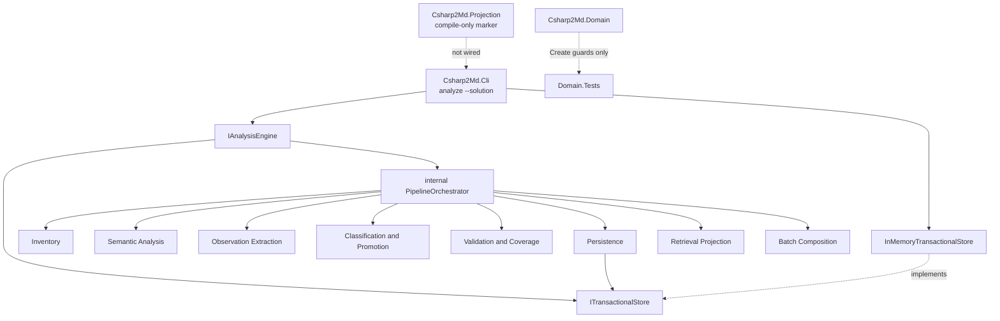

# Engine Bootstrap Design

**Spec**: `.specs/features/engine-bootstrap/spec.md`
**Context**: `.specs/features/engine-bootstrap/context.md`
**Status**: Approved

---

## Architecture Overview

The composition root is the CLI. Analysis owns the application ports. Storage and (later) Projection are adapters. Domain stays taxonomy-only and is not referenced by this workstream's new production assemblies.

`ITransactionalStore` lives on Analysis's public surface (ENG-11). `Csharp2Md.Storage` references Analysis and implements that port with an in-memory adapter. Analysis never references Storage, Projection or CLI. The eight pipeline stages are `internal` to Analysis; tests substitute them through `InternalsVisibleTo`. `Csharp2Md.Projection` compiles and sits in the solution so the module exists, but it does not participate in the pipeline: ENG-03 and ENG-04 forbid Analysis↔Projection in either direction, and ENG-49 forbids a sixth production assembly that could hold a shared projector port. Workstream 6 owns that seam.

CLI constructs `InMemoryTransactionalStore`, injects it into `AnalysisEngine`, and never declares a project reference to Domain. Stub stages produce explicit zeros and write nothing to disk. Publication is atomic in memory: stage fragments, commit once, publish the manifest last, abort without replacing a previous publication.



Approach A, confirmed: hexagonal ports in Analysis, Storage as the adapter, Projection as a marker assembly, one test project per production assembly.

---

## Active decision conformance

| Decision | How this design conforms |
| --- | --- |
| AD-001 standardized taxonomy | New assemblies do not invent fact, observation or relation types. Stub stages report zeros. Domain is unchanged except the `Create` signature |
| AD-002 no compatibility constraint | Legacy CLI, Core, schemas, tests and benchmarks are deleted. `ConfirmedRelation.Create` is a breaking signature change with zero production consumers |
| AD-003 Roslyn and trust boundary | No production project references `Microsoft.CodeAnalysis.*` or `Microsoft.Build.*`. No `MSBuildLocator`. Real loading waits for workstream 4 |
| AD-004 evidence before promotion | Classification stage is a stub. Promotion does not happen. `Create` now requires `EvidenceMethod` so later classifiers cannot skip it |
| AD-005 business interpretation downstream | No classifier interprets conditions |
| AD-006 deep modules and storage seam | Five assemblies as named. Analysis exposes one facade and writes only through the port. CLI contains no taxonomy |
| AD-007 directly navigable package | No package is written. Manifest-last is proven on the in-memory commit order so workstream 3 inherits the rule |
| AD-008 one to many isolated solutions | One request, `1..N` sessions, independent commit/abort, no shared compilation or graph |
| AD-009 coverage and certification | Out of scope. Validation stage is a stub |
| AD-010 proof states not confidence | Untouched in Domain. Analysis result has no numeric confidence field |
| AD-011 query and wiki deferred | Projection assembly is a marker, not a renderer |
| AD-012 documentation migration | Port ledger is new. No legacy spec is revived |
| AD-013 domain-declared registry | `Create` calls the existing guards and registry. The committed registry file stays byte-identical |

No active decision is superseded. AD-014 (port ownership) and AD-015 (`Create` carries shape and evidence) are recorded in `.specs/STATE.md`.

---

## Code Reuse Analysis

### Existing Components to Leverage

| Component | Location | How to Use |
| --- | --- | --- |
| `Csharp2Md.Domain` construction guards | `src/Csharp2Md.Domain/Relations/ConfirmedRelation.cs`, `RelationShapeGuards.cs` | Widen `Create` so it calls `RequireCallableIfNeeded`, `RequireLegalTargetShape` and `RequireSufficientEvidence`. Do not reimplement them |
| `TaxonomyRegistry.RequireSufficientEvidence` | `src/Csharp2Md.Domain/Registry/` | Invoked from `Create` with the new `EvidenceMethod` parameter |
| Domain isolation test pattern | `tests/Csharp2Md.Domain.Tests/Isolation/DomainIsolationTests.cs` | Copy the referenced-assembly and public-surface namespace walk for Analysis, Storage, Projection and CLI. Delete the two tests that load `Csharp2Md.Core.dll` |
| `[Trait("Requirement", "TAX-nn")]` | every Domain test | Same trait on every new test, with `ENG-nn` |
| System.CommandLine 2.0 `RootCommand` / `SetAction` / `ParseResult.GetValue` | `src/Csharp2Md.Cli/Program.cs` | Keep the 2.0 API already in tree. Replace the root action with a required `analyze` subcommand and a repeatable `--solution` option (`Required = true`, `Arity = ArgumentArity.OneOrMore`) |
| CLI `Invalid` helper returning 1 on stderr | `src/Csharp2Md.Cli/Program.cs:153` | Keep the `csharp2md: {message}` shape for invocation errors |
| `PackAsTool` / `ToolCommandName` / `PackageId` | `src/Csharp2Md.Cli/Csharp2Md.Cli.csproj` | Leave packaging metadata unchanged |
| `AssemblyMarker` | `src/Csharp2Md.Domain/AssemblyMarker.cs` | Mirror in Analysis, Storage and Projection so topology tests have a stable `typeof` |
| Domain test csproj package set | `tests/Csharp2Md.Domain.Tests/Csharp2Md.Domain.Tests.csproj` | Copy xunit / Verify / coverlet references into each new test project |
| `Directory.Build.props` | repo root | Inherited. `net10.0`, nullable, implicit usings, warnings-as-errors, global `System.Collections.Immutable` |
| `InternalsVisibleTo` | `Csharp2Md.Domain.csproj` | Same pattern: Analysis → Analysis.Tests, Storage → Storage.Tests, CLI → Cli.Tests |
| `fixtures/SyntheticSolution` | `fixtures/SyntheticSolution/` | CLI existence checks and multi-solution tests use its `.slnx` paths. The engine does not read them |
| `csharp2md.slnx` folder layout | `/src/`, `/tests/` | Add the new projects under those folders. Remove `/benchmarks/` |

### Deliberately not reused

| Component | Location | Why not |
| --- | --- | --- |
| `AnalysisEngine` and `AnalysisRequest` | `src/Csharp2Md.Core/Analysis/` | Bound to inventory, Roslyn, markdown output and the old option surface. The new facade is a different type in a different assembly |
| `IAnalysisEngineObserver` / `ConsoleProgressObserver` | `src/Csharp2Md.Cli/Program.cs:193` | The stub has no per-scope progress. Diagnostics go to stderr as strings on the result |
| `FactStore`, JSON serializers, schemas | `src/Csharp2Md.Core/Facts/`, `schemas/` | Workstream 3. This port stages opaque fragments |
| `DotnetMsBuildEvaluator`, `SemanticCompilationAdapter` | `src/Csharp2Md.Core/Analysis/Semantics/` | Workstream 4. Named in the port ledger |
| `MarkdownProjector`, retrieval aggregates, benchmarks | `src/Csharp2Md.Core/Projection/`, `benchmarks/` | Workstream 6 |
| YamlDotNet, Roslyn package versions | `Directory.Packages.props` | Last production consumers die with Core. Fixture packages stay |

### Integration Points

| System | Integration Method |
| --- | --- |
| `csharp2md.slnx` | `src/` lists Domain, Analysis, Storage, Projection, Cli. `tests/` lists one test project each. No Core, no Core.Tests, no benchmarks folder |
| `Directory.Packages.props` | Drop `Microsoft.CodeAnalysis.CSharp.Workspaces`, `Microsoft.CodeAnalysis.Workspaces.MSBuild` and `YamlDotNet`. Keep System.CommandLine, the test stack, SourceLink and the fixture packages |
| `contracts/taxonomy-registry.json` | Untouched. Drift gate must still pass after the `Create` change |
| `.specs/features/knowledge-taxonomy-contract/spec.md` | ENG-61 flips TAX-46, TAX-50, TAX-51, TAX-53 to `Verified` with the gap clause removed |
| Port ledger | New file `docs/architecture/legacy-port-ledger.md` |

---

## Components

### Solution topology

- **Purpose**: The five production assemblies and their test projects with AD-006 boundaries enforced by tests.
- **Location**: `src/Csharp2Md.{Analysis,Storage,Projection,Cli}/`, `tests/Csharp2Md.{Analysis,Storage,Projection,Cli}.Tests/`
- **Interfaces**: project files and `InternalsVisibleTo` only.
- **Dependencies**: see the reference matrix below.
- **Reuses**: Domain's csproj shape and `AssemblyMarker`.

| Project | Project references | Package references |
| --- | --- | --- |
| `Csharp2Md.Domain` | none | none |
| `Csharp2Md.Analysis` | none | none |
| `Csharp2Md.Storage` | Analysis | none |
| `Csharp2Md.Projection` | none | none |
| `Csharp2Md.Cli` | Analysis, Storage, Projection | `System.CommandLine` |
| Each `*.Tests` | its production project | xunit stack + Verify, matching Domain.Tests |

Analysis does not reference Domain in this workstream. Stub stages never construct taxonomy types. Workstream 4 adds that reference when extractors exist.

A public-surface allowlist test on Analysis fails if a public type is not one of: `IAnalysisEngine`, `AnalysisEngine`, `AnalysisRequest`, `AnalysisResult`, `SolutionOutcome`, `StageReport`, `PublicationStatus`, `ITransactionalStore`, `IStoreSession`, `StagedFragment`, `ArtifactRole`, `CommittedPublication`. Nested types of those are allowed. Stage, pass, classifier and adapter types are not.

### `IAnalysisEngine` and `AnalysisEngine`

- **Purpose**: The single public entry for analyzing a validated request through the eight-stage pipeline.
- **Location**: `src/Csharp2Md.Analysis/AnalysisEngine.cs`, `IAnalysisEngine.cs`
- **Interfaces**:
  - `IAnalysisEngine.AnalyzeAsync(AnalysisRequest request, CancellationToken cancellationToken): Task<AnalysisResult>`
  - `AnalysisEngine(ITransactionalStore store)` — production constructor, uses the eight stub stages
  - `internal AnalysisEngine(ITransactionalStore store, ImmutableArray<IPipelineStage> stages)` — test substitution constructor. The orchestrator is unchanged
- **Dependencies**: `ITransactionalStore`. No Domain, no Storage project reference.
- **Reuses**: nothing from Core.

`AnalyzeAsync` validates the request, then processes each distinct solution independently:

1. Open a store session keyed by the solution's canonical full path.
2. Create a fresh `PipelineContext` that shares nothing with other solutions.
3. Run stages in declared order, checking cancellation before each stage starts.
4. On cancellation or stage exception: `session.Abort()`, record the failing stage name, continue the batch.
5. On `StageResult.StructuralCorruption`: `session.Abort()`, record corruption, continue the batch. Previously committed publication for that key stays.
6. Otherwise `session.Commit()` exactly once.

Results in `AnalysisResult.Solutions` are ordered by logical relative path (the `--solution` token with `/` separators, ordinal), never by input order. Duplicate detection uses `Path.GetFullPath` with ordinal comparison, case-insensitive on Windows.

### Pipeline stages

- **Purpose**: Substitutable steps whose names and order are the architecture pipeline.
- **Location**: `src/Csharp2Md.Analysis/Pipeline/` (internal)
- **Interfaces**:
  - `internal interface IPipelineStage` with `string Name { get; }` and `ValueTask<StageResult> ExecuteAsync(PipelineContext context, CancellationToken cancellationToken)`
  - `internal readonly record struct StageResult(int FactCount, int ObservationCount, int RelationCount, bool StructuralCorruption, bool HasUnknownsOrCandidatesOrFrontiers)`
- **Dependencies**: `PipelineContext` holds the store session, the solution path, and an accumulator of stage reports. Persistence is the only default stub that stages a fragment: one `ArtifactRole.Manifest` envelope so commit has a last artifact.
- **Reuses**: nothing.

Default stub `Name` values, in order:

1. `Inventory`
2. `Semantic Analysis`
3. `Observation Extraction`
4. `Classification and Promotion`
5. `Validation and Coverage`
6. `Persistence`
7. `Retrieval Projection`
8. `Batch Composition`

Every default stub returns zeros, `StructuralCorruption: false`, `HasUnknownsOrCandidatesOrFrontiers: false`. Substitution tests pass a replacement array of the same eight names; the orchestrator rejects a different count or order at construction.

Cancellation is observed between stages, not inside a stub body. A cancelled run does not commit.

### `ITransactionalStore` (the port)

- **Purpose**: Staging, commit and abort as three distinct operations, with publication order independent of staging order.
- **Location**: `src/Csharp2Md.Analysis/Storage/ITransactionalStore.cs` and the supporting records next to it
- **Interfaces**:
  - `IStoreSession Open(string solutionKey)`
  - `IStoreSession.Stage(StagedFragment fragment)`
  - `IStoreSession.Commit(): CommittedPublication`
  - `IStoreSession.Abort()`
- **Dependencies**: none. Fragments are opaque.
- **Reuses**: nothing.

`StagedFragment` carries `ArtifactRole Role` (`Payload` or `Manifest`), `string CanonicalKey` and `ImmutableArray<byte> Payload`. Commit sorts `Payload` fragments by `CanonicalKey` ordinal, then appends every `Manifest` fragment. That is ENG-23 and ENG-27. The adapter, not the caller, imposes this order.

`Commit` after a successful previous `Commit` on the same key replaces the in-memory publication. `Abort` discards the current session's fragments and leaves the last committed publication in place (ENG-24). A first-run abort leaves no publication.

The port does not classify, promote or interpret payload bytes (ENG-28). A test asserts Storage public types reference no Domain taxonomy type.

### `InMemoryTransactionalStore`

- **Purpose**: The production adapter for this workstream, and the only writer the skeleton has.
- **Location**: `src/Csharp2Md.Storage/InMemoryTransactionalStore.cs`
- **Interfaces**: implements `ITransactionalStore` / `IStoreSession`
- **Dependencies**: Analysis (for the port types only)
- **Reuses**: nothing. No `System.IO`

Sessions are isolated by `solutionKey`. Two keys never share a fragment list or publication slot.

### `Csharp2Md.Projection`

- **Purpose**: Occupy the AD-006 module slot so later workstreams fill it instead of creating it.
- **Location**: `src/Csharp2Md.Projection/AssemblyMarker.cs`
- **Interfaces**: `AssemblyMarker` only
- **Dependencies**: none
- **Reuses**: Domain's marker type

CLI references this project so `dotnet build` of the entry point builds it. CLI does not call it.

### `Csharp2Md.Cli`

- **Purpose**: Parse `analyze`, validate paths, compose the store and the engine, map the result to exit codes and streams.
- **Location**: `src/Csharp2Md.Cli/Program.cs`
- **Interfaces**: process entry only. No taxonomy types.
- **Dependencies**: Analysis, Storage, Projection, `System.CommandLine` 2.0.11
- **Reuses**: the existing `SetAction` and `Invalid` pattern

Command tree:

- `RootCommand` description stays a one-line product sentence. It has no options of its own and no action that analyzes.
- `Command("analyze")` with `Option<string[]>("--solution")` `{ Required = true, Arity = ArgumentArity.OneOrMore }`. Repeat as `--solution a --solution b`, not as a positional.

Exit codes:

| Situation | Code | Stream |
| --- | --- | --- |
| Missing verb, missing `--solution`, parse error | 1 | stderr (parser or `Invalid`) |
| `--solution` path does not exist | 1 | stderr names the path |
| Engine rejects empty or duplicate paths | 1 | stderr names the missing input or the duplicate |
| Every requested solution committed, including unknowns | 0 | summary on stdout |
| Any solution unpublished (stage failure or structural corruption) | 2 | diagnostics on stderr, summary on stdout |

ENG-41/42 name structural failure as exit 2. A stage exception also leaves that solution unpublished, so it uses the same code. Invocation errors stay 1.

Removed options (`--topic`, `--domain`, `--manifest`, `--output`, `--trust`, `--include-source-generators`, `--analysis-timeout`) are absent. A test lists `analyze.Options` and `analyze.Arguments` and asserts the only option name is `--solution`.

`Properties/launchSettings.json` is rewritten to the new verb and `--solution` against `fixtures/SyntheticSolution`.

### Port ledger

- **Purpose**: Retrievability of deleted infrastructure without keeping the code.
- **Location**: `docs/architecture/legacy-port-ledger.md`
- **Interfaces**: Markdown table, one row per removed area
- **Dependencies**: git history
- **Reuses**: the inventory taken for this spec

Columns: `Area`, `Former path`, `Responsibility` (one line), `Last commit`, `Re-establish in`. The Roslyn sanitation probes and the CLI security-boundary tests are named rows with `Re-establish in` set to workstream 4 and workstream 8 respectively. The SHA is `git log -1 --format=%H` on each path at the moment of deletion, captured in the same task that deletes the files.

### `ConfirmedRelation.Create` widening

- **Purpose**: Make TAX-46, TAX-50, TAX-51 and TAX-53 reachable through the only public construction API.
- **Location**: `src/Csharp2Md.Domain/Relations/ConfirmedRelation.cs`
- **Interfaces**: replace the current `Create` with:

```csharp
public static ConfirmedRelation Create(
    RelationKind kind,
    FactReference source,
    FactReference target,
    FacetBinding facets,
    EvidenceChain derivedFrom,
    ClassifierIdentity classifier,
    ImmutableArray<AnalysisVariantId> analysisVariants,
    EvidenceMethod evidenceMethod,
    IFact? sourceFact = null,
    IFact? targetFact = null)
```

After the existing triple, facet, chain, classifier and variant checks:

1. `RelationShapeGuards.RequireSufficientEvidence(Registry, kind, evidenceMethod)`
2. If `sourceFact` is not null and `sourceFact.Reference` ≠ `source`, reject naming `sourceFact`
3. If `targetFact` is not null and `targetFact.Reference` ≠ `target`, reject naming `targetFact`
4. Callable kinds (`Executes`, `Invokes`, `ImplementsOperation`, `AccessesData`):
   - `Executes`: `targetFact` must be `Symbol`; call `RequireCallableIfNeeded(kind, symbol, nameof(targetFact))`
   - the other three: `sourceFact` must be `Symbol`; call `RequireCallableIfNeeded(kind, symbol, nameof(sourceFact))`
5. `Targets` and `OperatesOn`: `targetFact` must be non-null; call `RequireLegalTargetShape(kind, targetFact)`
6. Existing `RequirePayloadRoleForUsesContract` stays

AD-002 allows breaking the current signature. Optional `IFact` parameters are required in effect when the kind needs them: passing null is the named rejection, not a skip. Existing Domain tests that call `Create` pass `EvidenceMethod.Semantic` except where the relation's minimum is `Syntactic` or `Configured` (use a method that meets the minimum). The new ENG-55..58 tests call only `Create`, never the guard helpers.

The descriptor tables do not change. `contracts/taxonomy-registry.json` remains byte-identical.

---

## Data Models

### `AnalysisRequest`

```csharp
public sealed record AnalysisRequest
{
    public ImmutableArray<string> SolutionPaths { get; }

    public static AnalysisRequest Create(ImmutableArray<string> solutionPaths);
}
```

`Create` rejects a default or empty array (names the missing input) and rejects a duplicate canonical full path (names the duplicate). Paths are stored as supplied; canonicalization is for duplicate checks and session keys only.

### `AnalysisResult` and `SolutionOutcome`

```csharp
public sealed record AnalysisResult
{
    public ImmutableArray<SolutionOutcome> Solutions { get; }
    public bool HasUnpublishedSolution { get; }
}

public sealed record SolutionOutcome
{
    public string SolutionPath { get; }
    public string LogicalRelativePath { get; }
    public PublicationStatus Status { get; } // Committed | Unpublished
    public string? FailingStage { get; }
    public bool StructuralCorruption { get; }
    public bool HasUnknownsOrCandidatesOrFrontiers { get; }
    public ImmutableArray<StageReport> Stages { get; }
}

public sealed record StageReport(string Name, int FactCount, int ObservationCount, int RelationCount);

public enum PublicationStatus { Committed, Unpublished }
```

`HasUnpublishedSolution` is true when any outcome is `Unpublished`. CLI maps that to exit 2. Stage names in `StageReport` equal the eight architecture names.

### Store types

```csharp
public enum ArtifactRole { Payload, Manifest }

public sealed record StagedFragment(
    ArtifactRole Role,
    string CanonicalKey,
    ImmutableArray<byte> Payload);

public sealed record CommittedPublication(
    string SolutionKey,
    ImmutableArray<StagedFragment> ArtifactsInPublicationOrder);
```

**Relationships**: one `IStoreSession` per solution key. `CommittedPublication.ArtifactsInPublicationOrder` is the canonical order, not the staging order. Analysis results do not embed fragments; CLI never reads them. Tests assert on `CommittedPublication` through the port and through a test-substituted Persistence stage.

---

## Error Handling Strategy

Rejection of illegal Domain states still throws, matching `FactIdGrammar` and the current `ConfirmedRelation.Create`. The pipeline uses `StageResult` for expected outcomes (zeros, unknowns, structural corruption) and lets unexpected stage exceptions abort that solution only.

| Error Scenario | Handling | User Impact |
| --- | --- | --- |
| No `analyze` verb or no `--solution` | Parser / `Invalid`, exit 1 | Message on stderr |
| `--solution` path does not exist | `Invalid` naming the path, exit 1 | Named path on stderr |
| Empty solution list reaching the facade | `AnalysisRequest.Create` throws `ArgumentException` naming the missing input; CLI maps to exit 1 | Named missing input |
| Duplicate canonical path | `ArgumentException` naming the duplicate; CLI maps to exit 1 | Named duplicate |
| Stage throws | Abort session, `Unpublished`, `FailingStage` set, batch continues | Exit 2 if any unpublished; stage name on stderr |
| `StructuralCorruption` from Validation | Abort session, previous publication kept, batch continues | Exit 2; corruption named |
| Cancellation between stages | Abort session, do not commit, remaining solutions still run unless the token is already cancelled | Unpublished for the cancelled solution |
| Unknowns / candidates / frontiers without corruption | Commit normally, exit 0 | Counts on stdout |
| Weaker evidence than the relation minimum | `ArgumentException` from `Create` naming relation, required method and supplied method | Domain tests only in this workstream |
| Callable kind without a callable `Symbol` | `ArgumentException` from `Create` | Domain tests only |
| `targets` / `operates-on` with an illegal or missing target fact | `ArgumentException` from `Create` | Domain tests only |

---

## Risks & Concerns

| Concern | Location (file:line) | Impact | Mitigation |
| --- | --- | --- | --- |
| `ConfirmedRelation.Create` never calls three implemented guards | `src/Csharp2Md.Domain/Relations/ConfirmedRelation.cs:79-82` | TAX-46/50/51/53 were spec-precision gaps | AD-015: `Create` calls them. Tests go through `Create` only |
| `DomainIsolationTests` loads `Csharp2Md.Core.dll` | `tests/Csharp2Md.Domain.Tests/Isolation/DomainIsolationTests.cs:28-100` | Those two tests break the moment Core is deleted | Delete `Domain_DoesNotReferenceCore`, `Core_DoesNotReferenceDomain` and `CoreAssemblyPath` in the same task that removes Core |
| Snapshotting `Path.GetTempPath()` for ENG-16 is racy under parallel xUnit | Design-level | False failures from other tests or processes | Snapshot repo trees excluding `bin/`, `obj/`, `TestResults/`. Prove the in-memory adapter has no `System.IO` usage. Do not mutate process `TMP` |
| Storage → Analysis looks inverted | Design-level | Future authors may "fix" it by moving the port into Domain | AD-014 records the hexagonal direction. Boundary tests lock the reference matrix |
| Projection cannot plug into the pipeline without a sixth assembly | ENG-03, ENG-04, ENG-49 | Workstream 6 has no legal projector port today | Marker assembly now. Workstream 6 must add a seam (likely CLI-sequenced projection after commit, or a spec change). Out of scope here |
| `Directory.Build.props` `Version` is `4.0.0`, the legacy schema-2 signal | `Directory.Build.props:10` | New assemblies inherit a version tied to a deleted contract | Leave it. Assembly version is not a taxonomy axis. Workstream 8 sets the first post-migration version |
| ENG-16 "no filesystem write" vs CLI parsing `Directory.Exists` | `Program.cs` will call existence checks | A naive snapshot of the working tree still passes; a snapshot that forbids all `System.IO` would fail on the CLI | The criterion applies to a completed analysis run's writes, not to read-only existence checks. Tests assert no new or changed files |
| Existing Domain `Create` call sites will not compile | `tests/Csharp2Md.Domain.Tests/Relations/*.cs` | Gate red until tests pass `EvidenceMethod` | Same workstream updates those call sites. No production caller exists |
| Fixture `Microsoft.Extensions.Http` / `Grpc.AspNetCore` have no solution consumer after Core dies | `Directory.Packages.props` Fixture group | ENG-51 fails if the test does not scan `fixtures/` | Package-hygiene test scans solution projects and `fixtures/**/*.csproj` |
| Known failing `MigrationLedgerTests` | `tests/Csharp2Md.Core.Tests/Analysis/MigrationLedgerTests.cs` | Suite is not green until Core.Tests is gone | Deleted with Core. ENG-54 is the green-suite gate after excision |

> None found - is not the case. Every row has a mitigation in this design or an explicit later workstream.

---

## Tech Decisions

| Decision | Choice | Rationale |
| --- | --- | --- |
| Storage port location | Declared in Analysis; Storage implements it | ENG-11 already puts the port on Analysis. Hexagonal adapters depend on application ports. Domain stays taxonomy-only |
| Analysis → Domain in this workstream | No reference | Stubs do not construct taxonomy types. Keeps CLI free of a transitive Domain load until workstream 4 |
| Projection's role | Compile-only marker, referenced by CLI, not called | No legal place for a projector port under ENG-03/04/49 |
| Stage substitution | `internal` constructor taking `ImmutableArray<IPipelineStage>` plus `InternalsVisibleTo` | ENG-12 forbids public stage types. ENG-14 requires substitution without changing the orchestrator |
| Fragment payload | Opaque bytes plus `ArtifactRole` and `CanonicalKey` | Storage must not interpret (ENG-28). Workstream 3 replaces the envelope with real wire contracts |
| Commit ordering | Adapter sorts payloads by key, then appends manifests | Callers cannot violate ENG-23 even if they stage the manifest first |
| Duplicate paths | `Path.GetFullPath`, case-insensitive on Windows | `.\a.sln` and an absolute form of the same file are one solution |
| Result ordering | Ordinal sort of the supplied path with `/` separators | Independent of input order and of absolute clone path used as a session key |
| CLI verb | Required `analyze` subcommand, not a root action | ENG-37. Later `validate` / `compose` attach next to it |
| Repeatable option | `--solution` with `Required` and `OneOrMore` | Documented System.CommandLine 2.0 arity. Matches the existing 2.0 `SetAction` style |
| Exit code 2 | Any unpublished solution, not only the `StructuralCorruption` flag | A stage exception also aborted publication. Invocation errors stay 1 |
| `Create` signature | Breaking add of `EvidenceMethod` plus optional `IFact` ends | Zero production consumers (AD-002). Optional parameters that throw when missing keep one method rather than a matrix of overloads |
| Test layout | One test project per production assembly | Matches Domain. ENG-49's "their test projects" |
| Port ledger path | `docs/architecture/legacy-port-ledger.md` | Next to the target architecture, not inside a feature folder that agents treat as done |
| Package pruning | Drop Roslyn and YamlDotNet versions; keep fixture packages | ENG-51 with a `fixtures/` scan |
| Rejection style | Throw BCL exceptions in Domain and request validation; `StageResult` for pipeline outcomes | Domain already throws. Pipeline outcomes (unknowns, corruption) are data, not programmer errors |

**Project-level decisions** — append to `.specs/STATE.md` on approval:

- **AD-014** — Hexagonal storage port owned by Analysis. Storage may reference Analysis. Analysis never references Storage. Projection stays unwired until workstream 6.
- **AD-015** — `ConfirmedRelation.Create` requires `EvidenceMethod` and materialized facts when the registered shape needs them, and is the only supported call path into the shape guards.
