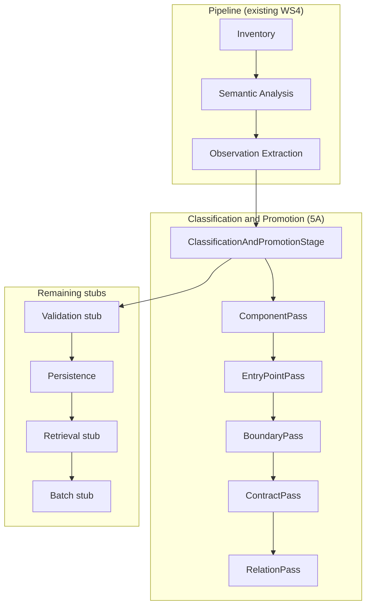

# Entry Points, Boundaries, and Contracts Design

**Spec**: `.specs/features/entrypoints-boundaries-contracts/spec.md`
**Status**: Draft

---

## Architecture Overview

The Classification and Promotion stage consumes the accumulated `SnapshotAccumulator` (structural facts + observations from WS4) and promotes observations into architecture and contract facts. It replaces `ClassificationAndPromotionStub` at pipeline index 3 with a composable stage that runs an ordered sequence of classifier passes.



Each pass reads facts and observations accumulated so far and adds its promoted facts, relations, candidates, and unresolved records to the shared `SnapshotAccumulator`. Passes run in a fixed order because later passes depend on facts created by earlier ones (e.g., `BoundaryPass` needs `Component` facts from `ComponentPass`).

---

## Code Reuse Analysis

### Existing Components to Leverage

| Component | Location | How to Use |
| --- | --- | --- |
| `SnapshotAccumulator` | [`Pipeline/SnapshotAccumulator.cs`](file:///d:/workspace/csharp2md/src/Csharp2Md.Analysis/Pipeline/SnapshotAccumulator.cs) | Extend with `AddCandidate` and `AddUnresolved` methods; classifier passes add facts/relations through existing methods |
| `PipelineStages.CreateDefault()` | [`Pipeline/PipelineStages.cs`](file:///d:/workspace/csharp2md/src/Csharp2Md.Analysis/Pipeline/PipelineStages.cs) | Add `.SetItem(3, classificationStage)` to replace stub at index 3 |
| `ConfirmedRelation.Create` | [`Domain/Relations/ConfirmedRelation.cs`](file:///d:/workspace/csharp2md/src/Csharp2Md.Domain/Relations/ConfirmedRelation.cs) | Classifiers construct relations through existing guards; `ImplementsOperation` requires `sourceFact` as `Symbol` with `Callable`; `UsesContract` requires `payload-role` facet |
| `CandidateLink.Create` | [`Domain/Relations/CandidateLink.cs`](file:///d:/workspace/csharp2md/src/Csharp2Md.Domain/Relations/CandidateLink.cs) | Outbound HTTP `targets` candidates |
| `UnresolvedRecord.Create` | [`Domain/Relations/UnresolvedRecord.cs`](file:///d:/workspace/csharp2md/src/Csharp2Md.Domain/Relations/UnresolvedRecord.cs) | Unresolvable messaging types and outbound destinations |
| `Component.Create`, `EntryPoint.Create`, `BoundaryOperation.Create` | [`Domain/Facts/Architecture/`](file:///d:/workspace/csharp2md/src/Csharp2Md.Domain/Facts/Architecture) | Domain construction with existing guards; `BoundaryOperation.Create` dispatches to `CreateOutboundHttp` or `CreateInbound` based on direction/protocol |
| `Contract.Create`, `ContractBinding.Create`, `ContractRevision.Create` | [`Domain/Facts/Contracts/ContractFacts.cs`](file:///d:/workspace/csharp2md/src/Csharp2Md.Domain/Facts/Contracts/ContractFacts.cs) | Messaging contract construction |
| `ContainsRelationEmitter` pattern | [`Extraction/ContainsRelationEmitter.cs`](file:///d:/workspace/csharp2md/src/Csharp2Md.Analysis/Extraction/ContainsRelationEmitter.cs) | Reuse the pattern of querying snapshot facts by type and observations by path; do NOT couple to Roslyn types |
| `FacetBinding.Create` | Domain facets | Construct facet bindings for `uses-contract` (`payload-role`) |
| `ClassifierIdentity.Create` | Domain proof | Construct classifier identities per pass |

### Integration Points

| System | Integration Method |
| --- | --- |
| `PipelineOrchestrator` | Unchanged; runs stages in declared order; `ClassificationAndPromotionStage` at index 3 replaces the stub |
| `PersistenceStage` at index 5 | Unchanged; stages `context.Accumulator.ToSnapshot()` which now includes classifier output |
| `AnalysisEngine` | Unchanged; passes `PipelineStages.CreateDefault()` which now includes the real classification stage |
| WS4 test infrastructure | Existing WS4 tests that assert `ROSE-20` and `ROSE-60` use the stub pipeline; they remain valid. New 5A integration tests use the real pipeline and assert classifier output |

---

## Components

### `IClassifierPass` (interface)

- **Purpose**: Contract for a single classifier pass that promotes observations into facts and relations.
- **Location**: `src/Csharp2Md.Analysis/Classification/IClassifierPass.cs`
- **Interface**:
  - `string Name { get; }` — human-readable pass name for diagnostics
  - `ClassifierPassResult Execute(ClassifierContext context, CancellationToken cancellationToken)` — runs the classifier; returns counts
- **Dependencies**: `ClassifierContext` (read-only view of accumulated state)
- **Reuses**: Pattern from `IRegisteredContextDetector` (simple interface, one method)

### `ClassifierContext` (read-only view)

- **Purpose**: Provides classifier passes with a read-only snapshot of accumulated facts and observations, plus the `SnapshotAccumulator` for writing promoted output.
- **Location**: `src/Csharp2Md.Analysis/Classification/ClassifierContext.cs`
- **Interface**:
  - `ImmutableArray<IFact> Facts { get; }` — all facts accumulated so far (structural + prior passes)
  - `ImmutableArray<Observation> Observations { get; }` — all observations from extraction
  - `SnapshotAccumulator Accumulator { get; }` — write target for promoted facts/relations/candidates/unresolved
  - `ImmutableArray<AnalysisVariantId> AnalysisVariants { get; }` — required for `ConfirmedRelation.Create`
  - Computed indexes: `FactsByType<T>()`, `ObservationsByKind(ObservationKind)`, `ObservationsByOwner(FactReference)`, `SymbolsBySignatureKey()`
- **Dependencies**: `SnapshotAccumulator`, `PipelineContext`
- **Reuses**: Index patterns from `ContainsRelationEmitter` (facts by type, symbols by signature)

### `ClassificationAndPromotionStage` (pipeline stage)

- **Purpose**: Replaces `ClassificationAndPromotionStub`. Runs an ordered sequence of `IClassifierPass` instances and reports aggregate counts.
- **Location**: `src/Csharp2Md.Analysis/Classification/ClassificationAndPromotionStage.cs`
- **Interface**: `IPipelineStage` (existing)
  - `string Name => "Classification and Promotion"`
  - `ValueTask<StageResult> ExecuteAsync(PipelineContext context, CancellationToken cancellationToken)`
- **Dependencies**: `ImmutableArray<IClassifierPass>` (injected at construction)
- **Reuses**: `ObservationExtractionStage` pattern (build snapshot, delegate to internal workers, report counts)

### `ComponentPass`

- **Purpose**: Creates one `Component` fact per project that contains at least one entry point or boundary symbol. Runs first because all later passes need component references.
- **Location**: `src/Csharp2Md.Analysis/Classification/Passes/ComponentPass.cs`
- **Interface**: `IClassifierPass`
- **Logic**:
  1. Scan `Symbol` facts that will be promoted (deferred: component pass pre-scans observations to identify which symbols are boundary/entry-point candidates, then creates components for their projects).
  2. For each qualifying project, create `Component.Create(solutionId, projectLogicalPath, owners)`.
  3. Add to accumulator.
- **Dependencies**: `ClassifierContext` (reads `Symbol`, `Project`, `Solution` facts and `AttributeUsage`/`BaseType`/`RouteDeclaration` observations)

**Design note — two-pass component identification**: `ComponentPass` needs to know which symbols will become entry points or boundary operations, but those passes run later. Two approaches:

1. **Pre-scan approach** (chosen): `ComponentPass` runs its own lightweight observation scan to identify candidate boundary symbols (symbols with `RouteDeclaration`, `BaseType` to `ControllerBase`, `MessageOperation`, or `IIntegrationEventHandler` interface). It creates components from this pre-scan. Later passes consume these components and promote the actual facts.
2. Alternative: Run component creation lazily inside later passes. Rejected because it would scatter component creation across multiple passes and make the component count unpredictable.

### `EntryPointPass`

- **Purpose**: Classifies callable symbols as entry points when they are controller action methods or messaging event handler methods.
- **Location**: `src/Csharp2Md.Analysis/Classification/Passes/EntryPointPass.cs`
- **Interface**: `IClassifierPass`
- **Logic**:
  1. For each `Symbol` fact with `Callable` facet:
     - Check if the symbol's declaring type has a `BaseType` observation whose target binds to `Microsoft.AspNetCore.Mvc.ControllerBase`. → Create `EntryPoint` for action methods with route declarations.
     - Check if the symbol's declaring type has a `BaseType` observation whose target binds to `IIntegrationEventHandler<T>` and the symbol is the `HandleAsync` method. → Create `EntryPoint`.
  2. Add `EntryPoint` facts to accumulator.
- **Dependencies**: `ClassifierContext` (reads `Symbol` facts, `BaseType` and `AttributeUsage` observations, `Component` facts from prior pass)
- **Classifier identity**: `csharp2md.classifier.entrypoint` version 1

### `BoundaryPass`

- **Purpose**: Classifies inbound and outbound boundary operations for HTTP and messaging protocols.
- **Location**: `src/Csharp2Md.Analysis/Classification/Passes/BoundaryPass.cs`
- **Interface**: `IClassifierPass`
- **Logic** (four sub-classifiers, all within one pass):

  **HTTP inbound**: For each entry point from a `ControllerBase` descendant, find its `RouteDeclaration` observation. Create `BoundaryOperation.Create(symbol, component, Inbound, Http, protocolOperationKey: routeTemplate)`.

  **HTTP outbound**: For each callable with an `Invocation` observation whose target method name is `CreateClient` on `IHttpClientFactory`:
  1. Extract the client name literal from the invocation payload.
  2. Find subsequent HTTP method invocations (`PostAsJsonAsync`, `GetAsync`, etc.) on the returned client within the same callable.
  3. Create `BoundaryOperation.Create(symbol, component, Outbound, Http, destinationScope: clientName, httpMethod, route)`.
  4. Create `ExternalSystem.Create(solutionId, clientNameLiteral)` as a candidate fact.
  5. Create `CandidateLink.Create(Targets, boundaryOp.Reference, externalSystem.Reference, evidenceChain)`.

  **Messaging outbound**: For each `MessageOperation` observation with method `PublishAsync` or `Publish`:
  1. Extract the `TEvent` type name from the observation payload.
  2. Create `BoundaryOperation.Create(symbol, component, Outbound, Messaging, protocolOperationKey: eventTypeFqn)`.

  **Messaging inbound**: For each symbol implementing `IIntegrationEventHandler<TEvent>`:
  1. Extract `TEvent` from the `BaseType` observation.
  2. Create `BoundaryOperation.Create(symbol, component, Inbound, Messaging, protocolOperationKey: eventTypeFqn)`.

- **Classifier identities**: `csharp2md.classifier.http-inbound` v1, `csharp2md.classifier.http-outbound` v1, `csharp2md.classifier.messaging` v1

### `ContractPass`

- **Purpose**: Creates `Contract`, `ContractBinding`, and `ContractRevision` facts for messaging boundaries when the event type is shared across projects.
- **Location**: `src/Csharp2Md.Analysis/Classification/Passes/ContractPass.cs`
- **Interface**: `IClassifierPass`
- **Logic**:
  1. Collect all messaging boundary operations (outbound publish + inbound handler) grouped by `TEvent` FQN.
  2. For each group where both outbound and inbound exist:
     a. Verify `TEvent` is a named type declared in a project referenced by both the publishing and subscribing projects. Cross-check against `Symbol` facts and `Project` facts.
     b. Create `Contract.Create(proof)` where proof is a `StructuralLiteral` with role `ProtocolName` and value = FQN.
     c. Create `ContractBinding.Create(operation, "request", clrSymbol, contract)` for each boundary operation.
     d. Create `ContractRevision.Create(contract, fingerprint)` where fingerprint is derived from the event type's public properties (from `Symbol` facts).
  3. For unpaired publish-only events: do not create a contract (EBC-24).
- **Classifier identity**: `csharp2md.classifier.contract-messaging` v1

### `RelationPass`

- **Purpose**: Emits confirmed `implements-operation` and `uses-contract` relations for all boundary operations and contract bindings created by prior passes.
- **Location**: `src/Csharp2Md.Analysis/Classification/Passes/RelationPass.cs`
- **Interface**: `IClassifierPass`
- **Logic**:
  1. For each `EntryPoint` + `BoundaryOperation` pair: create `ConfirmedRelation.Create(ImplementsOperation, symbol, boundaryOp, facets, derivedFrom, classifier, variants, Semantic, sourceFact: symbol)`.
  2. For each `ContractBinding`: create `ConfirmedRelation.Create(UsesContract, boundaryOp, contract, facetsWithPayloadRole, derivedFrom, classifier, variants, Semantic)`.
  3. For outbound HTTP: `CandidateLink` already created in `BoundaryPass`; no confirmed `targets` relation.
- **Dependencies**: All facts from prior passes, observations for evidence chains

---

## Data Models

No new Domain types. All fact types (`EntryPoint`, `BoundaryOperation`, `ExternalSystem`, `Component`, `Contract`, `ContractBinding`, `ContractRevision`) and relation/candidate/unresolved types already exist in `Csharp2Md.Domain`.

### New Analysis-internal types

```csharp
// Composable classifier pass contract
internal interface IClassifierPass
{
    string Name { get; }
    ClassifierPassResult Execute(ClassifierContext context, CancellationToken cancellationToken);
}

internal readonly record struct ClassifierPassResult(
    int FactCount,
    int RelationCount,
    int CandidateCount,
    int UnresolvedCount);

// Read/write context for classifier passes
internal sealed class ClassifierContext
{
    public FactualSnapshot Snapshot { get; }              // read-only view at pass start
    public SnapshotAccumulator Accumulator { get; }       // write target
    public ImmutableArray<AnalysisVariantId> AnalysisVariants { get; }
    public SolutionId SolutionId { get; }
    // Computed indexes refreshed between passes
}
```

### SnapshotAccumulator extensions

```csharp
// Two new methods on SnapshotAccumulator
public void AddCandidate(CandidateLink candidate);
public void AddUnresolved(UnresolvedRecord record);
```

These are currently missing — the `ToSnapshot()` method already constructs `ImmutableArray<CandidateLink>.Empty` and `ImmutableArray<UnresolvedRecord>.Empty`. The new methods will populate those collections.

---

## Error Handling Strategy

| Error Scenario | Handling | User Impact |
| --- | --- | --- |
| Observation payload missing expected fields | Skip that observation; record diagnostic | Boundary operation not created; package shows diagnostic |
| Non-constant `CreateClient` argument | Create `UnresolvedRecord` with cause `InsufficientEvidence` | LLM sees the unresolved record and available evidence |
| Messaging type argument unresolvable | Create `UnresolvedRecord` with cause `NoCandidateFound` | Event-driven boundary not classified; diagnostic names the symbol |
| Controller action with no route declaration | Create `EntryPoint` without boundary operation; record diagnostic | Entry point exists but has no protocol operation |
| Structural corruption during fact creation | `SnapshotAccumulator.AddFact` detects collision; pipeline aborts | Existing WS4 behavior preserved |

---

## Risks & Concerns

| Concern | Location | Impact | Mitigation |
| --- | --- | --- | --- |
| `ComponentPass` pre-scan may disagree with later passes about which symbols qualify | `Classification/Passes/ComponentPass.cs` (new) | A component could be created for a project where no entry point or boundary operation is ultimately emitted | Pre-scan uses the same observation queries as later passes; add a post-verification assertion in tests |
| `ConfirmedRelation.Create` for `ImplementsOperation` requires materialized `sourceFact` as `Symbol` | [`ConfirmedRelation.cs:108-119`](file:///d:/workspace/csharp2md/src/Csharp2Md.Domain/Relations/ConfirmedRelation.cs#L108-L119) | Classifier must hold both the `FactReference` and the `Symbol` fact instance | `ClassifierContext` indexes provide `Symbol` facts by reference; passes carry both |
| Observation payload structure is not type-safe at the Domain level | `NormalizedPayload` is a bag of `StructuralLiteral` values | Classifiers must know which payload keys exist for each observation kind | Define payload key constants in the classifier and test against the fixture; the extractor set version pins the contract |
| `BoundaryOperation.CreateOutboundHttp` requires non-null `destinationScope`, `httpMethod`, and `route` | [`BoundaryFacts.cs:105-139`](file:///d:/workspace/csharp2md/src/Csharp2Md.Domain/Facts/Architecture/BoundaryFacts.cs#L105-L139) | Classifier must extract all three from observations or skip | If any is missing, skip that outbound HTTP boundary and record an `UnresolvedRecord` |
| `Contract.Create` requires proof literal with role `ProtocolName` or `SchemaName` | [`ContractFacts.cs:21-34`](file:///d:/workspace/csharp2md/src/Csharp2Md.Domain/Facts/Contracts/ContractFacts.cs#L21-L34) | Messaging contracts use `ProtocolName` (FQN of event type) | Confirmed by Domain guards; test with fixture's `OrderPlaced` |

---

## Tech Decisions

| Decision | Choice | Rationale |
| --- | --- | --- |
| Five passes in one stage vs. five separate pipeline stages | Five passes in one `ClassificationAndPromotionStage` | The pipeline has a fixed 8-stage structure enforced by `PipelineOrchestrator`; classification is one of those 8 stages |
| `ClassifierContext` refreshes snapshot between passes vs. shared mutable accumulator | Shared mutable accumulator with lazy index refresh | Each pass needs to see facts added by prior passes; refreshing the immutable snapshot between passes provides consistent reads without race conditions |
| Observation payload querying by key constants vs. structured payload types | Key constants in classifier code | The observation schema is owned by WS4's extractors; adding typed wrappers would couple classifiers to extraction internals. Constants are sufficient and testable |
| `ComponentPass` pre-scan vs. lazy component creation | Pre-scan | Keeps component creation in one place; avoids scattered `Component.Create` calls across passes |
| `ExternalSystem` as candidate fact vs. confirmed fact | Candidate fact (added to accumulator) + `CandidateLink` | `ExternalSystem` identity from a client name string alone is not "identidade demonstrada por fonte ou configuração autorizada"; 5D provides configuration evidence |

> **Project-level decision:** The composable `IClassifierPass` interface and `ClassificationAndPromotionStage` pattern will be used by workstreams 5B–5D. This is a feature-local decision that becomes a de facto standard once 5B starts.
