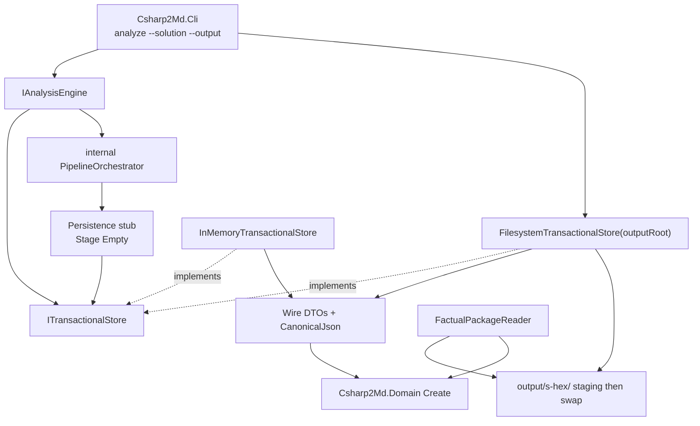

# Factual Storage Design

**Spec**: `.specs/features/factual-storage/spec.md`
**Context**: `.specs/features/factual-storage/context.md`
**Status**: Approved

---

## Approach exploration

All three approaches deliver the same scoped package. They differ only in where Domain becomes JSON.

| Approach | How Domain crosses the port | Mapper home | Cost |
| --- | --- | --- | --- |
| **A (recommended)** | `IStoreSession.Stage(FactualSnapshot)` carries Domain types. `Commit` is the only serializer | Storage only | Analysis references Domain. Public surface adds `FactualSnapshot` and `PublicationRejectedException` |
| B | Persistence serializes inside Analysis, port stays opaque bytes, Storage parses again | Duplicated | Two wire implementations drift. ENG-07 allows internal JSON in Analysis, but AD-013 forbids restating the taxonomy |
| C | Second Analysis port `IFactualCodec`, implemented by Storage, CLI injects both | Storage only | Same mapper as A, extra public port, two constructor arguments |

**Chosen: A.** One mapper, last gate and reader share it, CLI still does not reference Domain. Output root is an adapter constructor argument, not an `AnalysisRequest` field: CLI parses `--output` and constructs `FilesystemTransactionalStore`. Injected-engine tests still pass `--output` (required) and ignore it.

---

## Architecture Overview

CLI is still the composition root. Analysis still owns the write port (AD-014). Storage now also owns wire DTOs, canonical JSON, JSON Schema emission, commit-time gates, the filesystem adapter, and the factual reader.

`Commit` is the last gate. It maps the staged snapshot to wire DTOs, writes a complete staging tree, validates that tree, then atomically replaces the previous package. A gate failure deletes the staging tree, throws `PublicationRejectedException`, and leaves the last valid package untouched. The engine catches that exception, calls `Abort`, and reports `Unpublished` plus structural corruption.

The Persistence stub stages `FactualSnapshot.Empty`. An empty commit is a schema-valid package: manifest last, taxonomy-registry copy, envelope files, omitted empty family shards, counts 0.



---

## Active decision conformance

| Decision | How this design conforms |
| --- | --- |
| AD-001 standardized taxonomy | Wire DTOs and schemas are projections of Domain types. No new fact, observation or relation kind |
| AD-002 no compatibility constraint | Port `Stage` changes from opaque bytes to `FactualSnapshot`. ENG-45 `--output` prohibition and ENG-28 opaque-byte tests are replaced |
| AD-003 Roslyn and trust boundary | No `Microsoft.CodeAnalysis.*` or `Microsoft.Build.*` |
| AD-004 evidence before promotion | Storage never promotes. Invalid derived records go to quarantine |
| AD-005 business interpretation downstream | No classifier |
| AD-006 deep modules | Five assemblies. CLI still has no Domain reference. Analysis writes only through the port |
| AD-007 navigable package | Filesystem adapter writes a manifest-led directory tree. No database |
| AD-008 isolated solutions | One session and one child directory per solution key |
| AD-009 coverage and certification | Envelope schemas exist with zero numerators. Precision/recall stay empty/`not_evaluated` |
| AD-010 proof states | Candidates, unresolved and frontiers are separate shards, not confirmed edges |
| AD-011 query deferred | No catalogs, postings, Markdown or retrieval guide |
| AD-012 documentation migration | No legacy spec revived. Port ledger already names Facts/schemas/Manifests for this workstream |
| AD-013 registry | Package embeds a byte copy of `contracts/taxonomy-registry.json`. Registry emitter still passes. Validation uses Domain `Create` and the registry, not a second vocabulary |
| AD-014 port on Analysis | Unchanged. Storage references Analysis and now Domain |
| AD-015 relation `Create` | Reader and commit reconstruct confirmed relations through `ConfirmedRelation.Create` |

AD-016 is recorded in `.specs/STATE.md`: Storage (and Analysis) may reference Domain so the last gate and the reader reconstruct through `Create`. Storage still does not classify.

---

## Code Reuse Analysis

### Existing Components to Leverage

| Component | Location | How to Use |
| --- | --- | --- |
| `ITransactionalStore` / `IStoreSession` / `CommittedPublication` | `src/Csharp2Md.Analysis/Storage/` | Keep Open/Commit/Abort. Replace `Stage(StagedFragment)` with `Stage(FactualSnapshot)`. Keep `StagedFragment` as the published artifact view |
| `InMemoryTransactionalStore` | `src/Csharp2Md.Storage/InMemoryTransactionalStore.cs` | Same session isolation and manifest-last ordering. Add validation. Still no `System.IO` |
| Domain `Create` guards and registry | `src/Csharp2Md.Domain/` | Commit and reader reconstruct only through public `Create`. Do not bypass into constructors |
| Observation kind `WireName` | `src/Csharp2Md.Domain/Registry/ObservationKindDescriptor.cs` | Shard file names and JSON `kind` fields |
| `TaxonomyRegistryWriter` pattern | `tests/Csharp2Md.Domain.Tests/Registry/TaxonomyRegistryWriter.cs` | Canonical JSON: UTF-8 no BOM, `\n`, indent 2, explicit property order. Schema emitter lives in Storage.Tests the same way |
| `contracts/taxonomy-registry.json` | repo `contracts/` | Embed in Storage as `EmbeddedResource`. Copy into each package. Drift-test embed vs committed file |
| Isolation test walks | `tests/Csharp2Md.Storage.Tests/Isolation/StorageIsolationTests.cs` | Invert the Domain ban: Storage must reference Domain and must still expose no classifier/promoter type |
| Analysis public-surface allowlist | `tests/Csharp2Md.Analysis.Tests/Isolation/AnalysisPublicSurfaceTests.cs` | Add `FactualSnapshot` and `PublicationRejectedException` |
| CLI `Invalid` / exit 1 / 2 | `src/Csharp2Md.Cli/CommandFactory.cs` | Same message shape. Add required `--output`. Construct `FilesystemTransactionalStore` inside the action when no engine is injected |
| `[Trait("Requirement", "ENG-nn")]` | existing tests | New tests use `STOR-nn`. Rewrite ENG-45/ENG-28 assertions this feature supersedes |
| `JsonSchemaExporter.GetJsonSchemaAsNode` | `System.Text.Json.Schema` (net10) | Emit committed schemas from wire DTO `JsonTypeInfo`. No extra NuGet package |
| `Directory.Build.props` / CPM | repo root | No new package version unless a later task proves `JsonSchemaExporter` cannot describe a DTO |

### Deliberately not reused

| Component | Location | Why not |
| --- | --- | --- |
| Legacy `FactStore` / `FactualJsonSerializer` | SHA `1482fa6a` via the port ledger | Bound to deleted schema-2 facts. New DTOs follow Domain, not the old wire |
| Legacy `schemas/` | deleted in workstream 2 | New files go under `contracts/json-schema/` |
| JsonSchema.Net / NJsonSchema | not in CPM | Runtime check is STJ deserialize with `UnmappedMemberHandling.Disallow` plus Domain `Create`. Committed `.json` files are the published contract |
| A sixth mapping assembly | ENG-49 | Mapper stays in Storage |
| `AnalysisRequest.OutputRoot` | — | Output is adapter configuration. Request stays solution paths |

### Integration Points

| System | Integration Method |
| --- | --- |
| `Csharp2Md.Analysis.csproj` | ProjectReference to Domain |
| `Csharp2Md.Storage.csproj` | ProjectReference to Domain (keep Analysis). Embed `contracts/taxonomy-registry.json` |
| `Csharp2Md.Cli` | Required `--output`. Default engine uses `FilesystemTransactionalStore`. Still no Domain reference |
| `contracts/json-schema/` | Committed exporter output. Drift gate in Storage.Tests |
| `launchSettings.json` | Add `--output` to a temp-relative or `artifacts/analyze-out` path that gitignores |

---

## Components

### `FactualSnapshot` (port payload)

- **Purpose**: The typed unit of staging. Replaces opaque `Stage(StagedFragment)` as the production input.
- **Location**: `src/Csharp2Md.Analysis/Storage/FactualSnapshot.cs`
- **Interfaces**:
  - `FactualSnapshot.Empty`
  - Properties: `ImmutableArray<IFact> Facts`, `ImmutableArray<Observation> Observations`, `ImmutableArray<ConfirmedRelation> ConfirmedRelations`, `ImmutableArray<CandidateLink> Candidates`, `ImmutableArray<UnresolvedRecord> Unresolved`, `ImmutableArray<OpenFrontier> Frontiers`
  - `FactualSnapshot Merge(FactualSnapshot other)` concatenates arrays. Collision is a commit-time gate, not a merge error
- **Dependencies**: Domain
- **Reuses**: Domain public types only

`IStoreSession.Stage(FactualSnapshot snapshot)` merges into the session. `Stage(StagedFragment)` is removed.

### `PublicationRejectedException`

- **Purpose**: Named abort-class failure from `Commit` so the engine can mark structural corruption without Storage referencing pipeline types.
- **Location**: `src/Csharp2Md.Analysis/Storage/PublicationRejectedException.cs`
- **Interfaces**: `PublicationRejectedException(string gate, string detail)` with `Gate` and `Detail`
- **Dependencies**: none
- **Reuses**: nothing

Gates: `schema`, `unregistered-kind`, `identity-collision`, `content-hash`, `absolute-path`, `construction`, `io`, `session-state`, `not-a-package`, `lock`.

### `ITransactionalStore` (updated)

- **Purpose**: Unchanged seam: Open, Stage, Commit, Abort.
- **Location**: `src/Csharp2Md.Analysis/Storage/ITransactionalStore.cs`
- **Interfaces**:
  - `IStoreSession Open(string solutionKey)`
  - `void Stage(FactualSnapshot snapshot)`
  - `CommittedPublication Commit()`
  - `void Abort()`
- **Dependencies**: Domain (via `FactualSnapshot`)
- **Reuses**: existing session lifetime

`Commit` either publishes or throws `PublicationRejectedException`. It never returns a mixed package. A second `Commit` or a `Stage` after `Commit` throws `session-state`.

`CommittedPublication.ArtifactsInPublicationOrder` remains payload shards then manifest, canonical keys ordinal, bytes of the written files. Both adapters fill it.

`AnalysisEngine.AnalyzeSolutionAsync` wraps `Commit` in try/catch for `PublicationRejectedException`, then `Abort` and `Unpublished` + `StructuralCorruption = true`.

### Wire DTOs and `CanonicalJson`

- **Purpose**: The JSON shape. Domain types keep private constructors, so they are not STJ-serialized directly.
- **Location**: `src/Csharp2Md.Storage/Wire/`
- **Interfaces**:
  - One DTO per fact type, plus observation, confirmed relation, candidate, unresolved, frontier, and the envelopes (manifest, coverage, run_certification, diagnostics, quarantine, measurements)
  - `CanonicalJson.Write<T>(T dto) -> ImmutableArray<byte>`
  - `CanonicalJson.Read<T>(ReadOnlySpan<byte> utf8) -> T`
- **Dependencies**: System.Text.Json source-generated context in Storage. `PropertyNamingPolicy = JsonNamingPolicy.SnakeCaseLower`, `UnmappedMemberHandling = Disallow`, `DefaultIgnoreCondition = WhenWritingNull` off for required fields
- **Reuses**: registry writer’s byte rules (UTF-8 no BOM, `\n`, indent 2)

Arrays inside a shard are sorted by identity string ordinal before write. That is STOR-45.

Each payload record carries `content_sha256`: SHA-256 of the canonical JSON object with that property omitted. STOR-28 compares it on read and after write.

### `DomainMapper`

- **Purpose**: `FactualSnapshot` ↔ wire DTOs. The only Domain↔JSON map.
- **Location**: `src/Csharp2Md.Storage/Mapping/DomainMapper.cs`
- **Interfaces**:
  - `WireDocument ToWire(FactualSnapshot snapshot, ManifestContext context)`
  - `FactualSnapshot FromWire(WireDocument document)` calling Domain `Create` for every record
- **Dependencies**: Domain, wire DTOs
- **Reuses**: `TaxonomyRegistry` and relation `Create` (AD-015)

`FromWire` classifies construction failures: Structural fact or observation → abort-class `construction`. Architecture/Contract/Persistence/Configuration fact or confirmed relation → quarantine record, omit from snapshot, set run certification failed.

Unknown `kind` / fact type string → abort-class `unregistered-kind`.

### `PackageValidator`

- **Purpose**: Abort-class gates over a wire document or a directory of shards. Shared by Commit and the reader.
- **Location**: `src/Csharp2Md.Storage/Validation/PackageValidator.cs`
- **Interfaces**: `PackageValidator.Validate(WireDocument document)` throws `PublicationRejectedException`, or returns a `ValidationReport` with quarantined derived records
- **Dependencies**: DomainMapper, registry, `content_sha256`, absolute-path scanner
- **Reuses**: Domain `Create`

Absolute-path scan: every JSON string that matches a rooted path (`/`, `\`, or `X:`) fails `absolute-path`. Domain relative-path fields already reject this; the scan catches leaks in other strings.

STOR-25/26/27/28/29/30 tests call this validator directly with fixture JSON. Commit and reader call the same method. That is how schema failures are driven without a production “stage raw bytes” API.

### `FilesystemTransactionalStore`

- **Purpose**: Production adapter. Writes only under the output root.
- **Location**: `src/Csharp2Md.Storage/FilesystemTransactionalStore.cs`
- **Interfaces**: `FilesystemTransactionalStore(string outputRoot)` implements `ITransactionalStore`
- **Dependencies**: PackageValidator, CanonicalJson, DomainMapper, embedded registry bytes
- **Reuses**: in-memory session rules (one commit, abort clears, overlapping Open rejected)

Child directory: `s-{sha256(utf8(canonical solutionKey))[:32]}` lowercase hex. Not a display name, not a path. Manifest stores `solution_key` (that hex) and `solution_file_name` (`Path.GetFileName`). Workstream 4 replaces this with `SolutionId` once a workspace exists.

Physical tree (omitted shards are absent files):

```text
<output>/
  s-<hex>/
    manifest.json
    contracts/taxonomy-registry.json
    facts/{structural,architecture,contract,persistence,configuration}.json
    observations/{wire-name}.json
    relations/confirmed/{wire-name}.json
    relations/candidates.json
    relations/unresolved.json
    relations/frontiers.json
    quarantine/records.json
    coverage.json
    run-certification.json
    diagnostics.json
    measurements.json
```

No directory named for a fact or observation identity. No catalogs, postings, Markdown, source, or `retrieval.md`.

Commit protocol:

1. Refuse if `outputRoot` is an existing file (`io` / `not-a-package` as specified).
2. Create `outputRoot` if missing.
3. Reject overlapping Open of the same `solution_key` (`lock`): exclusive `FileStream` on `<child>.lock`.
4. If `<child>` exists without `manifest.json`, refuse and leave it (`not-a-package`).
5. Write `<child>.staging/` fully, manifest file last inside that tree.
6. Validate the staging tree. On failure, delete staging, release lock, throw.
7. If `<child>` exists, `Directory.Move` it to `<child>.bak`.
8. `Directory.Move` staging to `<child>`.
9. Delete `<child>.bak` if present.
10. If step 8 fails, move `.bak` back to `<child>` when it exists.
11. Release lock.

Abort: delete `<child>.staging` if present, release lock, do not touch `<child>`.

Cancellation: engine Aborts; same cleanup.

### `InMemoryTransactionalStore`

- **Purpose**: Tests that must not touch disk (STOR-24). Same gates as filesystem.
- **Location**: existing file
- **Interfaces**: unchanged port. `TryGetPublication` stays on this concrete type
- **Dependencies**: PackageValidator, DomainMapper
- **Reuses**: current key isolation

No `System.IO`. Publication bytes are the canonical shard bytes, manifest last.

### `FactualPackageReader`

- **Purpose**: Public read-back (STOR-34, STOR-38).
- **Location**: `src/Csharp2Md.Storage/FactualPackageReader.cs`
- **Interfaces**:
  - `static PackageReadResult Read(string packageDirectory)`
  - `PackageReadResult(FactualSnapshot Snapshot, ImmutableArray<QuarantineRecord> Quarantine, CoverageEnvelope Coverage, RunCertificationEnvelope Certification)`
- **Dependencies**: PackageValidator, DomainMapper
- **Reuses**: the same gates as Commit

Not a package (missing manifest) → named rejection, no partial snapshot. Abort-class gate failure → same. Quarantine present → snapshot is the valid remainder, quarantine exposed separately.

Analysis public surface does not include this type.

### Persistence stub and CLI

- **PersistenceStub**: `context.Session.Stage(FactualSnapshot.Empty)` then zeros. Commit of empty is the valid empty package (STOR-50).
- **CLI**: `--output` required. Missing → exit 1 naming `--output`. Production path: `new AnalysisEngine(new FilesystemTransactionalStore(output))`. Injected engine still requires the option so the surface does not lie. Writes only under that root (STOR-51). Forbidden leftover options stay forbidden except `--output`.

---

## Data Models

### Wire document (logical)

```csharp
sealed record WireDocument(
    ManifestEnvelope Manifest,
    ImmutableArray<byte> TaxonomyRegistryCopy,
    ImmutableDictionary<FactFamily, ImmutableArray<FactDto>> Facts,
    ImmutableDictionary<string, ImmutableArray<ObservationDto>> Observations, // key = WireName
    ImmutableDictionary<string, ImmutableArray<ConfirmedRelationDto>> ConfirmedRelations,
    ImmutableArray<CandidateLinkDto> Candidates,
    ImmutableArray<UnresolvedDto> Unresolved,
    ImmutableArray<OpenFrontierDto> Frontiers,
    ImmutableArray<QuarantineRecordDto> Quarantine,
    CoverageEnvelope Coverage,
    RunCertificationEnvelope RunCertification,
    DiagnosticsEnvelope Diagnostics,
    MeasurementsEnvelope Measurements);
```

Empty collections are omitted as files; the manifest lists every partition with `count: 0`.

### Manifest envelope

```csharp
sealed record ManifestEnvelope(
    int SchemaVersion,          // 1
    int TaxonomyVersion,        // from registry
    int ObservationSchemaVersion,
    string SolutionKey,         // s-hex without prefix or with, pick one and keep it
    string SolutionFileName,
    ImmutableArray<ManifestEntry> Artifacts);
```

`ManifestEntry`: `canonical_key`, `role` (`payload` | `manifest`), `count`, `path` relative to the package root, forward slashes. No absolute paths.

### Coverage envelope (zeros)

Metrics named `entry_point_coverage`, `linked_call_coverage`, `contract_coverage`, `persistence_coverage`. Each: `numerator`, `denominator`, `exclusions`, `unknowns`, `degradation_reasons` (all empty/0).

### Run certification

`status`: `not_evaluated` | `failed`. `failed` is true when quarantine is non-empty. No precision/recall numbers.

### Quarantine record

`record_kind`, `identity_or_key`, `gate`, `detail`, plus the rejected wire object as `payload`.

### Measurements

Only file allowed to hold timestamps or durations. Canonical byte-equality tests exclude it (STOR-43, STOR-44).

---

## Error Handling Strategy

| Error Scenario | Handling | User Impact |
| --- | --- | --- |
| Missing `--output` | CLI `Invalid`, exit 1 | stderr names `--output` |
| `--output` is a file | Adapter refuses before staging | stderr names the path, exit 1 |
| Child exists without manifest | Refuse, path unchanged | stderr names the directory, exit 1 |
| Schema / unregistered kind / collision / bad hash / absolute path / structural construction | `PublicationRejectedException`, staging deleted | that solution Unpublished, process exit 2 if any, last package kept |
| Invalid derived construction | Quarantine + certification failed, commit the rest | exit 0, package readable |
| I/O (disk full, ACL) | Abort, name `io` | Unpublished, last package kept |
| Overlapping `Open` | Reject `lock` | named; no second writer |
| `Commit`/`Stage` after `Commit` | `session-state` | test/engine failure, not a published mix |
| Cancelled run | Abort, delete staging | no residue, Unpublished |
| Reader on truncated package | Reject, no snapshot | named gate |

---

## Risks & Concerns

| Concern | Location (file:line) | Impact | Mitigation |
| --- | --- | --- | --- |
| Engine uses a full path as `solutionKey` | `src/Csharp2Md.Analysis/AnalysisEngine.cs:42` | Absolute path leaking into the package fails STOR-29 | Child name and manifest use the hash and file name only. Validator scans every JSON string |
| `Commit` cannot fail after a green pipeline | `AnalysisEngine.cs:57` | Last gate would be silent | Catch `PublicationRejectedException`, Abort, Unpublished + StructuralCorruption |
| Storage isolation forbids Domain | `tests/Csharp2Md.Storage.Tests/Isolation/StorageIsolationTests.cs:16-36` | Blocks STOR-11 | Replace with “must reference Domain” and “no classifier types”. Drop the opaque-byte round-trip |
| ENG-45 asserts no `--output` | `tests/Csharp2Md.Cli.Tests/AnalyzeOptionSurfaceTests.cs:10-42` | Blocks STOR-47 | Allow `--output`; keep the other names forbidden. Product options become `--solution` and `--output` |
| Windows `Directory.Move` replace | new filesystem adapter | Mixed tree on crash | Staging directory + `.bak` swap with restore on failure; validate before swap |
| STOR-28 vs missing source blobs | Domain `DocumentHash` | Cannot re-hash files we do not store | Integrity hash is `content_sha256` of the canonical record. Document hashes round-trip as Domain fields and wait for workstream 4/6 |
| `JsonSchemaExporter` formatting vs byte drift | new schema emitter | Flaky drift gate | Normalize like the registry writer: UTF-8 no BOM, `\n`, indent 2, then compare |
| Analysis public surface grows Domain types | `FactualSnapshot` | CLI might grow a Domain reference by accident | Keep CLI isolation test. CLI never constructs a snapshot |
| Solution identity is a path hash | new child naming | Clone move changes the directory name | Document as provisional. Workstream 4 binds `SolutionId`. Spec STOR-19 is met by a non-display, non-path key |

---

## Tech Decisions (only non-obvious ones)

| Decision | Choice | Rationale |
| --- | --- | --- |
| Mapper home | Storage only; Analysis stages Domain snapshots | One wire. Domain has no JSON. Analysis never references Storage |
| Output root | `FilesystemTransactionalStore(string outputRoot)` | Request stays solution paths. CLI already composes the adapter |
| Runtime schema check | STJ deserialize with `UnmappedMemberHandling.Disallow`, not JsonSchema.Net | Same contract the exporter publishes. No new CPM package |
| Schema files | `contracts/json-schema/*.json` from `JsonSchemaExporter` | Matches AD-013’s committed-artifact + drift-gate pattern |
| Canonical bytes | Source-generated STJ + sort-by-identity + registry writer encoding | STOR-44/45 need explicit order, not reflection |
| Integrity hash | `content_sha256` per record | Enforces STOR-28 without source blobs |
| Child directory | `s-` + first 32 hex chars of SHA-256(canonical key) | Not a display name, not an absolute path |
| Empty commit | Legal; Persistence stages `Empty` | Stub pipeline must honor `--output` (STOR-50) |
| Port `Stage` input | `FactualSnapshot` only | Opaque bytes cannot hit Domain `Create`. Validator fixtures cover bad JSON |
| Quarantine vs abort | Validator implements the spec split | Derived construction failures do not take down the package |

**Project-level:** AD-016 — Storage reconstructs through Domain `Create` and therefore references Domain; it still does not classify.
