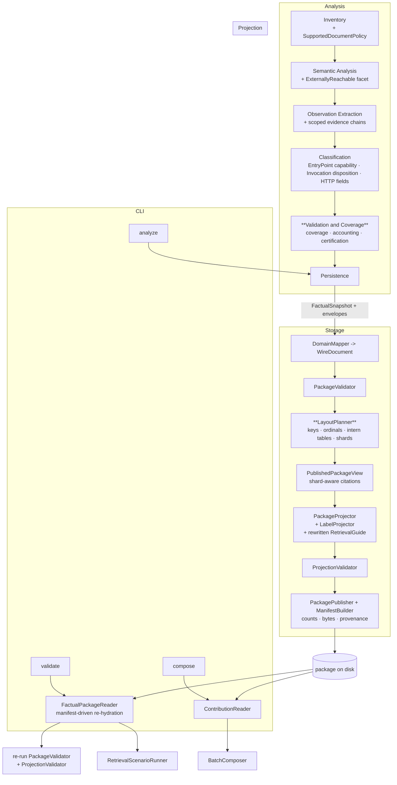

# Generator CLI, Projections and Certification — Design

**Spec**: `.specs/features/generator-cli-projections-certification/spec.md`
**Context**: `.specs/features/generator-cli-projections-certification/context.md`
**Status**: Draft

---

## Architecture Overview

Four seams change; everything else is consumed as-is.

1. **A real Validation and Coverage stage** fills pipeline index 4, which has been a stub since workstream 2. It is the only place that computes coverage, accounting and the run-certification status, and it ships them to Storage on `FactualSnapshot` — the same route AD-017 opened for diagnostics.
2. **A layout planner inside Storage** decides the complete physical shape of the package — artifact keys, per-record ordinals, intern tables, shard boundaries — *before* the first byte is written. Payload writing, projection, manifest and the reader all consume that one plan, so a citation is shard-aware by construction rather than patched afterwards.
3. **Two correction passes in Analysis** close the proven defects: evidence chains stop being document-wide, and entry points stop being declared without proven entry capability.
4. **A re-validation path in Storage** backs `validate` and `compose` by re-hydrating a published package from disk and running it back through the same validators that wrote it. No second validator is introduced.



`analyze` publishes; `validate` and `compose` both start from `FactualPackageReader` and touch no solution. The
validators `validate` re-runs are the same types `Commit()` uses, so there is one definition of a valid package.

---

## Research findings

Measured, not assumed. Each finding pins a root cause to a line and changes the design.

### F1 — The 169 MiB payload is an evidence defect, not a cardinality defect

`relations/confirmed/contains.json` in the audited package holds **3,607 records averaging 48 KiB each**.

| Measurement | Value |
| --- | --- |
| `derived_from` share of the file | 96.3% — 141.4 MiB of 146.6 MiB |
| Worst single record | `Document contains Symbol` citing **449** observations across `invocation`, `data-access`, `assignment`, `type-usage` |
| `derived_from` per record | min 1, median 26, mean 51, max 449 |
| File without `derived_from` | 5.25 MiB |
| String redundancy (interning) | 98.3% — 121.45 MiB inlined, 2.11 MiB distinct |
| `belongs-to` | 2,421 records, 9,287 B each, 90.1% redundant |
| Worst repeaters | a 775-byte symbol id ×1,786; a 368-byte `analysis_variants` string ×3,607 |

Root cause: [ContainsRelationEmitter.cs:49](../../../src/Csharp2Md.Analysis/Extraction/ContainsRelationEmitter.cs#L49) builds **one** evidence chain from *every* observation in a document, then reuses that same chain for the `project contains document` edge (line 52) and for every `document contains symbol` edge (line 58).

Consequence for the spec: sharding alone cannot satisfy GCPC-038. A single 48 KiB record already exceeds any ceiling derivable from the declared budget, so GCPC-038's own edge case would fire on nearly every record and produce roughly 5,400 single-record shards. The user confirmed the three-part correction: scope the evidence, intern the identities, then shard.

### F2 — Configuration parsing diverges from the .NET provider in both directions

Probed against `Microsoft.Extensions.Configuration.Json` 10.0.0 on `net10.0` with a throwaway project, not from memory.

| Case | .NET configuration provider | `JsonDocument.Parse` at [ConfigurationDocumentReader.cs:47](../../../src/Csharp2Md.Analysis/Extraction/ConfigurationDocumentReader.cs#L47) |
| --- | --- | --- |
| `//` line comment | accepts | rejects → false `malformed-configuration-document` |
| `/* */` block comment | accepts | rejects → false diagnostic |
| trailing comma | accepts | rejects → false diagnostic |
| UTF-8 BOM | accepts | rejects → false diagnostic |
| unterminated object | rejects | rejects — correct |
| **duplicate key** | **rejects** (`InvalidDataException`) | **accepts** → ambiguous document promoted |

BOM is a fourth false-positive cause the audit did not name. The duplicate-key row diverges the other way and is exactly the case GCPC-107 forbids.

### F3 — Solution folders are parsed as projects

[SolutionFileReader.cs:50](../../../src/Csharp2Md.Analysis/Inventory/SolutionFileReader.cs#L50) matches every `Project("{…}") = "…", "path"` line in a `.sln`. Solution folders use project type GUID `2150E333-8FDC-42A3-9474-1A3956D46DE8` and carry a folder name where a path belongs, so they reach the missing-project branch at [InventoryStage.cs:99](../../../src/Csharp2Md.Analysis/Inventory/InventoryStage.cs#L99). The `.slnx` reader is unaffected — it selects `Project` elements and folders are `Folder` elements.

### F4 — Invocations are dropped by five silent branches

[InvokesPass.cs](../../../src/Csharp2Md.Analysis/Classification/Passes/InvokesPass.cs) reaches `continue` with no record emitted at lines 64, 91, 107, 162 and 168. Line 91 is the likely audit-B3 path: a target signature that could not be extracted **and** a binding diagnostic code other than `unbound` produces nothing at all — no candidate, no unresolved record, no frontier. Line 107 is the framework skip (CLLF-20) and line 168 is de-duplication, both legitimate but currently uncounted.

### F5 — Nothing computes coverage or certification

`coverage.json` and `run-certification.json` are hardcoded: [DomainMapper.cs:155-156](../../../src/Csharp2Md.Storage/Mapping/DomainMapper.cs#L155) writes four zero metrics and the literal `not_evaluated`, and [FactualPackageReader.cs:62-65](../../../src/Csharp2Md.Storage/FactualPackageReader.cs#L62) mirrors the same defaults on read. The envelope shapes in [EnvelopeDtos.cs:41-54](../../../src/Csharp2Md.Storage/Wire/EnvelopeDtos.cs#L41) already carry numerator, denominator, exclusions, unknowns and degradation reasons — the contract exists, nothing fills it. `ValidationAndCoverageStub` at pipeline index 4 returns zeros.

### F6 — Manifest counts are zero for projections by construction

[ManifestBuilder.cs:30](../../../src/Csharp2Md.Storage/Mapping/ManifestBuilder.cs#L30) looks each fragment up in `view.Slots`. Projection fragments are not slots, so `TryGetValue` fails and `count` defaults to `0`. That is finding I5 exactly, for all 1,859 projection artifacts.

### F7 — Titles and catalogs carry no label

[MarkdownProjector.cs:112](../../../src/Csharp2Md.Projection/Markdown/MarkdownProjector.cs#L112) writes `# ` followed by the fact type, which is why the audited page for `OrdersController.GetOrderAsync` is titled `EntryPoint`. `CatalogEntryDto` is `(FactId, ArtifactKey, Ordinal, FactType)` — no label field exists.

### F8 — Accessibility is carried nowhere

`CanonicalSymbolSignature.Create` at [SymbolFactEmitter.cs:161](../../../src/Csharp2Md.Analysis/Semantics/SymbolFactEmitter.cs#L161) records kind, container, name, arity, type, parameters and type arguments. `SymbolFacet` holds `Callable, Controller, Handler, Repository, Client, Service, Abstract`. Neither carries accessibility, so `EntryPointPass` has no way to know `ChangeUriPlaceholder` is private. Entry capability is not expressible without a Domain addition — and `symbol-facet` is a registry axis, so the registry moves with it.

### F9 — Existing sharding is single-level and projection-only

[ShardWriter.cs](../../../src/Csharp2Md.Projection/ShardWriter.cs) buckets on the first byte of `sha256(factId)` — 256 buckets, no recursion — and is called only by the catalog and posting projectors. Canonical payloads are written whole by [PackagePublisher.Write](../../../src/Csharp2Md.Storage/Mapping/PackagePublisher.cs#L36). Both facts drive the layout planner: bucket depth must adapt, and the planner must own canonical payloads too.

---

## Code Reuse Analysis

### Existing components to leverage

| Component | Location | How to use |
| --- | --- | --- |
| `FactualSnapshot` diagnostics slot | `src/Csharp2Md.Analysis/Storage/FactualSnapshot.cs` | Extend the same way AD-017 extended it: new envelope records ride along, Storage maps them |
| `IPackageProjector` seam | `src/Csharp2Md.Storage/IPackageProjector.cs` | Unchanged. Projectors receive a shard-aware view instead of a flat one |
| `ShardWriter` bucketing | `src/Csharp2Md.Projection/ShardWriter.cs` | Bucket-key derivation is kept and generalized to adaptive depth; move under the planner so payloads and projections split identically |
| `PublishedPackageView.TryLocate` | `src/Csharp2Md.Storage/Mapping/PublishedPackageView.cs` | Same signature, rebuilt over `PackageLayout` so citations name shards |
| `ProjectionValidator` | `src/Csharp2Md.Storage/Validation/ProjectionValidator.cs` | Unchanged contract; gains label checking through the same `EnsureValueMatches` path, and is now run by `validate` as well as by `Commit()` |
| `FactualPackageReader` | `src/Csharp2Md.Storage/FactualPackageReader.cs` | Becomes manifest-driven and also returns projection fragments; the single re-hydration entry point for both `validate` and `compose` |
| `IBatchComposer` and `BatchComposer` | `src/Csharp2Md.Storage/IBatchComposer.cs`, `src/Csharp2Md.Projection/Composition/` | `compose` reuses them wholesale; only the contribution source changes |
| `SolutionContribution` | `src/Csharp2Md.Storage/SolutionContribution.cs` | Already carries `HttpMethod`, `Route`, `ProtocolOperationKey` and locators — enough to rebuild from a published package |
| `CanonicalJson` | `src/Csharp2Md.Storage/Wire/CanonicalJson.cs` | Deterministic byte writer for every new envelope and intern table |
| `SecretRedactor` and `RedactionEnvelope` | `src/Csharp2Md.Projection/Source/` | Redacted spans become the input to the label safety check |
| `PathGuard`, `AuthorizedRoot` | `src/Csharp2Md.Analysis/Inventory/` | Unchanged; the document policy runs inside the existing authorized-root bound |

### Integration points

| System | Integration method |
| --- | --- |
| Pipeline index 4 | `ValidationAndCoverageStub` is replaced by a real stage, matching how `PipelineStages.CreateDefault` already replaces indices 0, 1, 2, 3 and 5 |
| `Commit()` | Unchanged order per AD-019: validate, then plan, then project, then validate projections, then publish, manifest last |
| Registry drift gate | Declaration and `contracts/taxonomy-registry.json` are regenerated together; the byte-comparison gate stays green because it forbids drift, not deliberate joint revision |
| CLI | `CommandFactory` gains two subcommands and an exit-code map; it still holds no taxonomy and keeps no `Csharp2Md.Domain` reference |

---

## Components

### Csharp2Md.Domain

#### SymbolFacet.ExternallyReachable

- **Purpose**: make entry capability expressible, since accessibility is carried nowhere today (F8).
- **Location**: `src/Csharp2Md.Domain/Facets/SymbolFacets.cs`
- **Interfaces**: one new enum value; `symbol-facet` axis gains `externally-reachable`.
- **Dependencies**: none.
- **Reuses**: the `SymbolFacet.Abstract` precedent from AD-018 exactly.
- **Note**: this moves `taxonomy_version` to 2 and regenerates the registry artifact.

### Csharp2Md.Analysis

#### SupportedDocumentPolicy

- **Purpose**: decide, per document, accept or exclude, and account for both (GCPC-026..GCPC-035).
- **Location**: `src/Csharp2Md.Analysis/Inventory/SupportedDocumentPolicy.cs`
- **Interfaces**:
  - `PolicyDecision Decide(string relativePath)` — accepted with category, or excluded with category
  - `DocumentPolicyReport Report()` — accepted and excluded counts and bytes per category
- **Dependencies**: `ClassifierCapabilityRegistry` for the conditional set, caller allowlist.
- **Reuses**: replaces the diagnostic tail of `DocumentInventory.Collect` at [DocumentInventory.cs:98](../../../src/Csharp2Md.Analysis/Inventory/DocumentInventory.cs#L98); the enumeration and authorized-root guard above it are untouched.

#### ClassifierCapabilityRegistry

- **Purpose**: let an active classifier declare the extensions it consumes, so the conditional set is derived rather than hand-listed (GCPC-029).
- **Location**: `src/Csharp2Md.Analysis/Classification/ClassifierCapabilityRegistry.cs`
- **Interfaces**: `ImmutableArray<string> ConsumedExtensions()` per registered pass.
- **Dependencies**: the registered `IClassifierPass` set.
- **Reuses**: `ClassificationAndPromotionStage`'s existing pass registration as the source of truth for "active".

#### EvidenceScope

- **Purpose**: cut `derived_from` down to the observations that justify *this* promotion (F1).
- **Location**: `src/Csharp2Md.Analysis/Classification/EvidenceScope.cs`
- **Interfaces**: `EvidenceChain For(FactReference source, FactReference target, RelationKind kind, IEnumerable<Observation> candidates)`
- **Dependencies**: none beyond the observation ledger.
- **Reuses**: `EvidenceChain.Create`. First adopter is `ContainsRelationEmitter`, whose document-wide chain is the 96.3%.

#### EntryPointPass corrections

- **Purpose**: require proven entry capability; publish the evidence that proved it (GCPC-019..GCPC-025).
- **Location**: `src/Csharp2Md.Analysis/Classification/Passes/EntryPointPass.cs`
- **Interfaces**: unchanged `IClassifierPass`.
- **Dependencies**: `SymbolFacet.ExternallyReachable`, route and attribute observations.
- **Reuses**: the existing controller and handler type detection; only the promotion predicate and the evidence output change. The EBC-08 missing-route branch is preserved.

#### InvokesPass disposition ledger

- **Purpose**: give every recognized occurrence exactly one disposition (GCPC-011..GCPC-018).
- **Location**: `src/Csharp2Md.Analysis/Classification/Passes/InvokesPass.cs`
- **Interfaces**: unchanged `IClassifierPass`; the pass additionally records an `InvocationDisposition` per occurrence.
- **Dependencies**: `ClassifierContext`.
- **Reuses**: every existing branch. The five silent `continue` statements at lines 64, 91, 107, 162 and 168 each gain an explicit disposition — `excluded(external-framework-callable)`, `excluded(duplicate-edge)`, `unresolved`, or a candidate — before continuing.

#### ValidationAndCoverageStage

- **Purpose**: compute the four metrics, both accounting ledgers and the certification status (GCPC-001..GCPC-015, GCPC-087..GCPC-092).
- **Location**: `src/Csharp2Md.Analysis/Pipeline/ValidationAndCoverageStage.cs`
- **Interfaces**: `IPipelineStage.ExecuteAsync`
- **Dependencies**: the accumulated snapshot, the disposition ledger, the document policy report.
- **Reuses**: replaces `ValidationAndCoverageStub`; registered by `PipelineStages.CreateDefault().SetItem(4, …)` in the established pattern.
- **Status rule**: `passed` only when every metric is evaluated, nothing is quarantined, no conflict touches a covered area and no degradation reason exists; `degraded` when a reason, unknown or unsupported capability exists, or when every metric is `not_applicable`; `failed` on quarantine, covered-area conflict, or any unaccounted occurrence.

### Csharp2Md.Storage

#### LayoutPlanner and PackageLayout

- **Purpose**: decide the whole physical package before writing anything, so citations are shard-aware by construction (the confirmed approach).
- **Location**: `src/Csharp2Md.Storage/Mapping/LayoutPlanner.cs`
- **Interfaces**:
  - `PackageLayout Plan(WireDocument document, LayoutBudget budget)`
  - `bool TryLocate(string factId, out ArtifactCitation citation)` — returns the shard key and the ordinal *within that shard*
  - `ImmutableArray<PlannedArtifact> Artifacts { get; }`
- **Dependencies**: `CeilingCalculator`, `InternTableBuilder`.
- **Reuses**: `ShardWriter.BucketKey`, generalized to adaptive prefix depth — extend the prefix by one byte and re-bucket until every bucket fits the ceiling.
- **Ordering**: bucket assignment derives from the fact id only, never a display name, so it is stable across runs (GCPC-042, preserving RP-54).

#### InternTableBuilder and wire v2 encoding

- **Purpose**: remove the 98.3% string redundancy (F1).
- **Location**: `src/Csharp2Md.Storage/Wire/InternTable.cs`
- **Interfaces**: `InternTable Build(IEnumerable<string> values)`; records reference entries by index.
- **Dependencies**: `CanonicalJson`.
- **Scope**: interns fact identities, analysis-variant identities, classifier identities and facet bindings — the four repeaters the measurement named. Each artifact carries its own table, so an artifact stays independently readable in one file read.
- **Note**: moves `schema_version` to 2.

#### CeilingCalculator

- **Purpose**: derive and publish the per-artifact ceiling instead of choosing one (GCPC-036, GCPC-037).
- **Location**: `src/Csharp2Md.Storage/Mapping/CeilingCalculator.cs`
- **Interfaces**: `CeilingCalculation Derive(LayoutBudget budget, double measuredBytesPerToken)`
- **Chain**: declared scenario budget 100,000 tokens and 25 reads → no artifact a scenario reads whole may exceed one eighth of that, so 12,500 tokens → measured bytes-per-token on the package's own canonical JSON → round down to a power of two. At the ~4 B/token this encoding measures, that lands on **32 KiB**; the calculation and its inputs are published so a consumer can re-derive it.
- **Token estimator**: a declared, deterministic, documented byte-based function published in provenance — an estimate with a stated method, not a vendor tokenizer.

#### `validate` re-validation path

- **Purpose**: audit a published package without re-analyzing the solution (GCPC-063..GCPC-067), introducing **no new validator**.
- **Location**: `src/Csharp2Md.Storage/FactualPackageReader.cs` (extended), driven from `CommandFactory`.
- **Shape**: `FactualPackageReader.Read` becomes manifest-driven and additionally returns the projection fragments it finds on disk. `validate` is then the composition of three pieces that already exist:
  1. `FactualPackageReader.Read` — re-hydrates the `WireDocument` and the projection fragments from the package directory
  2. `PackageValidator.Validate` — schema, registered kinds, unique identities, content hashes, absolute paths, structural construction
  3. `ProjectionValidator.Validate` — every cited key exists, every ordinal is in range, every locator lies inside its published `source/` artifact, every repeated value matches the payload
- **Checks added to `PackageValidator`**, so publication asserts them too: manifest `Count` and `ByteSize` agree with each artifact's real content (GCPC-061), every declared artifact exists and every file is declared (GCPC-062), and provenance is compatible with the running generator (GCPC-071, exit `6`).
- **Reuses**: everything. The validators are shared with `Commit()`, so a rule added for publication is automatically enforced on `validate` and the two paths cannot disagree.

#### ContributionReader

- **Purpose**: let `compose` work over published packages with no solution present (GCPC-068).
- **Location**: `src/Csharp2Md.Storage/ContributionReader.cs`
- **Interfaces**: `SolutionContribution Read(string packageDirectory)`
- **Reuses**: `SolutionContribution` unchanged — it already carries direction, protocol, operation key, destination scope, HTTP method, route and locator, which is exactly what `BatchComposer.Compose` consumes.

#### RetrievalScenarioRunner

- **Purpose**: execute every documented path and measure it (GCPC-052..GCPC-054).
- **Location**: `src/Csharp2Md.Storage/Retrieval/RetrievalScenarioRunner.cs`
- **Interfaces**: `ScenarioReport Run(IArtifactSource source)`
- **Two adapters**: over the staged fragment set during `analyze`, so measurements reach `measurements.json` where STOR-43 requires them; over the on-disk package during `validate`, so CI re-checks a package it did not build. One runner, two sources. It resolves and measures paths; it does not validate the package.

#### Manifest and provenance

- **Purpose**: GCPC-056..GCPC-062.
- **Location**: `src/Csharp2Md.Storage/Mapping/ManifestBuilder.cs`, `Wire/EnvelopeDtos.cs`
- **Change**: `ManifestEntry` gains `ByteSize`; `Count` is taken from the planned artifact rather than a slot lookup that misses projections (F6). `ManifestEnvelope` gains a provenance block holding generator version, build or commit identity, all five version axes, the derived ceiling, the document-policy version and the allowlist digest. Timestamps stay out of it and remain in `measurements.json`.

### Csharp2Md.Projection

#### LabelProjector

- **Purpose**: compact, proven labels for catalogs and pages (GCPC-093..GCPC-098, GCPC-101).
- **Location**: `src/Csharp2Md.Projection/Labels/LabelProjector.cs`
- **Interfaces**: `ImmutableArray<Label> For(PageSubject subject, PublishedPackageView view)`
- **Dependencies**: the authoritative payload and the redaction envelope.
- **Rules**: every label cites the artifact key and ordinal it came from; a label whose source value falls inside a declared redacted span is omitted, never substituted (GCPC-084); an unproven value yields no label rather than an inferred one.
- **Reuses**: `ProjectionValidator.EnsureValueMatches`, so a wrong label aborts publication through the existing path.

#### CatalogProjector, MarkdownProjector, RetrievalGuideProjector

- **Purpose**: carry the labels, title pages by them, and rewrite the guide.
- **Location**: `src/Csharp2Md.Projection/Catalogs/`, `Markdown/`, `Guides/`
- **Changes**: `CatalogEntryDto` gains a label collection; the page title at [MarkdownProjector.cs:112](../../../src/Csharp2Md.Projection/Markdown/MarkdownProjector.cs#L112) leads with the label and keeps the canonical id as an identity line, so no page is titled by fact type plus an encoded id. `retrieval.md` is rewritten to start at catalogs, teach bucket selection, cover all seven relation kinds and all three proof states in their own artifacts, and state the five stopping rules.

### Csharp2Md.Cli

#### CommandFactory

- **Purpose**: three verbs and a stable exit-code map (GCPC-063, GCPC-069..GCPC-073).
- **Location**: `src/Csharp2Md.Cli/CommandFactory.cs`
- **Interfaces**: `analyze --solution … --output … [--allowlist …]`; `validate --package …`; `compose --package … --output …`
- **Reuses**: the existing `analyze` wiring and the `Invalid` helper, which already returns `1`. `0` and `2` keep their current meanings; `3`, `4`, `5` and `6` are new.
- **Constraint**: still no `Csharp2Md.Domain` reference, still no taxonomy logic.

### Fixtures and certification

#### fixtures/CertificationCorpus

- **Purpose**: every regression in a versioned tree, with `fixtures/SyntheticSolution` byte-identical so the 1,723 existing tests keep their expectations (the confirmed approach).
- **Contents**: a controller carrying a routed action, a conventional action and a private helper; a controller action calling an injected interface with one concrete implementation in another project, plus two framework calls; a published event with a handler, a published event without one, and two same-named payload types in unrelated projects; an `appsettings.json` with comments, trailing comma and BOM, and one unterminated, and one with a duplicate key; a `.sln` with a solution folder and a genuinely missing project; and a project carrying `.ts`, `.js` + `.map`, an image, a `.zip`, a `package-lock.json` and a `.pfx`.

#### Labeled corpora and ScaleInputGenerator

- **Labeled corpora**: data files recording source, expected present/absent/unresolved and rationale, authored against the source with no reference to classifier output (GCPC-074..GCPC-076). Kept beside the corpus but read only by the engine-certification suite.
- **ScaleInputGenerator**: produces the over-ceiling input deterministically at test time, so no large output is committed.
- **LlmReadinessChecklist**: evaluates the audit's readiness matrix over any package; CI runs it on the corpus, and it runs on an eShop clone only when the expected `.sln` exists.

---

## Data Models

### Envelope additions (`src/Csharp2Md.Storage/Wire/EnvelopeDtos.cs`)

```csharp
// Coverage: the existing metric shape gains an explicit evaluation state and per-reason counts.
public sealed record CoverageMetricDto(
    string State,                 // "evaluated" | "not_applicable"
    string? NotApplicableReason,
    int Numerator,
    int Denominator,
    int Exclusions,
    int Unknowns,
    ImmutableArray<DegradationReasonDto> DegradationReasons);

public sealed record DegradationReasonDto(string Code, string Detail, int AffectedCount);

// Certification: "not_evaluated" leaves the vocabulary.
public sealed record RunCertificationEnvelope(
    string Status,                // "passed" | "degraded" | "failed"
    ImmutableArray<string> Reasons);

// Accounting: totals must sum to recognized occurrences.
public sealed record InvocationAccountingEnvelope(
    int RecognizedOccurrences,
    int Confirmed, int Candidate, int Unresolved, int OpenFrontier,
    ImmutableArray<ExclusionCategoryDto> Exclusions);

public sealed record ExclusionCategoryDto(string Category, int Count);

// Manifest: real cardinality plus deterministic provenance.
public sealed record ManifestEntry(
    string CanonicalKey, string Role, int Count, long ByteSize, string Path);

public sealed record ProvenanceDto(
    string GeneratorVersion, string BuildIdentity,
    int SchemaVersion, int TaxonomyVersion, int ObservationSchemaVersion,
    int ExtractorSetVersion, int ClassifierSetVersion,
    int ArtifactCeilingBytes, string TokenEstimatorId,
    string DocumentPolicyVersion, string AllowlistDigest);
```

### Version axes

| Axis | From | To | Why |
| --- | ---: | ---: | --- |
| `schema_version` | 1 | 2 | Interned wire encoding, manifest `ByteSize`, provenance, new envelopes |
| `taxonomy_version` | 1 | 2 | `symbol-facet` gains `externally-reachable` |
| `observation_schema_version` | 1 | 1 | Observation payloads are unchanged |
| `extractor_set_version` | 1 | 2 | Supported-document policy and configuration parsing change what is extracted |
| `classifier_set_version` | 1 | 2 | Entry capability, invocation disposition, scoped evidence, inbound HTTP fields |

---

## Error Handling Strategy

| Scenario | Handling | Operator sees |
| --- | --- | --- |
| Coverage metric population empty | Metric published `not_applicable` with reason; run `degraded` | Exit `3`, package published |
| Occurrence with no disposition | Run `failed`, occurrence named | Exit `4`, package published |
| Derived fact quarantined | Existing STOR-32 path, run `failed` | Exit `4`, valid artifacts still committed |
| Projection cites a missing key or bad ordinal | Existing `ProjectionValidator` abort | Exit `5`, prior package byte-identical |
| Label disagrees with payload | `ProjectionValidator` abort naming page and value | Exit `5` |
| Record larger than the ceiling after interning and scoping | Own shard, degradation reason recorded, never truncated | Exit `3` |
| `validate` finds hash, count, reference, ordinal, locator or link defect | `PackageValidator` / `ProjectionValidator` name artifact, class and value | Exit `5` |
| `validate` finds provenance mismatch | Refused before any status is reported | Exit `6` |
| `validate` target has no manifest | Rejected as not-a-package | Exit `1`, directory untouched |
| One solution of a batch unpublished | Batch declares incomplete scope, committed packages untouched | Exit `2` |

---

## Risks & Concerns

| Concern | Location | Impact | Mitigation |
| --- | --- | --- | --- |
| Over-broad evidence chain is a correctness defect, not only a size defect | `ContainsRelationEmitter.cs:49` | A `contains` edge claims 449 unrelated observations as its justification, so an LLM reading `derived_from` is actively misled | `EvidenceScope` scopes the chain per promotion; an independent test asserts a `contains` edge cites the declaration and no `invocation` observation |
| Wire v2 breaks Storage and Projection test expectations | `tests/Csharp2Md.Storage.Tests`, `tests/Csharp2Md.Projection.Tests` | A large block of the 1,723 tests asserts current wire shape | Sequence the wire change as its own phase with its own commit, so the breakage is one reviewable step rather than spread across the feature |
| Adaptive bucket depth can still leave one oversized bucket | `ShardWriter.cs:68` | An unlucky id distribution could loop or leave a bucket over the ceiling | Depth extension is bounded; a bucket that cannot be split further because it holds a single record is published as its own shard with a recorded degradation reason (GCPC-038 edge case) |
| One shared validator means a validator defect is invisible to both publication and `validate` | `PackageValidator.cs:50`, `ProjectionValidator.cs:12` | A package wrong in a way the validator does not model passes both paths, so `validate` supplies no second opinion. This is the accepted cost of removing the separate auditor | Carry detection strength in the inputs rather than in a second implementation: the certification corpus holds one deliberately corrupted package per defect class — bad hash, wrong count, dangling reference, out-of-range ordinal, out-of-bounds locator, broken link, mismatched provenance — and CI asserts `validate` rejects each with the mapped exit code. A defect class the validator cannot model then fails as a missing test rather than passing silently |
| Registry change invalidates the AD-013 drift gate if declaration and artifact move separately | `contracts/taxonomy-registry.json` | Green gate on a stale artifact, or a spurious red | Regenerate both in one commit; the gate's byte comparison then passes and proves they agree |
| `fixtures/SyntheticSolution` must stay byte-identical | `fixtures/SyntheticSolution/` | Any edit re-baselines prior workstreams' expectations | New corpus is a sibling tree; a CI check asserts the SyntheticSolution tree hash is unchanged |
| Scenario runner over staged fragments may diverge from on-disk behaviour | new file | A scenario could pass in `analyze` and fail in `validate` | One runner, two `IArtifactSource` adapters; a test runs both sources over the same package and asserts identical reports |
| eShop clone absent in CI | `fixtures/eShop*` | Optional gate silently never runs | The checklist evaluator reports `skipped` with the missing path named, and a test asserts the skip is reported rather than assumed |
| `EntryPointPass` demotion could remove legitimate conventional actions | `EntryPointPass.cs:70` | Under-reporting entry points is a new false-negative class | The corpus carries a conventional action with no route attribute and asserts it survives as an `EntryPoint` with its diagnostic (GCPC-022) |

---

## Tech Decisions

| Decision | Choice | Rationale |
| --- | --- | --- |
| Where coverage is computed | Analysis, pipeline index 4, shipped on `FactualSnapshot` | Only Analysis knows the denominators — recognized occurrences, framework exclusions, policy decisions. Storage computing them would make Storage classify, which AD-006 forbids |
| Layout before bytes | `LayoutPlanner` runs after `PackageValidator`, before projection | Citations must be shard-aware at the moment they are minted; patching them afterwards is what creates the two-ordinal indirection the audit criticizes |
| Intern table scope | Per artifact, not per package | Keeps an artifact independently readable in one file read, which is the whole point of the ceiling |
| Ceiling value | Derived to 32 KiB and published with the calculation | GCPC-037 requires the number be derived, not chosen; publishing the inputs lets a consumer re-derive it |
| `validate` implementation | Reuse `FactualPackageReader` plus the publication validators; no separate auditor | User decision. One definition of "valid" cannot drift from itself, and a rule added for publication is enforced on `validate` for free. Detection strength moves to the corrupted-package corpus |
| Scenario execution | One runner, two sources | Satisfies "publish measurements" in `analyze` and "fail when a path does not resolve" in `validate` without two implementations |
| Corpus placement | New sibling tree | Keeps SyntheticSolution byte-identical, so no prior workstream is re-baselined |
| Duplicate configuration keys | Rejected, matching the .NET provider | Probed behaviour (F2). Accepting them promotes ambiguous data, which GCPC-107 forbids |

### Decisions to record in `.specs/STATE.md`

| ID | Decision |
| --- | --- |
| AD-023 | The package layout is planned before it is written. `LayoutPlanner` computes every artifact key, every record ordinal, the intern tables and the shard split from the validated wire document; payload writing, projection, manifest and the reader all consume that one plan. `FactualPackageReader` becomes manifest-driven |
| AD-024 | Run coverage, certification and the accounting ledgers are produced by Analysis and travel on `FactualSnapshot`. Storage maps them and never computes them. Extends AD-017 |
| AD-025 | `validate` re-hydrates a published package through `FactualPackageReader` and re-runs the publication-time validators. There is no separate package auditor: one validator serves both publication and validation, and detection strength is proven by a corpus of deliberately corrupted packages rather than by a second implementation |
| AD-026 | `fixtures/CertificationCorpus` joins `fixtures/SyntheticSolution` as a versioned analysis fixture, amending the single-fixture standing constraint. SyntheticSolution stays byte-identical |
| AD-027 | `derived_from` carries only the evidence that justifies its own promotion. A structural relation cites structural evidence, not every observation inside the document |

---

## Suggested phase order

Dependency-ordered, so each phase leaves the tree compiling and its own invariants tested.

| Phase | Content | Why here |
| --- | --- | --- |
| 1 | Certification corpus, scale generator, readiness checklist skeleton | Every later phase asserts against it |
| 2 | Supported-document policy, solution-folder fix, configuration parsing policy | Shrinks the inventory before anything measures it |
| 3 | `ExternallyReachable` facet, registry regeneration, entry-point capability | Registry move lands once, early |
| 4 | Evidence scoping, invocation disposition ledger, inbound HTTP fields | Classifier corrections; unblocks real denominators |
| 5 | Validation and Coverage stage, accounting and certification envelopes | Needs phase 4's ledger |
| 6 | Wire v2: intern tables, layout planner, adaptive sharding, manifest counts and provenance | Largest breakage, isolated in one phase |
| 7 | Labels, Markdown titles, rewritten retrieval guide, scenario runner | Consumes the planner's shard-aware citations |
| 8 | `validate` re-validation path, corrupted-package corpus, `compose` contribution reader, exit codes | Needs a finished package shape to re-validate |
| 9 | Engine certification suite on labeled corpora | Independent of the rest; last so classifiers are final |
| 10 | Completion gate, STATE.md decisions, LocalCorpus wiring | Closes the roadmap |

---

## Requirement coverage

| Requirements | Primary component |
| --- | --- |
| GCPC-001..010 | `ValidationAndCoverageStage`, `RunCertificationEnvelope` |
| GCPC-011..018 | `InvokesPass` disposition ledger, `InvocationAccountingEnvelope` |
| GCPC-019..025 | `SymbolFacet.ExternallyReachable`, `EntryPointPass` |
| GCPC-026..035 | `SupportedDocumentPolicy`, `ClassifierCapabilityRegistry` |
| GCPC-036..045 | `CeilingCalculator`, `LayoutPlanner`, `InternTableBuilder`, `EvidenceScope` |
| GCPC-046..055 | `RetrievalGuideProjector`, `RetrievalScenarioRunner` |
| GCPC-056..062 | `ManifestBuilder`, `ProvenanceDto`, `LayoutPlanner` |
| GCPC-063..073 | `CommandFactory`, `FactualPackageReader` + `PackageValidator` + `ProjectionValidator`, `ContributionReader` |
| GCPC-074..081 | Labeled corpora, engine-certification suite |
| GCPC-082..086 | `LabelProjector` redaction check, existing `SecretRedactor` |
| GCPC-087..092 | `ValidationAndCoverageStage` contract accounting |
| GCPC-093..098 | `LabelProjector`, `CatalogProjector`, `MarkdownProjector` |
| GCPC-099..102 | `BoundaryPass` inbound HTTP fields |
| GCPC-103..107 | `SolutionFileReader`, `ConfigurationDocumentReader` |
| GCPC-108..114 | `LayoutPlanner` determinism, `BatchComposer` |
| GCPC-115..120 | `LlmReadinessChecklist` |
