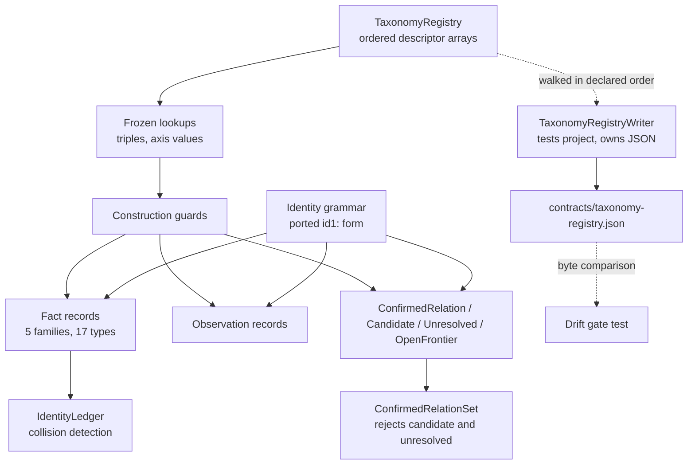

# Knowledge Taxonomy Contract Design

**Spec**: `.specs/features/knowledge-taxonomy-contract/spec.md`
**Context**: `.specs/features/knowledge-taxonomy-contract/context.md`
**Status**: Approved

---

## Architecture Overview

One declarative table is the taxonomy. `TaxonomyRegistry` inside `Csharp2Md.Domain` holds ordered descriptor arrays for families, fact types, observation kinds, facet axes, relations with their registered triples and minimum evidence method, mapping roles, proof-state axes and version axes. Every construction-time guard queries that table, and the emitter in the test project walks the same table in declared order to write `contracts/taxonomy-registry.json`. Enforcement and published contract therefore read one source and cannot diverge.

Ordering discipline carries the drift gate. Declared arrays are `ImmutableArray<T>` in authored order; `FrozenSet` and `FrozenDictionary` are derived from them for lookup only and are never enumerated for output, because frozen-collection enumeration order is unspecified.



The dashed edges are the only place JSON appears. `Csharp2Md.Domain` never references `System.Text.Json`, satisfying AD-006 and TAX-02.

---

## Active decision conformance

| Decision | How this design conforms |
| --- | --- |
| AD-001 standardized generator-owned taxonomy | The registry is the versioned machine-readable taxonomy; structural, classified, confirmed and candidate records are separate types |
| AD-002 no compatibility constraint | The `id1:` grammar is reused because it is sound, not because anything depends on it |
| AD-003 Roslyn and trust boundary | The domain references nothing; no Roslyn or MSBuild type appears in any signature |
| AD-004 evidence before promotion | `PromotionRecord` carries required observations, accepted evidence methods, negative conditions and rejected candidates with causes |
| AD-006 deep modules and storage seam | The domain is the innermost module with no I/O; the emitter lives outside it |
| AD-010 proof states, not numeric confidence | Three independent enums replace legacy `FactResolution`; no numeric confidence member exists |
| AD-012 documentation and implementation migration | No legacy spec or schema is revived; only two identity source files are ported |

No active decision conflicts with this design, so nothing is superseded. One new project-level decision is proposed in Tech Decisions below.

---

## Code Reuse Analysis

### Existing Components to Leverage

| Component | Location | How to Use |
| --- | --- | --- |
| `FactIdGrammar` | `src/Csharp2Md.Core/Facts/Identity/FactId.cs:22` | Port the source into `Csharp2Md.Domain/Identity/`. Supplies the `id1:type;key=value` form, percent-encoding, `ValidateRelativePath` and `RequireCanonicalText` — the substance of TAX-68 through TAX-71 and TAX-76 |
| `FactId` | `src/Csharp2Md.Core/Facts/Identity/FactId.cs:5` | Port the `readonly record struct` shape with its uninitialized-value guard; keep `Type` so a fact reference can be triple-checked without loading the fact |
| `CanonicalSymbolSignature` | `src/Csharp2Md.Core/Facts/Identity/CanonicalSymbolSignature.cs:13` | Port as the `Symbol` identity component. Its `-` sentinel for absent parameter and type-argument lists is the pattern for every optional identity component |
| `Evidence` ordering | `src/Csharp2Md.Core/Facts/Metadata/Evidence.cs:46` | Apply the same ordinal, document-then-span comparison shape to `EvidenceLocator`, so evidence sorts deterministically |
| Existing xUnit and Verify conventions | `tests/Csharp2Md.Core.Tests/Csharp2Md.Core.Tests.csproj` | Mirror the package set and test style in the new `tests/Csharp2Md.Domain.Tests` project |
| Global `System.Collections.Immutable` using | `Directory.Build.props:25` | Already available to every project, so `ImmutableArray<T>` needs no using directive |

Porting means copying source, not referencing: `FactIdGrammar` is `internal` and `FactId`'s constructor is `internal`, and TAX-06 forbids a reference to `Csharp2Md.Core` in either direction. Legacy copies are deleted with the rest of `Csharp2Md.Core` in workstream 2.

### Deliberately not reused

| Component | Location | Why not |
| --- | --- | --- |
| `FactResolution` and `FactResolutionAlgebra` | `src/Csharp2Md.Core/Facts/Model/FactResolution.cs:3` | One enum mixes resolution (`Candidate`, `Unresolved`) with evidence method (`Syntactic`) and a confidence gradient (`Partial`, `Heuristic`) — the exact defect AD-001 and AD-010 exist to remove. `Stronger`/`Rank` is precedence-by-strength, which the taxonomy forbids for conflicting classifiers |
| `ResolutionKind` | `src/Csharp2Md.Core/ResolutionKind.cs` | Superseded by the three independent axes |
| `schemas/facts.schema.json` | `schemas/facts.schema.json` | Legacy wire contract; the new registry lands at `contracts/taxonomy-registry.json` and wire schemas belong to workstream 3 |

### Integration Points

| System | Integration Method |
| --- | --- |
| `csharp2md.slnx` | Add `src/Csharp2Md.Domain` under the `src` folder and `tests/Csharp2Md.Domain.Tests` under `tests`; legacy projects stay listed and untouched |
| `Directory.Build.props` | Inherited unchanged. `net10.0` comes from the new project's own `TargetFramework`; `NetLibVersion` exists as a property but the legacy projects set the framework themselves |
| `Directory.Packages.props` | Only the test project adds package versions; the domain project adds none |

---

## Components

### `Csharp2Md.Domain` project

- **Purpose**: The taxonomy contract as a dependency-free assembly.
- **Location**: `src/Csharp2Md.Domain/`
- **Interfaces**: none beyond the types below.
- **Dependencies**: the .NET base class library only. No `PackageReference`, no `ProjectReference`.
- **Reuses**: `Directory.Build.props` settings, including `Nullable`, `ImplicitUsings`, `TreatWarningsAsErrors` and the global `System.Collections.Immutable` using.

### Identity

- **Purpose**: Deterministic identities that exclude absolute paths, locations, labels and timestamps.
- **Location**: `src/Csharp2Md.Domain/Identity/`
- **Interfaces**:
  - `FactIdGrammar.Create(string type, params ReadOnlySpan<(string Key, string Value)> components): FactId` — ported.
  - `FactIdGrammar.ValidateRelativePath(string path, string parameterName): string` — ported.
  - `FactIdGrammar.RequireCanonicalText(string value, string parameterName): string` — ported.
  - `WorkspaceIdentity.Create(string logicalName): WorkspaceIdentity` — scopes globally composable identities (TAX-72).
  - `SolutionId.Create(WorkspaceIdentity workspace, string logicalRelativePath): SolutionId`
  - `ProjectId.Create(SolutionId solution, string logicalRelativePath, LogicalKey? logicalKey): ProjectId` — the optional key preserves identity across a path change (TAX-74, TAX-75).
  - `AnalysisVariantId.Create(string targetFramework, string configuration, ImmutableArray<string> symbols, string environment): AnalysisVariantId`
  - `FactReference` — `readonly record struct (FactId Id, string FactType)`, the triple-checkable handle.
- **Dependencies**: none.
- **Reuses**: the two ported legacy files.

### `IdentityLedger`

- **Purpose**: Detect identity collisions across a set of facts and fail naming both participants (TAX-77).
- **Location**: `src/Csharp2Md.Domain/Identity/IdentityLedger.cs`
- **Interfaces**:
  - `Register(FactReference reference): void` — throws `ArgumentException` naming both fact types when an identity string is already held by a different fact.
  - `Count: int`
- **Dependencies**: `FactReference`.
- **Reuses**: nothing; internally a `Dictionary<string, FactReference>` with ordinal comparison.

### Facets

- **Purpose**: Closed vocabularies as independent axes, with an explicit CLR-to-wire pairing.
- **Location**: `src/Csharp2Md.Domain/Facets/`
- **Interfaces**:
  - Enums `BoundaryProtocol`, `BoundaryDirection`, `BoundaryRole`, `DataStoreTechnology`, `DataObjectForm`, `DataOperationKind`, `SymbolFacet`, `MappingStateKind`.
  - `FacetAxes.WireValue<TEnum>(TEnum value): string` — resolves through the paired table, throwing `ArgumentOutOfRangeException` naming the axis and value when undefined (TAX-25).
  - `SymbolFacetSet.Create(IEnumerable<SymbolFacet> facets): SymbolFacetSet` — normalized, distinct, ordered.
- **Dependencies**: `TaxonomyRegistry` for the axis names and values.
- **Reuses**: nothing.

Wire values are paired explicitly with enum members rather than derived from member names. A derived camel-to-kebab conversion happens to produce every current value correctly, which is exactly what makes it dangerous: a future rename would silently change the published contract. A test asserts the pairing is total and injective in both directions.

### Facts

- **Purpose**: The five families and their seventeen types as immutable records.
- **Location**: `src/Csharp2Md.Domain/Facts/` with one folder per family.
- **Interfaces**:
  - `IFact` — `FactReference Reference { get; }` and `FactFamily Family { get; }`.
  - `sealed record Solution`, `Project`, `Document`, `Symbol`; `Component`, `DeploymentUnit`, `EntryPoint`, `BoundaryOperation`, `ExternalSystem`; `Contract`, `ContractBinding`, `ContractRevision`; `DataStore`, `DataObject`, `DataField`, `DataOperation`; `ConfigurationBinding`.
  - Each type exposes a static `Create(...)` that validates its identity components and facets and throws naming the missing or rejected one.
- **Dependencies**: Identity, Facets, Literals, `TaxonomyRegistry`.
- **Reuses**: nothing.

`EntryPoint` and `BoundaryOperation` are separate records with no conversion between them, and one `Symbol` may be referenced by both (TAX-27, TAX-28). Callable is a `SymbolFacet` value, not a type (TAX-14).

### Observations

- **Purpose**: Immutable extracted occurrences whose identity ignores location.
- **Location**: `src/Csharp2Md.Domain/Observations/`
- **Interfaces**:
  - `enum ObservationKind` — the ten kinds; `enum EmissionTier { AlwaysWhenBindable, RegisteredContextOnly }`.
  - `Observation.Create(FactReference owner, ObservationKind kind, NormalizedPayload payload, int occurrenceOrdinal, EvidenceLocator locator, EvidenceMethod extractionMethod, BindingDiagnostic diagnostic, DocumentHash documentHash, ExtractorVersion extractorVersion): Observation`
  - `ObservationIdentity` — `readonly record struct` over owner, kind, normalized payload and ordinal only (TAX-35 through TAX-37).
- **Dependencies**: Identity, Proof.
- **Reuses**: the `Evidence` comparison shape for `EvidenceLocator`.

No member of this namespace names a Roslyn type; `NormalizedPayload` is an ordered array of canonical key-value pairs (TAX-40).

### Relations

- **Purpose**: The twelve canonical relations with construction-time triple validation.
- **Location**: `src/Csharp2Md.Domain/Relations/`
- **Interfaces**:
  - `enum RelationKind` — twelve members, no `references` and no `dependsOn` (TAX-43).
  - `ConfirmedRelation.Create(RelationKind kind, FactReference source, FactReference target, FacetBinding facets, EvidenceChain derivedFrom, ClassifierIdentity classifier, ImmutableArray<AnalysisVariantId> variants): ConfirmedRelation`
  - `CandidateLink.Create(...)`, `UnresolvedRecord.Create(RelationKind kind, FactReference source, UnresolvedCause cause, EvidenceChain available)`, `OpenFrontier.Create(ObservationIdentity occurrence, FrontierCause cause)`.
  - `ConfirmedRelationSet.Add(ConfirmedRelation relation): void` — rejects any record whose resolution is not `Confirmed` (TAX-62).
- **Dependencies**: Identity, Facets, Proof, `TaxonomyRegistry`.
- **Reuses**: nothing.

`ConfirmedRelation.Resolution` is a computed property fixed at `Resolution.Confirmed` with no setter and no constructor parameter, so TAX-61 holds structurally rather than by validation.

### Proof

- **Purpose**: The three independent axes and the promotion audit trail.
- **Location**: `src/Csharp2Md.Domain/Proof/`
- **Interfaces**:
  - `enum EvidenceMethod { Semantic, Syntactic, Configured }`, `enum Resolution { Confirmed, Candidate, Unresolved }`, `enum Frontier { Closed, Open }`.
  - `EvidenceChain.Create(ImmutableArray<ObservationIdentity> derivedFrom): EvidenceChain` — rejects an empty chain.
  - `ClassifierIdentity` — `readonly record struct (string Id, int Version)`.
  - `PromotionRecord.Create(...)` carrying required observations, accepted evidence methods, negative conditions, produced facts, produced relations, produced facets, rejected candidates and the classifier identity (TAX-66, TAX-67).
  - `RejectedCandidate` — carries its rejection cause; construction without one throws.
- **Dependencies**: Identity, Observations.
- **Reuses**: nothing. Explicitly replaces legacy `FactResolution`.

### Literals

- **Purpose**: Bound which literals may enter payloads and model suspected-secret evidence without the secret.
- **Location**: `src/Csharp2Md.Domain/Literals/`
- **Interfaces**:
  - `enum LiteralRole { Route, ProtocolName, Channel, SchemaName, TableName, FieldName, ConfigurationKey, ClientName }`
  - `StructuralLiteral.Create(LiteralRole role, string value): StructuralLiteral` — the only way a literal reaches a fact or observation payload (TAX-79, TAX-80).
  - `SuspectedSecretEvidence.Create(DocumentId document, SourceSpan span, DocumentHash hash, RedactedExcerpt excerpt): SuspectedSecretEvidence` — no member accepts or exposes the original literal or a hash of it (TAX-81, TAX-82).
- **Dependencies**: Identity.
- **Reuses**: nothing.

### `TaxonomyRegistry`

- **Purpose**: The single declarative taxonomy that both enforcement and emission read.
- **Location**: `src/Csharp2Md.Domain/Registry/`
- **Interfaces**:
  - `FactTypes: ImmutableArray<FactTypeDescriptor>`, `ObservationKinds: ImmutableArray<ObservationKindDescriptor>`, `FacetAxes: ImmutableArray<FacetAxisDescriptor>`, `Relations: ImmutableArray<RelationDescriptor>`, `MappingRoles: ImmutableArray<string>`, `ProofAxes: ImmutableArray<FacetAxisDescriptor>`, `Versions: TaxonomyVersions`.
  - `IsRegisteredTriple(RelationKind kind, string sourceFactType, string targetFactType): bool`
  - `RequireRegisteredTriple(RelationKind kind, string sourceFactType, string targetFactType): void` — throws `ArgumentException` naming all three (TAX-45).
  - `MinimumEvidenceMethod(RelationKind kind): EvidenceMethod` (TAX-52).
  - `RequireSufficientEvidence(RelationKind kind, EvidenceMethod supplied): void` (TAX-53).
- **Dependencies**: Facets, Proof, Relations enums.
- **Reuses**: nothing.

Initialization derives a `FrozenSet<RelationTripleKey>` and per-axis `FrozenSet<string>` from the ordered arrays, and fails if one relation triple is declared twice, which also fails the emitter (TAX-90).

### `TaxonomyRegistryWriter` (test project)

- **Purpose**: Project the registry to deterministic JSON, keeping JSON out of the domain.
- **Location**: `tests/Csharp2Md.Domain.Tests/Registry/TaxonomyRegistryWriter.cs`
- **Interfaces**:
  - `Write(): string` — walks the ordered arrays and returns UTF-8 JSON with two-space indent and LF endings.
  - `CommittedPath: string` — resolves `contracts/taxonomy-registry.json` from the repository root.
- **Dependencies**: `Csharp2Md.Domain`, `System.Text.Json`.
- **Reuses**: the repository-root resolution pattern in `tests/Csharp2Md.Core.Tests/TestPaths.cs`.

---

## Data Models

Registry descriptors, the load-bearing shapes:

```csharp
public enum FactFamily { Structural, Architecture, Contract, Persistence, Configuration }

public sealed record FactTypeDescriptor(
    FactFamily Family,
    string Name,
    ImmutableArray<string> IdentityComponents);

public sealed record ObservationKindDescriptor(
    ObservationKind Kind,
    string WireName,
    EmissionTier Tier);

public sealed record FacetAxisDescriptor(
    string Name,
    ImmutableArray<string> Values);

public readonly record struct RelationTriple(
    string SourceFactType,
    string TargetFactType);

public sealed record RelationDescriptor(
    RelationKind Kind,
    string WireName,
    ImmutableArray<RelationTriple> Triples,
    EvidenceMethod MinimumEvidenceMethod);

public sealed record TaxonomyVersions(
    int SchemaVersion,
    int TaxonomyVersion,
    int ObservationSchemaVersion,
    int ExtractorSetVersion,
    int ClassifierSetVersion);
```

**Relationships**: `FactTypeDescriptor.Name` is the same token that appears in `FactReference.FactType` and in both ends of `RelationTriple`, which is what lets a triple be validated from a reference alone without materializing facts.

The confirmed relation, showing where each invariant lives:

```csharp
public sealed record ConfirmedRelation
{
    public RelationKind Kind { get; }
    public FactReference Source { get; }
    public FactReference Target { get; }
    public FacetBinding Facets { get; }
    public EvidenceChain DerivedFrom { get; }
    public ClassifierIdentity Classifier { get; }
    public ImmutableArray<AnalysisVariantId> AnalysisVariants { get; }

    // Structural, not validated: no parameter and no setter exists.
    public Resolution Resolution => Resolution.Confirmed;

    public static ConfirmedRelation Create(/* as listed above */);
}
```

---

## Error Handling Strategy

Rejection throws, matching the established convention in `FactIdGrammar` and `Evidence`. No result type is introduced.

| Error Scenario | Handling | Caller Impact |
| --- | --- | --- |
| Facet value outside a closed axis, including an undefined enum reached by cast | `ArgumentOutOfRangeException` naming the axis and the rejected value | TAX-25 |
| Unregistered relation triple | `ArgumentException` naming source fact type, relation and target fact type | TAX-45 |
| `uses-contract` without a registered payload role | `ArgumentException` naming the relation and the missing role | TAX-49 |
| Evidence weaker than the relation's registered minimum | `ArgumentException` naming the relation, the required method and the supplied method | TAX-53 |
| Missing required observation metadata | `ArgumentException` naming the missing component | TAX-39 |
| Missing required identity component | `ArgumentException` naming the missing component; no partial identity is produced | TAX-76 |
| Two distinct facts on one identity string | `ArgumentException` from `IdentityLedger` naming both fact types | TAX-77 |
| Candidate or unresolved record added to `ConfirmedRelationSet` | `ArgumentException` naming the offending resolution | TAX-62 |
| Literal outside the allowlist | `ArgumentException` naming the field and the role | TAX-80 |
| Duplicate relation triple in the registry | Registry initialization throws, which fails every consumer including the emitter | TAX-90 |
| Value read from an uninitialized identity struct | `InvalidOperationException`, matching the ported legacy guard | Programmer error |

---

## Risks & Concerns

| Concern | Location (file:line) | Impact | Mitigation |
| --- | --- | --- | --- |
| Legacy resolution enum conflates three axes and ranks by strength | `src/Csharp2Md.Core/Facts/Model/FactResolution.cs:3` | Porting it would reintroduce the defect AD-001 and AD-010 remove | Listed as deliberately not reused; a test asserts no domain type exposes a combined resolution and none exposes a numeric confidence |
| `FactIdGrammar` is `internal` and `FactId`'s constructor is `internal` | `src/Csharp2Md.Core/Facts/Identity/FactId.cs:13` | Cannot be referenced even if TAX-06 allowed it | Copy the source into the domain; legacy copies die with workstream 2 |
| `Encode` throws on any whitespace-only component and reports no parameter name | `src/Csharp2Md.Core/Facts/Identity/FactId.cs:72` | An absent optional component would abort identity creation with an unattributable error | Port with an explicit parameter name and the `-` sentinel already used at `CanonicalSymbolSignature.cs:48` for absent lists |
| `TreatWarningsAsErrors` is on for every project | `Directory.Build.props:7` | Partial scaffolding, unused private members or nullable gaps break the whole solution build | Each task's gate is a full `csharp2md.slnx` build; no half-authored type is committed |
| `Version` is pinned to `4.0.0` for all projects and documented as the legacy schema-2 signal | `Directory.Build.props:10` | The new domain inherits a version tied to a contract it replaces | Left untouched here; assembly version is not one of the five taxonomy axes. Flagged for workstream 2, which owns legacy removal |
| Frozen collection enumeration order is unspecified | Design-level | Emitting from a frozen collection would make the drift gate flaky rather than deterministic | Emit only from ordered `ImmutableArray<T>`; frozen collections are lookup-only, asserted by the writer's structure |
| Enum members are reachable by cast, so the compiler does not close a vocabulary | Design-level | `(BoundaryProtocol)99` would otherwise flow into a fact | Every facet entry point validates with `Enum.IsDefined` before use |
| Wire names derived from CLR member names would silently change on rename | Design-level | A refactor could alter the published contract with no failing test | Explicit paired table plus a totality and injectivity test |
| Legacy identity tests are deleted with the legacy test project in workstream 2 | `tests/Csharp2Md.Core.Tests/Facts/Identity/FactIdentityTests.cs` | The ported grammar would lose its coverage mid-migration | Grammar tests are re-authored in `tests/Csharp2Md.Domain.Tests` against TAX-68 through TAX-71 |

---

## Tech Decisions

| Decision | Choice | Rationale |
| --- | --- | --- |
| Registry representation | Ordered `ImmutableArray` descriptor tables in the domain, frozen lookups derived from them | Makes emission a deterministic ordered walk and makes enforcement and contract read one source |
| Rejection mechanism | Throw BCL exceptions | Matches `FactIdGrammar` and `Evidence`; resolves the spec's open assumption |
| Identity grammar | Port the `id1:` form and keep the prefix | Grammar mechanics are unchanged; only the component set differs, and AD-002 removes any compatibility obligation |
| Wire naming | Explicit CLR-to-wire pairing tables | A derived conversion would tie the published contract to CLR member names |
| `Resolution` on a confirmed relation | Computed property with no parameter | Makes TAX-61 structural rather than a runtime check |
| Facet sets on symbols | Ordered distinct `SymbolFacetSet` rather than a `[Flags]` enum | Flags defeat `Enum.IsDefined` validation and produce no stable wire ordering |
| Registry file location | `contracts/taxonomy-registry.json` | `schemas/` is deleted in workstream 2 |
| Emitter placement | `tests/Csharp2Md.Domain.Tests` | AD-006 forbids JSON in the domain, and the emitter's only consumer is the drift gate |

**Proposed project-level decision** — append to `.specs/STATE.md` as `AD-013` at approval: the domain-declared taxonomy registry is the single authority for families, types, facets, relation triples, minimum evidence methods and version axes; it is emitted to a committed artifact guarded by a byte-comparison drift gate, and every taxonomy rule is enforced at construction rather than re-implemented per layer. Workstreams 2 through 8 validate against this registry instead of restating it.
