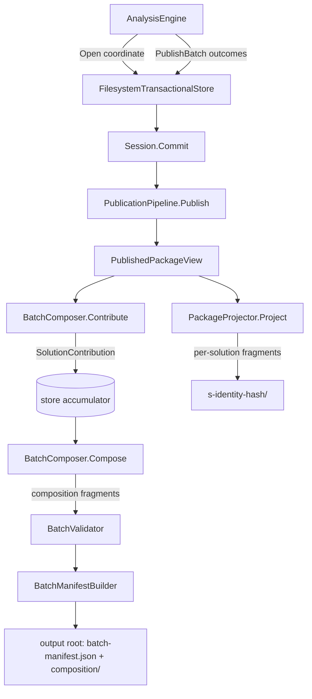

# Multi-Solution Composition Design

**Spec**: `.specs/features/multi-solution-composition/spec.md`
**Status**: Draft

---

## Architecture Overview

Composition is a second projection stage that runs once per invocation, after the last per-solution `Commit()`. It reuses the AD-019 shape exactly: `Csharp2Md.Storage` declares the port, `Csharp2Md.Projection` implements it, `Csharp2Md.Storage` writes the manifest.

Each successful `Commit()` already builds a `PublishedPackageView` inside `PublicationPipeline.Publish`. That view is where every fact's `(artifactKey, ordinal)` lives, so the composer extracts a bounded `SolutionContribution` from it at that moment and the store keeps it. `Csharp2Md.Analysis` never sees an artifact key or an ordinal — it hands back only outcome metadata — so AD-022's "the port gains no projection member" holds.



The accumulator is registered only after a package directory is actually on disk, so a solution that fails staging or replacement contributes nothing (MSC-39).

---

## Code Reuse Analysis

### Existing Components to Leverage

| Component | Location | How to Use |
| --- | --- | --- |
| `PublishedPackageView.TryLocate` | [PublishedPackageView.cs:99](src/Csharp2Md.Storage/Mapping/PublishedPackageView.cs#L99) | Already returns `(ArtifactKey, Ordinal)` per fact id — the whole locator half of MSC-17 |
| `BoundaryOperationDto` | [ArchitectureFactDtos.cs:22](src/Csharp2Md.Storage/Wire/ArchitectureFactDtos.cs#L22) | Carries `Direction`, `Protocol`, `DestinationScope`, `HttpMethod`, `Route`, `ProtocolOperationKey` — every matching input, no new extraction |
| `ShardWriter.Write` | [ShardWriter.cs:12](src/Csharp2Md.Projection/ShardWriter.cs#L12) | Sorts and buckets by whatever string key it is given, so composite composition sort keys work unchanged (MSC-27, MSC-28) |
| `CanonicalJson.Write` | `src/Csharp2Md.Storage/Wire/CanonicalJson.cs` | Deterministic bytes for every composition artifact and the batch manifest |
| `FilesystemIo` + `FilesystemRetryPolicy` | [FilesystemIo.cs:12](src/Csharp2Md.Storage/FilesystemIo.cs#L12) | Staging-then-replace with the Windows file-lock retry added in `594e659` |
| `ManifestBuilder` | [ManifestBuilder.cs](src/Csharp2Md.Storage/Mapping/ManifestBuilder.cs) | Pattern to copy for `BatchManifestBuilder`: Projection emits payloads, Storage emits the manifest |
| `ProjectionValidator` | [ProjectionValidator.cs:12](src/Csharp2Md.Storage/Validation/ProjectionValidator.cs#L12) | Pattern to copy for `BatchValidator` |
| `FacetAxes.WireValue` | [FacetAxes.cs:15](src/Csharp2Md.Domain/Facets/FacetAxes.cs#L15) | Source of `"inbound"`, `"outbound"`, `"http"`, `"messaging"` — the matcher never hard-codes those literals |
| `PackageProjector.HasNoFacts` | [PackageProjector.cs:44](src/Csharp2Md.Projection/PackageProjector.cs#L44) | Same "publish nothing when there is nothing" rule, applied per composition artifact (MSC-29) |
| `fixtures/SyntheticSolution` | `Acme.Orders.slnx`, `Acme.Payments.slnx` | Already a real two-solution batch sharing `Acme.Shared.Contracts`; supplies the MSC-20 and MSC-19 negative cases as they stand |

### Integration Points

| System | Integration Method |
| --- | --- |
| `ITransactionalStore` | Gains `PublishBatch`; `Open` takes a `SolutionCoordinate` with a path-taking overload so existing call sites keep compiling |
| `CommandFactory` | No new option. `AnalysisEngine` drives composition; the CLI only maps a batch failure onto the existing non-zero exit |
| `contracts/taxonomy-registry.json` | Untouched. No fact type, relation triple or facet is added — the AD-013 drift gate stays green |

---

## Components

### `SolutionCoordinate`

- **Purpose**: One place that turns a solution path into the identity and file name every layer needs, replacing three copies of the same expression.
- **Location**: `src/Csharp2Md.Analysis/Storage/SolutionCoordinate.cs`
- **Interfaces**:
  - `SolutionCoordinate.For(string solutionPath): SolutionCoordinate` — `SolutionId.Create(WorkspaceIdentity.Create("default"), Path.GetFileName(path))` plus the file name
  - `Identity: SolutionId`, `SolutionFileName: string`
- **Dependencies**: `Csharp2Md.Domain.Identity`
- **Reuses**: The exact expression currently duplicated at [AnalysisEngine.cs:119](src/Csharp2Md.Analysis/AnalysisEngine.cs#L119) and [InventoryFacts.cs:20](src/Csharp2Md.Analysis/Inventory/InventoryFacts.cs#L20); both call sites collapse onto this.

### `ITransactionalStore` (extended)

- **Purpose**: Add batch publication to the write port without adding a projection member.
- **Location**: `src/Csharp2Md.Analysis/Storage/ITransactionalStore.cs`
- **Interfaces**:
  - `Open(SolutionCoordinate coordinate, ISourceDocumentReader reader): IStoreSession`
  - `Open(string solutionPath, ISourceDocumentReader reader): IStoreSession` — overload delegating through `SolutionCoordinate.For`, so the 89 existing call sites are untouched
  - `PublishBatch(ImmutableArray<BatchSolutionRecord> solutions): void`
- **Dependencies**: `Csharp2Md.Domain.Identity`
- **Reuses**: `PublicationRejectedException` for every batch failure path.

`BatchSolutionRecord(SolutionId Identity, string SolutionFileName, PublicationStatus Status, string? FailingStage)` carries no fact data — that is the invariant an API-shape test asserts.

### `SolutionContribution`

- **Purpose**: The bounded projection-side view of one committed solution; the only thing composition is allowed to read (MSC-25).
- **Location**: `src/Csharp2Md.Storage/SolutionContribution.cs`
- **Dependencies**: none beyond primitives
- **Reuses**: Values copied verbatim from `PublishedPackageView`; nothing is derived or interpreted.

MSC-25 is enforced by construction rather than by discipline: `Compose` receives only `BatchView`, which reaches only `SolutionContribution`, which has no member typed `WireDocument`, `PublishedPackageView`, `ObservationDto`, `SymbolDto` or `byte`. A reflection test over the closure of `SolutionContribution`'s property types is the sensor.

### `IBatchComposer` (new port on Storage)

- **Purpose**: Let Projection own every derivation, exactly as `IPackageProjector` does for one solution.
- **Location**: `src/Csharp2Md.Storage/IBatchComposer.cs`
- **Interfaces**:
  - `Contribute(PublishedPackageView view, SolutionCoordinate coordinate, string packageDirectory): SolutionContribution`
  - `Compose(BatchView batch): ImmutableArray<StagedFragment>`
- **Dependencies**: `PublishedPackageView`, `StagedFragment`
- **Reuses**: The AD-019 port-and-implementation split verbatim.

### `BatchComposer`

- **Purpose**: Implement the two derivations — extraction and matching.
- **Location**: `src/Csharp2Md.Projection/Composition/BatchComposer.cs`
- **Interfaces**: `IBatchComposer`
- **Dependencies**: `Csharp2Md.Storage`, `Csharp2Md.Domain.Facets`
- **Reuses**: `ShardWriter.Write`, `CanonicalJson.Write`, `FacetAxes.WireValue`.

Matching rules, all pure string equality over values the packages already publish:

| Artifact | Rule | ACs |
| --- | --- | --- |
| `composition/cross-solution-relations.json` | `a.Direction == outbound && a.Protocol == messaging && b.Direction == inbound && b.Protocol == messaging && a.ProtocolOperationKey == b.ProtocolOperationKey && a.Solution != b.Solution`; one entry per matched pair, relation kind `targets` | MSC-16, MSC-18, MSC-19, MSC-20 |
| `composition/shared-contracts.json` | Contract fact ids present in two or more distinct solutions | MSC-21, MSC-37 |
| `composition/correlation-candidates.json` | `a.Direction == outbound && a.Protocol == http && a.HttpMethod is not null && a.Route is not null && (a.HttpMethod + " " + a.Route) == b.ProtocolOperationKey && b.Direction == inbound && b.Protocol == http && a.Solution != b.Solution` | MSC-22, MSC-23 |
| `composition/components-and-deployment-units.json` | Every component and deployment unit, grouped by canonical name, never merged | MSC-30..33 |
| `composition/external-systems.json` | Same grouped form; the name comes from `ExternalSystemDto.Name.Value`, which is a `StructuralLiteralDto`, not a bare string | MSC-34 |

Sort keys handed to `ShardWriter.Write`, joined by ``:

- relations and candidates: `sourceSolution, sourceFactId, targetSolution, targetFactId` (MSC-26)
- shared contracts: `contractFactId`; owning solutions sorted by solution identity (MSC-27)
- grouped catalogs: `canonicalName, solutionIdentity, factId` (MSC-31)

### `BatchValidator`

- **Purpose**: Prove every composition entry resolves before anything is written.
- **Location**: `src/Csharp2Md.Storage/Validation/BatchValidator.cs`
- **Interfaces**: `Validate(BatchView batch, ImmutableArray<StagedFragment> fragments): void`
- **Dependencies**: `BatchView`
- **Reuses**: `ProjectionValidator`'s structure and its `PublicationRejectedException` failure mode.

Checks: every cited solution identity belongs to the batch; every `(artifactKey, ordinal)` matches a contribution entry; no entry pairs a solution with itself; no artifact is published empty.

### `BatchManifestBuilder`

- **Purpose**: Build `batch-manifest.json` — a manifest, so Storage owns it, mirroring `ManifestBuilder`.
- **Location**: `src/Csharp2Md.Storage/Mapping/BatchManifestBuilder.cs`
- **Interfaces**: `From(BatchView batch, ImmutableArray<StagedFragment> composition): BatchManifestEnvelope`
- **Dependencies**: `BatchView`
- **Reuses**: `ManifestBuilder`'s stem/entry shape and `CanonicalJson`.

### `FilesystemTransactionalStore` (changed)

- **Purpose**: Identity-derived directories, the contribution accumulator, and the root-level batch write.
- **Location**: `src/Csharp2Md.Storage/FilesystemTransactionalStore.cs`
- **Changes**:
  - `hex = sha256(coordinate.Identity.Value)[..32]` instead of `sha256(absolute path)[..32]` (MSC-02, MSC-05); `.lock` and `.staging` follow the same stem
  - `ManifestContext(coordinate.Identity.Value, coordinate.SolutionFileName)` (MSC-07)
  - a `Dictionary<string, SolutionContribution>` filled only after a directory replacement succeeds
  - `PublishBatch` takes a root lock, composes, validates, writes `composition.staging` and `batch-manifest.json.staging`, replaces both, then clears the accumulator
- **Reuses**: The existing lock, staging and retry machinery unchanged in shape.

### `InMemoryTransactionalStore` (changed)

- **Purpose**: Keep the two stores observationally identical, which is what MSC-07 asserts.
- **Changes**: same coordinate signature; publishes the identity as `solution_key`; rekeys `TryGetPublication` by identity; implements `PublishBatch` into an in-memory batch the tests read back.

### `AnalysisEngine` (changed)

- **Purpose**: Drive the batch after the per-solution loop.
- **Changes**: builds coordinates through `SolutionCoordinate.For`; `RejectDuplicateSolutionIdentities` reuses it (MSC-12); after the loop, calls `PublishBatch` with one `BatchSolutionRecord` per requested solution, committed or not (MSC-03, MSC-09, MSC-35); catches `PublicationRejectedException` and reports it on `AnalysisResult` (MSC-15).

---

## Data Models

### `SolutionContribution`

```csharp
public sealed record SolutionContribution(
    string SolutionIdentity,
    string SolutionFileName,
    string PackageDirectory,
    ImmutableArray<ContributedBoundaryOperation> BoundaryOperations,
    ImmutableArray<ContributedIdentity> Contracts,
    ImmutableArray<ContributedNamedIdentity> Components,
    ImmutableArray<ContributedNamedIdentity> DeploymentUnits,
    ImmutableArray<ContributedNamedIdentity> ExternalSystems);

public sealed record ContributedBoundaryOperation(
    string FactId, string FactType, string Direction, string? Protocol,
    string? DestinationScope, string? HttpMethod, string? Route,
    string? ProtocolOperationKey, string ArtifactKey, int Ordinal);

public sealed record ContributedIdentity(
    string FactId, string FactType, string ArtifactKey, int Ordinal);

public sealed record ContributedNamedIdentity(
    string FactId, string FactType, string Name, string ArtifactKey, int Ordinal);
```

### `BatchView`

```csharp
public sealed record BatchView(
    ImmutableArray<BatchSolutionRecord> Solutions,
    ImmutableArray<SolutionContribution> Contributions,
    bool Complete,
    string? IncompleteScopeReason);
```

`Complete` is `false` and `IncompleteScopeReason` is `"solution-unpublished"` whenever any record is `Unpublished` (MSC-10, MSC-11).

### `batch-manifest.json`

```json
{
  "schema_version": 1,
  "complete": false,
  "incomplete_scope_reason": "solution-unpublished",
  "solutions": [
    { "identity": "solution:workspace=…,path=Acme.Orders.slnx",
      "solution_file_name": "Acme.Orders.slnx",
      "package_directory": "s-<32 hex>",
      "status": "committed" },
    { "identity": "solution:workspace=…,path=Acme.Payments.slnx",
      "solution_file_name": "Acme.Payments.slnx",
      "package_directory": "s-<32 hex>",
      "status": "unpublished",
      "failing_stage": "Semantics" }
  ],
  "artifacts": [
    { "canonical_key": "composition/cross-solution-relations.json", "role": "payload", "count": 1 }
  ]
}
```

Solutions are ordered by identity; artifacts by canonical key (MSC-04).

---

## Error Handling Strategy

| Error Scenario | Handling | User Impact |
| --- | --- | --- |
| A solution fails before commit | Existing per-solution abort; the batch record carries `unpublished` plus the failing stage | Committed packages intact, `complete: false`, exit 2 |
| Every solution fails | Batch manifest written with zero committed entries and no composition artifact | `complete: false`, exit 2 (MSC-35) |
| Composition entry cites an unresolvable locator | `BatchValidator` throws `PublicationRejectedException("batch-composition", …)` before any root write | No batch manifest; every committed package untouched (MSC-15) |
| Root lock held by a concurrent invocation | `PublicationRejectedException("lock", outputRoot)`, matching `Open`'s behaviour | Batch not written; committed packages untouched |
| I/O failure during root staging or replacement | Retried under `FilesystemRetryPolicy.Default`, then `PublicationRejectedException("io", …)` | Same as above |
| Stale `s-*` directory from an earlier run | Left in place, not referenced | No data loss (MSC-13) |

---

## Risks & Concerns

| Concern | Location (file:line) | Impact | Mitigation |
| --- | --- | --- | --- |
| Fixture has no positive cross-solution pair: the only `HandleAsync` for `OrderPlaced` lives in `Acme.Orders`, and `Acme.Payments` exposes gRPC only | `fixtures/SyntheticSolution/Acme.Payments/PaymentsService.cs:13`, `fixtures/SyntheticSolution/Acme.Orders/Events/OrderPlacedEventHandler.cs:25` | MSC-16 and MSC-22 would have no end-to-end evidence | Add a restorable `Acme.Shipping` solution that handles `OrderPlaced` and exposes `POST shipments`, closing the `ShippingService` client call `OrderService.cs:44` already makes. `Acme.Payments` stays untouched so its deliberate unrestored state keeps serving P1-08 |
| Port signature change reaches 89 `Open(` call sites and 57 `TryGetPublication` call sites | `tests/**`, `src/**` | A mechanical break large enough to swamp the real work | Ship the `Open(string, reader)` overload delegating to `SolutionCoordinate.For`, and rekey `TryGetPublication` by identity behind the same helper; only tests asserting directory names or `solution_key` change |
| `FilesystemTransactionalStore` becomes stateful across sessions | `src/Csharp2Md.Storage/FilesystemTransactionalStore.cs` | A leaked accumulator would let one batch's contributions appear in the next | Accumulator scoped to the store instance and cleared by `PublishBatch`; a test runs two sequential batches on one store instance and asserts no bleed |
| `solution_key` diverges today: path hash in the filesystem store, raw key in the in-memory store | [FilesystemTransactionalStore.cs:177](src/Csharp2Md.Storage/FilesystemTransactionalStore.cs#L177), [InMemoryTransactionalStore.cs:80](src/Csharp2Md.Storage/InMemoryTransactionalStore.cs#L80) | Two stores publish different bytes for the same solution, so in-memory tests cannot guard the real manifest | MSC-07 makes both publish the identity, asserted by one test that runs the same snapshot through both stores |
| The `s-<hash>` rename orphans every previously generated output directory | `src/Csharp2Md.Storage/FilesystemTransactionalStore.cs:39` | Existing output trees stop being recognised as this batch's packages | AD-002 authorizes the break; MSC-13 leaves the orphans untouched rather than deleting them |
| `ExternalSystemDto.Name` is a `StructuralLiteralDto`, not a string, unlike `ComponentDto.Name` | [ArchitectureFactDtos.cs:37](src/Csharp2Md.Storage/Wire/ArchitectureFactDtos.cs#L37) | A grouped catalog that reads `.Name` uniformly would not compile or would group on the wrong value | Called out here so the task uses `.Name.Value` for external systems only |
| Inbound HTTP keys are `method + " " + template` only when a method observation exists, otherwise the bare template | [BoundaryPass.cs:101](src/Csharp2Md.Analysis/Classification/Passes/BoundaryPass.cs#L101) | A method-less inbound operation silently never matches | Intended: MSC-22 requires the joined form, so a method-less inbound op yields no candidate. A test pins that as deliberate, not accidental |
| Multi-project `dotnet test` hits MSB1008 in this repo | `.specs/STATE.md` carry-forward | A batch gate that runs all projects at once fails for the wrong reason | Run each test project separately, as every prior workstream did |

---

## Tech Decisions

| Decision | Choice | Rationale |
| --- | --- | --- |
| Contribution seam | Storage accumulates contributions built by the composer during `Commit()` | Keeps artifact keys and ordinals out of `Csharp2Md.Analysis`, so AD-022's "no projection member" survives |
| Who builds the batch manifest | Storage, not Projection | Mirrors `ManifestBuilder`: Projection emits payload fragments, Storage emits manifests |
| MSC-25 enforcement | Type-level — `Compose` reaches only `SolutionContribution` | An invariant the compiler and a reflection test hold, rather than a review convention |
| Composition atomicity | Root artifacts staged and replaced independently of the per-solution packages | The spec requires a committed package to survive both a sibling's failure and a batch write failure |
| Batch identity of a solution | `SolutionCoordinate.For`, one implementation | Three copies of the same expression is how MSC-02 and MSC-07 drift apart |
| Wire literals in the matcher | `FacetAxes.WireValue(...)` | Hard-coding `"outbound"` in Projection would duplicate the taxonomy AD-013 centralised |

> No new `AD-NNN` is proposed. The batch member is a publication member, so AD-022 is conformed to rather than superseded; AD-008, AD-014 and AD-019 are all satisfied as written.
