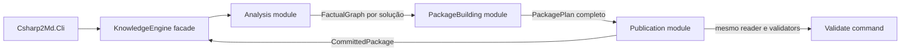
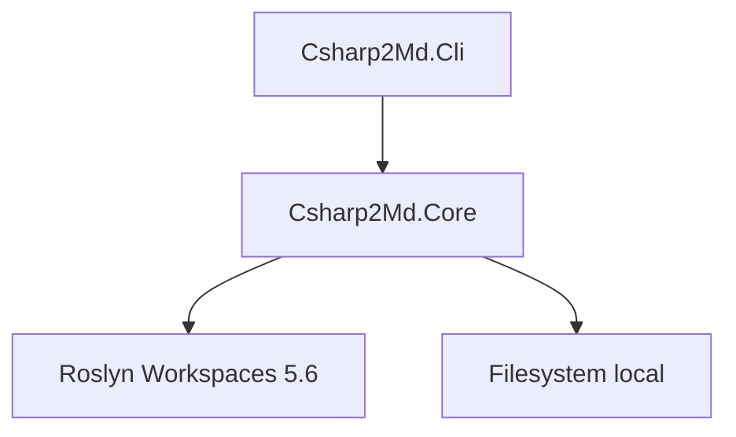
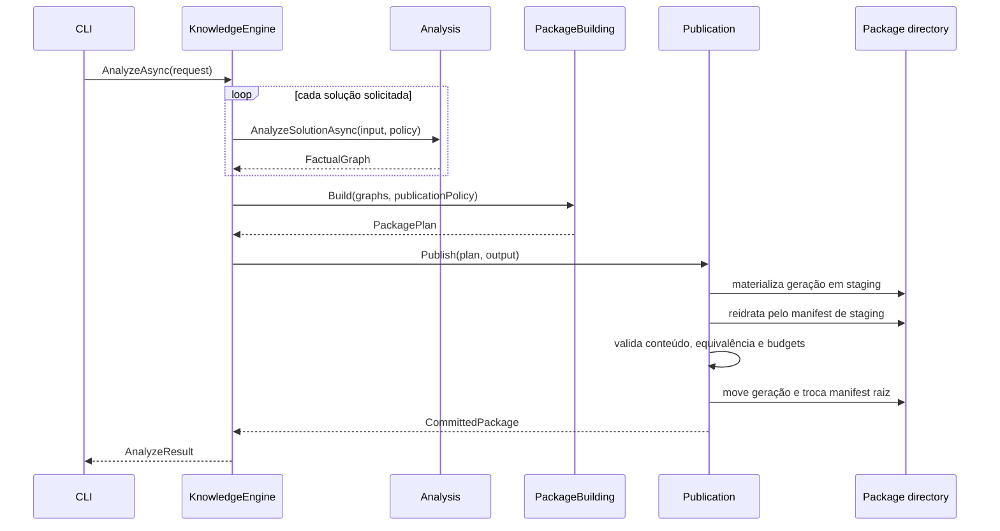
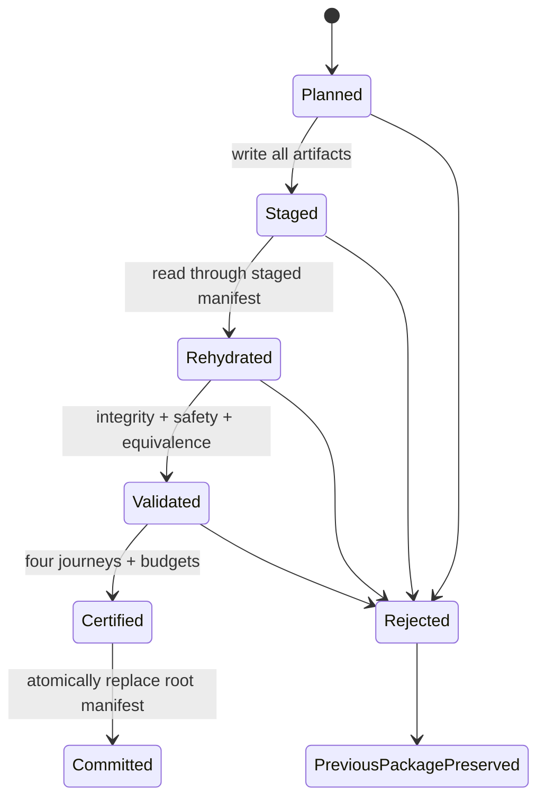

# Pacote de conhecimento útil e confiável Design

**Spec**: `.specs/features/pacote-conhecimento-util-e-confiavel/spec.md`
**Status**: Approved

---

## Architecture Overview

O produto terá dois assemblies: `Csharp2Md.Core` e `Csharp2Md.Cli`. O Core será um módulo profundo com uma facade pequena para a CLI. Sua implementação conterá três módulos internos orientados a resultados:

1. `Analysis` recebe uma solução e produz um `FactualGraph` em memória.
2. `PackageBuilding` recebe grafos e uma `PublicationPolicy` e produz um `PackagePlan` completo.
3. `Publication` recebe o plano, materializa uma geração privada, reidrata, valida, certifica e retorna um `CommittedPackage` somente após o commit.

`Csharp2Md.Cli` será o único seam externo do produto. Roslyn, passes, identidades canônicas, retenção, sharding, handles, staging e validação permanecem implementação interna do Core. O estado final removerá os projetos `Csharp2Md.Domain`, `Csharp2Md.Analysis`, `Csharp2Md.Storage` e `Csharp2Md.Projection`; nenhuma facade de compatibilidade os substituirá.



### Dependency direction



Não haverá abstração pública para filesystem ou Roslyn. Ambos são dependências locais exercitáveis com a fixture e diretórios temporários. Seams internos só serão criados quando houver duas implementações reais; testes não justificam portas de passagem por si sós.

### Analyze and commit sequence



### Commit state machine



O diretório publicado usa gerações imutáveis. O arquivo `manifest.json` na raiz é o commit marker e a única entrada do consumidor. Cada artefato referenciado pelo novo manifesto existe antes da troca. O publicador mantém lock exclusivo durante move, troca do manifesto e limpeza da geração anterior. O validador mantém lock compartilhado durante a leitura. Assim, um leitor observa integralmente a geração antiga ou a nova.

---

## Research Findings

- `MSBuildWorkspace.Create(properties)` aplica propriedades globais ao workspace. O pipeline atual combina isso com um loop de TFMs da solução e abre a solução inteira para cada TFM, o que permite que um framework de um projeto alcance outro projeto.
- Roslyn 5.6 expõe `MSBuildWorkspace.OpenProjectAsync` e `ProjectLoadProgress.TargetFramework`. O target framework reportado é válido para projetos SDK-style durante `ProjectLoadOperation.Resolve`. O módulo de análise usará esses seams públicos; não referenciará `Microsoft.Build.*` e não chamará `MSBuildLocator.RegisterDefaults()`.
- A avaliação inicial sem `TargetFramework` global descobrirá os pares resolvidos de projeto e TFM. Cada par será analisado como projeto raiz em um workspace próprio. Projetos carregados apenas como referências fornecem semântica à compilação, mas não produzem novamente ocorrências para outro projeto raiz.
- Referências oficiais: [Roslyn MSBuildWorkspace public surface](https://github.com/dotnet/roslyn/blob/main/src/Workspaces/MSBuild/Core/PublicAPI.Shipped.txt) e [MSBuild ProjectReference protocol](https://github.com/dotnet/msbuild/blob/main/documentation/ProjectReference-Protocol.md).

---

## Core Facade

### `KnowledgeEngine`

- **Purpose**: esconder os três módulos internos e entregar à CLI apenas resultados completos.
- **Location**: `src/Csharp2Md.Core/KnowledgeEngine.cs`
- **Interface**:

```csharp
public sealed class KnowledgeEngine
{
    public Task<AnalyzeResult> AnalyzeAsync(
        AnalyzeRequest request,
        CancellationToken cancellationToken = default);

    public PackageValidationResult Validate(ValidateRequest request);
}
```

- **Invariants**:
  - `AnalyzeAsync` nunca retorna status committed antes da validação e certificação da geração materializada.
  - Falhas esperadas retornam diagnósticos estruturados; cancelamento permanece `OperationCanceledException`.
  - `Validate` usa o mesmo `PackageReader`, `PackageValidator` e `JourneyCertifier` usados antes do commit.
  - A facade não expõe grafos, passes, shards, handles ou staging.
- **Dependencies**: módulos internos `Analysis`, `PackageBuilding` e `Publication`.
- **Reuses**: forma assíncrona e suporte a cancelamento do `AnalysisEngine` atual; não reutiliza sua dependência de store.

### CLI commands

- `analyze`: aceita uma ou mais soluções, diretório de saída e a opção explícita de incluir testes. Produz um único pacote multi-solução comprometido.
- `validate`: reidrata e valida um pacote existente sem tocar nas soluções-fonte.
- `compose` será removido. A composição de várias soluções acontece antes da construção de um único plano e de um único commit.
- Os códigos numéricos de saída podem mudar. O contrato preservado é: sucesso somente para pacote committed e certificado; qualquer rejeição produz código não zero e diagnóstico estruturado.

---

## Internal Modules

### Analysis module

- **Purpose**: transformar cada solução em um grafo factual isolado, sem persistência.
- **Location**: `src/Csharp2Md.Core/Analysis/`
- **Interface**:

```csharp
internal static class SolutionAnalyzer
{
    internal static Task<FactualGraph> AnalyzeAsync(
        SolutionInput input,
        AnalysisPolicy policy,
        CancellationToken cancellationToken);
}
```

- **Dependencies**: Roslyn Workspaces MSBuild 5.6, inventário de arquivos autorizado e classificadores factuais.
- **Reuses**:
  - algoritmos úteis de inventário, extração e classificação existentes em `src/Csharp2Md.Analysis`;
  - `PathGuard` para conter arquivos no root autorizado;
  - vocabulário factual atual quando seu comportamento ainda satisfizer a spec.
- **Does not reuse**:
  - `PipelineOrchestrator`, `IPipelineStage`, `PersistenceStage`, `ITransactionalStore` ou `FactualSnapshot`;
  - TFMs agregados no `PipelineContext`;
  - IDs persistidos atuais.

#### Project variant planning

1. Abrir a solução sem definir `TargetFramework` global e registrar `ProjectLoadProgress` de operações `Resolve`.
2. Normalizar cada par `(project logical path, evaluated target framework)` e deduplicá-lo por solução.
3. Abrir cada projeto raiz em workspace próprio com o TFM desse par.
4. Emitir fatos somente para o projeto raiz daquela avaliação; referências carregadas dão suporte semântico, mas não geram uma segunda cópia do projeto referenciado.
5. Identificar a variante por TFM, configuração, símbolos e ambiente avaliados.
6. Unificar entidades pela chave lógica. Guardar locator, shape e evidência em `VariantOccurrence`.
7. Rejeitar duas shapes incompatíveis para a mesma entidade dentro da mesma variante. Preservar shapes distintas entre variantes como ocorrências qualificadas.
8. Descartar workspaces assim que o grafo imutável estiver completo.

Um progresso sem TFM para projeto SDK-style, um TFM sem projeto correspondente ou uma avaliação ambígua falha como `variant-plan` em vez de inferir um valor.

### PackageBuilding module

- **Purpose**: reter conhecimento útil, construir dependências e medidas e produzir todos os bytes do pacote.
- **Location**: `src/Csharp2Md.Core/PackageBuilding/`
- **Interface**:

```csharp
internal static class PackageBuilder
{
    internal static PackagePlan Build(
        ImmutableArray<FactualGraph> graphs,
        PublicationPolicy policy);
}
```

- **Dependencies**: modelos internos do Core e serialização JSON source-generated.
- **Reuses**:
  - normalização determinística de `CanonicalJson`;
  - conceitos de agrupamento por família do `LayoutPlanner` e `ShardWriter`, reimplementados sobre o contrato novo;
  - taxonomia factual confirmada, sem carregar schemas ou DTOs wire legados.
- **Does not reuse**:
  - `WireDocument`, `PublishedPackageView`, projectors plugáveis, batch composer, catálogo legado ou arquivos por ocorrência.

#### Retention pipeline

1. Validar cada grafo e construir mapas de pertencimento comprovado.
2. Selecionar Component, Deployment Unit, Entry Point e Boundary Operation comprovados como raízes.
3. Percorrer Confirmed Relations causais até contratos, sistemas externos, persistência e efeitos observáveis.
4. Incluir relações de pertencimento, fatos estruturais, ocorrências e evidências necessários para resolver cada passo retido.
5. Incluir relações de entrada provenientes de outras raízes comprovadas quando atingirem uma entidade retida. Isso sustenta dependentes e impacto reverso sem admitir inventário desconectado.
6. Reter Candidate, Unknown e Open Frontier somente se sua origem ou alvo interromper ou puder alterar uma jornada retida.
7. Ordenar lacunas por jornadas afetadas, raízes afetadas e chave canônica.
8. Incluir apenas documentos citados por evidência retida. Excluir testes por padrão; quando habilitados, registrar a política no manifesto e no digest da execução.
9. Produzir contagens separadas para extraído, retido e filtrado por motivo.

Toda Confirmed Relation retida precisa resolver origem, destino e ao menos uma evidência. Caso contrário, ela é removida da classe confirmed ou o build falha quando a disposição correta não puder ser determinada.

#### Dependency and measurement pipeline

1. Categorizar cada Confirmed Relation retida como Project Reference, invocação interna, uso estrutural de tipo, HTTP, gRPC, mensageria, contrato ou persistência.
2. Subir origem e destino para Document, Project, Component e Deployment Unit somente por mapas de pertencimento comprovado.
3. Agregar arestas diretas por `(solution, scope, source, target, category)`.
4. Somar ocorrências antes de deduplicar relações e evidências. Preservar o conjunto de variantes observadas e as referências às relações factuais.
5. Calcular fan-in e fan-out por identidades distintas, cruzamentos entre componentes e ciclos por strongly connected components no grafo dirigido de cada escopo.
6. Calcular impacto reverso pelo índice incoming e persistir cada entidade alcançável com sua profundidade mínima.
7. Manter resultados transitivos separados das arestas diretas. Nenhuma travessia se torna Confirmed Relation.
8. Publicar quantidades de Candidate, Unknown e Open Frontier relevantes ao lado das medidas, sem incorporá-las aos números confirmados.

#### Retrieval model and renderers

`RetrievalModel` é o único input dos dois renderers. Seu agrupamento por solução é estrutural: raízes, dependências, medidas e grafo retido pertencem a um único `SolutionRetrievalModel` e nunca existem em coleções globais:

- `MachineArtifactWriter` produz tabelas, grafo, índices, dependências, medidas e impacto.
- `MarkdownRenderer` produz resumo, páginas de Component, Deployment Unit apresentada como serviço e documentos retidos.

O validador reidrata o `RetrievalModel` a partir dos artefatos de máquina, renderiza novamente o Markdown esperado e compara bytes. Essa regeneração prova equivalência e impede que Markdown e JSON evoluam por caminhos independentes.

### Publication module

- **Purpose**: transformar um plano completo em um pacote comprometido ou rejeitar sem alterar o pacote anterior.
- **Location**: `src/Csharp2Md.Core/Publication/`
- **Interfaces**:

```csharp
internal static class PackagePublication
{
    internal static CommittedPackage Publish(
        PackagePlan plan,
        string outputDirectory);

    internal static ValidatedPackage Validate(string packageDirectory);
}
```

- **Dependencies**: filesystem local, `PackageReader`, validators e certifier internos.
- **Reuses**:
  - retry restrito a operações locais transitórias de `FilesystemIo`;
  - ideia de manifest-led reading do `FactualPackageReader`;
  - testes de preservação e lock do store atual, reescritos pelo novo seam.
- **Does not reuse**:
  - `IStoreSession`, fragments deferred, `PublicationPipeline`, manifests antigos ou readers por versão.

#### Materialize, rehydrate, validate, commit

1. Adquirir lock exclusivo de publicação para o diretório de saída.
2. Criar staging irmão no mesmo volume.
3. Escrever todos os `PlannedArtifact` e o mesmo `manifest.json` que será comprometido.
4. Reidratar staging somente pelos caminhos declarados no manifesto.
5. Validar hashes, cardinalidades, handles, IDs, referências, segurança, determinismo estrutural e equivalência Markdown/máquina.
6. Executar as quatro jornadas aplicáveis e medir arquivos, bytes e tokens. `tokens = ceil(bytes UTF-8 / 4.0)` e o manifesto declara `csharp2md.tokens.bytes-per-token-v1` e `4.0`.
7. Reescrever em staging apenas os artefatos de certificação e medições previstos no plano; repetir reidratação e validação final.
8. Mover a geração validada para `generations/<package-digest>/`.
9. Trocar atomicamente o `manifest.json` raiz. O manifest referencia somente a nova geração imutável.
10. Remover a geração anterior sob o mesmo lock. Falha de limpeza posterior ao commit é diagnóstico operacional e não invalida a nova geração.
11. Liberar lock e retornar `CommittedPackage`.

Falha antes da troca do manifesto remove staging e preserva byte a byte o pacote anterior. O comando `validate` adquire lock compartilhado e executa os passos 4 a 7 sem escrever no pacote.

---

## Data Models

Os tipos abaixo definem forma e ownership. Nomes de campos podem ser ajustados durante Tasks sem alterar os invariantes.

### Analysis models

```csharp
internal sealed record FactualGraph(
    SolutionIdentity Solution,
    ImmutableArray<LogicalEntity> Entities,
    ImmutableArray<VariantOccurrence> Occurrences,
    ImmutableArray<EvidenceRecord> Evidence,
    ImmutableArray<FactualRelation> Relations,
    ImmutableArray<KnowledgeGap> Gaps,
    ImmutableArray<SourceDocumentSnapshot> Sources,
    ExtractionMeasurements Measurements);

internal sealed record LogicalEntity(
    EntityKind Kind,
    string CanonicalKey,
    string DisplayName,
    string? QualifiedName);

internal sealed record VariantOccurrence(
    string EntityCanonicalKey,
    ProjectIdentity Project,
    AnalysisVariant Variant,
    LogicalLocator Locator,
    string ShapeDigest,
    ImmutableArray<string> EvidenceCanonicalKeys);

internal sealed record AnalysisVariant(
    string TargetFramework,
    string Configuration,
    ImmutableArray<string> Symbols,
    string Environment);

internal sealed record EvidenceRecord(
    string CanonicalKey,
    string DocumentCanonicalKey,
    AnalysisVariant Variant,
    SourceSpan Span,
    string ContentDigest);
```

`LogicalLocator` contém somente caminho relativo autorizado, span e identidade do projeto. Caminhos absolutos existem apenas durante leitura local e nunca entram no grafo retornado.

### Retained and retrieval models

```csharp
internal sealed record RetainedGraph(
    ImmutableArray<RetainedEntity> Entities,
    ImmutableArray<RetainedRelation> Relations,
    ImmutableArray<RetainedGap> Gaps,
    ImmutableArray<EvidenceRecord> Evidence,
    ImmutableArray<SourceDocumentSnapshot> CitedSources,
    RetentionMeasurements Measurements);

internal sealed record AggregatedDependency(
    AggregationScope Scope,
    EntityHandle Source,
    EntityHandle Target,
    DependencyCategory Category,
    DependencyNature Nature,
    int OccurrenceCount,
    ImmutableArray<VariantHandle> Variants,
    ImmutableArray<RelationHandle> Relations,
    ImmutableArray<EvidenceHandle> Evidence);

internal sealed record ScopeMeasures(
    AggregationScope Scope,
    EntityHandle Entity,
    int FanIn,
    int FanOut,
    int CrossComponentEdges,
    ImmutableArray<CycleHandle> Cycles,
    ImmutableArray<ImpactTarget> ReverseImpact,
    GapCounts Gaps);

internal sealed record RetrievalModel(
    ImmutableArray<SolutionRetrievalModel> Solutions);

internal sealed record SolutionRetrievalModel(
    SolutionIdentity Solution,
    ImmutableArray<EntityHandle> Roots,
    ImmutableArray<AggregatedDependency> Dependencies,
    ImmutableArray<ScopeMeasures> Measures,
    RetainedGraph? RetainedGraph);
```

`RetrievalModel` não contém paths nem `NavigationIndexes`. O writer é dono do layout e deriva os índices a partir dos dados da solução.

### Identity and table models

```csharp
internal readonly record struct PublicId(string Value);       // ^[a-z]{3}_[0-9a-v]{16}$
internal readonly record struct LocalHandle(string Value);    // ^[0-9a-z]{1,6}$

internal sealed record IdentityEntry(
    PublicId Id,
    EntityKind Kind,
    string DisplayNameHandle,
    string? QualifiedNameHandle);

internal sealed record EvidenceEntry(
    LocalHandle Document,
    LocalHandle Variant,
    SourceSpan Span,
    string ContentDigest);
```

- O ID público usa um prefixo de tipo único e os primeiros 80 bits de SHA-256 da chave canônica em base32hex minúsculo.
- `PublicIdRegistry` mantém `PublicId -> canonical key` durante todo o build e rejeita colisão entre chaves distintas.
- Cada tabela ordena por chave canônica e atribui ordinais base36 a partir de `0`. Um ordinal acima de seis caracteres rejeita o build.
- Registros de relações, dependências, medidas e índices usam handles. ID público, caminho, nome e assinatura aparecem uma vez nas tabelas apropriadas.
- Deduplicação nunca atravessa a solução. O manifest raiz referencia tabelas separadas por `SolutionIdentity`.

### Package plan and publication models

```csharp
internal sealed record PackagePlan(
    PackageManifest Manifest,
    ImmutableArray<PlannedArtifact> Artifacts,
    string PackageDigest,
    PublicationMeasurements Measurements);

internal sealed record PlannedArtifact(
    RelativeArtifactPath Path,
    ArtifactFamily Family,
    ImmutableArray<byte> Payload,
    int RecordCount,
    string ContentDigest);

internal sealed record CommittedPackage(
    string PackageDirectory,
    string PackageDigest,
    PackageCertification Certification);

internal sealed record PackageManifest(
    string TokenEstimator,
    double TokenDivisor,
    bool IncludeTests,
    ImmutableArray<SolutionManifestEntry> Solutions);

internal sealed record SolutionManifestEntry(
    SolutionId Id,
    string LogicalRelativePath,
    ImmutableArray<RootManifestEntry> Roots,
    ImmutableArray<IndexManifestEntry> Indexes,
    ImmutableArray<JourneyManifestEntry> Journeys);

internal sealed record IndexManifestEntry(
    NavigationIndexKind Kind,
    string EntryPath);

internal sealed record JourneyManifestEntry(
    JourneyKind Kind,
    NavigationIndexKind EntryIndex);

internal sealed record PackageCertification(
    ImmutableArray<SolutionCertification> Solutions);

internal sealed record SolutionCertification(
    SolutionId SolutionId,
    ImmutableArray<JourneyCertification> Journeys);
```

O plano contém os bytes finais de todos os artefatos. Não existe fragmento diferido depois de `Build`. O staging pode escrever em streaming, mas não pode descobrir novos artefatos nem mudar payload fora do ciclo explícito de certificação.

---

## Package Layout

```text
<output>/
├── manifest.json
├── package.lock
└── generations/
    └── <package-digest>/
        ├── certification.json
        ├── measurements.json
        └── solutions/
            └── <solution-public-id>/
                ├── tables/
                │   ├── identities.<range>.json
                │   ├── documents.<range>.json
                │   ├── strings.<range>.json
                │   ├── variants.<range>.json
                │   └── evidence.<range>.json
                ├── graph/
                │   ├── entities.<range>.json
                │   ├── relations.<range>.json
                │   └── gaps.<range>.json
                ├── indexes/
                │   ├── identity.<range>.json
                │   ├── roots.json
                │   ├── outgoing.<range>.json
                │   ├── incoming.<range>.json
                │   ├── contracts.<range>.json
                │   ├── persistence.<range>.json
                │   └── evidence.<range>.json
                ├── measures/
                │   ├── dependencies.<range>.json
                │   ├── impact.<range>.json
                │   ├── cycles.json
                │   └── summary.json
                ├── markdown/
                │   ├── index.md
                │   ├── components/<handle>.md
                │   ├── deployment-units/<handle>.md
                │   └── documents/<handle>.md
                └── source/<document-handle>.<extension>
```

`manifest.json` agrupa cada solução por `SolutionId`. O mesmo ID público tipado `sol_...` nomeia o diretório da solução. Cada grupo lista raízes arquiteturais com nome legível, handle, citação de máquina e link Markdown, além de exatamente um índice de cada tipo e quatro jornadas. A jornada referencia semanticamente `EntryIndex`; somente o índice contém `EntryPath`, que aponta para o índice-raiz/router lógico e nunca para um shard arbitrário.

`NavigationIndexKind`, `JourneyKind` e seus valores persistidos são strings estáveis em snake case (`identity`, `outgoing`, `follow_flow`), nunca ordinais numéricos. O reader resolve primeiro `SolutionId -> SolutionManifestEntry` e depois `NavigationIndexKind -> IndexManifestEntry`.

Bulk JSON usa target de 64 KiB e hard ceiling de 96 KiB por shard. O packer ordena registros pela chave canônica, mede o JSON canônico real e cria shards ordinais estáveis. Um registro bulk maior que o hard ceiling falha como `oversized-record`. Fontes citadas e páginas Markdown são artefatos de navegação, não registros bulk; continuam sujeitas aos budgets das jornadas e do corpus.

Arquivos `<range>` usam sequência ordinal determinística, não prefixo variável derivado de quantidade ou hash. O manifest contém a resolução direta `handle -> artifact + ordinal`, portanto o consumidor nunca enumera diretórios nem escolhe shard.

---

## Security Model

- Caminhos de leitura são resolvidos contra o root autorizado e links simbólicos são verificados antes da abertura.
- O grafo usa somente caminhos lógicos relativos. Caminho absoluto nunca é dado de apresentação.
- Configuração publica chave, seção, vínculo, categoria e locator seguro. Valores brutos não entram no `FactualGraph` publicável.
- JSON é validado por campos tipados. Não se tokeniza todo texto como se fosse caminho.
- Conteúdo C# é inspecionado lexicalmente. Comentários e trivia não são classificados como caminhos; strings e campos estruturados são avaliados pela política de segurança.
- Segredos e caminhos absolutos detectados em fonte citada provocam redação determinística ou rejeição antes do plano. A escolha aplicada fica registrada por documento, sem persistir o valor removido.
- Após materialização, o mesmo scanner revalida cada artefato conforme seu media type antes do commit.
- Caminhos do manifest são relativos, normalizados com `/`, sem `..`, raiz, drive ou escape por symlink.

---

## Navigation and Certification

`JourneyCertifier` lê somente por um `MeasuredPackageReader`. Cada `Open` registra path, bytes UTF-8 e uma leitura. O certifier não acessa diretório diretamente. Ele certifica todas as soluções e reinicia a medição antes de cada jornada, de modo que corrupção ou excesso de budget em qualquer solução reprove o pacote sem contaminar a medição das demais jornadas.

| Journey | Start | Required terminal | Budget |
| --- | --- | --- | --- |
| Locate | `manifest.json` | entidade raiz e sua página/registro | Component: 5 leituras; outras raízes: 8 leituras e 12.000 tokens |
| Follow flow | operação ou entry point | contratos, efeitos externos e persistência alcançáveis | 32 leituras e 125.000 tokens |
| Reverse impact | arquivo, projeto, Component, Deployment Unit, contrato ou dado | conjunto alcançável com profundidade | 32 leituras e 125.000 tokens |
| Evidence/disposition | relação, Candidate, Unknown ou Open Frontier | evidência e disposição resolvidas | 12 leituras e 25.000 tokens |

- Uma jornada aplicável sem rota completa falha.
- Uma jornada sem raiz ou terminal factual aplicável registra `not_applicable` e motivo.
- `not_applicable` nunca conta como aprovação.
- A certificação percorre as rotas declaradas pelo pacote. Os testes de aceitação da fixture mantêm expectativas manuais e não usam produção para calcular o resultado esperado.
- Limites de arquivo e bytes de corpus consideram somente o manifest e artefatos alcançáveis da geração committed.

---

## Code Reuse Analysis

### Existing implementation to leverage

| Existing implementation | Location | How to use |
| --- | --- | --- |
| Roslyn workspace loading | `src/Csharp2Md.Analysis/Semantics/MsBuildWorkspaceFactory.cs` | Reusar `MSBuildWorkspace` 5.6 e o BuildHost out-of-process; substituir o carregamento global por discovery + avaliação por projeto. |
| Inventory root safety | `src/Csharp2Md.Analysis/Inventory/PathGuard.cs` | Mover o algoritmo de contenção e resolução de symlink para `Core/Analysis/Inventory`. |
| Extraction/classification algorithms | `src/Csharp2Md.Analysis/Extraction/`, `Classification/` | Portar somente detectores que produzam fatos exigidos e adaptar a saída ao `FactualGraph`. |
| Canonical JSON | `src/Csharp2Md.Storage/Wire/CanonicalJson.cs` | Manter UTF-8 sem BOM, LF, propriedades source-generated e hashing canônico; registrar apenas os novos modelos. |
| Filesystem retry primitives | `src/Csharp2Md.Storage/FilesystemIo.cs` | Reusar retry local para move/delete sob o novo protocolo de geração. |
| Manifest-led reading | `src/Csharp2Md.Storage/FactualPackageReader.cs` | Preservar o princípio de ler somente caminhos declarados; substituir todos os DTOs e famílias fixas. |
| Atomicity and corruption tests | `tests/Csharp2Md.Storage.Tests/Filesystem/`, `Corruption/` | Reescrever cenários contra `KnowledgeEngine`/CLI e o novo manifest; não portar testes de layout legado. |
| Synthetic fixture | `fixtures/SyntheticSolution` | Expandir com multi-target por projeto, chamadas repetidas, ciclo, comentário `//`, configuração insegura e lacuna controlada. |
| Local corpus launch paths | `tests/Csharp2Md.Cli.Tests/LocalCorpusAnalyzeTests.cs` | Preservar execução condicional quando clones existirem; mudar asserts para respostas e budgets novos. |

### Implementation to remove

| Legacy area | Reason |
| --- | --- |
| `ITransactionalStore`, `IStoreSession`, `PersistenceStage` | A análise deve retornar grafo; persistência não pertence ao seu interface. |
| `FactualSnapshot`, wire DTOs e schemas atuais | Representam o ledger e IDs antigos, não o pacote retido. |
| `IPackageProjector`, `IBatchComposer`, `IDeferredFragmentStaging` | Criam seams sem variação de produto e rotas de publicação distintas. |
| `PublishedPackageView`, catalogs/postings/guides atuais | Fixam navegação e cenários do contrato substituído. |
| `compose` command e batch manifest paralelo | O plano único já contém todas as soluções e deve ser comprometido atomicamente. |
| Testes de compatibilidade, surface e snapshots legados | Protegem arquitetura e wire format fora do contrato aprovado. |

---

## Error Handling Strategy

Todos os erros esperados carregam `code`, `stage`, `cause` e, quando aplicável, `solution`, `project`, `variant`, `family` e `artifact`. A CLI escreve uma linha curta por diagnóstico e retorna código não zero.

| Error scenario | Handling | User impact |
| --- | --- | --- |
| Solução ou output inválido | Rejeitar antes de analisar ou criar staging. | Mensagem de invocação; nenhum arquivo publicado muda. |
| Falha de discovery/evaluation de variante | Rejeitar a solução como `variant-plan`; nunca inferir TFM. | Projeto, variante parcial e causa aparecem no diagnóstico. |
| Colisão incompatível na mesma variante | Rejeitar como `variant-collision`. | Nenhum plano é publicado. |
| Colisão de public ID | Rejeitar no builder antes da serialização. | Prefixo, ID e as duas categorias canônicas são informados sem expor caminhos absolutos. |
| Relação sem evidência resolvível | Reclassificar quando a disposição for conhecida; caso contrário rejeitar. | Confirmed Relation inválida nunca chega ao pacote. |
| Handle acima de seis caracteres | Rejeitar como `handle-overflow`. | Nenhum pacote parcial. |
| Registro ou pacote acima do limite | Rejeitar como `oversized-record` ou `package-budget`. | Família/corpus e medida excedida são informados. |
| Caminho absoluto, escape ou segredo | Redigir deterministically quando permitido; caso contrário rejeitar como `publication-safety`. | O valor proibido nunca aparece no pacote committed. |
| Falha de escrita ou lock | Limpar staging com retry e preservar manifest atual. | Diagnóstico operacional; pacote anterior continua válido. |
| Falha de reidratação/validação/equivalência | Rejeitar antes do manifest swap. | Pacote anterior permanece byte a byte. |
| Jornada aplicável incompleta ou acima do budget | Certificação failed; impedir commit. | Jornada e leituras/bytes/tokens são informados. |
| Cancelamento | Propagar cancelamento, liberar workspace/lock e remover staging. | Nenhum status committed é emitido. |

---

## Risks & Concerns

| Concern | Location (file:line) | Impact | Mitigation |
| --- | --- | --- | --- |
| Analysis owns storage and commit | `src/Csharp2Md.Analysis/AnalysisEngine.cs:9`, `:81` | Mistura produção factual com publicação e impede testar resultados em memória. | Remover o store do Analysis; `SolutionAnalyzer` retorna `FactualGraph`. |
| Solution-wide TFM loop | `src/Csharp2Md.Analysis/Semantics/SemanticAnalysisStage.cs:42`, `:69` | Aplica variante de um projeto a outros e produz colisões artificiais. | Discovery sem TFM global e workspace por projeto/TFM; fixture prova isolamento. |
| Full extraction ledger becomes persistence input | `src/Csharp2Md.Analysis/Pipeline/PersistenceStage.cs:13`, `src/Csharp2Md.Analysis/Storage/FactualSnapshot.cs:166` | Publica observações e fatos desconectados e amplifica arquivos/contexto. | Inserir retenção explícita entre `FactualGraph` e `PackagePlan`; não portar `FactualSnapshot`. |
| Deferred fragments bypass initial projection validation | `src/Csharp2Md.Storage/FilesystemTransactionalStore.cs:426` | Um pacote pode ser anunciado committed e falhar no validate posterior. | Eliminar deferred fragments; plano contém todos os bytes e staging é reidratado antes do commit. |
| Current absolute-path fallback scans arbitrary text tokens | `src/Csharp2Md.Storage/Validation/PackageValidator.cs:579` | Texto C# pode ser confundido com caminho; correções lexicais pontuais são frágeis. | Validar campos tipados e analisar conteúdo C# lexicalmente, distinguindo comments/trivia de strings. |
| Current store performs several mutable publication steps | `src/Csharp2Md.Storage/FilesystemTransactionalStore.cs:427-429` | Crash entre passos pode deixar diretório ou manifest incoerente. | Gerações imutáveis e troca atômica de um único manifest raiz sob lock. |
| Existing project dependency direction is inverted | `src/Csharp2Md.Storage/Csharp2Md.Storage.csproj:14`, `src/Csharp2Md.Projection/Csharp2Md.Projection.csproj:10` | Storage depende de Analysis e Projection depende de Storage, espalhando contratos internos. | Substituir quatro assemblies por um Core; somente CLI referencia Core. |
| Complete in-memory plan increases peak memory | Novo `PackagePlan` | Corpora grandes podem manter grafo, retrieval model e payloads simultaneamente. | Liberar workspaces cedo, construir por solução, descartar modelos intermediários e falhar por budget antes do commit. Otimização além disso fica fora do escopo. |
| One Markdown page per retained document may pressure file budgets | Novo layout Markdown | Soluções grandes podem exceder limites apesar de JSON compacto. | Reter somente documentos citados, medir antes do commit e falhar com breakdown por família. |
| Reusing old classifiers can import legacy semantics | `src/Csharp2Md.Analysis/Classification/` | Código reaproveitado pode produzir fatos fora da taxonomia ou sem evidência adequada. | Portar comportamento por requisito e provar pelo seam; não mover diretórios inteiros como unidade. |
| Broad clean cut creates temporarily uncompilable commits | Product and test projects | Fases intermediárias não representam entrega e podem confundir mantenedores. | Tasks marcarão explicitamente fases incompletas; último gate exige build e CLI completa. |
| Local corpus clones are optional | `fixtures/eShop*`, `fixtures/pitstop` | Escala real pode não ser verificada em toda máquina/CI. | Fixture versionada cobre comportamento; Verifier executa corpora locais quando presentes e registra skips. |

---

## Testing Strategy

### Primary seam

`Csharp2Md.Cli.Tests` executa `analyze`, abre somente o `manifest.json`, percorre as quatro jornadas, executa `validate` e compara respostas com expectativas manuais da fixture. O teste mede arquivos, bytes, leituras e tokens realmente abertos.

### Focused seams

- `Analysis`: variantes por projeto, identidade lógica entre variantes, colisão intra-variante, produção/teste e locators.
- `PackageBuilding`: fechamento de retenção, lacunas, dependências por escopo, ocorrências, ciclos, impacto, IDs, handles, deduplicação e packing.
- `Publication`: segurança tipada/lexical, reidratação, equivalência, locks, falhas em cada passo e preservação do pacote anterior.

Testes focados chamam módulos internos via `InternalsVisibleTo`. Eles complementam o seam da CLI e não fixam passes, quantidade de classes ou ordem interna.

### Fixture and corpora

- `fixtures/SyntheticSolution` é a única fixture versionada.
- eShop, eShopOnContainers e Pitstop são executados quando os clones locais existirem.
- eShop prova ausência de contaminação de variante.
- eShopOnContainers deve ficar em até 1.500 arquivos e 64 MiB.
- Pitstop deve ficar em até 750 arquivos e 25 MiB.
- O discrimination sensor permanece omitido por regra do projeto. Cobertura ancorada na spec, gate, qualidade e Verifier continuam obrigatórios.

---

## Requirement Coverage

| Requirements | Design ownership |
| --- | --- |
| PKG-01 | Root `manifest.json`, package layout e navigation indexes. |
| PKG-02..PKG-09, EDG-01 | `PackageBuilder` retention pipeline, source/config safety e factual graph. |
| PKG-10 | Clean-cut Core + CLI topology e removal list. |
| DEP-01..DEP-08, EDG-04 | Dependency and measurement pipeline com pertencimento comprovado e variantes. |
| MET-01..MET-08 | `ScopeMeasures`, SCC, incoming traversal e gap counts separados. |
| NAV-01..NAV-10, EDG-05 | `RetrievalModel`, dois renderers, package layout, measured reader e equivalence validation. |
| VAR-01..VAR-06 | Project variant planning e `VariantOccurrence`. |
| STO-01..STO-07 | `PublicIdRegistry`, local tables, base36 handles, canonical JSON e deterministic packer. |
| PUB-01..PUB-08 | Complete plan, immutable generations, rehydrate-before-commit, shared validators e security model. |
| CRT-01..CRT-09, EDG-02..EDG-03 | CLI acceptance seam, `JourneyCertifier`, measurements, fixture e conditional local corpora. |

Todos os 71 requisitos têm ownership de design. Tasks deverá expandir esta tabela para testes e gates por requisito.

---

## Tech Decisions

| Decision | Choice | Rationale |
| --- | --- | --- |
| Product topology | Um assembly profundo `Csharp2Md.Core` e uma CLI fina | Maximiza locality, mantém interfaces internas e remove dependências invertidas sem criar contratos públicos artificiais. |
| Core interface | `AnalyzeAsync` e `Validate` na facade | São os dois resultados externos requeridos; construção e publicação permanecem ocultas. |
| Internal module interfaces | `FactualGraph`, `PackagePlan`, `CommittedPackage` | Cada caller aprende um resultado, não a sequência de passes, shards ou validators. |
| Variant evaluation | Discovery sem TFM global, seguida de avaliação por projeto/TFM | Usa seams públicos do Roslyn e impede contaminação entre projetos. |
| Publication commit | Gerações imutáveis e troca do manifest raiz | Reduz o commit a um ponto atômico e mantém a geração anterior intacta até a nova ser validada. |
| Publication plan | Todos os payloads completos antes de staging | Elimina rotas deferred que escapem da validação. |
| Human/machine equivalence | Ambos derivam de `RetrievalModel`; validator rerenderiza Markdown | Evita duas semânticas e torna divergência detectável após reidratação. |
| Isolamento multi-solução | `RetrievalModel`, manifesto e certificação são agrupados por `SolutionId` | Impede colisão de handles/tipos de índice e vazamento de raízes, dependências ou medidas entre soluções. |
| Shard sizing | 64 KiB target, 96 KiB hard ceiling para bulk JSON | Reduz arquivos sem produzir shards grandes demais para as jornadas; bytes reais decidem packing. |
| Transitive knowledge | Impact e alcance são medidas/projeções, nunca Confirmed Relations | Preserva a fronteira factual e mantém causalidade observada separada de travessia. |
| Filesystem testing | Diretórios temporários reais, sem `IFileSystem` público | Filesystem é local-substitutable; uma interface adicional seria um seam hipotético. |
