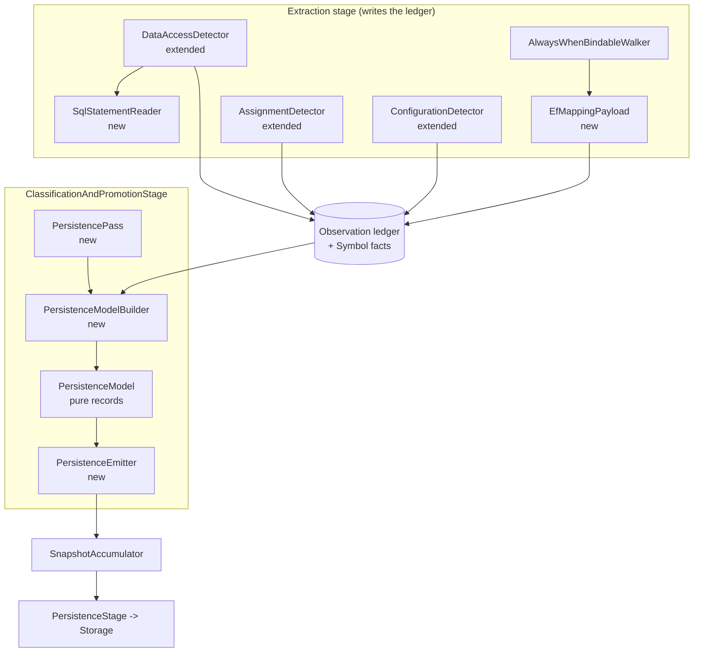

# Persistence Knowledge Design

**Spec**: `.specs/features/persistence-knowledge/spec.md`
**Status**: Draft

---

## Architecture Overview

Two layers, split at the ledger. Extraction writes persistence evidence into observation payloads; classification reads only the ledger and never touches Roslyn (AD-004).

The classification half is a **model builder plus a thin emitter**, not the inline `Classify*` shape 5A used. Persistence resolution is genuinely multi-source: one `DataOperation` can need a `DataAccess` observation, an `Assignment` observation from elsewhere in the same callable, a `ToTable` invocation from another document, and a `Configuration` observation from a third. The builder resolves all of that into a plain data model with no Domain construction and no accumulator; the emitter walks the model in canonical order and mints facts. That keeps the correlation logic unit-testable against a hand-built ledger and makes determinism a property of one small ordered walk.



**Pass order inside the stage.** `PersistencePass` is inserted after `ContractPass` and before `RelationPass`. `RelationPass` iterates boundary operations and contract bindings only, so it neither sees nor disturbs persistence facts; placing persistence before it keeps the relation-emitting passes adjacent and leaves room for 5B/5D to append.

---

## Code Reuse Analysis

### Existing Components to Leverage

| Component | Location | How to Use |
| --- | --- | --- |
| `IClassifierPass` / `ClassifierPassResult` | [src/Csharp2Md.Analysis/Classification/IClassifierPass.cs](src/Csharp2Md.Analysis/Classification/IClassifierPass.cs) | Implement; this is 5A's declared extension point (PK-43) |
| `ClassificationAndPromotionStage` | [src/Csharp2Md.Analysis/Classification/ClassificationAndPromotionStage.cs](src/Csharp2Md.Analysis/Classification/ClassificationAndPromotionStage.cs) | Register `PersistencePass` via `PipelineStages.CreateDefault()` — the stage is untouched |
| `ClassifierContext` | [src/Csharp2Md.Analysis/Classification/ClassifierContext.cs](src/Csharp2Md.Analysis/Classification/ClassifierContext.cs) | `FactsByType<Symbol>()`, `ObservationsByKind`, `ObservationsByOwner`, `AnalysisVariants`, `SolutionId` |
| `IRegisteredContextDetector` / `BoundOccurrence` | [src/Csharp2Md.Analysis/Extraction/IRegisteredContextDetector.cs](src/Csharp2Md.Analysis/Extraction/IRegisteredContextDetector.cs) | Detector extension shape, already carries model + compilation + cancellation |
| `DataAccessDetector` | [src/Csharp2Md.Analysis/Extraction/DataAccessDetector.cs](src/Csharp2Md.Analysis/Extraction/DataAccessDetector.cs) | Its `IsDbSet` / `IsDbContext` / `IsLinqOperator` recognition is reused verbatim; only the payload grows |
| `AssignmentDetector.CollectEntities` | [src/Csharp2Md.Analysis/Extraction/AssignmentDetector.cs:58](src/Csharp2Md.Analysis/Extraction/AssignmentDetector.cs#L58) | Already computes the exposed-entity set per compilation; reuse for the `entity-type` payload |
| `ObservationMaterializer.Redact` | [src/Csharp2Md.Analysis/Extraction/ObservationMaterializer.cs:42](src/Csharp2Md.Analysis/Extraction/ObservationMaterializer.cs#L42) | Runs over every draft already — new payload entries are redacted for free (PK-09, PK-48) |
| `BoundaryPass` outbound pattern | [src/Csharp2Md.Analysis/Classification/Passes/BoundaryPass.cs:121](src/Csharp2Md.Analysis/Classification/Passes/BoundaryPass.cs#L121) | Copy the `emittedKeys` de-duplication and `OrderBy(id, Ordinal)` determinism discipline |
| `RelationPass` mapping-axis pattern | [src/Csharp2Md.Analysis/Classification/Passes/RelationPass.cs:16](src/Csharp2Md.Analysis/Classification/Passes/RelationPass.cs#L16) | Same trick for `mapping-role`: `TaxonomyTables.Default.FacetAxes.Add(new FacetAxisDescriptor("mapping-role", TaxonomyTables.Default.MappingRoles))` |
| Domain persistence facts | [src/Csharp2Md.Domain/Facts/Persistence/PersistenceFacts.cs](src/Csharp2Md.Domain/Facts/Persistence/PersistenceFacts.cs) | `DataStore/DataObject/DataField/DataOperation.Create` — used as-is, no Domain change |
| `SnapshotAccumulator` | [src/Csharp2Md.Analysis/Pipeline/SnapshotAccumulator.cs](src/Csharp2Md.Analysis/Pipeline/SnapshotAccumulator.cs) | `AddFact` (dedupes equal facts, flags colliding ones), `AddRelation`, `AddCandidate`, `AddUnresolved`, `AddDiagnostic` — all already present |

### Integration Points

| System | Integration Method |
| --- | --- |
| Observation ledger | New payload entries on `DataAccess`, `Assignment`, `Invocation`, `Configuration`; observation identity includes the payload, so `DataAccess` and `Assignment` identities shift (AD-002 permits it) |
| `PipelineStages.CreateDefault()` | One added element in the `ClassificationAndPromotionStage` pass array — the only production wiring change |
| Storage / `DomainMapper` | None. Persistence fact types already round-trip through Storage (AD-016); no wire-contract change |
| `fixtures/SyntheticSolution` | Three additive changes (see the spec's Fixture changes section) |

---

## Components

### `SqlStatementReader`

- **Purpose**: turn a constant SQL statement into an operation kind, a target identifier and a column list, or report that it is unreadable.
- **Location**: `src/Csharp2Md.Analysis/Extraction/SqlStatementReader.cs`
- **Interfaces**:
  - `static bool TryRead(string statement, out SqlStatementFacts facts)` — `false` when the leading keyword is outside the closed set or the target is not a bare identifier
  - `readonly record struct SqlStatementFacts(DataOperationKind Operation, string Target, ImmutableArray<string> Columns)`
- **Grammar (closed, deliberately small)**:

  | Leading keyword | Operation | Target | Columns |
  | --- | --- | --- | --- |
  | `SELECT <list> FROM <ident>` | `Read` | after `FROM` | the select list; `*` yields none (PK-27) |
  | `INSERT INTO <ident> (<list>)` | `Insert` | after `INTO` | the parenthesised list |
  | `UPDATE <ident> SET <a> = …` | `Update` | after `UPDATE` | the assigned names in the `SET` list |
  | `DELETE FROM <ident>` | `Delete` | after `FROM` | none |
  | `EXEC`/`EXECUTE <ident>` | `Execute` | the procedure name | none |
  | anything else | — | `TryRead` returns `false` (PK-40) | — |

  `[Orders]` and `"Orders"` are unquoted to `Orders` (PK-19). A target containing an interpolation hole, a parameter marker or whitespace is rejected (PK-39). Keyword matching is `OrdinalIgnoreCase`; emitted identifiers keep their source casing.
- **Dependencies**: none — pure string work, no Roslyn, no Domain.
- **Reuses**: nothing; it is the one genuinely new algorithm.

### `DataAccessDetector` (extended)

- **Purpose**: unchanged recognition; the payload now carries what the classifier needs.
- **Location**: `src/Csharp2Md.Analysis/Extraction/DataAccessDetector.cs`
- **Payload contract**:

  | Key | Literal role | When present |
  | --- | --- | --- |
  | `operation` | `ProtocolName` | always (PK-01), from the closed table in PK-35 |
  | `entity-type` | `ProtocolName` | receiver binds to `DbSet<TEntity>` (PK-02) |
  | `context-type` | `ProtocolName` | receiver is or derives from `DbContext` (PK-03) |
  | `field-names` | `FieldName` | LINQ lambda member accesses on the entity, ordinal-sorted, `\|`-joined (PK-05) |
  | `sql-operation` / `sql-target` / `sql-columns` | `ProtocolName` / `TableName` / `FieldName` | a raw-SQL API with a constant statement that `SqlStatementReader` accepts (PK-04) |

  The statement text is never a payload entry (PK-04). A raw-SQL call whose statement is non-constant emits the observation with `operation=unknown` and no `sql-*` entries, so the classifier can record it as unresolved rather than lose it.
- **Dependencies**: `SqlStatementReader`, `SemanticModel`, `Compilation`.
- **Reuses**: its own `IsDbSet` / `IsDbContext` / `IsLinqOperator` helpers unchanged.

### `AssignmentDetector` (extended)

- **Purpose**: unchanged recognition; payload gains the entity and property names (PK-06).
- **Location**: `src/Csharp2Md.Analysis/Extraction/AssignmentDetector.cs`
- **Payload contract**: `entity-type` (`ProtocolName`, the containing type's fully-qualified name) and `field-name` (`FieldName`, the assigned member's name).
- **Dependencies**: its existing per-compilation entity set.
- **Reuses**: `CollectEntities`, unchanged.

### `EfMappingPayload`

- **Purpose**: build the fluent-mapping payload entries for an EF model-builder invocation.
- **Location**: `src/Csharp2Md.Analysis/Extraction/EfMappingPayload.cs`
- **Interfaces**:
  - `static IEnumerable<PayloadEntry> For(SemanticModel model, IMethodSymbol method, InvocationExpressionSyntax invocation, CancellationToken ct)`
- **Behaviour**: recognizes `Entity<T>()`, `ToTable(string)`, `Property(...)` and `HasColumnName(string)`. For `ToTable` and `HasColumnName` it walks the receiver chain up to the enclosing `Entity<T>()` call to recover `entity-type` from that invocation's type argument, and for `HasColumnName` recovers the CLR property name from the `Property(x => x.Member)` lambda. Emits `table-name` (`TableName`), `field-name` (`FieldName`), `entity-type` (`ProtocolName`), `property-name` (`FieldName`) as applicable (PK-07). A non-constant argument yields no literal entry, which is what makes PK-16 and PK-26 fall back to convention.
- **Dependencies**: `SemanticModel`.
- **Reuses**: the existing `TryFirstStringLiteral` shape from the walker.
- **Wiring**: `AlwaysWhenBindableWalker.InvocationPayload` becomes an instance method so it can pass `_model` and `_cancellationToken` through. The existing `CreateClient` / HTTP-route branches are untouched.

### `ConfigurationDetector` (extended)

- **Purpose**: recognize `GetConnectionString(name)` alongside `GetSection` / `GetValue` (PK-08).
- **Location**: `src/Csharp2Md.Analysis/Extraction/ConfigurationDetector.cs`
- **Change**: one name added to the `matchesConfigurationCall` condition. The payload shape (`key`) is unchanged, so 5D's future consumer sees a familiar record.

### `PayloadReader` and `SignatureReader`

- **Purpose**: read a payload entry or a canonical-signature field without a fourth copy-paste.
- **Location**: `src/Csharp2Md.Analysis/Classification/PayloadReader.cs`, `src/Csharp2Md.Analysis/Classification/SignatureReader.cs`
- **Interfaces**:
  - `PayloadReader.Value(Observation, string key) : string?`
  - `PayloadReader.Contains(Observation, string key, string needle) : bool`
  - `PayloadReader.Multi(Observation, string key) : ImmutableArray<string>` — splits a `\|`-joined entry
  - `SignatureReader.Field(string signature, string key) : string?`
  - `SignatureReader.Kind/Container/Metadata/Type(Symbol) : string?`
- **Dependencies**: none.
- **Note**: 5A's three private copies stay exactly as they are, so PK-43 holds literally. The duplication is logged in Risks & Concerns.

### `PersistenceModelBuilder`

- **Purpose**: resolve the ledger into a persistence model. This is where every correlation rule lives.
- **Location**: `src/Csharp2Md.Analysis/Classification/Persistence/PersistenceModelBuilder.cs`
- **Interfaces**:
  - `static PersistenceModel Build(ClassifierContext context, CancellationToken ct)`
- **Ordered internal steps**:
  1. **Stores** — union of the `container` of every `DbSet<T>` property `Symbol` and every `context-type` payload entry. Name = a `Configuration` observation's `key` whose owning callable's signature mentions that context type, else the context's fully-qualified name (PK-10, PK-11, PK-12).
  2. **Entity-set objects** — one per `DbSet<T>` property `Symbol`; entity type from the property's `type` type argument, conventional table name from the property's `metadata` (PK-14, PK-16).
  3. **Explicit object mappings** — `Invocation` observations carrying `table-name` + `entity-type` overwrite the table name and set `ExplicitConfirmation` (PK-15).
  4. **SQL objects** — one per distinct `sql-target`, under the store named by the occurrence's `context-type`, always `ConventionalCandidate`; `EXEC` targets get form `unknown` (PK-18, PK-21). Never merged with an entity-set object (PK-20).
  5. **Fields** — from `field-names`, from `sql-columns`, from `Assignment` observations; `HasColumnName` upgrades the matching property to `ExplicitConfirmation` with the physical name (PK-22 … PK-26).
  6. **Operations** — one node per `(object, operation kind)`, accumulating every owning callable (PK-31, PK-38). `SaveChanges` mints nothing itself; it promotes the same callable's `Assignment` observations to an `update` (PK-36, PK-37).
  7. **Unresolved and coverage** — everything recognized but unresolved becomes an `UnresolvedNode`; counts and unresolved owner ids fill `CoverageCounts` (PK-39 … PK-41, PK-51, PK-52).

  Every collection is materialized ordinal-sorted by its canonical key, so the model is order-independent before the emitter ever runs.
- **Dependencies**: `ClassifierContext`, `PayloadReader`, `SignatureReader`.
- **Reuses**: `ClassifierContext`'s existing lookups; no new indexing.

### `PersistenceEmitter`

- **Purpose**: turn the model into Domain facts, relations, candidates, unresolved records and the coverage diagnostic.
- **Location**: `src/Csharp2Md.Analysis/Classification/Persistence/PersistenceEmitter.cs`
- **Interfaces**:
  - `static ClassifierPassResult Emit(PersistenceModel model, ClassifierContext context)`
- **Behaviour**: a single ordered walk — stores, objects, fields, operations, then relations, candidates, unresolved, diagnostic. Confirmed relations use `EvidenceMethod.Semantic` for `accesses-data` and `operates-on`, and `EvidenceMethod.Configured` for `maps-to` (the registry's declared minimum). `ConfirmedRelation.Create` is always called with `sourceFact`/`targetFact` where the shape guards need them: `accesses-data` needs a callable `Symbol` source, `operates-on` needs a `DataObject` or `DataField` target.
- **Dependencies**: Domain fact and relation types, `SnapshotAccumulator`.

### `PersistencePass`

- **Purpose**: the `IClassifierPass` seam; nothing else.
- **Location**: `src/Csharp2Md.Analysis/Classification/Passes/PersistencePass.cs`
- **Interfaces**: `Name => "Persistence"`; `Execute` = `PersistenceEmitter.Emit(PersistenceModelBuilder.Build(context, ct), context)`.
- **Classifier identities**: `csharp2md.classifier.persistence-ef` v1 for entity-set-derived promotion, `csharp2md.classifier.persistence-sql` v1 for statement-derived promotion (PK-32).

---

## Data Models

```csharp
internal sealed record PersistenceModel(
    ImmutableArray<StoreNode> Stores,
    ImmutableArray<UnresolvedNode> Unresolved,
    CoverageCounts Coverage);

internal sealed record StoreNode(
    string ContextTypeFqn,
    DataStoreTechnology Technology,
    string Name,
    ImmutableArray<ObjectNode> Objects);

internal sealed record ObjectNode(
    string? EntityTypeFqn,          // null for a SQL-derived object
    DataObjectForm Form,
    string SchemaName,              // "unknown" until a schema is proven (PK-17)
    string TableName,
    MappingStateKind MappingState,
    FactReference? ClrSymbol,       // the entity type's Symbol; source of maps-to
    ImmutableArray<FieldNode> Fields,
    ImmutableArray<OperationNode> Operations,
    EvidenceChain Evidence);

internal sealed record FieldNode(
    string? PropertyName,           // CLR property; null for a SQL-only column
    string FieldName,               // physical name when proven, else the CLR name
    MappingStateKind MappingState,
    FactReference? ClrSymbol,       // the property's Symbol; source of maps-to
    EvidenceChain Evidence);

internal sealed record OperationNode(
    DataOperationKind Kind,
    ClassifierIdentity Classifier,
    ImmutableArray<FactReference> Callables,   // many-to-one: PK-38
    ImmutableArray<string> FieldNames,         // operates-on -> DataField targets
    EvidenceChain Evidence);

internal sealed record UnresolvedNode(
    RelationKind Kind,
    FactReference Source,
    UnresolvedCause Cause,
    EvidenceChain Available);

internal readonly record struct CoverageCounts(
    int RecognizedOccurrences,
    int ResolvedOccurrences,
    ImmutableArray<string> UnresolvedOwnerIds);
```

**Relationships**: `StoreNode` 1—N `ObjectNode` 1—N `FieldNode` / `OperationNode`. `OperationNode.Callables` is the many-to-one that PK-38 requires: one shared `DataOperation` fact, one `accesses-data` relation per callable. `MappingStateKind` on an object or field decides confirmed `maps-to` versus `CandidateLink` (PK-28 … PK-30).

---

## Error Handling Strategy

| Error scenario | Handling | Package impact |
| --- | --- | --- |
| SQL target is an interpolation hole or non-constant | `UnresolvedRecord(operates-on, InsufficientEvidence)`; no `DataObject` | The access is visible and explicitly unresolved (PK-39) |
| SQL leading keyword outside the closed set | `UnresolvedRecord(accesses-data, NoCandidateFound)` | Same (PK-40) |
| `DataAccess` entity type has no `Symbol` fact | `UnresolvedRecord(accesses-data, NoCandidateFound)`; no `DataOperation` | Same (PK-41) |
| `ToTable` / `HasColumnName` argument non-constant | Fall back to the conventional name with `ConventionalCandidate` | A candidate `maps-to`, never a confirmed one (PK-16, PK-26) |
| Persistence-shaped type with no data access | Nothing emitted at all | `OrderRepository` stays absent (PK-42) |
| A payload entry looks like a secret | `ObservationMaterializer.Redact` drops it and records `SuspectedSecretEvidence` | Redacted excerpt only (PK-09, PK-48) |
| Two structurally different facts share an identity | `SnapshotAccumulator` sets `StructuralCorruption` | Commit aborts — existing workstream 4 invariant |

---

## Risks & Concerns

| Concern | Location (file:line) | Impact | Mitigation |
| --- | --- | --- | --- |
| `ReadField` / `ReadPayloadValue` / `PayloadContains` duplicated verbatim in three passes | [BoundaryPass.cs:413](src/Csharp2Md.Analysis/Classification/Passes/BoundaryPass.cs#L413), [ContractPass.cs:161](src/Csharp2Md.Analysis/Classification/Passes/ContractPass.cs#L161), [RelationPass.cs:291](src/Csharp2Md.Analysis/Classification/Passes/RelationPass.cs#L291) | A fix to signature parsing must land in three places; a fourth copy would make it four | New `PayloadReader`/`SignatureReader` used by all persistence code; 5A untouched to satisfy PK-43. Consolidating 5A's copies is a logged follow-up, not this feature |
| `BaseType` observations carry an empty payload, so `BoundaryPass.TryEventTypeFromHandlerBases` can never match — 5A's messaging inbound silently relies on the `TryFirstParameterType` fallback | [AlwaysWhenBindableWalker.cs:303](src/Csharp2Md.Analysis/Extraction/AlwaysWhenBindableWalker.cs#L303), [BoundaryPass.cs:351](src/Csharp2Md.Analysis/Classification/Passes/BoundaryPass.cs#L351) | Dead code reads as live; a future author may assume `BaseType` payloads exist | This design does **not** rely on `BaseType` payloads — stores are found from `DbSet<T>` property containers and `context-type` entries instead (PK-10 was tightened to match). Populating `BaseType` payloads would change 5A's messaging output and is deliberately out of scope; logged as a follow-up |
| Changing `DataAccess` / `Assignment` payloads changes their observation identities | [NormalizedPayload](src/Csharp2Md.Domain/Observations/NormalizedPayload.cs) participates in `ObservationIdentity` | Any test asserting a fixed `DataAccess` identity or a stable observation count breaks | Only `DataAccessDetectorTests` touches these kinds and it asserts kind and owner, not identity. AD-002 permits the break. Full-suite green is the T-level gate |
| `NormalizedPayload.Create` throws on duplicate keys | [NormalizedPayload.cs:30](src/Csharp2Md.Domain/Observations/NormalizedPayload.cs#L30) | A naive one-entry-per-column payload would throw at extraction time and abort the run | Column and field lists are a single ordinal-sorted `\|`-joined entry; the spec was corrected before design (PK-04, PK-05) |
| `DataOperation.Create` omits the symbol from its identity, unlike the registry's documentary `identity_components` | [PersistenceFacts.cs:169](src/Csharp2Md.Domain/Facts/Persistence/PersistenceFacts.cs#L169) | Two callables collapse onto one `DataOperation`; a reader expecting per-callable operations is surprised | Made explicit and tested: PK-38 asserts one shared fact with one `accesses-data` per callable. Domain is closed, so this is a constraint, not a defect to fix here |
| The fixture holds two live-looking connection strings, and this feature adds a SQL reader that walks string arguments | [OrderSqlQueries.cs:26](fixtures/SyntheticSolution/Acme.Orders/Data/OrderSqlQueries.cs#L26), [appsettings.json:3](fixtures/SyntheticSolution/Acme.Orders/appsettings.json#L3) | A leak into a canonical payload is a zero-tolerance gate failure | Statement text is never a payload entry; only parsed identifiers are. PK-48 greps every canonical payload for both passwords as an explicit gate |
| Rewriting `OrderSqlQueries` shifts observation and symbol counts for every fixture-wide test | [OrderSqlQueries.cs](fixtures/SyntheticSolution/Acme.Orders/Data/OrderSqlQueries.cs) | Existing workstream 3/4/5A integration assertions on totals may fail | The fixture change is its own early task with the full 1019-test suite as its gate, so the blast radius is measured before any classifier work lands |

---

## Tech Decisions

| Decision | Choice | Rationale |
| --- | --- | --- |
| Classification structure | `PersistenceModelBuilder` → `PersistenceModel` → `PersistenceEmitter`, behind one `PersistencePass` | User-approved. Correlation is multi-source; a pure model is testable without an accumulator and makes determinism one ordered walk |
| Shared payload/signature readers | New files; 5A's private copies left alone | User-approved. PK-43 forbids modifying 5A passes; consolidation is a logged follow-up |
| SQL reading location | At extraction, inside `DataAccessDetector` via `SqlStatementReader` | PK-04 puts the parsed fields in the payload, and AD-004 forbids the classifier re-reading source. It also keeps the statement text out of the ledger |
| SQL grammar | Closed five-keyword reader, everything else unresolved | A real parser is out of scope and would invent precision the fixture cannot justify |
| `DataStore` name literal role | `LiteralRole.SchemaName` regardless of derivation | The role is not part of `FactIdGrammar.Create`, so it never affects identity; one role keeps the store's literal stable whether the name came from config or from the type |
| `mapping-role` facet | Registered ad hoc via `FacetAxisTable.All.Add(...)`, mirroring `RelationPass`'s `payload-role` | `mapping-role` is a registry table, not a facet axis; 5A already established this exact pattern |
| Store discovery signal | `DbSet<T>` property containers plus `context-type` payload entries — not `BaseType` observations | `BaseType` payloads are empty; relying on them would require changing 5A's messaging behaviour |
| `EXEC` target | A `DataObject` with form `unknown` | `DataOperation.Create` requires a target reference, so the alternative is dropping the operation entirely |

> No project-level decision is proposed. Every choice here is feature-local and conforms to AD-004, AD-006, AD-013, AD-014, AD-016 and AD-017.

---

## Test Strategy

Three levels, matching where the logic actually lives:

1. **`SqlStatementReader`** — pure unit tests, one per grammar row plus every rejection path. No fixture, no Roslyn.
2. **`PersistenceModelBuilder`** — unit tests over a hand-built `ClassifierContext` with synthetic observations and symbol facts. This is where the correlation rules (tracked writes, cross-document mapping, shared operations, store naming fallback) are pinned without a solution load.
3. **Detectors and end-to-end** — `Acme.Orders.slnx` integration tests assert the payload contract at the ledger and the published package's persistence content, determinism across clone paths, byte-identical re-commits, and secret absence.

Per project rule, the discrimination sensor stays skipped; the user runs Stryker manually.
