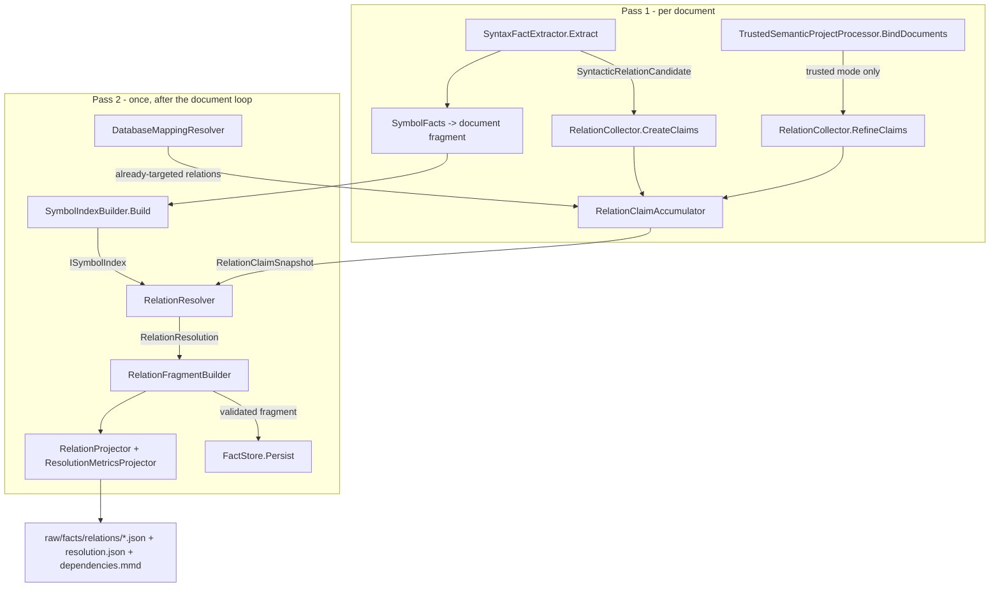

# RelationResolver Design

**Spec**: `.specs/features/relation-resolver/spec.md`
**Status**: Approved

---

## Architecture Overview

The resolver is `data-access-discovery`'s pass-two shape applied to relations. `RelationCollector` stops
minting facts and starts emitting **claims**; a `RelationClaimAccumulator` holds them plus the
`DocumentExtent`s their evidence needs; once the document loop has produced the complete `SymbolIndex`, a
`RelationResolver` runs an ordered strategy chain over every claim and a `RelationFragmentBuilder` turns the
outcome into one validated solution-level fragment.

That seam is what makes RELR-01 ("the only writer of `RelationFact`") true by construction rather than by
convention, and it is why relation identity survives untouched: the id is still minted from
`owner + kind + fingerprint(details) + ordinal`, and the details are still exactly what `DetailsFor` produces
today. Resolution outcome never reaches the fingerprint (RELR-22).



### Strategy chain

One fixed order, first handler wins (RELR-09), each strategy free to decline a kind it does not own
(RELR-10):

| # | Strategy | Owns | Requirements |
| --- | --- | --- | --- |
| 1 | `ExistingTargetStrategy` | A claim that arrived already targeted; verifies the target exists in the run | RELR-02, RELR-03 |
| 2 | `DatabaseRelationStrategy` | `data`-partition claims: maps the existing `mapping` detail onto `configured` / `convention`, and interpolated SQL onto `dynamic` | RELR-27..RELR-32 |
| 3 | `ReceiverTypeStrategy` | `calls` with a receiver: method lookup through `FindMethods` | RELR-05..RELR-08 |
| 4 | `SymbolIndexStrategy` | Everything else with a `target_text`: type/member lookup through `FindCandidates` | RELR-04, RELR-13, RELR-15 |
| 5 | `UnresolvedStrategy` | Terminal; always handles | RELR-12, RELR-15, RELR-16 |

The user's spec lists eleven strategies. Five of those are out of scope (`Semantic`, `CandidateSymbol`,
`Configuration`, `ProtocolSpecific`, `Heuristic` — see spec.md's Out of Scope and the P2/P3 cut), and
`Candidate` and `Convention` are not separate passes over the claim: they are *outcomes* of the lookup that
strategies 4 and 2 already perform. Splitting them into their own classes would mean re-running the same
index query to reinterpret its result.

---

## Code Reuse Analysis

### Existing Components to Leverage

| Component | Location | How to Use |
| --- | --- | --- |
| `RawDatabaseClaim` | `Analysis/DataAccess/DataAccessContracts.cs` | Copy its shape for `RawRelation`: required non-default `Evidence` enforced in the initializer, "never serialized" contract, capped text |
| `DatabaseClaimAccumulator` | `Analysis/DataAccess/DatabaseClaimAccumulator.cs` | Copy verbatim for `RelationClaimAccumulator`, including the "retain extents only for documents that produced a claim" memory rule and the evidence-first canonical ordering |
| `DatabaseMappingResolver` | `Analysis/DataAccess/DatabaseMappingResolver.cs` | Its `MappingKey` detail already carries `configured` / `convention`; strategy 2 reads it rather than re-deciding. Its relations become claims |
| `DatabaseFragmentBuilder` | `Analysis/DataAccess/DatabaseFragmentBuilder.cs` | Copy its `Build(resolution, validate)` shape, its `knownFactIds` argument for cross-fragment references, and its ordinal-keyed id minting |
| `ISymbolIndex` | `Analysis/Indexes/SymbolIndex.cs` | `FindMethods(MethodLookup)`, `FindCandidates(SymbolLookup)`, `GetById`. Already returns `Unique`/`Ambiguous`/`NotFound` without choosing — RELR-14 is enforced by the index, not re-implemented |
| `DeclaredReceiverTypeName` | `Analysis/Syntax/SyntaxFactExtractor.cs:627` | Extend in place for RELR-07 (it covers method parameters and non-`var` locals today; fields, properties, constructor and primary-constructor parameters, and pattern variables are missing) |
| `FactResolutionAlgebra.Stronger` | `Facts/Model/FactResolution.cs` | Merging a refined claim with its baseline keeps the stronger `ShapeConfidence`, preserving AD-015's rank-merge semantics at the claim level |
| `RelationProjector` | `Projection/Aggregates/RelationProjector.cs` | Unchanged. It already projects over the `RelationPartition` enum and already filters Mermaid edges on `TargetId is not null` — that filter starts passing instead of being changed |
| `AnalysisDiagnostic.Create` | `Facts/Metadata/AnalysisDiagnostic.cs` | Every `C2M-RELR-*` diagnostic, scoped to the relation's fact id (RELR-37) |

### Integration Points

| System | Integration Method |
| --- | --- |
| `AnalysisEngine.AnalyzeAsync` | Relations leave the per-document `baseline`/`enrichment` arrays; a `RelationClaimAccumulator` is threaded exactly where `DatabaseClaimAccumulator` already is, and the resolve→build→persist block sits next to the existing database one |
| `FactStore` | One additional solution-level fragment per run, persisted through the unchanged `Persist` path |
| `CanonicalAggregateWriter` | One additional file, `raw/facts/relations/resolution.json` |
| `FactValidator` | One new invariant (`C2M-FV-008`) tying `resolution_method` to `target_id` |
| `schemas/facts.schema.json` | `schema_version` const 4 -> 5; `relation_fact` gains required `resolution_method` and optional `candidates` |

---

## Components

### `RawRelation`

- **Purpose**: One pass-one observation about a relation, carrying everything pass two needs and nothing it does not.
- **Location**: `src/Csharp2Md.Core/Analysis/Relations/RelationContracts.cs`
- **Interfaces**: an internal `sealed record` with `required` `Kind`, `OwnerId`, `Evidence`, `ShapeConfidence`, `Partition`; optional `TargetText`, `ReceiverText`, `ReceiverTypeText`, `MemberName`, `ArgumentCount`, `ArgumentTypes`, `Namespace`, `ProjectId`, `Imports`, `TargetId`, `ProducerMethod`, `UnresolvedReason`; and `Details` holding exactly the identity-bearing details today's `DetailsFor` produces.
- **Dependencies**: `FactId`, `Evidence`, `RelationDetail`, `FactResolution`, `RelationPartition`.
- **Reuses**: `RawDatabaseClaim`'s construction-time evidence guard and its never-serialized contract.

### `RelationClaimAccumulator`

- **Purpose**: Hold every claim the run produced plus the extents its evidence will be validated against.
- **Location**: `src/Csharp2Md.Core/Analysis/Relations/RelationClaimAccumulator.cs`
- **Interfaces**: `Add(DocumentFactId, string relativePath, ImmutableArray<int> lineLengths, ImmutableArray<RawRelation>)`; `AddResolved(ImmutableArray<RawRelation>)` for the database resolver's already-targeted claims; `RelationClaimSnapshot ToSnapshot()`.
- **Dependencies**: `DocumentExtent`.
- **Reuses**: `DatabaseClaimAccumulator` line for line, including the rule that a document producing no claim contributes no extent.

### `RelationResolutionContext` / `IRelationResolutionStrategy`

- **Purpose**: The contract a strategy sees and the contract it honours.
- **Location**: `src/Csharp2Md.Core/Analysis/Relations/Resolution/IRelationResolutionStrategy.cs`
- **Interfaces**:
  - `RelationResolutionOutcome TryResolve(RelationResolutionContext context)`
  - `RelationResolutionContext(RawRelation Relation, ISymbolIndex SymbolIndex, IReadOnlySet<FactId> KnownFactIds)`
  - `RelationResolutionOutcome(bool Handled, FactId? TargetId, ResolutionMethod Method, ImmutableArray<FactId> Candidates, ImmutableArray<Evidence> AddedEvidence, string? UnresolvedReason, AnalysisDiagnostic? Diagnostic)` with a `static None`
- **Dependencies**: `ISymbolIndex`.
- **Reuses**: `IDataAccessAnalyzer`'s single-method, no-I/O, no-engine strategy shape.
- **Deviation from the user's spec section 10**: the context carries no `SemanticModel` and no `SyntaxNode`. Both are disposed with the compilation at the end of pass one and cannot be handed to a pass-two strategy. What the semantic pass knows reaches the resolver as claim fields (`ReceiverTypeText`, `ArgumentTypes`), which is why `RefineClaims` exists.

### Strategies

- **Location**: `src/Csharp2Md.Core/Analysis/Relations/Resolution/`
- Each is an internal sealed class with no state beyond the index handed to it, so two runs over the same claim produce the same outcome (RELR-21).
- `UnresolvedStrategy` always returns `Handled: true`, which is what makes RELR-12 structural: the chain cannot fall through and drop a relation.

### `RelationResolver`

- **Purpose**: Run the chain over every claim, in order, isolating strategy failures.
- **Location**: `src/Csharp2Md.Core/Analysis/Relations/Resolution/RelationResolver.cs`
- **Interfaces**: `RelationResolution Resolve(RelationClaimSnapshot claims, ISymbolIndex index, CancellationToken cancellationToken)`
- **Behaviour**: for each claim, walk the chain; a strategy that throws has its outcome discarded, contributes `C2M-RELR-006`, and the walk continues with the next strategy (RELR-11); mint the `RelationFactId` from `owner + kind + fingerprint(claim.Details) + ordinal`, where the ordinal counter is keyed `owner \0 kind \0 fingerprint` and advanced in claim-snapshot order; order the result by `RelationFactId` ordinal (RELR-26).
- **Dependencies**: `ISymbolIndex`, the strategy list.
- **Reuses**: `DatabaseFragmentBuilder`'s ordinal-minting shape; `DataAccessCollector`'s per-analyzer failure isolation (`C2M-DA-001`) as the model for `C2M-RELR-006`.

### `RelationFragmentBuilder`

- **Purpose**: Turn the resolution into facts and run them through the same validate path every other fragment takes.
- **Location**: `src/Csharp2Md.Core/Analysis/Relations/RelationFragmentBuilder.cs`
- **Interfaces**: `RelationFragmentResult Build(RelationResolution resolution, FragmentValidationFunc validate)`
- **Dependencies**: `FactValidator` via the existing `FragmentValidationFunc` delegate.
- **Reuses**: `DatabaseFragmentBuilder` structurally, including declaring source *and* target fact ids as `knownFactIds` — both live in document fragments that `C2M-FV-002` cannot see from a solution-level fragment.

### `ResolutionMetricsProjector`

- **Purpose**: Count resolution outcomes so a change can be shown to have improved something.
- **Location**: `src/Csharp2Md.Core/Projection/Aggregates/ResolutionMetricsProjector.cs`
- **Interfaces**: `ResolutionMetricsAggregate Project(RelationProjectionResult relations)`
- **Behaviour**: derives counts from the *projected partitions*, not from the resolver's own tally, so RELR-36 (counts equal what was written) cannot drift.
- **Reuses**: `CoverageProjector`'s aggregate-from-validated-fragments shape.

### Changed existing components

| Component | Change |
| --- | --- |
| `RelationCollector` | `CreateFacts` -> `CreateClaims`; `Refine` -> `RefineClaims`. `BuildFact`, `PartitionFor`, `DetailsFor`, `ClaimFor` and the ordinal logic move to the resolver or stay as shared helpers. The fixed `UnresolvedReasonText` placeholder is deleted (RELR-16) |
| `SyntaxFactExtractor` | `SyntacticRelationCandidate` gains `ReceiverText`, `ReceiverTypeText`, `MemberName`, `ArgumentCount`, `ArgumentTypes`; `DeclaredReceiverTypeName` extended per RELR-07; the document's namespace and usings captured once per document |
| `AnalysisEngine` | Relations removed from the per-document `baseline` and `enrichment`; claim accumulator threaded; resolve/build/persist block added after the symbol index is built and after `DatabaseMappingResolver` runs |
| `RelationFact` | Gains `ResolutionMethod Method` and `ImmutableArray<FactId> Candidates` |
| `RelationFactJson` | Gains `resolution_method` (`JsonPropertyOrder` 8) and `candidates` (9); `details` keeps order 7 so existing field order is unchanged |
| `FactualJsonSerializer` | `SchemaVersion` 4 -> 5 |
| `FactValidator` | New `C2M-FV-008` invariant |
| `CanonicalAggregateWriter` | Writes `raw/facts/relations/resolution.json` |

---

## Data Models

### `ResolutionMethod`

```csharp
// src/Csharp2Md.Core/Facts/Model/RelationFact.cs
public enum ResolutionMethod
{
    Exact,       // "exact"
    Candidate,   // "candidate"
    Syntactic,   // "syntactic"
    Configured,  // "configured"
    Convention,  // "convention"
    Dynamic,     // "dynamic"
    Heuristic,   // "heuristic"
    Unresolved,  // "unresolved"
}
```

Deliberately separate from `FactResolution`. `FactResolution` answers "how proven is this fact?" and is
aggregated across every fact family by `FactResolutionAlgebra`; `ResolutionMethod` answers "by what route did
we reach this target?" and is meaningful only on a relation. Collapsing them would drag `Configured` and
`Convention` into every symbol, document and project header, and would supersede AD-016's
convention-to-`Heuristic` mapping for no gain.

### `RelationFact` (changed)

```csharp
public sealed record RelationFact(
    FactHeader Header,
    RelationFactId RelationId,
    FactId SourceId,
    FactId? TargetId,
    RelationPartition Partition,
    string RelationKind,
    string? UnresolvedReason,
    ResolutionMethod Method,
    ImmutableArray<FactId> Candidates = default,
    ImmutableArray<RelationDetail> Details = default) : IFact;
```

**Invariant (`C2M-FV-008`)**: `TargetId is not null` implies `Method` is one of `Exact`, `Syntactic`,
`Configured`, `Convention`, `Heuristic`; `Method is Candidate or Dynamic or Unresolved` implies
`TargetId is null`; `Candidates` is non-empty only when `Method is Candidate`.

### `RelationClaimSnapshot`

```csharp
internal sealed record RelationClaimSnapshot(
    ImmutableArray<RawRelation> Claims,
    ImmutableArray<DocumentExtent> Documents);
```

Canonical order: `Evidence` first (document, path, position), then kind, then the details fingerprint —
so the order documents were analysed in cannot reach the snapshot (RELR-21).

### `resolution.json`

```json
{
  "schema_version": 1,
  "kind": "resolution",
  "total": 128,
  "by_method": { "exact": 0, "candidate": 3, "syntactic": 71, "configured": 6,
                 "convention": 2, "dynamic": 4, "heuristic": 0, "unresolved": 42 },
  "by_partition": [
    { "partition": "structural", "total": 90, "by_method": { "...": 0 } }
  ]
}
```

Every one of the eight keys is always present, at zero when unused (RELR-33, RELR-35).

---

## Error Handling Strategy

| Error Scenario | Handling | User Impact |
| --- | --- | --- |
| A strategy throws on one claim | Outcome discarded, `C2M-RELR-006` at `Warning`, chain continues with the next strategy, exit code unchanged | The relation is emitted unresolved; the diagnostic names the strategy |
| No candidate found | `UnresolvedStrategy` handles; `C2M-RELR-001` at `Information` | Relation present with `target_text` and `resolution_method: "unresolved"` |
| Ambiguous candidates | `SymbolIndexStrategy` returns `Candidate` with every tied id; `C2M-RELR-002` | Relation present, both ids visible, nothing chosen |
| Receiver type undeterminable | `ReceiverTypeStrategy` declines to a `Unresolved` outcome; `C2M-RELR-003` | Relation present, unresolved |
| Interpolated / concatenated SQL target | `DatabaseRelationStrategy` returns `Dynamic`; `C2M-RELR-004` | Relation present, `target_text` preserved |
| Convention-named database target | `DatabaseRelationStrategy` returns `Convention`; `C2M-RELR-005` | Relation present with a target and an honest method |
| Claim names a source or target absent from the run | `C2M-RELR-007` at `Warning`, relation still emitted with `target_id: null` | Visible inconsistency, no lost relation |
| Fragment validation fails | Structural failure, exit code 1 — identical to the database fragment's existing behaviour | Run fails with the validator's own diagnostics |
| Cancellation mid-resolution | `ThrowIfCancellationRequested` propagates; never converted into a diagnostic | Standard cancellation, matching `DataAccessCollector` |

---

## Risks & Concerns

| Concern | Location (file:line) | Impact | Mitigation |
| --- | --- | --- | --- |
| Relation ordinals are currently per-document (`RelationCollector.cs:39`, a fresh dictionary per `CreateFacts` call). A run-wide resolver keyed only on `kind + claim` would renumber relations that today sit in different documents | `Analysis/Relations/RelationCollector.cs:39` | Silent, one-time change to every affected `relation_id`, defeating RELR-23 for the upgrade | Key the ordinal `owner \0 kind \0 fingerprint`. Owner is a symbol or document id, so it is already document-scoped, and the ordinal reproduces today's value. A dedicated task asserts id equality against the pre-change output |
| `DeclaredReceiverTypeName` returns `null` for `var` locals, fields, properties, and constructor parameters — the most common receiver shapes in real code | `Analysis/Syntax/SyntaxFactExtractor.cs:627` | Without extension, RELR-07 resolves almost nothing on a real codebase and the feature looks like it works on the fixture only | RELR-07 names the shapes explicitly; a task per shape group, each with a fixture case. `var` locals stay unresolvable by syntax and are documented as such |
| The whole `Detection/` tree is dead code (no production caller, tests only) | `src/Csharp2Md.Core/Detection/` | Three empty relation partitions (`compile-time`, `dependency-injection`, `grpc`) ship in every run; a reader reasonably concludes the analysis found nothing rather than that nothing ran | Out of scope here and recorded in spec.md. `resolution.json`'s per-partition breakdown makes "zero relations in this partition" explicit rather than implied |
| `RelationProjector` throws `InvalidOperationException` on a duplicate relation identity | `Projection/Aggregates/RelationProjector.cs:63` | A minting bug becomes an unhandled exception rather than a diagnostic | Kept deliberately (spec.md edge case): duplicate identity is a structural failure. The resolver mints ids in one place, so the ordinal task above is the real guard |
| Claims are held for the whole run in memory | `Analysis/Relations/RelationClaimAccumulator.cs` | Memory grows with relation count on a large solution — AD-008's bounded-memory goal | Claims carry no syntax nodes and no source text; `ArgumentTypes` holds simple names. Same bound `DatabaseClaimAccumulator` already accepted. Extents retained only for documents that produced a claim |
| `EndToEndTests` and the fact snapshots assert relations inside document fragments | `tests/` | Moving relations out of document fragments breaks a set of existing tests | Expected and intended: those assertions are rewritten to the new location, never deleted or weakened. A dedicated task carries the snapshot re-approval, reviewed line by line (the `data-access-discovery` schema-4 bump set this precedent) |

---

## Tech Decisions

| Decision | Choice | Rationale |
| --- | --- | --- |
| Collector-to-resolver seam | Claims buffered in an accumulator, resolver mints the fact | Only shape that makes "sole writer of `RelationFact`" structural, and the only one that leaves existing relation ids untouched. Direct `RawDatabaseClaim` precedent |
| Resolution vocabulary | New `ResolutionMethod` enum on the relation | Keeps `FactResolution` and AD-016 intact; the two enums answer different questions |
| Where `resolution_method` lives | A field, not a `RelationDetail` | Details feed the identity fingerprint; a resolution-bearing detail would churn `relation_id` on every improvement, contradicting RELR-22 and RELR-23 |
| Strategy count | Five classes, not the spec's eleven | Five are out of scope; `Candidate` and `Convention` are outcomes of lookups strategies 2 and 4 already perform, not separate passes |
| Metrics source | Counted from the projected partitions | Makes RELR-36 true by construction instead of by a second tally that can drift |
| JSON field order | New fields at `JsonPropertyOrder` 8 and 9, `details` stays at 7 | Existing serialized field order is unchanged, keeping the snapshot diff limited to genuinely new content |

### Project-level decisions to record

Two entries for `.specs/STATE.md` `## Decisions`, appended once this design is approved:

**AD-018** — *Relations are claims until pass two.* `RelationCollector` emits `RawRelation` claims rather than
facts; a `RelationClaimAccumulator` buffers them with their `DocumentExtent`s; `RelationResolver` is the only
component that mints a `RelationFact`, and it does so in pass two once the `SymbolIndex` exists. Document
fragments no longer carry relations; every relation lives in one solution-level fragment. The factual fragment
schema moves 4 -> 5. *Supersedes AD-015* in one respect only: relation enrichment is merged at the claim level
by `FactResolutionAlgebra.Stronger` instead of at the fact level by `FactMerger`'s same-identity rank merge.
The pass-one wiring AD-015 chose (`SyntaxFactExtractor.Extract` plus
`TrustedSemanticProjectProcessor.BindDocuments`, not `DetectorHost`) is unchanged.

**AD-019** — *Resolution route is separate from fact resolution.* A relation carries a `ResolutionMethod`
(`exact`, `candidate`, `syntactic`, `configured`, `convention`, `dynamic`, `heuristic`, `unresolved`)
alongside, not instead of, its header's `FactResolution`. No part of a fact's identity may derive from its
resolution outcome, so resolution state is a field and never a `RelationDetail`. Conforms to AD-011 and
AD-016: a target is still only proven by a semantic binding, an index match, or a source literal.

---

## Conformance to Active Decisions

| Decision | Status here |
| --- | --- |
| AD-003 (net10.0, Workspaces.MSBuild 5.6.0, no `Microsoft.Build.*`) | Conforms — the resolver touches no Roslyn workspace API |
| AD-008 (validated fragment lifecycle, bounded memory) | Conforms — one more solution-level fragment; claims are bounded and syntax-free |
| AD-011 (no unproven target promoted to an identity) | Conforms and reinforces — `UnresolvedStrategy` is terminal |
| AD-012 (syntax-only default, semantics opt-in) | Conforms — resolution is index-only and runs identically in the default mode |
| AD-013 (modular inside `Csharp2Md.Core`, `AnalyzeAsync` the only external surface) | Conforms — every new type is `internal` |
| AD-014 (`id1:` grammar) | Conforms — P1 mints no new node identity; P2 must follow the grammar when it does |
| AD-015 (relation wiring) | **Partially superseded by AD-018** — merge point moves from fact to claim; wiring unchanged |
| AD-016 (identity only from literal-proven names) | Conforms — the resolver never mints a database node |
| AD-017 (fragment schema 4, aggregates at 2) | **Extended** — fragment schema 5, aggregates stay at 2, `resolution.json` is a new envelope at 1 |
