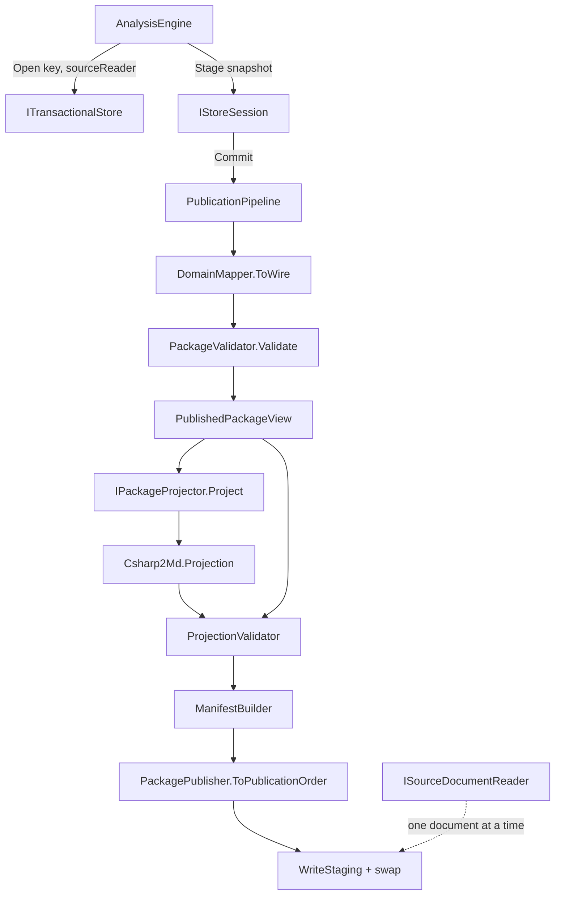

# Retrieval Projections Design

**Spec**: `.specs/features/retrieval-projections/spec.md`
**Context**: `.specs/features/retrieval-projections/context.md`
**Status**: Draft

---

## Architecture Overview

Projection runs inside `Commit()`, over the mapped and validated wire document (AD-019). The chosen approach extracts a shared `PublicationPipeline` that both stores call, and a `PublishedPackageView` that becomes the **single authority on canonical keys and ordinals** — consumed by the projector and by serialization alike, so the two cannot drift. The manifest stops being built in `DomainMapper` and is derived from the final fragment list instead.



The pipeline is linear and fails closed: `ProjectionValidator` runs before a single staging byte is written, so RP-04 falls out of the sequence rather than needing a compensating action.

`Csharp2Md.Projection` gains project references to `Csharp2Md.Storage` and `Csharp2Md.Domain`. `Csharp2Md.Cli` already references `Csharp2Md.Projection` and needs no new direct reference — the Domain dependency stays transitive, which the `.csproj`-inspecting isolation tests permit.

---

## Code Reuse Analysis

### Existing Components to Leverage

| Component | Location | How to Use |
| --- | --- | --- |
| `CanonicalJson` | `src/Csharp2Md.Storage/Wire/CanonicalJson.cs` | Public; Projection serializes every catalog and posting through it, so projection bytes inherit the existing determinism contract |
| `PackagePublisher` | `src/Csharp2Md.Storage/Mapping/PackagePublisher.cs` | Refactored: its key conventions move into `PublishedPackageView`; it keeps ordering and appends projection fragments |
| `PackageValidator` | `src/Csharp2Md.Storage/Validation/PackageValidator.cs` | Unchanged entry point; `ProjectionValidator` is a sibling reusing `PublicationRejectedException` and its reason-code style |
| `PublicationRejectedException` | `src/Csharp2Md.Analysis/Storage/PublicationRejectedException.cs` | Reused verbatim for every projection-validation abort; new reason codes only |
| `StagedFragment` / `ArtifactRole` | `src/Csharp2Md.Analysis/Storage/StagedFragment.cs` | Extended with a deferred form; existing eager construction stays source-compatible |
| `SuspectedSecretEvidence` | `src/Csharp2Md.Domain/Literals/SuspectedSecretEvidence.cs` | Already carries document, span, hash and redacted excerpt — redaction needs no new detection |
| `EvidenceLocator` / `SourceSpan` / `DocumentHash` | `src/Csharp2Md.Domain/Literals/` | `DeclarationLocator` composes the existing `SourceSpan` and `DocumentHash` rather than inventing parallel types |
| `SymbolFactEmitter` | `src/Csharp2Md.Analysis/Semantics/SymbolFactEmitter.cs` | Already walks declarations with the semantic model; the locator comes from the node it already holds |
| `InventoryStage` / `AuthorizedRoot` | `src/Csharp2Md.Analysis/Inventory/` | Already knows the authorized root and each document's absolute path — the source reader's map is built here |
| `FilesystemTransactionalStore` staging swap | `src/Csharp2Md.Storage/FilesystemTransactionalStore.cs:180-215` | Atomic replace with `.bak` rollback is reused unchanged; projections ride the existing atomicity |

### Integration Points

| System | Integration Method |
| --- | --- |
| Analysis write port | `ITransactionalStore.Open` gains an `ISourceDocumentReader` parameter (AD-022) |
| Pipeline | Slot 6 `RetrievalProjectionStub` stays a no-op; the eight declared stage names remain load-bearing in `PipelineOrchestrator` |
| CLI | `CommandFactory` constructs `new FilesystemTransactionalStore(outputPath, new PackageProjector())`; no command or option changes |
| Registry drift gate | Untouched — `DeclarationLocator` is not an identity component |

---

## Components

### `ISourceDocumentReader`

- **Purpose**: hand the store one document's original bytes on demand, so the package never holds a second full copy of the source.
- **Location**: `src/Csharp2Md.Analysis/Storage/ISourceDocumentReader.cs`
- **Interfaces**:
  - `bool TryRead(DocumentId document, out ImmutableArray<byte> bytes)` — false when the document is no longer readable
  - `ImmutableArray<DocumentId> Documents { get; }` — canonical order, so the projector enumerates without guessing
- **Dependencies**: `Csharp2Md.Domain` identity types only
- **Reuses**: declared beside `ITransactionalStore`, the established home for write-port contracts (AD-014)

### `FilesystemSourceDocumentReader`

- **Purpose**: read each analyzed document from its absolute path at commit time.
- **Location**: `src/Csharp2Md.Analysis/Inventory/FilesystemSourceDocumentReader.cs`
- **Interfaces**: implements `ISourceDocumentReader`
- **Dependencies**: the `DocumentId → absolute path` map the inventory already computes
- **Reuses**: `InventoryStage`'s authorized-root logic; nothing is cached between calls

### `PublishedPackageView`

- **Purpose**: the single authority on which artifact key holds which payload and at which ordinal.
- **Location**: `src/Csharp2Md.Storage/Mapping/PublishedPackageView.cs`
- **Interfaces**:
  - `static PublishedPackageView From(WireDocument document)`
  - `WireDocument Document { get; }` — typed access to every fact, observation and relation array
  - `ImmutableArray<ArtifactSlot> Slots { get; }` — canonical key, role, element count, in publication order
  - `bool TryLocate(string factId, out ArtifactCitation citation)` — key plus ordinal for one fact
  - `bool TryLocateRelation(string kind, int index, out ArtifactCitation citation)`
- **Dependencies**: `WireDocument`, `TaxonomyTables`
- **Reuses**: the key conventions currently inlined in `PackagePublisher`, lifted here so both callers read one definition

### `IPackageProjector`

- **Purpose**: the port AD-014 deferred and AD-019 places on Storage.
- **Location**: `src/Csharp2Md.Storage/IPackageProjector.cs`
- **Interfaces**:
  - `ImmutableArray<StagedFragment> Project(PublishedPackageView view, ISourceDocumentReader source)`
- **Dependencies**: none beyond the view and the reader
- **Reuses**: returns the existing `StagedFragment` type, so projections need no parallel publication concept

### `PublicationPipeline`

- **Purpose**: one commit sequence shared by both stores, so they cannot diverge.
- **Location**: `src/Csharp2Md.Storage/Mapping/PublicationPipeline.cs` (internal)
- **Interfaces**:
  - `static ImmutableArray<StagedFragment> Publish(FactualSnapshot snapshot, ManifestContext context, IPackageProjector? projector, ISourceDocumentReader source)`
- **Dependencies**: `DomainMapper`, `PackageValidator`, `PublishedPackageView`, `ProjectionValidator`, `ManifestBuilder`, `PackagePublisher`
- **Reuses**: replaces the duplicated three-line sequence in both stores

### `ProjectionValidator`

- **Purpose**: prove every projection citation resolves before staging is written.
- **Location**: `src/Csharp2Md.Storage/Validation/ProjectionValidator.cs`
- **Interfaces**:
  - `static void Validate(PublishedPackageView view, ImmutableArray<StagedFragment> projections)`
- **Dependencies**: `PublishedPackageView`, `CanonicalJson`, `PublicationRejectedException`
- **Reuses**: `PackageValidator`'s reason-code discipline; new codes `projection-key`, `projection-ordinal`, `projection-value`, `projection-span`

### `ManifestBuilder`

- **Purpose**: derive the manifest from the fragments that actually exist.
- **Location**: `src/Csharp2Md.Storage/Mapping/ManifestBuilder.cs`
- **Interfaces**:
  - `static ManifestEnvelope From(ManifestContext context, ImmutableArray<StagedFragment> payloads, PublishedPackageView view)`
- **Dependencies**: `ManifestEnvelope`, `PublishedPackageView`
- **Reuses**: replaces `DomainMapper.BuildManifestArtifacts`, and closes the gap where the manifest listed omitted files

### `PackageProjector`

- **Purpose**: compose the sub-projectors in canonical order and return their fragments.
- **Location**: `src/Csharp2Md.Projection/PackageProjector.cs`
- **Interfaces**: implements `IPackageProjector`
- **Dependencies**: the five sub-projectors below and `ShardWriter`
- **Reuses**: `CanonicalJson` for every JSON artifact

### `SourceProjector`

- **Purpose**: emit one `source/` artifact per analyzed document, redacting declared secret spans.
- **Location**: `src/Csharp2Md.Projection/Source/SourceProjector.cs`
- **Interfaces**:
  - `ImmutableArray<StagedFragment> Project(PublishedPackageView view, ISourceDocumentReader source)`
- **Dependencies**: `ISourceDocumentReader`, the suspected-secret records in `DiagnosticsEnvelope`
- **Reuses**: `DocumentDto.ContentSha256` as the integrity check against the bytes read at commit time

### `CatalogProjector`

- **Purpose**: emit the six catalogs, each entry citing key and ordinal.
- **Location**: `src/Csharp2Md.Projection/Catalogs/CatalogProjector.cs`
- **Dependencies**: `PublishedPackageView.TryLocate`
- **Reuses**: the view's citations, so no key convention is restated here

### `PostingProjector`

- **Purpose**: emit the five posting families from confirmed relations, candidates, unresolved records and frontiers.
- **Location**: `src/Csharp2Md.Projection/Postings/PostingProjector.cs`
- **Dependencies**: `PublishedPackageView.TryLocateRelation`
- **Reuses**: `TaxonomyTables.Default.Relations` for canonical relation ordering

### `MarkdownProjector`

- **Purpose**: emit one page per architecture identity, citing the origin of every repeated value.
- **Location**: `src/Csharp2Md.Projection/Markdown/MarkdownProjector.cs`
- **Dependencies**: `PublishedPackageView`, `CatalogProjector`'s citations
- **Reuses**: the same citation record the validator later re-checks, so RP-34 and RP-44 read one structure

### `GuideProjector`

- **Purpose**: emit `retrieval.md` and the generated `AGENTS.md`.
- **Location**: `src/Csharp2Md.Projection/Guides/GuideProjector.cs`
- **Dependencies**: `PublishedPackageView.Slots` — the guides name only artifacts that exist in this publication
- **Reuses**: nothing; content is a template filled from the slot list

### `ShardWriter`

- **Purpose**: split a catalog or posting once it exceeds the ceiling, by a deterministic bucket key.
- **Location**: `src/Csharp2Md.Projection/ShardWriter.cs`
- **Interfaces**:
  - `ImmutableArray<StagedFragment> Write(string baseKey, IReadOnlyList<(string FactId, JsonNode Entry)> entries, int ceilingBytes)`
- **Dependencies**: `CanonicalJson`
- **Reuses**: bucket key is the first 2 hex characters of the SHA-256 of the fact id — display-name independent, per RP-54

### `Symbol.DeclarationLocator` (Domain change)

- **Purpose**: give every symbol the span of its own declaration.
- **Location**: `src/Csharp2Md.Domain/Literals/DeclarationLocator.cs` plus a field on `Symbol`
- **Dependencies**: `DocumentId`, `SourceSpan`, `DocumentHash` — all existing
- **Reuses**: `Symbol.Create` keeps its identity computation untouched, so the registry stays byte-identical

---

## Data Models

### `DeclarationLocator`

```csharp
public readonly record struct DeclarationLocator(
    DocumentId Document,
    string RelativePath,
    SourceSpan Span,
    DocumentHash Hash);
```

**Relationships**: optional on `Symbol`. Absent when the declaration's document produced no `Document` fact, matching the emitter's existing owning-project requirement.

### `ArtifactSlot` and `ArtifactCitation`

```csharp
public readonly record struct ArtifactSlot(string CanonicalKey, ArtifactRole Role, int Count);
public readonly record struct ArtifactCitation(string ArtifactKey, int Ordinal);
```

**Relationships**: `ArtifactCitation` is what catalogs, postings and Markdown all carry, and exactly what `ProjectionValidator` re-checks. One structure, three producers, one checker.

### Deferred `StagedFragment`

```csharp
public sealed record StagedFragment
{
    public bool IsDeferred { get; }
    public static StagedFragment Deferred(ArtifactRole role, string key, Func<ImmutableArray<byte>> materialize);
    public ImmutableArray<byte> ReadPayload();   // eager: the stored array; deferred: invokes once
}
```

**Relationships**: `WriteStaging` calls `ReadPayload()`, writes, and discards. The `CommittedPublication` returned to callers carries deferred fragments with an empty payload and `IsDeferred = true`, so RP-57's "requested at most once, not retained" is directly observable with a counting reader.

### Source artifact envelope

```jsonc
// source/acme.orders/appsettings.development.json.meta.json
{ "document": "id1:document;...",
  "artifact": "source/acme.orders/appsettings.development.json",
  "redacted": true,
  "redactedSpans": [ { "startLine": 7, "startColumn": 25, "endLine": 7, "endColumn": 61 } ],
  "originalSha256": "…",   // equals DocumentDto.ContentSha256
  "publishedSha256": "…" }
```

For an unredacted document the envelope is omitted and `publishedSha256` is by construction the `ContentSha256` already in `facts/structural.json` (RP-11).

---

## Error Handling Strategy

| Error Scenario | Handling | Impact |
| --- | --- | --- |
| Projector throws | `PublicationPipeline` lets it escape as `PublicationRejectedException("projection", …)`; the session aborts | Prior package byte-identical; `PublicationStatus.Unpublished` |
| Projection cites a missing artifact key | `ProjectionValidator` throws `projection-key` naming the key | Whole publication aborts (RP-42) |
| Projection cites an out-of-range ordinal | `projection-ordinal` naming key and ordinal | Whole publication aborts (RP-43) |
| Markdown value differs from the payload | `projection-value` naming page and value | Whole publication aborts (RP-44) |
| Locator span outside the published source artifact | `projection-span` naming the locator | Whole publication aborts (RP-45) |
| Source document changed between analysis and commit | `SourceProjector` compares the read bytes' sha256 against `DocumentDto.ContentSha256`; mismatch throws `source-drift` naming the document | Whole publication aborts. Without this, RP-11 would fail silently at read time instead of at write time |
| Source document unreadable at commit time | `TryRead` returns false; the projector emits a `DiagnosticRecord` and omits that `source/` artifact | Package publishes; locators into that document fail `projection-span` and abort, so the two cannot disagree |
| No projector supplied | `PublicationPipeline` skips projection and validation entirely | Factual artifacts commit alone (RP-06) |

---

## Risks & Concerns

| Concern | Location (file:line) | Impact | Mitigation |
| --- | --- | --- | --- |
| **Relation ordering key is not total.** Confirmed relations are ordered by `{Kind}:{Source.Id}:{Target.Id}`, which is not unique — two relations of the same kind between the same pair, differing only in evidence chain or facets, tie. `OrderBy` is stable, so their order follows snapshot insertion order, which follows document order | `src/Csharp2Md.Storage/Mapping/DomainMapper.cs:104-109` | Fatal to the whole feature. Every posting cites a relation ordinal; a tie makes those ordinals depend on input order, so RP-48 fails and published postings point at the wrong relation between runs | Append `:{ContentSha256}` to the ordering key, making it total. `ConfirmedRelationDto` already carries it. Semantics unchanged; ordering becomes deterministic. This is a prerequisite task, before any posting is written |
| **Observation ordering key is not total either.** Ordered by `{Owner}:{Kind}:{OccurrenceOrdinal}`, omitting the payload — the latent issue recorded in the 5D handoff | `src/Csharp2Md.Storage/Mapping/DomainMapper.cs:97-102` | No projection artifact in this feature cites observation ordinals, so the blast radius is contained. But it is the same defect and will bite workstream 7 | Same fix, same task: append `:{ContentSha256}`. Closes the 5D latent issue as a side effect |
| **The manifest already lists files that are not published.** `BuildManifestArtifacts` emits an entry for every observation kind and relation kind with `Count = 0`, while `PackagePublisher` omits empty shards | `src/Csharp2Md.Storage/Mapping/DomainMapper.cs:269-291` vs `PackagePublisher.cs:82-101` | RP-42 says citing an absent key aborts. If the manifest is the reference for "present", every empty shard is a false positive; if it is not, the manifest is not a table of contents | `ManifestBuilder` derives entries from the final fragment list, so the manifest lists exactly what exists. `ProjectionValidator` resolves against `PublishedPackageView.Slots`, not the manifest |
| **Two different meanings of "canonical key".** The manifest uses `facts/structural` while `StagedFragment` uses `facts/structural.json` | `DomainMapper.cs:295-303` vs `PackagePublisher.cs:29` | Silent mismatch when projection links are checked against the wrong one | `PublishedPackageView.Slots` holds the fragment-form key only; `ManifestBuilder` derives the manifest's stem form from it. One direction, one source |
| **The commit sequence is duplicated in both stores.** | `FilesystemTransactionalStore.cs:138-141`, `InMemoryTransactionalStore.cs:56-58` | A projector wired into one and not the other makes in-memory tests stop representing filesystem behaviour | `PublicationPipeline` becomes the only sequence; both stores delegate |
| **`WriteStaging` materializes every payload.** `File.WriteAllBytes(destination, [.. fragment.Payload])` copies the whole array again | `src/Csharp2Md.Storage/FilesystemTransactionalStore.cs:178` | With source artifacts in the publication this doubles peak bytes per document | Deferred fragments plus writing through a stream rather than an array copy |
| **`Csharp2Md.Projection.Tests` exists but the assembly has no code.** | `tests/Csharp2Md.Projection.Tests/` | The project's 3 tests are placeholders; there is no established test pattern for this assembly | Phase 1 establishes the pattern with the seam tests before any projector is written |
| **Redaction correctness has one fixture case.** `fixtures/SyntheticSolution` carries a single suspected secret | `fixtures/SyntheticSolution/Acme.Orders/appsettings.Development.json` | Overlapping spans, whole-document spans and multi-secret documents are specified as edge cases but unexercised by the fixture | Cover them with synthetic `SuspectedSecretEvidence` inputs at the `SourceProjector` unit level, not by growing the fixture |

---

## Tech Decisions

| Decision | Choice | Rationale |
| --- | --- | --- |
| Ordering key totality | Append `ContentSha256` to the relation and observation ordering keys | The only way published ordinals can be input-order independent; both DTOs already carry the hash |
| Manifest construction | Derived from the final fragment list in `ManifestBuilder`, not built in `DomainMapper` | Projections do not exist when `ToWire` runs, and the current construction already disagrees with what is published |
| Projection link validation anchor | `PublishedPackageView.Slots`, not `manifest.json` | The view is what the projector saw; anchoring on the manifest would validate against a derived artifact |
| Citation structure | One `ArtifactCitation` record produced by catalogs, postings and Markdown alike | The validator checks one shape instead of three, so RP-42 through RP-45 share an implementation |
| Bucket key | First 2 hex characters of SHA-256 of the fact id | Display-name independent (RP-54), uniform, and 256 buckets is far beyond what any ceiling needs |
| Redaction marker | Fixed 17-byte `[REDACTED-SECRET]` | Confirms the spec's unconfirmed assumption; fixed length does not leak the secret's length |
| Multi-declaration tie-break | Ordinally first `(document id, start line, start column)` | Confirms the spec's unconfirmed assumption; deterministic and clone-path independent |
| Default ceiling | 1 MiB, a constant on `ShardWriter` | Confirms the spec's unconfirmed assumption; workstream 8 recalibrates from the `custom` corpus |
| Unknown prioritization | Confirmed-relation degree of the unresolved record's owner, descending, then fact id | Confirms the spec's unconfirmed assumption; derivable from the published payload alone |
| Markdown link form | Relative artifact key, with the ordinal in a trailing HTML comment | Confirms the spec's unconfirmed assumption; JSON has no anchor grammar, and the comment is machine-checkable |
| Pipeline slot 6 | `RetrievalProjectionStub` stays a no-op | Confirms the spec's unconfirmed assumption; the eight declared names are load-bearing in `PipelineOrchestrator`'s arity and name checks |
| Source envelope | A sidecar `.meta.json` beside redacted artifacts only | Keeps the byte-faithful artifact byte-faithful — metadata inside the file would corrupt it |

> **Project-level decisions**: AD-019 through AD-022 are already recorded in `.specs/STATE.md`. The ordering-key totality fix is corrective, not a new convention, and stays in this table.

---

## Phase Outline (input to Tasks)

| Phase | Content | Why this order |
| --- | --- | --- |
| 1 | Ordering-key totality fix; `PublishedPackageView`; `ManifestBuilder`; `PublicationPipeline`; both stores delegate | Nothing downstream is deterministic until ordinals are stable and there is one authority on keys |
| 2 | `ISourceDocumentReader`; deferred `StagedFragment`; `Open` signature change; `AnalysisEngine` and CLI wiring | The seam must carry source before any source artifact exists |
| 3 | `IPackageProjector`; `ProjectionValidator`; empty `PackageProjector`; abort paths | Fail-closed behaviour proven before there is anything to publish |
| 4 | `DeclarationLocator` in Domain; `SymbolFactEmitter` fills it; registry drift assertion | Catalogs and Markdown link through it |
| 5 | `SourceProjector` and redaction | First real projection; exercises the reader and the validator's span check |
| 6 | `CatalogProjector` and `PostingProjector` | The navigation core |
| 7 | `MarkdownProjector`, `GuideProjector` | Consume the citations phases 5 and 6 produce |
| 8 | `ShardWriter` and the P2 story; determinism, security and isolation suite | Cross-cutting assertions over everything above |
