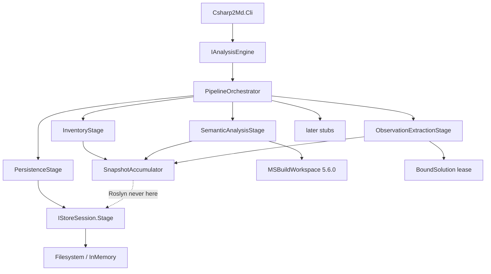

# Roslyn Observation Extraction Design

**Spec**: `.specs/features/roslyn-observation-extraction/spec.md`
**Context**: `.specs/features/roslyn-observation-extraction/context.md`
**Status**: Approved

---

## Approach exploration

All three approaches deliver the same scoped package: structural facts, ten C# observation kinds, `contains` only, committed through the existing storage port. They differ only in where Roslyn lives and how stages share work.

| Approach | Shape | Cost |
| --- | --- | --- |
| **A (recommended)** | Inventory is filesystem-only. Semantic Analysis owns `MSBuildWorkspace` and Symbol facts. Observation Extraction walks bound trees and emits observations plus `contains`. A `SnapshotAccumulator` on `PipelineContext` is the only in-memory graph. Persistence stages that snapshot | Three substitutable stages stay honest. Roslyn never outlives Extraction. Tests can stub any stage |
| B | One `SemanticBindingSession` owned by Semantic Analysis also runs extractors. Observation Extraction only reports counts | Stage names lie. A failure in extraction looks like a Semantic Analysis failure. Harder to keep ENG stage-order tests meaningful |
| C | One mega-visitor does inventory, symbols and observations | Symlink abort cannot happen before MSBuild. Registered-context kinds become untestable without a full workspace |

**Chosen: A.** The architecture pipeline already names three stages. Filling them in place is the smallest change that matches AD-006 and AD-008.

Agent discretion, locked here:

- Always-when-bindable kinds share one `CSharpSyntaxWalker`. Registered-context kinds are five small detectors over the same bound occurrence. One document visit.
- `MSBuildWorkspace.Create` with `Configuration` (and `TargetFramework` per variant). `OpenSolutionAsync(path, progress, cancellationToken)` only. No `Microsoft.Build.Framework.ILogger` overload. No `MSBuildLocator`.
- Document SHA-256 is stored on every observation from that document. Documents with zero observations do not publish a source digest (workstream 6).
- Multi-TFM union is by `ObservationIdentity` after ordinal assignment. Prefer a successful bind. Never emit two observations with one identity.

---

## Architecture Overview

CLI stays the composition root. Analysis still exposes one facade and writes only through `ITransactionalStore`. Production `AnalysisEngine(ITransactionalStore)` wires filled Inventory, Semantic Analysis, Observation Extraction and Persistence; Classification, Validation, Retrieval Projection and Batch Composition stay stubs.

Roslyn types exist only under `Csharp2Md.Analysis` internals. The public surface still has no `Microsoft.CodeAnalysis` type (ROSE-31). CLI still has no Domain reference (ROSE-62).

Inventory parses `.sln`/`.slnx` without MSBuild, computes the authorized root, rejects symlink escapes, and emits `Solution` / `Project` / `Document` facts. Semantic Analysis opens one disposable workspace per `(configuration, tfm)` pair, strips analyzer and generator assemblies, and emits `Symbol` facts. Observation Extraction binds C# documents, emits the ten kinds, unions identities, then emits `contains`. Persistence stages the accumulator, not `FactualSnapshot.Empty`.



---

## Active decision conformance

| Decision | How this design conforms |
| --- | --- |
| AD-001 standardized taxonomy | Extractors call Domain `Create` only. No new fact, observation or relation kind |
| AD-002 no compatibility constraint | Default engine stops reporting zeros. Isolation tests that banned Roslyn packages on Analysis are rewritten |
| AD-003 Roslyn and trust boundary | Analysis references `Microsoft.CodeAnalysis.Workspaces.MSBuild` 5.6.0 and `Microsoft.CodeAnalysis.CSharp.Workspaces` 5.6.0. No `Microsoft.Build.*` PackageReference. No `MSBuildLocator.RegisterDefaults`. Generators stripped. Analyzers never run |
| AD-004 evidence before promotion | No architecture/contract/persistence/configuration facts. Confirmed relations are `contains` only, with `derived_from` |
| AD-005 business interpretation downstream | No condition interpretation |
| AD-006 deep modules | Five assemblies. Roslyn, extractors and stages stay internal to Analysis |
| AD-007 navigable package | Persistence still commits a manifest-led package. No Markdown, catalogs or postings (ROSE-57) |
| AD-008 isolated solutions | One workspace lease per solution. Disposed before the next solution. No shared compilation |
| AD-009 coverage | Validation stage stays a stub. Unknowns (missing project, compile error, unbound) set `HasUnknownsOrCandidatesOrFrontiers` and still commit |
| AD-010 proof states | No numeric confidence. Bind failure is a binding diagnostic, not a score |
| AD-011 query deferred | No retrieval files |
| AD-012 no legacy specs | Port ledger names Semantics and Discovery for this workstream. Contracts are new |
| AD-013 registry | No descriptor-table or `taxonomy-registry.json` edits |
| AD-014 port on Analysis | Unchanged. Persistence is the only stage that calls `Stage` |
| AD-015 relation `Create` | `contains` passes `EvidenceMethod.Syntactic`. No callable-shape kinds |
| AD-016 Storage reconstructs through Domain | Unchanged. Storage maps the filled snapshot, including diagnostics |

AD-017 is recorded in `.specs/STATE.md`: `FactualSnapshot` carries operational diagnostics and suspected-secret evidence so Persistence can fill `diagnostics.json` without a second port.

---

## Code Reuse Analysis

### Existing Components to Leverage

| Component | Location | How to Use |
| --- | --- | --- |
| `IPipelineStage` / `PipelineOrchestrator` / `StubStages.DeclaredNames` | `src/Csharp2Md.Analysis/Pipeline/` | Keep names and order. Replace four stub classes. Keep the other four |
| `PipelineContext` | `src/Csharp2Md.Analysis/Pipeline/PipelineContext.cs` | Add the accumulator and an optional bound-solution lease. Keep `Session` and `SolutionPath` |
| `FactualSnapshot` / `IStoreSession.Stage` | `src/Csharp2Md.Analysis/Storage/` | Persistence stages the accumulator. Extend snapshot with diagnostics and secrets |
| Domain `Create` | `src/Csharp2Md.Domain/` | `Solution`, `Project`, `Document`, `Symbol`, `Observation`, `ConfirmedRelation`, `SuspectedSecretEvidence` |
| `SolutionId` / `ProjectId` / `AnalysisVariantId` / `CanonicalSymbolSignature` | `src/Csharp2Md.Domain/Identity/` | Filename-only solution path. Project path relative to authorized root. Variant `environment` = `local` |
| `ClassifierIdentity.Create` | `src/Csharp2Md.Domain/Proof/ClassifierIdentity.cs` | `csharp2md.inventory.contains` version 1 |
| `FacetBinding.Create(..., [], [])` | existing relation tests | `contains` has no facet axes |
| `DiagnosticRecordDto` | `src/Csharp2Md.Storage/Wire/EnvelopeDtos.cs` | Map snapshot diagnostics; stop hardcoding `new DiagnosticsEnvelope([])` |
| `.slnx` Project `Path` walk | `tests/Csharp2Md.Analysis.Tests/Isolation/PackageHygieneTests.cs` | Same XML walk for Inventory's `.slnx` reader |
| Isolation allowlists | `AnalysisPublicSurfaceTests`, `AnalysisIsolationTests`, `SolutionTopologyTests` | Public surface still forbids Roslyn. Package hygiene allows Workspaces.MSBuild on Analysis only |
| `[Trait("Requirement", "STOR-nn")]` | existing tests | New tests use `ROSE-nn` |
| `fixtures/SyntheticSolution` | `fixtures/SyntheticSolution/` | Versioned positive corpus. Extend only for missing kinds |
| `LocalCorpusAnalyzeTests` | `tests/Csharp2Md.Cli.Tests/LocalCorpusAnalyzeTests.cs` | Run after Verifier when clones exist |
| Port ledger Semantics / Discovery / sanitation probes | `docs/architecture/legacy-port-ledger.md` | Re-establish sanitation as Analysis.Tests against `CompilationSanitizer`, not Core |

### Deliberately not reused

| Component | Location | Why not |
| --- | --- | --- |
| Legacy `DotnetMsBuildEvaluator` / `SemanticCompilationAdapter` | SHA `93837df` | Called `MSBuildLocator` and mixed Markdown. New loader follows AD-003 |
| Legacy Discovery | SHA `82a5fe66` | Bound to deleted identity and service catalog |
| `Microsoft.Build.*` / `MSBuildLocator` | research gist | Forbidden by AD-003. Roslyn 5.6 BuildHost is out-of-process |
| `OpenSolutionAsync(..., ILogger, ...)` | Roslyn public API | The `ILogger` type is `Microsoft.Build.Framework.ILogger` |
| Domain descriptor edits | `TaxonomyTables` | Workstream 1 is closed |
| Byte-faithful source files | STOR-46 | Workstream 6 |
| Approach B session object as a public type | — | Would put Roslyn near the Analysis surface |

### Integration Points

| System | Integration Method |
| --- | --- |
| `Csharp2Md.Analysis.csproj` | PackageReference `Microsoft.CodeAnalysis.Workspaces.MSBuild` 5.6.0 and `Microsoft.CodeAnalysis.CSharp.Workspaces` 5.6.0 |
| `Directory.Packages.props` | Restore those two PackageVersion entries. Keep YamlDotNet absent |
| `DomainMapper.ToWire` | Fill `DiagnosticsEnvelope` from snapshot diagnostics |
| `AnalysisPublicSurfaceTests` | Allow `DiagnosticRecord`. Still forbid Extractor/Stage/Adapter names |
| `SolutionTopologyTests.ForbiddenPackageCases` | Analysis may reference `Microsoft.CodeAnalysis.*`. Storage and Projection still must not |
| `PackageHygieneTests.DroppedPackageVersions` | Remove the two Roslyn ids from the dropped list |
| `DefaultPipelineZerosTests` | Rewrite: first three stages and Persistence are non-zero on the fixture; later stubs stay 0/0/0 |
| CLI `WriteDiagnostics` | Print `SolutionOutcome.Detail` so symlink and MSBuild open failures name the path |
| Fixture | Add stand-ins and one occurrence each for `AttributeUsage`, `RouteDeclaration`, `Configuration` |

---

## Components

### Production pipeline wiring

- **Purpose**: Default engine runs real extraction. Tests that need the empty walking skeleton keep injecting `StubStages.CreateDefault()`.
- **Location**: `src/Csharp2Md.Analysis/Pipeline/PipelineStages.cs`, `AnalysisEngine.cs`
- **Interfaces**:
  - `PipelineStages.CreateDefault(): ImmutableArray<IPipelineStage>` — Inventory, Semantic Analysis, Observation Extraction, four stubs, Persistence
  - `AnalysisEngine(ITransactionalStore store)` uses `PipelineStages.CreateDefault()`
  - internal constructor unchanged
- **Dependencies**: the four filled stages
- **Reuses**: `StubStages.DeclaredNames` and the four remaining stub classes

### `SnapshotAccumulator`

- **Purpose**: The per-solution in-memory graph. Stages append; Persistence snapshots.
- **Location**: `src/Csharp2Md.Analysis/Pipeline/SnapshotAccumulator.cs` (internal)
- **Interfaces**:
  - `AddFact(IFact fact)` — identity collision of unequal facts sets `StructuralCorruption`
  - `AddObservation(Observation observation)` — union by identity; keep `bound` over `unbound`
  - `AddRelation(ConfirmedRelation relation)`
  - `AddDiagnostic(DiagnosticRecord record)`
  - `AddSuspectedSecret(SuspectedSecretEvidence evidence)`
  - `FactualSnapshot ToSnapshot()`
- **Dependencies**: Domain, `DiagnosticRecord`
- **Reuses**: `FactualSnapshot.Merge` is not the production path; one Persistence `Stage` of `ToSnapshot()` is

Fact identities are keyed by `FactReference.Id.Value` (ordinal). Observation identities ignore span (TAX-36 / ROSE-44).

### `DiagnosticRecord` and snapshot extension

- **Purpose**: Named operational diagnostics reach `diagnostics.json` through the existing port (AD-017).
- **Location**: `src/Csharp2Md.Analysis/Storage/DiagnosticRecord.cs`, `FactualSnapshot.cs`
- **Interfaces**:
  - `DiagnosticRecord(string Code, string Message, string? IdentityOrKey)`
  - `FactualSnapshot` gains `Diagnostics` and `SuspectedSecrets` as trailing optional parameters defaulting to empty, so existing six-argument call sites still compile
- **Dependencies**: Domain `SuspectedSecretEvidence`
- **Reuses**: `DiagnosticRecordDto` field-for-field

Codes this workstream emits:

| Code | When |
| --- | --- |
| `symlink-escape` | ROSE-02 (also `SolutionOutcome.Detail`; solution unpublished) |
| `duplicate-solution-id` | ROSE-08 (request rejected before Open) |
| `missing-project` | ROSE-11 |
| `unresolvable-sdk` | ROSE-12 |
| `msbuild-open-failed` | ROSE-22 |
| `compilation-error` | ROSE-23 |
| `unsupported-document` | ROSE-06 |
| `unbound` | ROSE-45 (also on the observation) |
| `suspected-secret` | ROSE-55 |

`IdentityOrKey` is a relative path or a fact id, never an absolute filesystem path (ROSE-56). Suspected secrets map to `DiagnosticRecordDto` with code `suspected-secret`, document id as `IdentityOrKey`, and a message that includes the one-based span plus the redacted excerpt. The secret value is absent.

### `InventoryStage`

- **Purpose**: Authorized root, inventory facts, symlink abort, missing-project diagnostics.
- **Location**: `src/Csharp2Md.Analysis/Inventory/`
- **Interfaces** (internal):
  - `AuthorizedRoot.Compute(solutionPath, existingProjectPaths): string` — smallest directory that contains the solution file and every listed project path that exists
  - `SolutionFileReader.ReadProjectPaths(solutionPath): ImmutableArray<string>` — `.slnx` XML `Project/@Path`; `.sln` `Project(...)` paths. No MSBuild
  - `PathGuard.RejectEscapes(root, path)` — resolve reparse points; abort if the resolved path is outside root
  - `InventoryStage : IPipelineStage` with `Name == "Inventory"`
- **Dependencies**: Domain structural facts, filesystem
- **Reuses**: `.slnx` XML walk already in tests

Rules:

- Workspace identity is `WorkspaceIdentity.Create("default")` (ROSE-09).
- Solution logical path is `Path.GetFileName` including extension (ROSE-10). `SolutionOutcome.LogicalRelativePath` stays the `--solution` token with `/` separators so ENG-34 ordering does not collapse distinct folder prefixes.
- Project logical path is relative to the authorized root, forward slashes (ROSE-03).
- Document path is relative to that root, forward slashes, no drive prefix (ROSE-04).
- Inventory files are the union of (a) project items whose resolved path is inside the root and (b) files sitting in the project directory inside the root, excluding `bin/`, `obj/`, `.git/`, `.vs/`. Those four names would make canonical bytes depend on local build output (ROSE-53).
- Non-C# documents become `Document` facts plus `unsupported-document`. No C# extractor runs on them (ROSE-05, ROSE-06).
- A listed path that does not exist is `missing-project`, continue (ROSE-11).
- Symlink escape: set `Detail` to the symlink path, return a non-corruption abort that the orchestrator already maps to unpublished (ROSE-02). Do not follow the target. Do not hash or copy the target (ROSE-07).
- Duplicate `SolutionId` is detected in `AnalyzeAsync` before `Open`, throwing `ArgumentException` that names both input paths (ROSE-08). CLI exit 1.

### `SemanticAnalysisStage`

- **Purpose**: Bind each variant, strip generators and analyzers, emit Symbol facts.
- **Location**: `src/Csharp2Md.Analysis/Semantics/`
- **Interfaces** (internal):
  - `MsBuildWorkspaceFactory.Open(solutionPath, configuration, targetFramework, cancellationToken): MsBuildWorkspaceLease`
  - `CompilationSanitizer.Strip(Project project): Project` — `WithAnalyzerReferences([])`
  - `SymbolFactEmitter.Emit(compilation, projectId, accumulator)`
  - `SemanticAnalysisStage : IPipelineStage` with `Name == "Semantic Analysis"`
- **Dependencies**: Workspaces.MSBuild 5.6.0, Domain `Symbol`
- **Reuses**: `workspace.Diagnostics` after open (no event subscription required)

Construction (Context7 + in-repo research, AD-003):

1. Inventory records each project's declared `TargetFramework` / `TargetFrameworks` from the csproj XML.
2. Configuration is `Debug` when the request does not name one (ROSE-24). No new CLI flag.
3. For each distinct TFM, `MSBuildWorkspace.Create(properties)` with `Configuration` and `TargetFramework`.
4. `SkipUnrecognizedProjects = true` so `Acme.DoesNotExist` does not throw.
5. `OpenSolutionAsync(solutionPath, progress: null, cancellationToken)`.
6. If open throws, abort that solution only, `Detail` names the failure, continue the batch (ROSE-22). Do not treat this as structural corruption (ROSE-63).
7. After open, read `workspace.Diagnostics`. A project SDK failure is `unresolvable-sdk`, continue (ROSE-12). Do not treat `WorkspaceDiagnosticKind.Failure` as a hard abort by itself (roslyn#75182 misclassifies some warnings).
8. For each C# project that declares that TFM: `Strip`, then `GetCompilationAsync`.
9. Compilation diagnostics of error severity: `compilation-error` naming the project, still extract what binds (ROSE-23).
10. `AnalysisVariantId.Create(tfm, configuration, DefineConstants symbols, "local")` (ROSE-25).
11. Emit one `Symbol` fact per declared type, method, property, field, event, constructor, local function, and identifiable lambda. Identity is `(project, signature)`, so multi-TFM does not duplicate symbols (ROSE-14).
12. Facets: `Callable` on methods, constructors, local functions, identifiable lambdas. Never `Controller` / `Handler` / `Repository` / `Client` / `Service` (ROSE-15, ROSE-16).
13. Put a disposable `BoundSolution` lease on `PipelineContext` for Extraction. `AnalysisEngine` has no `Compilation` instance field.

Sanitation probes (ROSE-29, ROSE-30) assert the stripped `Project.AnalyzerReferences` is empty and that `GetGenerators` / `GetGeneratorsForAllLanguages` return none. They run against `CompilationSanitizer`, then against a compilation taken from the filled stage via `InternalsVisibleTo`.

Unresolvable SDK is detected from workspace diagnostics that name the project, not from a second MSBuild API.

### `ObservationExtractionStage`

- **Purpose**: Fill the ledger and emit `contains`.
- **Location**: `src/Csharp2Md.Analysis/Extraction/`
- **Interfaces** (internal):
  - `ObservationExtractor.Extract(BoundSolution, SnapshotAccumulator)`
  - `AlwaysWhenBindableWalker : CSharpSyntaxWalker`
  - `IRegisteredContextDetector.TryObserve(BoundOccurrence): ObservationDraft?`
  - detectors: `AssignmentDetector`, `ConfigurationDetector`, `RouteDeclarationDetector`, `MessageOperationDetector`, `DataAccessDetector`
  - `OccurrenceOrdinalAssigner` — sort by locator, then assign 1..n per `(owner, kind, payload)`
  - `ContainsRelationEmitter`
  - `SecretRedactor`
- **Dependencies**: CSharp.Workspaces, Domain `Observation`
- **Reuses**: `Observation.Create`, `EvidenceChain.Create`, `ConfirmedRelation.Create`

Always-when-bindable (every bindable occurrence):

| Kind | Syntax |
| --- | --- |
| `Invocation` | invocation that binds to a method or delegate; owner is the containing callable |
| `ObjectCreation` | object-creation expression that binds |
| `TypeUsage` | type reference that binds |
| `BaseType` | base list entries |
| `AttributeUsage` | attribute applications |

Registered-context only (ROSE-37–ROSE-42):

| Kind | Compiled context |
| --- | --- |
| `Assignment` | write to a member of a type `T` that is a `DbSet<T>` entity or a `DbContext`-owned entity in this compilation. Matches `order.Status =` in the fixture |
| `Configuration` | `IConfiguration` indexer / `GetSection` / `GetValue`, `IOptions<T>`, `Configure<T>`. Payload key only, `LiteralRole.ConfigurationKey`. Never the bound value |
| `RouteDeclaration` | `[HttpGet]` `[HttpPost]` `[HttpPut]` `[HttpDelete]` `[HttpPatch]` `[Route]`, or `MapGet`/`MapPost`/`MapPut`/`MapDelete`. Payload `LiteralRole.Route` when a route literal is present |
| `MessageOperation` | bound invocation named `Publish`, `PublishAsync`, `Send`, `SendAsync`, or `Subscribe` |
| `DataAccess` | `DbSet<T>` member access; `SaveChanges` / `SaveChangesAsync` / `Add` / `AddAsync` / `FromSqlRaw` / `FromSqlInterpolated` / `ExecuteSqlRaw` / `ExecuteSqlInterpolated` on `DbContext` or `DbSet<T>`; LINQ whose source binds to `DbSet<T>` |

Payloads contain only `StructuralLiteral` values (ROSE-47, TAX-79). Always-when-bindable kinds, `MessageOperation` and `DataAccess` use an empty payload: method names and SQL are not in the literal allowlist. Identity still distinguishes them by owner, kind and ordinal (ROSE-43).

Ordinal assignment is after a locator sort (`relative path`, then span). Document enumeration order cannot change identities (ROSE-54). Two drafts that differ only in span and share owner, kind, payload and assigned ordinal collapse to one identity (ROSE-44). Multi-TFM prefers `BindingDiagnostic` code `bound` over `unbound`.

Failed bind (ROSE-45): still emit the always-when-bindable kind when the syntax is present, `EvidenceMethod.Syntactic`, diagnostic names the failure, payload does not invent a target fact id. Successful bind uses `EvidenceMethod.Semantic` and `BindingDiagnostic("bound", "bound")`.

Every observation carries owner, kind, payload, positive ordinal, locator (relative path, one-based span), extraction method, diagnostic, SHA-256 document hash of file bytes, `ExtractorVersion(1)` (ROSE-46, ROSE-50, ROSE-51). `DocumentId` is the owning `Document` fact's id value (opaque, not an absolute path).

`contains` (ROSE-17–ROSE-20): after extraction, for each C# document with at least one observation, emit `Project contains Document` and `Document contains Symbol` for each symbol declared in that document. Classifier `csharp2md.inventory.contains` version 1, `EvidenceMethod.Syntactic`, empty facets, `derived_from` those observations, `AnalysisVariants` the variants that produced them. No `Solution contains Project`. No other confirmed kind.

Secret redaction (ROSE-55): before any string enters a payload, diagnostic message or fact, run the suspected-secret heuristic (connection-string keys, `Password=`, token/bearer, certificate PEM). On match, omit the value, record `SuspectedSecretEvidence` with document, span, whole-document hash and a `RedactedExcerpt` that contains `***` or `[REDACTED]`. Do not hash the secret.

Dispose the `BoundSolution` lease at the end of the stage.

### `PersistenceStage`

- **Purpose**: Stage the accumulated graph.
- **Location**: `src/Csharp2Md.Analysis/Pipeline/PersistenceStage.cs`
- **Interfaces**: `IPipelineStage` with `Name == "Persistence"`
- **Dependencies**: `SnapshotAccumulator`, `IStoreSession`
- **Reuses**: existing commit/abort engine loop

`Stage(accumulator.ToSnapshot())`. Empty accumulator is still a valid empty package for stub-injected tests. Production fixture runs are non-empty (ROSE-58, ROSE-59). Later stubs still return 0/0/0 (ROSE-60). In-memory adapter creates no files (ROSE-64).

### `SolutionOutcome.Detail`

- **Purpose**: Name symlink and MSBuild open failures on unpublished solutions without committing a package.
- **Location**: `src/Csharp2Md.Analysis/AnalysisResult.cs`
- **Interfaces**: optional `string? Detail` on `SolutionOutcome`
- **Dependencies**: none
- **Reuses**: CLI `WriteDiagnostics` already prints unpublished lines

### Fixture extensions

- **Purpose**: ROSE-49 requires one positive occurrence of each kind under `fixtures/SyntheticSolution`.
- **Location**: `fixtures/SyntheticSolution/Acme.Orders/`
- **Already present**: Invocation, ObjectCreation, TypeUsage, BaseType (`OrdersController : ControllerBase`), Assignment (`order.Status =`), MessageOperation (`PublishAsync`), DataAccess (`SaveChanges`, `DbSet`, `Add`, LINQ)
- **Add**: stand-in `[HttpGet("orders/{id}")]` on `GetOrderStatus` (AttributeUsage + RouteDeclaration); a small `IConfiguration` stand-in used as `configuration["Logging:Level"]` (Configuration key only)

Do not add `Controller` facets. `OrderRepository` stays a negative for DataAccess.

---

## Data Models

### `DiagnosticRecord`

```csharp
public sealed record DiagnosticRecord(string Code, string Message, string? IdentityOrKey);
```

**Relationships**: accumulated on `FactualSnapshot`; Storage maps to `DiagnosticRecordDto`. Not a Domain taxonomy type.

### Observation draft (internal)

```csharp
internal sealed record ObservationDraft(
    FactReference Owner,
    ObservationKind Kind,
    NormalizedPayload Payload,
    EvidenceLocator Locator,
    EvidenceMethod ExtractionMethod,
    BindingDiagnostic Diagnostic,
    DocumentHash DocumentHash);
```

Ordinal is assigned after sort. `Observation.Create` is the only public construction.

### `AnalysisVariantId`

`(tfm, configuration, sorted DefineConstants, environment: "local")`. Attached to `contains` relations. Not attached to observations (Domain has no variant axis).

### Symbol signature

`CanonicalSymbolSignature.Create` from documented `ISymbol` / `IMethodSymbol` members at implement time (`Kind`, `MetadataName`, `ContainingType` / namespace display, arity, return/parameter types). Do not invent Roslyn members. Consult Context7 `/dotnet/roslyn` in Execute.

---

## Error Handling Strategy

| Error Scenario | Handling | User Impact |
| --- | --- | --- |
| Duplicate `SolutionId` | `ArgumentException` before Open | CLI exit 1, both paths named |
| Symlink escape | Abort that solution, `Detail` names the symlink, last package kept | CLI exit 2, unpublished |
| Missing listed project | Diagnostic, continue, unknowns flag | Committed package |
| Unresolvable SDK | Diagnostic, continue, unknowns flag | Committed package |
| `OpenSolutionAsync` throws | Abort that solution only, `Detail` names the failure | CLI exit 2 if any unpublished |
| Compilation errors | Diagnostic, extract bindable occurrences | Committed package with unknowns |
| Unbound always-when-bindable syntax | Observation with `unbound` diagnostic, no invented target | Committed |
| Identity collision of unequal facts | `StructuralCorruption`, Abort | Unpublished, last package kept |
| Suspected secret | Omit value, record redacted evidence | Committed, secret absent from JSON |
| In-memory adapter | Same graph, no files | Tests |

---

## Risks & Concerns

| Concern | Location (file:line) | Impact | Mitigation |
| --- | --- | --- | --- |
| Default engine tests use fake paths or assert zeros | `tests/Csharp2Md.Analysis.Tests/Pipeline/CanonicalResultOrderTests.cs:14`, `DefaultPipelineZerosTests.cs:22`, `CommitOnceTests.cs`, `NoFilesystemWriteTests.cs`, `PersistenceManifestTests.cs` | Real Inventory cannot open `alpha/a.sln`; zeros are superseded by ROSE-59 | Fake-path tests inject `StubStages.CreateDefault()`. Fixture default-engine tests assert non-zero Inventory / Semantic / Extraction |
| `bin/` / `obj/` inventory would break ROSE-53 | ROSE-04 directory walk | Clone hashes would include local build output | Exclude `bin`, `obj`, `.git`, `.vs` from the directory walk |
| Literal allowlist cannot hold method names | `src/Csharp2Md.Domain/Literals/StructuralLiteral.cs:5` | Invocation payloads cannot carry target names | Empty payload for those kinds; identity is owner + kind + ordinal |
| Fixture lacks three kinds | `fixtures/SyntheticSolution/Acme.Orders/Api/OrdersController.cs`, `Program.cs` | ROSE-49 fails | Add `[HttpGet]` and an `IConfiguration` stand-in |
| `FactualSnapshot` diagnostics are empty today | `src/Csharp2Md.Storage/Mapping/DomainMapper.cs:168` | Named diagnostics would never reach the package | AD-017: snapshot carries them; mapper fills the envelope |
| `WorkspaceDiagnosticKind.Failure` is unreliable | research `2026-08-14-...md` / roslyn#75182 | False abort of a loadable solution | Abort only on `OpenSolutionAsync` throw; project issues are named diagnostics |
| Workspaces.MSBuild may depend on `Microsoft.Build.*` transitively | Analysis csproj after restore | AD-003 forbids a PackageReference, not every transitive restore item | Assert no `Microsoft.Build` PackageReference on Analysis; never call Locator; sanitizer tests stay |
| Public `Detail` / `DiagnosticRecord` | `AnalysisPublicSurfaceTests.cs:8` | Allowlist will fail | Add `DiagnosticRecord` only. `Detail` is a property on an existing allowlisted type |
| Sanitation probes lived in deleted Core | port ledger row `3336bc0b` | ROSE-29/30 would have no home | Re-home under `tests/Csharp2Md.Analysis.Tests/Semantics/` |

> Confirmed lessons: none.

---

## Tech Decisions (only non-obvious ones)

| Decision | Choice | Rationale |
| --- | --- | --- |
| Extractor hosting | One walker + five detectors, one visit per document | Registered-context kinds stay independently testable without a second syntax walk |
| Workspace open | `Create(properties)` + `OpenSolutionAsync(path, null, ct)` per TFM | Global properties are per workspace. Multi-TFM is ROSE-24 |
| Unrecognized projects | `SkipUnrecognizedProjects = true` | Fixture lists `Acme.DoesNotExist` |
| Empty payloads for most kinds | Empty `NormalizedPayload` except Configuration key and Route literal | TAX-79 allowlist has no method-name role |
| Ordinals | Assign after locator sort | ROSE-54 would fail if ordinals followed enumeration order |
| Diagnostics on snapshot | AD-017 | Only Persistence may `Stage`; envelopes are not Domain types |
| Secret wire shape | Flatten into `DiagnosticRecordDto` code `suspected-secret` | Avoids a STOR schema additive file; Independent Test only needs excerpt present and value absent |
| Solution outcome path vs SolutionId path | Outcome keeps the `--solution` token; identity uses filename | ROSE-10 vs ENG-34. Collision still uses `SolutionId` (filename) |
| Directory exclusions | `bin`, `obj`, `.git`, `.vs` | Determinism. Project items inside those folders are still taken if MSBuild lists them and they sit inside the root |
| Callable owner fallback | Nearest inventoried declared symbol | File-level `TypeUsage` / `BaseType` are not inside a method |

**Project-level:** AD-017 (snapshot diagnostics). Everything else in this table is feature-local.
