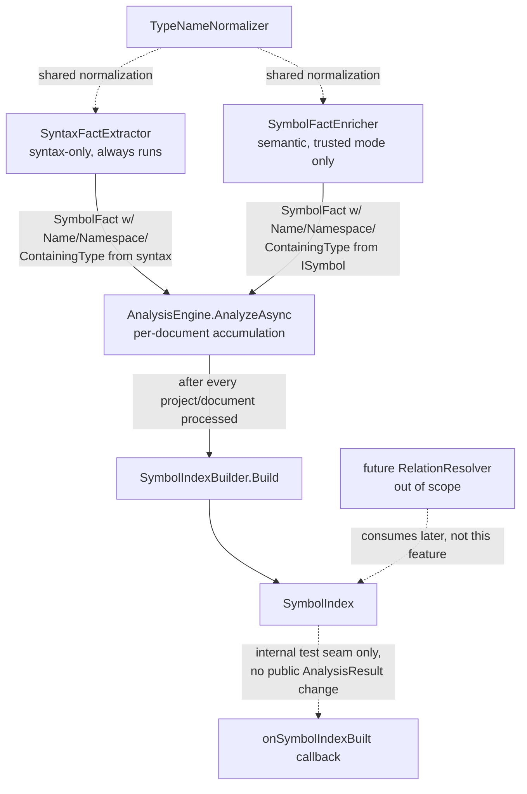

# SymbolIndex Design

**Spec**: `.specs/features/symbol-index/spec.md`
**Context**: `.specs/features/symbol-index/context.md`
**Status**: Draft

---

## Architecture Overview

`SymbolFact` (the existing persisted fact type) is extended with the identity-shaped fields `IndexedSymbol`
needed (`Name`, `FullyQualifiedName`, `Namespace`, `ContainingType`, `ContainingSymbolId`, `Signature`, `Arity`,
`ParameterTypes`), populated by both existing producers — `SyntaxFactExtractor` (syntax-only) and
`SymbolFactEnricher` (semantic). A new shared `TypeNameNormalizer` gives both producers one normalization rule
(section 11's alias table + `global::` handling), so a query for `System.String` matches a symbol declared with
`string` regardless of which producer touched it.

`AnalysisEngine.AnalyzeAsync` accumulates every `SymbolFact`/`ProjectFact`/`DocumentFact`/`TargetFact` it already
produces per document/project (same accumulation point as the existing `coverageFacts` builder) and, once the
main loop finishes, calls `SymbolIndexBuilder.Build(...)` once — mirroring `CoverageProjector.Project`'s existing
call shape at the same point in the method. The built `SymbolIndex` is captured through a new `internal`
callback constructor parameter (mirroring the existing `FragmentValidationFunc`/`IAnalysisEngineObserver`
injection pattern already used for `AnalysisEngine`'s other test seams) — no change to the public
`AnalysisResult` contract, consistent with AD-013's "`AnalyzeAsync` is the module's only external interface."



---

## Code Reuse Analysis

### Existing Components to Leverage

| Component | Location | How to Use |
| --- | --- | --- |
| `SymbolFactId.CreateResolved`/`CreateSyntactic`/`CreateFallback` | `Facts/Identity/FactIds.cs:59-91` | Reused verbatim as `IndexedSymbol`'s (i.e. `SymbolFact`'s) identity — no second identity scheme. |
| `FactResolution` enum | `Facts/Model/FactResolution.cs:3-12` | Reused as-is for the index's "resolution level" concept (Exact/Syntactic/Candidate/Unresolved/...) — no parallel `SymbolResolution` enum. |
| `SymbolFactEnricher`'s `DisplayType`/`DisplayContainer`/`DisplayNamedType`/`SymbolType`/`Parameters`/`ParameterModifier` | `Analysis/Semantics/SymbolFactEnricher.cs:220-307` | Already compute almost exactly `Namespace`/`ContainingType`/`ParameterTypes`/`Arity` for the semantic path via `CanonicalSignature`'s locals — currently computed then discarded into an opaque ID string. Reused directly to populate the new `SymbolFact` fields instead of being thrown away. |
| `SyntaxFactExtractor`'s `DeclarationKind`/`DeclarationName`/`DeclarationSignature`/`ownerByDeclaration` | `Analysis/Syntax/SyntaxFactExtractor.cs:44-107,201-224,536-538` | `DeclarationName` becomes `Name` directly; `DeclarationSignature`'s raw token-joined text becomes `Signature` (the "original spelling" AC-06 needs) unchanged; `ownerByDeclaration` (already built for relation-candidate ownership) is reused to resolve `ContainingSymbolId` for the syntax-only path — same lookup, one more consumer. |
| `coverageFacts` accumulation pattern | `Analysis/AnalysisEngine.cs:105,282,316` | Precedent for retaining full fact objects across the whole run in memory — the chosen construction-point approach adds one more accumulator of the same shape, not a new pattern. |
| Internal test-seam constructor injection (`FragmentValidationFunc`, `IAnalysisEngineObserver`) | `Analysis/AnalysisEngine.cs:21,23-27,51-58` | Same mechanism reused for an `internal Action<SymbolIndex>? onSymbolIndexBuilt` parameter — no public API change, directly testable from a real run. |
| `RelationNoiseFilter` shared-predicate pattern | `Analysis/Relations/RelationNoiseFilter.cs` | Structural precedent for `TypeNameNormalizer`: one shared, directly-testable static helper both producers call, instead of two divergent inline implementations. |
| `Analysis/Indexes/SolutionAnalysisIndex.cs` folder/namespace | `Analysis/Indexes/` | `SymbolIndex`/`SymbolIndexBuilder`/`ISymbolIndex` live in this same folder/namespace as a sibling — same aggregate-index family, same placement convention (mirrored by `tests/.../Analysis/Indexes/`). |
| `FactMerger.Merge`'s generic `SymbolFact value => value with { Header = header }` handling | `Facts/Composition/FactMerger.cs:260` | Confirms the merge path is field-agnostic (keys off `Header.Id`/`Resolution` only) — extending `SymbolFact` with new fields needs no `FactMerger` change. |

### Integration Points

| System | Integration Method |
| --- | --- |
| `AnalysisEngine.AnalyzeAsync` | New accumulator builders (mirroring `coverageFacts`) capture every `SymbolFact`/`ProjectFact`/`DocumentFact`/`TargetFact`; `SymbolIndexBuilder.Build` called once after the main loop, before/alongside `CoverageProjector.Project` ([AnalysisEngine.cs:152](src/Csharp2Md.Core/Analysis/AnalysisEngine.cs#L152)). |
| `SymbolFactJson` / `FactualJsonContracts.cs` / `FactualJsonSerializer.SchemaVersion` | New JSON properties (`JsonPropertyOrder` 9-16) for the extended fields; `SchemaVersion` 2 → 3; existing approved Verify/JSON snapshots re-approved as part of Tasks. |
| `SyntaxFactExtractor.Extract` | Computes `Name`/`Namespace`/`ContainingType`/`ContainingSymbolId`/`Arity`/`ParameterTypes`/`FullyQualifiedName` purely from syntax at the same point `SymbolFact` is first constructed (`SyntaxFactExtractor.cs:54-62`). |
| `SymbolFactEnricher.EnrichSymbol` | Populates the same fields from the bound `ISymbol` when semantic binding succeeds, overwriting the syntax-only values exactly as it already overwrites `BaseAndInterfaceIds`/`Attributes`/`RelevantTypeReferences` today (`SymbolFactEnricher.cs:196-209`). |

---

## Components

### `TypeNameNormalizer`

- **Purpose**: One shared rule that turns a type spelling (`global::System.String`, `System.String`, `string`)
  into one comparable fully-qualified form, per spec AC-08 — used by both fact producers and by every
  `ISymbolIndex` qualified-name/parameter-type lookup.
- **Location**: `src/Csharp2Md.Core/Analysis/Semantics/TypeNameNormalizer.cs` (sits next to `SymbolFactEnricher`,
  the file whose `DisplayType`/`DisplayNamedType` it wraps — not under `Indexes/`, since both fact producers need
  it, not just the index).
- **Interfaces**:
  - `string Normalize(string typeSpelling)` - collapses a leading `global::`, and the 16 C# predefined-type
    keywords (`bool`, `byte`, `sbyte`, `short`, `ushort`, `int`, `uint`, `long`, `ulong`, `char`, `float`,
    `double`, `decimal`, `string`, `object`, `void`) to their `System.*` metadata name, into one
    `global::`-prefixed comparable form. Idempotent (`Normalize(Normalize(x)) == Normalize(x)`).
- **Dependencies**: none (pure string function, no Roslyn dependency — usable from both the syntax-only and
  semantic producers).
- **Reuses**: Nothing existing performs this normalization today (`SymbolDisplayFormat.FullyQualifiedFormat`'s
  default `UseSpecialTypes` option means Roslyn's own `DisplayType` renders `int` as `"int"`, not
  `"System.Int32"` — confirmed by reading `SymbolFactEnricher.cs:275-282`, so this is new value, not a wrapper
  around something that already does it).

### `SymbolFact` extension (data model change, not a new component)

- **Purpose**: Carry the identity-shaped data `IndexedSymbol` needs directly on the existing fact, so
  `ISymbolIndex` queries return `SymbolFact` values rather than mapping into a second, near-duplicate record.
- **Location**: `src/Csharp2Md.Core/Facts/Model/Facts.cs:62-71` (record extension), plus
  `Facts/Serialization/FactualJsonContracts.cs:102-111` (JSON contract) and
  `Facts/Serialization/FactualJsonSerializer.cs:8` (`SchemaVersion` 2 → 3).
- **New fields**: `Name` (string), `FullyQualifiedName` (string, normalized), `Namespace` (string?),
  `ContainingType` (string?), `ContainingSymbolId` (`SymbolFactId`?), `Signature` (string — the existing raw
  `DeclarationSignature` text, reused unchanged as the "original spelling" AC-06 requires), `Arity` (int),
  `ParameterTypes` (`ImmutableArray<string>`, normalized).
- **Dependencies**: `TypeNameNormalizer` (for `FullyQualifiedName`/`ParameterTypes`).
- **Reuses**: `SymbolFactEnricher`'s already-computed display strings (semantic path); `SyntaxFactExtractor`'s
  `DeclarationName`/`ownerByDeclaration` (syntax-only path).

### `ISymbolIndex` / `SymbolIndex` / `SymbolIndexBuilder`

- **Purpose**: The queryable aggregate itself — one `FrozenDictionary`-backed structure per lookup key, built
  once from a complete `SymbolFact`/`ProjectFact`/`DocumentFact`/`TargetFact` set.
- **Location**: `src/Csharp2Md.Core/Analysis/Indexes/SymbolIndex.cs` (sibling to `SolutionAnalysisIndex.cs`,
  same namespace `Csharp2Md.Core.Analysis.Indexes`).
- **Interfaces**:
  - `SymbolFact? GetById(SymbolFactId id)` - direct `FrozenDictionary` lookup.
  - `ImmutableArray<SymbolFact> FindByName(string simpleName)` - simple-name index, ordinal-ordered.
  - `ImmutableArray<SymbolFact> FindByQualifiedName(string fullyQualifiedName)` - keyed by
    `TypeNameNormalizer.Normalize(fullyQualifiedName)`.
  - `ImmutableArray<SymbolFact> FindMembers(string containingType, string memberName)` - keyed by
    `(NormalizedContainingType, memberName)`.
  - `ImmutableArray<SymbolFact> FindMethods(MethodLookup lookup)` - filters the containing-type+name bucket by
    `ArgumentCount`/`ArgumentTypes` per spec P2 criteria 1-2.
  - `SymbolLookupResult FindCandidates(SymbolLookup lookup)` - priority-tiered contextual search, spec P2
    criteria 3-6.
  - `SymbolIndexMetrics Metrics { get; }` - spec P3 criterion 4.
  - `ImmutableArray<AnalysisDiagnostic> Diagnostics { get; }` - spec P3 criteria 1-3.
  - `static SymbolIndex SymbolIndexBuilder.Build(IEnumerable<SymbolFact>, IEnumerable<ProjectFact>, IEnumerable<DocumentFact>, IEnumerable<TargetFact>)`
    - the pure, order-independent construction entry point spec AC SYMIDX-02 describes; unit-testable with
      hand-built facts (P3's Independent Test) with no dependency on `AnalysisEngine` or disk I/O.
- **Dependencies**: `TypeNameNormalizer`; `AnalysisDiagnostic`/`DiagnosticStage`/`DiagnosticSeverity`
  (`Facts/Metadata/*`) for the three P3 diagnostic codes.
- **Reuses**: `SolutionAnalysisIndex`'s `FrozenDictionary`/`ToUniqueFrozenDictionary`-style construction shape
  (`Analysis/Indexes/SolutionAnalysisIndex.cs:130-146`) as the pattern to follow for `GetById`'s backing
  dictionary — not shared code (different key/value types), but the same idiom, for consistency within one
  folder.

### `MethodLookup` / `SymbolLookup` / `SymbolLookupResult`

- **Purpose**: Query-parameter and result shapes for `FindMethods`/`FindCandidates`, matching the user's own
  sections 10 and 13 sketches almost verbatim (no simplification opportunity found here — the sketch is already
  the right shape).
- **Location**: Same file as `ISymbolIndex` (`Analysis/Indexes/SymbolIndex.cs`) — small, tightly-coupled record
  types, not worth splitting into separate files.
- **Interfaces**: `MethodLookup(string Name, string? ReceiverType, string? Namespace, string? ProjectId, int? ArgumentCount, ImmutableArray<string?> ArgumentTypes, ImmutableArray<string> Imports)`;
  `SymbolLookup(string Name, string? ContainingType, string? Namespace, string? ProjectId, ImmutableArray<string> Imports)`;
  `SymbolLookupResult(SymbolLookupStatus Status, ImmutableArray<SymbolFact> Candidates)` where
  `SymbolLookupStatus` is `Unique | Ambiguous | NotFound`.
- **Dependencies**: none beyond `SymbolFact`.
- **Reuses**: n/a — new, small, spec-literal types.

### `AnalysisEngine` wiring

- **Purpose**: Gather the complete fact set and invoke `SymbolIndexBuilder.Build` once per run, exposed only
  through an internal test seam.
- **Location**: `src/Csharp2Md.Core/Analysis/AnalysisEngine.cs` — new `internal Action<SymbolIndex>?
  onSymbolIndexBuilt = null` parameter on the existing `internal` constructor overload (line 60), four new
  `ImmutableArray<...>.Builder` accumulators declared alongside `coverageFacts` (line 105) and populated at the
  same points `coverageFacts.Add(...)` already fires (lines 282, 316, plus one new append for `SymbolFact`s at
  the point `merged.Facts`'s symbols are known, line ~253-256), and one `SymbolIndexBuilder.Build(...)` call plus
  `onSymbolIndexBuilt?.Invoke(index)` after the main loop (line ~151, alongside `CoverageProjector.Project`).
- **Dependencies**: `SymbolIndexBuilder`.
- **Reuses**: `FragmentValidationFunc`/`IAnalysisEngineObserver` injection pattern (lines 21-27, 51-58) —
  identical shape, one more optional constructor parameter, defaulted to a no-op for both public constructors.

---

## Data Models

### `SymbolFact` (extended)

```csharp
public sealed record SymbolFact(
    FactHeader Header,
    SymbolFactId SymbolId,
    DocumentFactId DocumentId,
    string SymbolKind,
    bool ContainsErrorSymbol,
    ImmutableArray<SymbolFactId> BaseAndInterfaceIds,
    ImmutableArray<string> Attributes,
    ImmutableArray<string> RelevantTypeReferences,
    SymbolSemanticDetails? Semantics,
    // --- new fields, this feature ---
    string Name,
    string FullyQualifiedName,
    string? Namespace,
    string? ContainingType,
    SymbolFactId? ContainingSymbolId,
    string Signature,
    int Arity,
    ImmutableArray<string> ParameterTypes) : IFact;
```

**Relationships**: `ContainingSymbolId` is a self-reference to another `SymbolFact` in the same index (a
method's containing class) — `FactValidator.GetReferences` gains one more case for it, symmetric with the
existing `BaseAndInterfaceIds`/`Semantics` reference handling (`FactValidator.cs:77-80`).

### `SymbolIndex` (in-memory only, no JSON contract — per the confirmed "standalone, in-memory" scope)

```csharp
internal sealed class SymbolIndex
{
    // FrozenDictionary<SymbolFactId, SymbolFact> ById
    // FrozenDictionary<string, ImmutableArray<SymbolFact>> ByName            (simple name, ordinal)
    // FrozenDictionary<string, ImmutableArray<SymbolFact>> ByQualifiedName   (normalized)
    // FrozenDictionary<(string ContainingType, string Name), ImmutableArray<SymbolFact>> ByMember
    // SymbolIndexMetrics Metrics
    // ImmutableArray<AnalysisDiagnostic> Diagnostics
}

public sealed record SymbolIndexMetrics(
    int TotalSymbols,
    ImmutableDictionary<FactResolution, int> ByResolution,
    ImmutableDictionary<IndexedSymbolKind, int> ByKind,
    int DuplicateIdCount,
    int AmbiguousSimpleNameCount);

public enum IndexedSymbolKind
{
    Namespace, Class, Struct, RecordClass, RecordStruct, Interface, Enum, Delegate,
    Constructor, Method, Property, Field, Event,
    Other, // destructor / indexer / operator / conversion-operator / enum-member —
           // already extracted by SyntaxFactExtractor.DeclarationKind but not named in spec section 5's
           // list; indexed under Other rather than dropped, so SYMIDX-01's "one entry per SymbolFact" holds.
}
```

**Relationships**: `IndexedSymbolKind` is a display/filter-only classification derived from `SymbolFact.SymbolKind`
(the existing string) via a pure mapping function — `SymbolFact.SymbolKind` itself is unchanged (still the wire
string used by `FactualJsonMapper`/existing snapshots).

---

## Error Handling Strategy

| Error Scenario | Handling | User Impact |
| --- | --- | --- |
| Two `SymbolFact`s collide on `SymbolFactId.Value` when accumulated solution-wide | `SymbolIndexBuilder.Build` records a `duplicated-symbol-id` diagnostic (`C2M-SYMIDX-001`), keeps the ordinal-first entry, continues (spec SYMIDX-19) | None — visible only via `SymbolIndex.Diagnostics`/`Metrics`; the run itself does not fail. |
| A `ContainingSymbolId` points at an id absent from the indexed set | `invalid-containing-symbol` diagnostic (`C2M-SYMIDX-002`), symbol still indexed under its own id (spec SYMIDX-20) | None — same as above. |
| A simple-name query's candidates span more than one namespace/containing type | `SymbolLookupResult.Status = Ambiguous` at query time (spec SYMIDX-16/17); `ambiguous-symbol-lookup` diagnostic (`C2M-SYMIDX-003`) recorded once per such name at build-completion time (spec SYMIDX-21) | None — this is the feature's core "don't guess" contract, not a failure. |
| Zero documents/symbols in the solution | `Build` returns an empty, queryable `SymbolIndex` (spec SYMIDX-11) | None. |

---

## Risks & Concerns

| Concern | Location (file:line) | Impact | Mitigation |
| --- | --- | --- | --- |
| Retaining every `SymbolFact` across the whole run departs from AD-001/AD-008's memory-bound streaming discipline, which exists specifically because "the tool's stated target is a large codebase and Roslyn has documented memory/performance regressions on large solutions" | `Analysis/AnalysisEngine.cs:210-292` (the discard point being changed for one fact kind) | Peak memory grows proportional to total declared-member count across the whole solution, not file count — a real, but bounded and roughly-linear, increase; not unbounded | User confirmed this trade-off explicitly (approach-exploration question, this session) after seeing the alternative (rebuild-from-disk); precedented by the existing `coverageFacts` accumulator already doing the same thing for 3 of 4 fact kinds. If this proves too costly in practice on a real large solution, the rebuild-from-`raw/facts/*.json` alternative documented in this design's discarded options is the fallback — not built now, per current scope. |
| `SchemaVersion` bump (2 → 3) invalidates every existing approved JSON/Verify snapshot containing a `SymbolFactJson` | `Facts/Serialization/FactualJsonSerializer.cs:8`, plus every `*.approved.*` snapshot exercising `Symbols` | Re-approving snapshots is mechanical but must not be silently skipped, or the test suite will fail non-obviously later | Tasks phase includes an explicit task to locate and re-approve every affected snapshot (`git grep` for `SchemaVersion` / `symbols` in approved files) before considering the feature done. |
| `FindMethods`'s exact-`ArgumentCount` filtering has no `params`/optional-parameter awareness (Assumption already logged in spec.md) | `Analysis/Indexes/SymbolIndex.cs` (new) | A method callable with fewer arguments than its declared parameter count (optional/`params`) can be missed by an exact-count query | Already documented as a known P2 limitation in spec.md's Assumptions table; no silent behavior — a future feature can extend `SymbolFact`/`MethodLookup` with per-parameter optionality data if this proves to matter. |
| `IndexedSymbolKind` must cover every string `SyntaxFactExtractor.DeclarationKind` already produces (16 values), but spec section 5 only names 13 | `Analysis/Syntax/SyntaxFactExtractor.cs:201-222` vs. spec.md section 5 | Silently dropping `destructor`/`indexer`/`operator`/`conversion-operator`/`enum-member` from the index would violate SYMIDX-01 ("one entry per SymbolFact") | Mapped to an explicit `Other` bucket rather than dropped or crashing on an unmapped kind — every `SymbolFact` still gets exactly one `IndexedSymbolKind`. |

---

## Tech Decisions (only non-obvious ones)

| Decision | Choice | Rationale |
| --- | --- | --- |
| `IndexedSymbol` as a type | Not introduced as a separate record — `ISymbolIndex`'s query methods return `SymbolFact` directly | The chosen data-source decision already extends `SymbolFact` with every field the user's `IndexedSymbol` sketch wanted; a second, structurally near-identical record would just be a duplicate model to keep in sync. Section 6 of the original request calls it a "modelo conceitual" (conceptual model), not a literal contract. |
| `SymbolResolution` enum | Not introduced — `IndexedSymbol`'s (i.e. `SymbolFact.Header`'s) resolution reuses the existing `FactResolution` enum | `FactResolution` already has `Exact`/`Syntactic`/`Candidate`/`Unresolved` plus `Partial`/`Heuristic`/`NotApplicable`; every `SymbolFact` already carries one via `Header.Resolution`. A parallel enum would duplicate an already-solved concept. |
| Construction point | `SymbolIndexBuilder.Build` called once in `AnalysisEngine.AnalyzeAsync`, fed by a new full-run accumulator (mirroring `coverageFacts`) | User's explicit choice (approach-exploration question, this session). |
| Exposure from `AnalysisEngine` | `internal Action<SymbolIndex>? onSymbolIndexBuilt` constructor parameter, no `AnalysisResult` change | Matches AD-013 ("`AnalyzeAsync` is the module's only external interface") and the existing `FragmentValidationFunc`/`IAnalysisEngineObserver` internal test-seam pattern exactly — proves the index is built from a real run (spec Goal #3) without growing the public contract for a feature with no consumer yet. |
| `TypeNameNormalizer` location | `Analysis/Semantics/` (not `Analysis/Indexes/`) | Both `SyntaxFactExtractor` (syntax-only) and `SymbolFactEnricher` (semantic) need it to populate `SymbolFact` at extraction time — it is not index-specific, so it does not live in the `Indexes` folder alongside the component that merely reuses its output for lookup keys. |
| `Signature` field reuses raw `DeclarationSignature` text unchanged | Yes, verbatim, for both syntax-only and semantic-enriched symbols | Satisfies spec AC-06 ("preserve original, non-normalized spelling") at zero extra cost — the raw token-joined text this method already produces *is* the original spelling; no new field/structure needed. |

> **Project-level decision to append to `.specs/STATE.md`:** The `internal Action<SymbolIndex>? onSymbolIndexBuilt`
> test-seam pattern and the "extend the existing fact instead of introducing a parallel query-shaped model"
> resolution both generalize beyond this feature (any future aggregate built from a full-run accumulation will
> face the same two choices) — recorded as `AD-016` at Tasks completion, once the pattern has actually shipped
> and proven itself, not speculatively before that.
